# 深度学习论文
## 前置概念
- 论文大致按照年份排序,有一个先后关系
- 学习前提: 阅读过<< Deep Learning From Scratch>>即可,然后就可以大致跟着时间线走,如果忽略前人的研究成果直接跳到最新模型的话,那绝对是看不懂的.

首先,深度学习领域的主要框架类型有如下几个:
1. CNN(卷积神经网络): 通过卷积层来实现高维的图像/3D输入,适用于处理图像.
   1. 代表框架有LeNet,ResNet等.
   2. [wiki](https://en.wikipedia.org/wiki/Convolutional_neural_network)
2. RNN(循环神经网络): 适用于处理具有时间先后顺序的数据,例如音频
   1. 代表框架有LSTM,GRU等
   2. [wiki](https://en.wikipedia.org/wiki/Recurrent_neural_network)
3. Transformer: 适用于处理文本,代码,多模态信号
   1. 代表框架有GPT,Llama,BERT等
4. GNN(图神经网络): 适用于处理社交网络等网络数据
   1. 代表框架有GCN,GAT等


然后,我们需要大致明白一条主要的时间线:
1. 1986年<< Learning representations by back-propagating errors >>将反向传播算法引入了神经网络
2. 1989年<< Backpropagation applied to handwritten zip code recognition >>是第一篇真正将反向传播算法实际应用到学习过程中的论文,也是CNN的原型论文
3. 1990年<< Finding Structure in Time >>是RNN的原型论文.
4. 1997年<< Long Short-Term Memory >>提出了LSTM框架
5. 2015年<< Deep Residual Learning for Image Recognition >>提出了深度残差网络
6. 2017年<< Attention Is All You Need >>提出了Transformer框架.
7. 2018年<< Improving Language Understanding by Generative Pre-Training >>提出了GPT框架
8. 2023年<< LLaMA: Open and Efficient Foundation Language Models >>提出了LLaMA框架.
9. 2025年<< DeepSeek-R1: Incentivizing Reasoning Capability in LLMs via Reinforcement Learning >>提出了DeepSeek-R1框架.


- 这些主要论文中间穿插着许多奠基者的研究成果,我也会适当地学习这些论文.
- 由于我只是一个业余爱好者,只想准确的了解现代大模型背后的原理,所以只会挑选最经典或者最优秀的论文来大致学习一下.
- (5/22): 早期论文大多会深入底层的原理,讲的特别深入和透彻,能够洋洋洒洒写三四十页;而越是新的论文,就越是含混不清,潦草的介绍了公式和框架就结束了,总共十几页中能有四五页真东西就不错了.这固然有版面限制的原因在,但我想还是因为风气出了问题.
- (5/28): 早期的经典论文都是大学里的研究者提出的,而近十年的突破性论文都是由大公司里的研究者提出的,这不仅说明巨头科技公司垄断了顶尖的人才,也说明学术研究的环境不再像以前那般淳朴了.
- (5/29): 早期的经典论文之间时间跨度很大,随着深度学习的不断火爆,论文数量呈指数级上升,每一年都有新的突破性成果,这又何尝不是一场你死我活的大跃进.
- (6/1): GPT的突破性成果让所有人都见识到了大模型的可怕,但至今为止都没有人能够清晰的告诉我们,为什么把模型变大就可以实现这种奇迹般的涌现,还有就是,模型的大小到底有没有极限,大模型的发展是否存在一个瓶颈,没有人能够说明.前方,有可能是天堂,也可能是地狱.
- (6/4): 实际上来说,大模型确实算是一种爆发性的增长,在2017年以前,语言模型只能应付简单的文本标注和文本分类任务,而在这之后,语言模型就可以真正地实现文本理解和文本生成了,这一飞跃确实值得让人深思.而如今,语言模型的发展再次停滞,足足有十年没有新的突破性架构被提出了,现有的改进都是对Transformer本身的结构优化,尽管如此,由于商业界本身的滞后性,大小企业仍然在争先恐后的入场,但实际的落地应用却并没有看上去那么多.
- (6/12): 读的论文越多,内心反而越悲哀,自从OpenAI将目标转向盈利后,深度学习研究的风气就发生了可悲的转折,高级模型的内部构造成了黑箱,就连参数量都不会轻易揭露,而所谓的开源模型也只是开放权重和架构,那些极为重要的训练语料却不肯拿出来分享,那么也就无从谈起复现模型了.

### 卷积神经网络是如何实现反向传播计算的
一般神经网络的反向传播计算很好理解,我们只需要对某一位置的参数求偏导就行了,但卷积神经网络多了一个卷积层和池化层,这显然没有那么好处理.

- [一个比较好的说明](https://zhuanlan.zhihu.com/p/61898234)
  - 由于讲的挺好的,我就不讲了...

## Learning representations by back-propagating errors(1986)

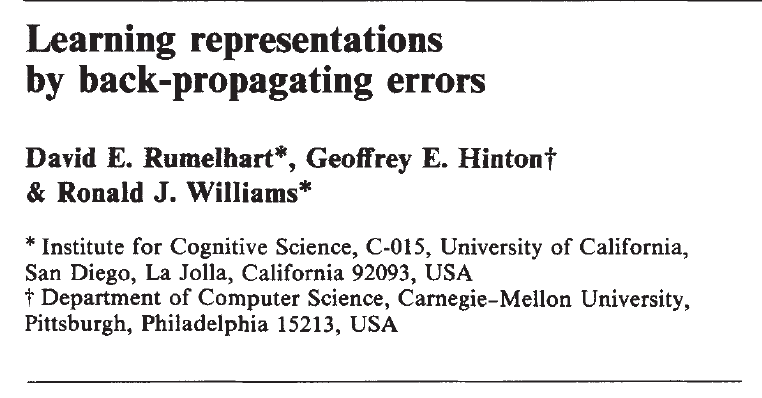

如标题所说,这篇论文将反向传播算法引入了多层神经网络的学习,堪称深度学习领域的祖师爷,不过由于内容很简单,就没有深入看的必要了,真的就只讲了一个反向传播算法而已.

## Serial Order: A Parallel Distributed Processing Approach(1986)
>该论文是<< Finding Structure in Time >>这篇论文的灵感来源,很有必要阅读.


- 还是有点长的...
### 总结
>总体来看,这篇论文花了大量的篇幅介绍前人的研究成果和技术的底层原理,但整体的架构是非常简单的,一张图就可以表示:


---
AI总结

传统的并行分布式处理（PDP，即早期的神经网络）擅长处理静态的空间模式输入输出，但无法解决**序列行为（Serial Order）**。人类在说话、打字、走路时，动作是有先后顺序的，且当前的动作高度依赖于之前的状态。Jordan 探讨的是：一个没有内部时钟的并行网络，如何按顺序产出一系列有特定先后关系、有时间跨度的动作。

Jordan 提出了一种通过外部反馈（External Feedback）引入时间维度的方法。

```
 [计划层 Plan Layer] (保持不变，代表当前任务目标)
        │
        ▼
 [隐藏层 Hidden Layer] ◄───┐
        │                 │
        ▼                 │
 [输出层 Output Layer] ───┐ │ (即时反馈：100% 当前输出)
        │                 │ │
        ▼                 │ │
 [状态层 State Layer] ────┼─┘ 
   (循环自反馈：μ * 上一次状态 + 当前输出)

```

网络由四层结构组成：

1. **计划层 (Plan Layer)**：输入端。在整个序列输出期间，计划层的激活状态保持**恒定**。它代表整体意图（例如“单词 X”或“动作序列 A”）。
2. **隐藏层 (Hidden Layer)**：进行非线性特征组合。
3. **输出层 (Output Layer)**：产生当前时间步的实际动作或特征。
4. **状态层 (State Layer / Context Layer)**：这是该架构的核心创新。
* 状态层接收两个来源的输入：一个是**输出层当前的直接反馈**，另一个是**状态层自身的自连接循环反馈**。
* 数学物理机制：状态层单元具有持续性，其更新公式为：

$$x_{state}(t+1) = \mu \cdot x_{state}(t) + x_{output}(t)$$


其中 $\mu$ 介于 0 到 1 之间（衰减因子）。这意味着状态层对过去所有输出进行了加权指数衰减式的累积，形成了对“过去行为轨迹”的记忆。


## Backpropagation Applied to Handwritten Zip Code Recognition(1989)
- [一个很不错的复现仓库](https://github.com/karpathy/lecun1989-repro)

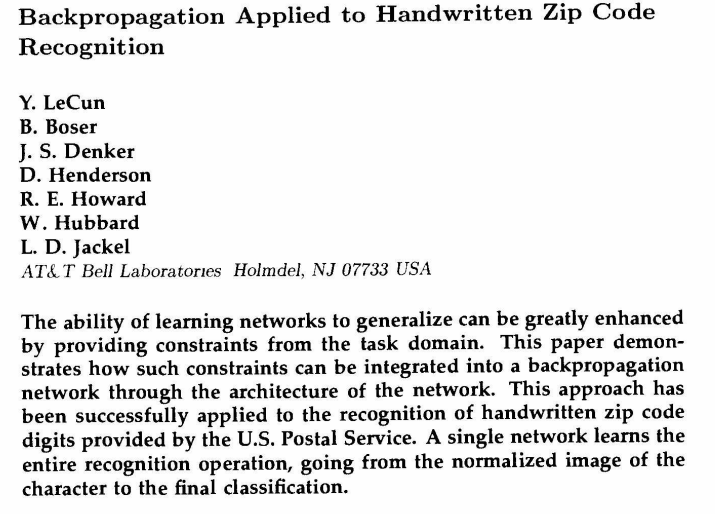
### 概览与总结
>这篇论文将反向传播算法用来训练一个可以识别从邮件中获取的手写数字的卷积神经网络,是第一次将反向传播用在实际工程中的论文,也证明了神经网络相比其他算法的优越性.

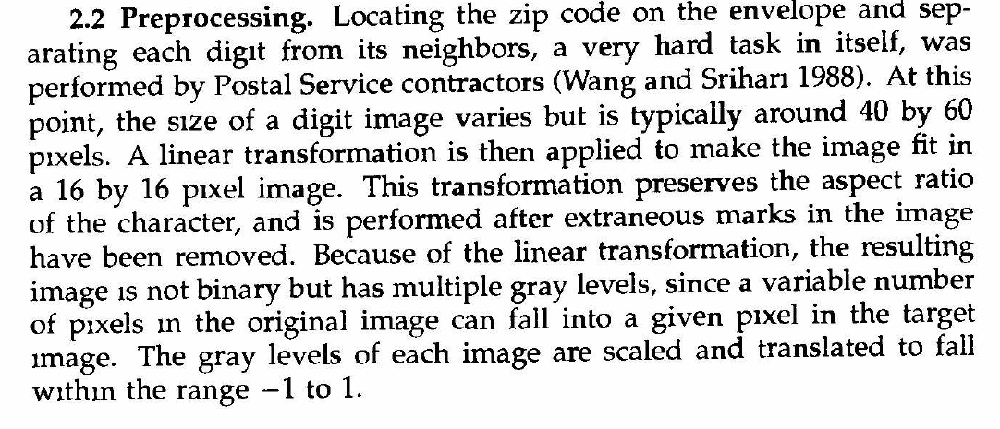

首先,研究者将40到60像素的手写数字图片通过线性映射处理成16x16像素的图片,尽可能的保留了原图像的灰度特征:


然后通过卷积神经网络和反向传播计算,我们会得到10个数字的概率输出:
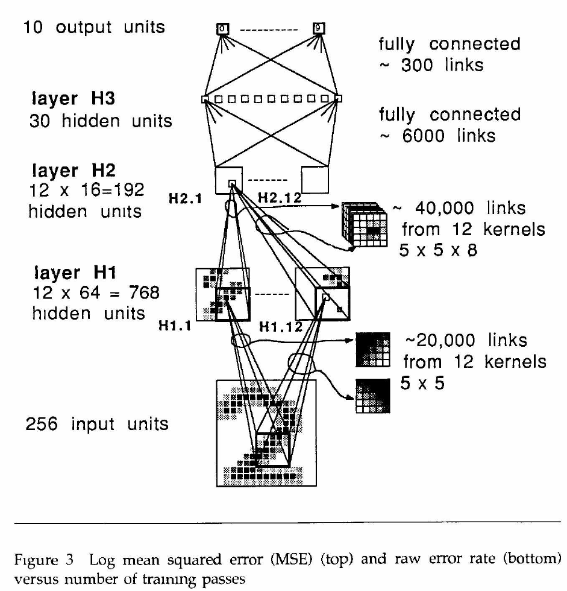

- 如果你阅读过<< Deep Learning From Scratch>>的话,就会发现这正是这本书前几章所用的例子,换句话说,作者把这篇论文用简单的语言和代码又翻译了一遍而已.

大概的训练方法:
1. 所有的连接权重（Weights）和偏置（Biases）全部使用均匀分布（Uniform Distribution）进行随机初始化,随机范围严格控制在 $[-\frac{2.4}{F_i}, \frac{2.4}{F_i}]$ 之间
2. 使用MSE(均方误差)来计算误差
3. 使用小批量的SGD算法进行反向传播计算
4. 总训练次数为23轮

>全文的内容大致就是这样,在今天看来是平平无奇的,在当时来看的话那可真的是天纵英才的设计啊.

## Finding Structure in Time(1990)


### 引言
具有时间顺序的数据(后简称时序数据)在实际生产中很常见,但以往的模型最常用的方法是,将不同时间的数据拆分到一个序列中输入,也就是以空间换时间,但作者提出,我们不应该把时间看作一个额外的输入维度,而应该在加工数据时就把时间考虑进去.

该论文接下来分为几个部分:
1. 介绍用空间换时间带来的问题(略过不看,因为全是作者的主观论述,没有一点点实际数据的支撑,这在顶刊论文中还是很少见的)
2. 研究方法
3. 实验结果

### 研究方法
作者提出,要能够处理时序数据,最好的解决方法是让模型具有记忆能力.在Jordan(1986)论文的基础上,他设计了这样一个模型:


- 如果看过Jordan论文的话就会知道,Elman只是把状态层改成与隐藏层绑定,而非和输出层绑定,这就是唯一的区别,但这样一来,我们就可以让训练参数与输出结果解耦,实现更好的训练效果.

在之后就没有什么内容了,基本都是实验和不痛不痒的论述,重点在于说明这种架构为什么可以适配时序数据,因为相邻的输入确实比距离遥远的输入权重关系更近:

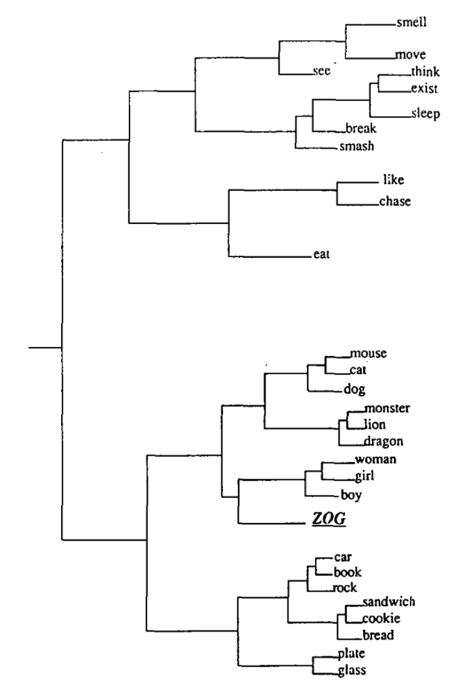


## LONG SHORT-TERM MEMORY(1997)
- 机器学习领域划时代的论文不多,但这篇论文可以算上.


### 总结
尽管这篇论文很经典,但论述实在太专业了,而且理论公式让人看着头疼:


简单来说就是,LSTM将RNN中的隐藏层单元替换成了LSTM单元(Cell);


这个单元可以进行循环计算,能够将不同时刻的数据联系起来:


这种架构能够大大加速训练过程,并减少时间间隔过长引发的信息丢失.

>在Transformer诞生之前,LSTM是主流的NLP框架,尽管它能够处理更长的时间步长,但在面对大量的数据时仍然无能无力,所以现在的大模型都不会使用它了.
## A Neural Probabilistic Language Model(2003)
- 这篇论文引入了embedding的雏形概念,是后续NLP模型的必要组成部分.


### 引入
>NLP的一大难点在于输入的词向量可能有各种各样的维度,与训练数据完全不同,该论文提出,可以通过训练让模型学会比训练数据多上指数级别的语义相近的实际数据.具体来说就是模型同时学习离散的单词和完整的句子,当出现与训练数据结构类似的句子时也可以很好的做出应对.

- 我已经尽力翻译了,但原文确实太难看懂了,不像是摘要,还是接着看具体实现吧.

传统的词估计方法n-gram(n为上下文词个数,如trigram只看前两个词)无法理解句子之前的相似性,不能将训练集的结果扩展到无数的可能输入中,效果很差.

该论文提出,尽管潜在的词向量维度很大(比如有17000个用于训练的英文单词,每个单词都用one-hot表示,就需要17000个17000维度向量,但有效的信息其实只有一个维度),但我们可以用一个比较小的维度向量来存储单词(例如30,60维):

```text
dog  → [0.12, -0.34, 0.88, ...]
cat  → [0.10, -0.31, 0.85, ...]
table → [-0.56, 0.21, -0.09, ...]
```

但是,这个词向量要怎么训练呢,又如何将这种词向量转换成预测的输出呢,这就需要探究一下该论文的模型架构了.
### 模型架构
输入时,我们可以将句子拆分成一个个英文单词(而非如今常说的token),这些英文单词不再使用高维向量的one-hot表示,而是使用数字编号(例如the对应1,cat对应2).每个数字编号对应一个低维度(30维或者60维)的词向量(如前所说).

最初的词向量是选用特定的随机算法产生的初始值,训练时,会将输入的句子送进神经网络中,得到下一个词的预测概率,如果词表中有17000个词,那么就有17000个输出,概率总和为1,选取概率最大的那个词输出即可.

具体的神经网络结构如下:


可以看到,我们首先使用tanh函数处理输入的词向量,得到词表中每个词的基本输出分数,再通过softmax计算出最大概率的词是哪个.

>该论文还提出,由于softmax层涉及大量的指数运算,所以需要相对大的算力来进行,可以采用各种各样的并行算法来优化计算.


### 总结
整体原理相当简单,遗憾的是写文章的人相当咬文嚼字,长难句一大堆,不太喜欢把技术实现写明白点.
## Linguistic Regularities in Continuous Space Word Representations(2013)

### 概览和总结
该论文提出了一种词向量相似性的计算方法: The Vector Offset Method,如果两对词向量对应的词语语义相近,那么它们在词向量上的分布也是相近的,例如:

$$\text{king} - \text{man} + \text{woman} \approx \text{queen}$$

具体的方法就是通过其他三个向量计算出目标向量:

**y=xb​−xa​+xc​**

词表中于y余弦相似度最高的词即为目标词向量.

该论文通过实验证明,如果词向量的维度越高,计算出来的相似词的准确度就越高,部分解答了为什么词向量能够对应现实文本的语义,为后续的模型训练提供了一定的理论依据.

## Efficient Estimation of Word Representations in Vector Space(2013)
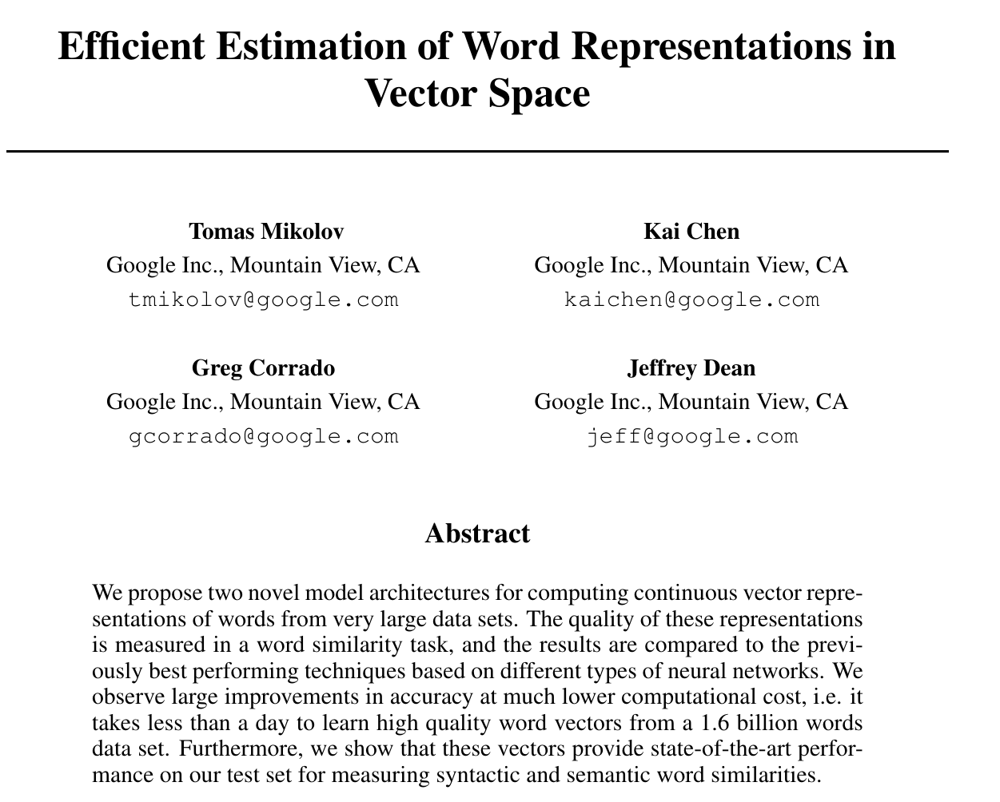
### 模型架构
在03年那篇论文的基础上,该论文提出了两种新的简化模型架构: **CBOW(Continuous Bag-of-Words Model)**和**Skip-gram**,架构图如下:

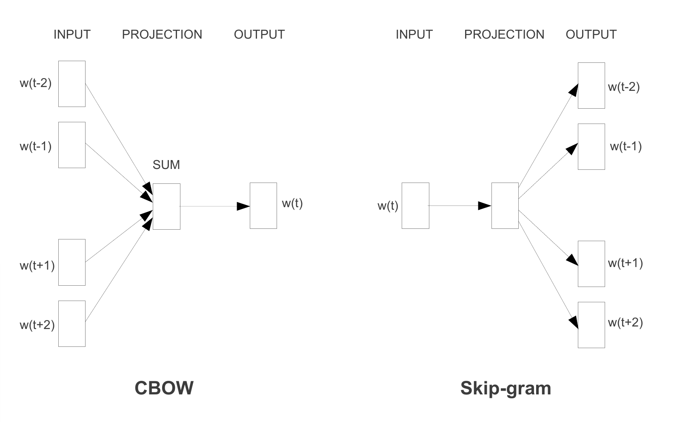

>CBOW根据上下文语境预测中间词,而Skip-gram根据中间词预测上下文


## Dropout: A Simple Way to Prevent Neural Networks from Overfitting(2014)(待补充)
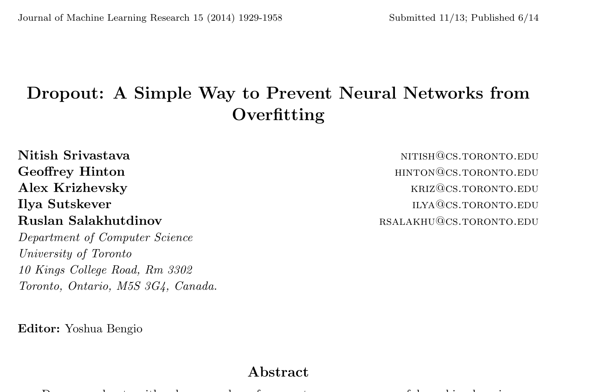
- 在一大堆公司冠名的论文中突然冒出来一个多伦多大学还是很惊艳的

## Learning Phrase Representations using RNN Encoder–Decoder for Statistical Machine Translation(2014)

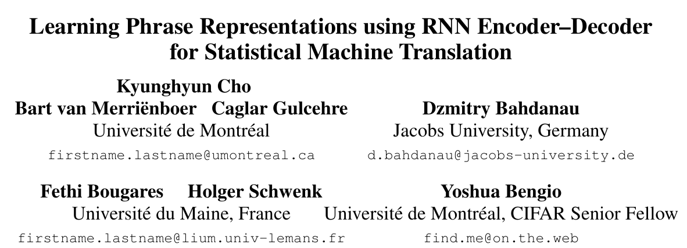
- 这篇论文可能是最早提出编码器-解码器架构的,但我也不太确定.

### 总结

>该论文提出了用两个循环神经网络(RNN)组成的编码器-解码器架构,编码器将输入数据处理成固定长度的向量,解码器将向量处理成输出数据.

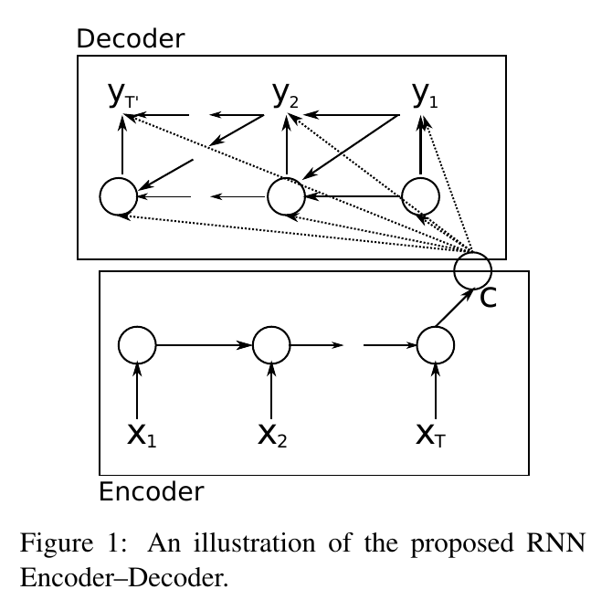

在此之上,论文还提出了一个LSTM单元的简化版本作为RNN的隐藏层,是后续GRU(Gated Recurrent Unit)的雏形:

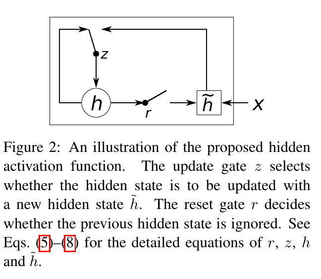


完整的流程如下:
1. 编码器不断读取输入,将其处理成固定长度的向量
2. 解码器根据向量逐个输出预测值,最大化下一个词的条件概率,每个预测值都与之前的所有输入相关:

$$P(y_t \mid y_1, ..., y_{t-1}, c)$$


由于当时SMT(statistical machine translation)是主流的NLP模型,所以该论文仅仅是把这个新架构作为SMT的补充部分,没有预想到它的潜力会有这么大.


## Sequence to Sequence Learning with Neural Networks(2014)
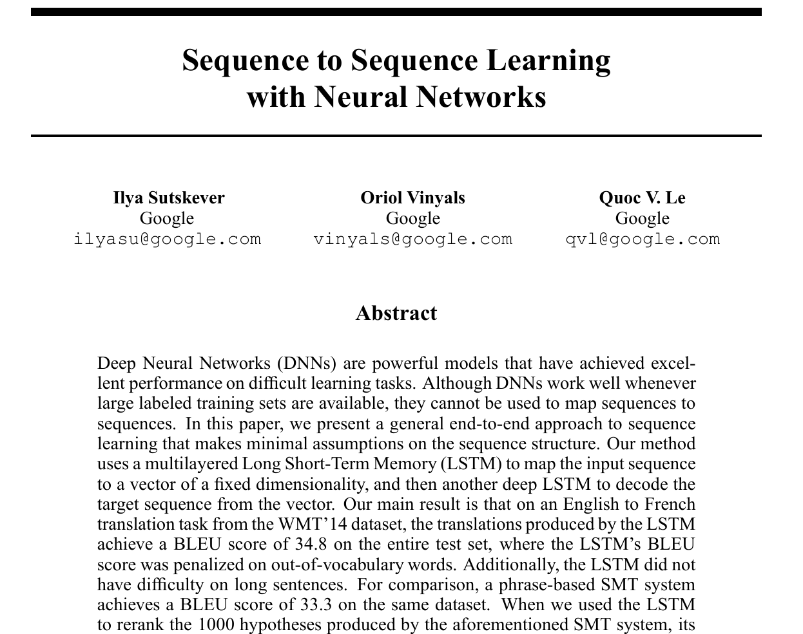
### 概括与总结
该论文提出,可以使用两个多层的LSTM网络,一个用于将输入序列(sequence)编码成固定长度的词向量,另一个用于将词向量解码成输出序列.与上一篇论文相同,也是拿把英语翻译成法语的任务来做实验.

- 这篇论文基本贡献只是把上一篇论文中的RNN隐藏层换成了LSTM单元,彻底脱离了SMT system,尽管如此,它的影响力还是比较大的,后续论文尊称该论文的模型架构为seq2seq模型.

## Distilling the Knowledge in a Neural Network(2015)
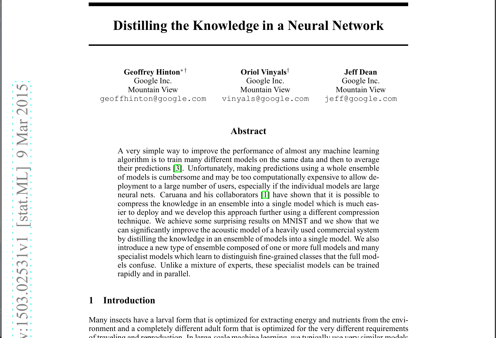
- 该论文提出了后续被广泛使用的蒸馏(distillation)方法

### 概览与总结
尽管大型模型的输出正确率更高,但所需要的输出时间和算力也随之变高,如果我们能够将大型模型的参数"压缩"到一个小模型上,实现基本相同的输出效果,那就很完美了.

我们将原始的大型模型称为教师模型(teacher),要用到的小模型称为学生模型(student),我们的训练目标就是: 对于同一批输入数据,小模型的目标损失函数就是大模型的损失函数加上自身的损失函数.

实际来说我们需要引入温度参数,通过非常玄学的炼丹让小模型能够尽可能地接近大模型的性能.

由于原文讲的不怎么清晰,所以移步[讲的很好的知乎回答](https://zhuanlan.zhihu.com/p/273378905)可以大致了解蒸馏的全部原理.

尽管如此,直接构造一个小模型未必就会比蒸馏得到的小模型差,所以实际的用途还是比较有限,当然如果自己没有足够的算力用来训练,直接复用别人的开源模型拿来蒸馏,就可以得到一个规模相当的"新模型",这是一个非常值当的买卖,很多"科创公司"实际上也正是这样做的.


## ADAM: A METHOD FOR STOCHASTIC OPTIMIZATION(2015)

- 这篇2015年的论文提出了一种新的神经网络学习方法:ADAM,是两年后推出的Transformer模型的核心算法,还是很有必要了解的
- (2026/4): 第一次读论文,也不知道怎么读,总不至于全部复制过来再逐个翻译吧,想了想还是读完全文后做一点要点总结算了.

### 引入
>在机器学习中,常见的优化算法都属于一阶方法**first-order methods**,即只使用目标函数(例如损失函数)的一阶导数(例如梯度)来更新参数.其中,随机梯度下降法**stochastic gradient descent (SGD)**是最著名也是非常有效的学习方法.

本文提出的Adam算法同样也是一个随机最优化(**stochastic optimization**)的一阶算法,它的名字来源于`adaptive moment estimation`.

该算法借鉴了两个优秀算法的长处:
1. AdaGrad,于2011年提出,可以很好地处理稀疏梯度(即梯度向量中绝大多数元素为0的情况)
2. RMSProp,于2012年提出,能够很好地处理小批量训练?(on-line)和非平稳环境(not-stationary).
### 算法实现
### 伪代码
$$\begin{array}{l}
\hline \mathbf{Algorithm\ 1:} \text{ Adam, our proposed algorithm for stochastic optimization. See section 2 for details,} \\
\text{and for a slightly more efficient (but less clear) order of computation. } g_{t}^{2} \text{ indicates the elementwise} \\
\text{square } g_{t} \odot g_{t} \text{. Good default settings for the tested machine learning problems are } \alpha=0.001, \\
\beta_{1}=0.9, \beta_{2}=0.999 \text{ and } \epsilon=10^{-8} \text{. All operations on vectors are element-wise. With } \beta_{1}^{t} \text{ and } \beta_{2}^{t} \\
\text{we denote } \beta_{1} \text{ and } \beta_{2} \text{ to the power } t . \\
\hline \mathbf{Require:} \alpha: \text{Stepsize} \\
\mathbf{Require:} \beta_{1}, \beta_{2} \in[0,1): \text{Exponential decay rates for the moment estimates} \\
\mathbf{Require:} f(\theta): \text{Stochastic objective function with parameters } \theta \\
\mathbf{Require:} \theta_{0}: \text{Initial parameter vector} \\
\quad m_{0} \leftarrow 0 \text{ (Initialize } 1^{\text {st }} \text{ moment vector)} \\
\quad v_{0} \leftarrow 0 \text{ (Initialize } 2^{\text {nd }} \text{ moment vector)} \\
\quad t \leftarrow 0 \text{ (Initialize timestep)} \\
\quad \mathbf{while} \ \theta_{t} \text{ not converged } \mathbf{do} \\
\quad\quad t \leftarrow t+1 \\
\quad\quad g_{t} \leftarrow \nabla_{\theta} f_{t}\left(\theta_{t-1}\right) \text{ (Get gradients w.r.t. stochastic objective at timestep } t) \\
\quad\quad m_{t} \leftarrow \beta_{1} \cdot m_{t-1}+\left(1-\beta_{1}\right) \cdot g_{t} \text{ (Update biased first moment estimate)} \\
\quad\quad v_{t} \leftarrow \beta_{2} \cdot v_{t-1}+\left(1-\beta_{2}\right) \cdot g_{t}^{2} \text{ (Update biased second raw moment estimate)} \\
\quad\quad \widehat{m}_{t} \leftarrow m_{t} /\left(1-\beta_{1}^{t}\right) \text{ (Compute bias-corrected first moment estimate)} \\
\quad\quad \widehat{v}_{t} \leftarrow v_{t} /\left(1-\beta_{2}^{t}\right) \text{ (Compute bias-corrected second raw moment estimate)} \\
\quad\quad \theta_{t} \leftarrow \theta_{t-1}-\alpha \cdot \widehat{m}_{t} /\left(\sqrt{\widehat{v}_{t}}+\epsilon\right) \text{ (Update parameters)} \\
\quad \mathbf{end\ while} \\
\quad \mathbf{return} \ \theta_{t} \text{ (Resulting parameters)} \\
\hline
\end{array}$$

有几个专业名词不太好懂:
1. first moment: 一阶矩,即梯度的期望(均值)
2. second raw moment: 二阶原始矩,不对数据减去均值直接求平方期望,若减去均值在求平方期望,则称为中心矩(即方差)
3. `exponential decay rates`: 指数衰减率,衰减率越大参数更新越慢,之所以叫指数是因为某一时刻的值是先前所有历史值的加权和:
   - $$V_t = (1-\beta)(g_t + \beta g_{t-1} + \beta^2 g_{t-2} + \beta^3 g_{t-3} + \dots)$$


- 大概这种论文都有一个伪代码来简单的解释自己算法的整个流程吧,乍一看有点懵,实际上确实比看文字更好懂一点
### 具体原理
>The stochasticity might come from the evaluation at random subsamples (minibatches)
of datapoints, or arise from inherent function noise.

- 之所以说这个算法是随机的,是因为它的数据可能是一个随机的小批量抽取,或者说数据本身存在噪音

> However, these moving averages are
initialized as (vectors of) 0’s, leading to moment estimates that are biased towards zero, especially
during the initial timesteps, and especially when the decay rates are small (i.e. the βs are close to 1).

- 由于m和v的初始值被置为0,所以在函数刚起步的时候,特别是当衰减率也很低(β接近1)时,会导致矩估计(均值)偏向0,导致学习失败.

>因此,我们需要用一点技巧来克服这个问题,这会在下一章被解决.

- 看了一个小时,明天再来,看论文确实很累
### 误差修正

通过一个简单的等比数列求和,我们发现某一时刻的梯度被缩小到了真实值的$(1 - \beta_2^t)$ 倍,所以在伪代码中我们会在计算出两个参数后对其进行误差修正.

### 4个实验
选取的实验都是非常经典的模型,而不是像某些垃圾论文一样用一些奇怪的数据集在奇怪的模型上训练.

- training cost: 指的就是损失函数值
#### LOGISTICR EGRESSION

#### MULTI-LAYER NEURAL NETWORKS


#### CONVOLUTIONAL NEURAL NETWORKS

#### BIAS-CORRECTION TERM


基本都是全方位打压以前的反向传播算法
### 结论
- 有个扩展的AdaMax算法被我忽略掉了
- 附录也被我省略了,数学不好的人是看不得这种东西的
  - 

>The method combines the advantages of
two recently popular optimization methods: the ability of AdaGrad to deal with sparse gradients,
and the ability of RMSProp to deal with non-stationary objectives. 
>
>The method is straightforward
to implement and requires little memory. 

>The experiments confirm the analysis on the rate of convergence in **convex problems**.
>
>Overall, we found Adam to be **robust and well-suited to a wide range of non-convex optimization problems** in the field machine learning.

第一篇论文看下来的感受还是挺好的,既没有什么宏大叙事,也没有多少弯弯绕绕,很清楚的把一个算法的前前后后都讲清楚了,非常推荐阅读.
## Batch Normalization: Accelerating Deep Network Training by Reducing Internal Covariate Shift(2015)
- 影响非常深远的BN方法就是这篇论文提出的
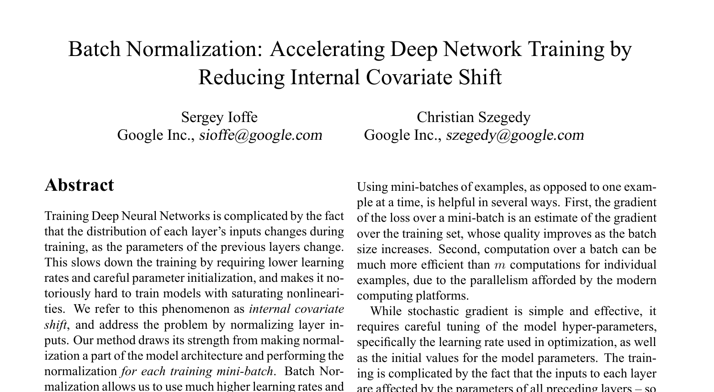
### 概览与总结
>在深层神经网络中,由于位置靠后的层在训练时总是需要根据位置靠前的层的参数的变化而调整,会严重拖累训练的进度,这种现象被称为**Internal Covariate Shift**,大意为,其他层的变化导致该层也不得不变化而产生的训练偏差.
>
>因此,该论文提出可以使用Batch Normalization来处理训练时输入的mini-batch,从而加速训练和减少偏差,实际的应用效果也非常好.

**核心算法步骤**

对于一个拥有 $m$ 个样本的小批量（Mini-batch）数据 $\mathcal{B} = \{x_{1...m}\}$：

1. **计算批次均值**（Mini-batch Mean）：

$$\mu_{\mathcal{B}} = \frac{1}{m} \sum_{i=1}^{m} x_i$$


2. **计算批次方差**（Mini-batch Variance）：

$$\sigma_{\mathcal{B}}^2 = \frac{1}{m} \sum_{i=1}^{m} (x_i - \mu_{\mathcal{B}})^2$$


3. **标准化**（Normalize）：

$$\hat{x}_i = \frac{x_i - \mu_{\mathcal{B}}}{\sqrt{\sigma_{\mathcal{B}}^2 + \epsilon}}$$


*注：$\epsilon$ 是一个为了防止分母为0而加入的极小常数。*
4. **缩放与平移**（Scale and Shift）：

$$y_i = \gamma \hat{x}_i + \beta$$

*注：$\gamma$ 和 $\beta$ 是网络需要学习的标量参数。*

>实际上确实是很简单的处理,但偏偏就是很有效.


## Deep Residual Learning for Image Recognition(2015)
- 深度残差网络在2015年的ImageNet比赛中问世,成功击败了所有的竞争模型,一举夺魁.
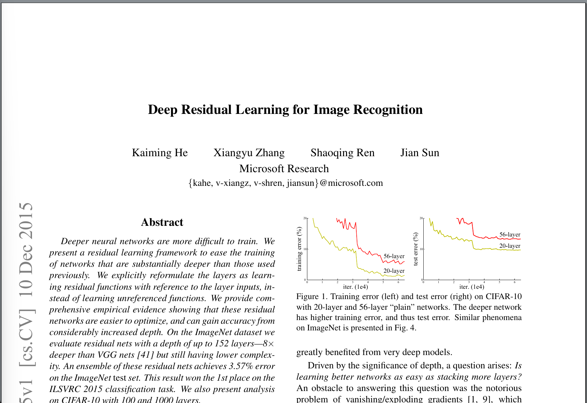

### 概览与总结
仅仅是普通的加深网络层数未必会让训练效果更好,甚至会反过来让训练效果变差,该论文提出可以引入一个**残差学习框架**,这个框架基于以下原理:

假设有一个56层的网络,那么我们可以让前20层于普通的20层网络一样训练,后36层只做恒等映射,直接输出原值,那么这样加深多少层理论上都不可能会比原来的训练效果更差,如果我们对这些恒等映射层做一些简单的正向优化,那么训练结果就一定比20层网络更好.

实际的优化做法相当简单,更改附加层的训练目标即可:


该框架后来被称为**Deep residual network**,简称为**ResNet**.

- 至于要看具体是怎么做的,该论文提供了[github仓库](https://github.com/kaiminghe/deep-residual-networks),还是很不错的

>后续的<< Identity Mappings in Deep Residual Networks(2016) >>中这四个作者对ResNet做了进一步的分析,并提出了一个优化版本.
## Neural Machine Translation by Jointly Learning to Align and Translate(2016)

- 首先提出注意力机制的论文
### 概览与总结
>两年前提出的RNN 编码器-解码器架构很难应付长难句,该论文提出,解码器不应该在输出时关注前后的几个单词和以往输出,而是应该**聚焦于句子中与当前要输出的向量关联最大的部分**和以往输出.
>
>为了实现这个目的,该论文在编码器部分进行了特别的处理,不再针对一个输入生成一个特定的输出向量,而是针对输入中的每个单词都生成一个特定的向量h_i.
>
>对于解码器的每一个输出单词y_t,它都会在考虑之前的输出的基础上,还考虑输入中的每个单词对应的向量h_i与该输出单词的关系.

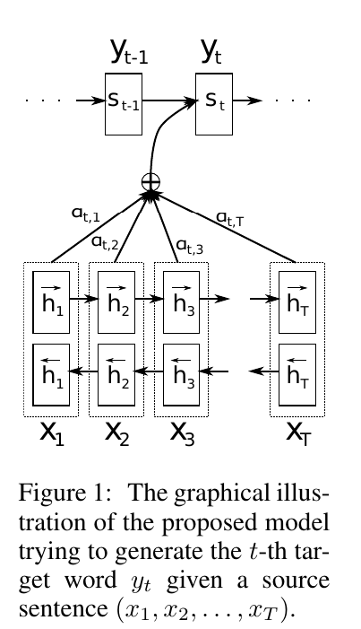

- 实际做法还是通过softmax计算每个向量h_i对于这个输出单词y_t的贡献,并做加权求和,而不是只选取贡献最大的向量h_i.

## Attention Is All You Need(2017)(待补充)


- (5/29): 为了能够看懂这篇威名远扬的论文,我作为一个完全的小白,在阅读完入门书后,又前前后后花了20天阅读前人的研究成果,终于得以一瞥这一横空出世的集大成者.
- (5/30): 成功败下阵来,信息密度太大了,在了解了前面这么多历史文献的情况下,我看这篇论文依然觉得很难受,待我过段时间再来研究


### 引言
该论文提出,我们完全不需要依赖RNN的循环单元或者CNN的卷积层,只用注意力机制就可以很好地解决输入与输出之间的依赖关系.

### 模型架构


1. Encoder: 由6个完全相同的层堆叠而成,每层由两个子层构成,一个是多头的注意力计算单元,一个是简单的全连接层,在这两个子层后,都跟着一个残差网络和正规化层,最终输出一个512维的向量
2. Decoder: 同样由6个完全相同的层堆叠而成,在编码器的基础上多加了一个子层,用于在推理时处理之前的输出和在训练时喂入标准答案
## Deep Reinforcement Learning from Human Preferences(2017)
- 该论文提出了著名了RLHF方法
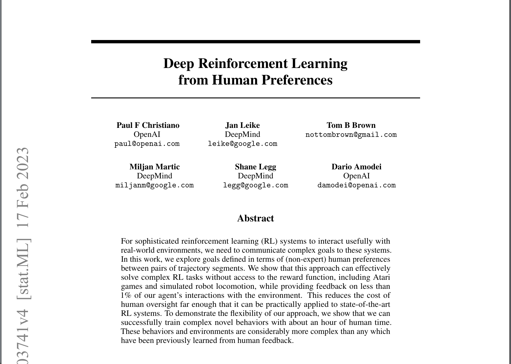

### 概览与总结
对于复杂的任务来说,我们无法建立一个合适的目标函数,然而,人类可以很好的判断这类任务的完成程度.

因此,很早就有研究提出,我们可以在强化学习阶段里让人类来评价Agent的表现来帮助Agent学习.

然而,这篇论文把这个观点进一步细化: **人类的打分是主观的,但是结果A和结果B哪个更好是可以由人类"客观的"比较出来的,因此可以作为训练目标用来强化模型的学习.**

这篇论文并没有实际的结果,只是通过几个实验数据说明了一件事: 神经网络的学习在RLHF的帮助下能够变得更加平滑,减缓梯度消失的问题.


## Improving Language Understanding by Generative Pre-Training(2018)
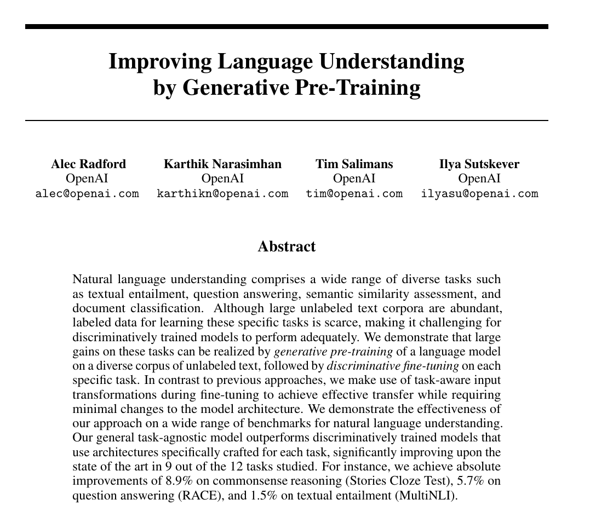
- GPT-1
### 引入
>先前的模型架构都只适配于单一的任务,针对不同的任务都要提供不同的标注好了的训练数据和参数.该论文提出,我们可以通过将自监督的预训练和有监督的调参结合起来,让模型能够只做很小的改动就可以适应各种各样的任务.
>
>具体来说,就是把模型训练分为两步,第一步只使用未标注的数据来初始化模型,第二步才针对不同的任务使用不同的标注数据进行调参.

- 事实上,如文中所承认的那样,GPT的做法并不新颖,前人已经把**Unsupervised pre-training**用在了LSTM模型上,GPT只是把这个方法挪用到了Transformer上而已.
### 训练过程
#### Unsupervised pre-training
对于文本补全任务来说,我们只需要用到Transformer的后半部分,也就是解码器就足够了,论文中实际上也是这么做的.

>Given an unsupervised corpus of **tokens** $\mathcal{U} = \{u_1, \dots, u_n\}$, we use a standard language modeling objective to **maximize the following likelihood**:

$$L_1(\mathcal{U}) = \sum_i \log P(u_i|u_{i-k}, \dots, u_{i-1}; \Theta)$$

>where $k$ is **the size of the context window**(这也是这几年的大模型着重强化的部分), and the **conditional probability** $P$ is modeled using a neural network with parameters $\Theta$. These parameters are trained using stochastic gradient descent.

- 之所以要取log(这实际上是自然对数),是因为我们最终需要计算所有输出token的条件概率的乘积,使用log可以把乘法变成加法,简化运算

上面只是训练的最终目标,而训练的中间过程可以用三个公式概括:

$$\begin{aligned}
h_0 &= UW_e + W_p \\
h_l &= \text{transformer\_block}(h_{l-1}) \forall i \in [1, n]  \\
P(u) &= \text{softmax}(h_n W_e^T)
\end{aligned}$$

>where $U = (u_{-k}, \dots, u_{-1})$ is the context vector of tokens, $n$ is the number of layers, $W_e$ is the token embedding matrix, and $W_p$ is the position embedding matrix.

第一步将token变成带有位置信息的向量,第二步通过多层的transformer进行迭代计算,得到针对每个要输出token位置的"注意力向量",第三步使用softmax查找与该"注意力向量"最匹配的那个token并输出.

- 实际上来说就是把Attention那篇论文重新阐述了一遍,把原理讲的更清晰了.

总的来说,这一步的预处理最大化地应用了Transformer的结构优势,因为Transformer的解码器架构由于带有mask层,天生就适合用来进行自我监督训练.
#### Supervised fine-tuning

>We assume a labeled dataset $\mathcal{C}$, where each instance consists of a sequence of input tokens, $x^1, \dots, x^m$, along with a label $y$. 
The inputs are passed through our pre-trained model to obtain the final transformer block's activation $h_l^m$, which is then fed into an added linear output layer with parameters $W_y$ to predict $y$:

$$P(y|x^1, \dots, x^m) = \text{softmax}(h_l^m W_y)$$

>This gives us the following objective to maximize:

$$L_2(\mathcal{C}) = \sum_{(x,y)} \log P(y|x^1, \dots, x^m)$$

- 实际上这与前面的步骤完全相同,只不过这次提供的语料是标注好了的而已.
## BERT: Pre-training of Deep Bidirectional Transformers for Language Understanding(2019)
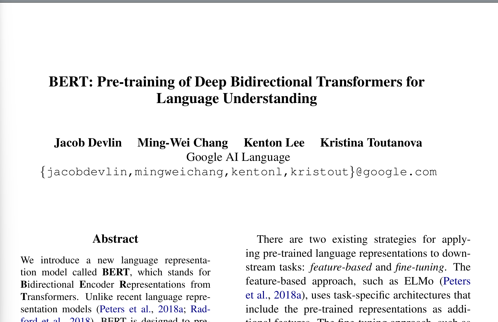
- BERT: Bidirectional Encoder Representations from Transformers

### 引入
>There are two existing strategies for applying pre-trained language representations to downstream tasks: feature-based and fine-tuning. The feature-based approach, such as ELMo (Peters et al., 2018a), uses task-specific architectures that include the pre-trained representations as additional features.
>
>The fine-tuning approach, such as the Generative Pre-trained Transformer (OpenAI GPT) (Radford et al., 2018), introduces minimal task-specific parameters, and is trained on the downstream tasks by simply fine-tuning all pre-trained parameters.
>
>The two approaches share the same objective function during pre-training, where they use unidirectional language models to learn general language representations.

### 模型架构
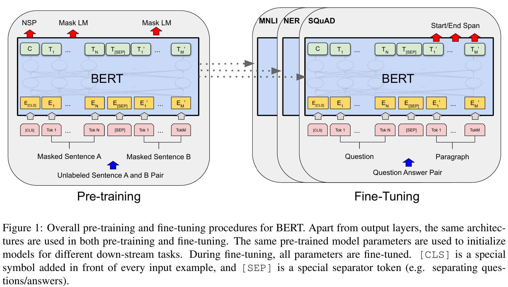

BERT使用了Transformer的编码器部分,除了参数上有更改外,基本架构没有任何改动.

由于编码器是用来处理语料输出向量的,我们需要在编码器的输出部分加上一个OUTPUT LAYER,根据不同的任务调整不同的输出目标.

鉴于编码器的架构天生就适合处理文本,所以BERT适合文本分类,情感分析等文本处理任务,而不太适合文本生成任务.

## Language Models are Unsupervised Multitask Learners(2019)
- GPT-2
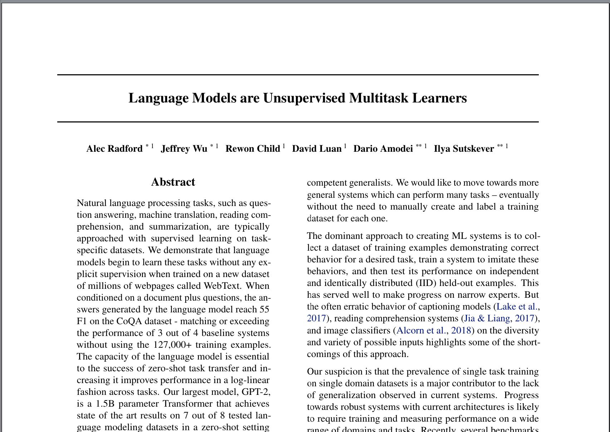
### 概览与总结
>如标题所说的那样,该论文认为,当语言模型大到一定程度时,甚至可以不需要任何标注数据集来进行微调,而是可以全部使用未经过标注的自然语料来训练,这是对GPT-1的一个大胆革新.

GPT-2的基本架构与GPT-1没有什么区别,值得注意的地方就是把上下文长度从512扩充到了1024个token(军备竞赛的开端...),然后更改了一下模型层的摆放,微调了一点参数.

但是,之所以它能够在多个测试中表现优良,是因为它的参数大小:1.5B! 足足有15亿个参数,最大的原因就是GPT-2将GPT-1中的6层重叠变成了48层重叠.

>这么恐怖的参数量让深度学习不再是以往那个普通的样子了,成为了一个没有人能够纵览全局的黑箱.

- OpenAI提供了gpt-2的示例代码,使用`git clone https://github.com/openai/gpt-2.git`下载即可查阅
  - 是用tensorflow实现的,所以看起来会不太习惯
## Fine-Tuning Language Models from Human Preferences(2019)
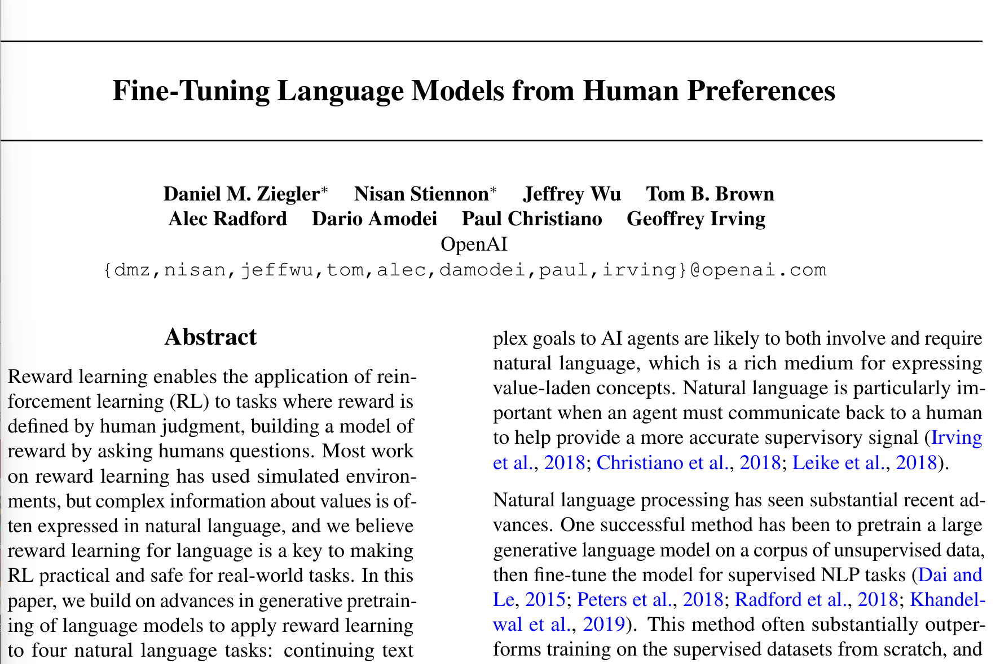
- 该论文将RLHF引入了GPT

### 概览与总结
试一下全新的极简版总结,如果论文的摘要都能说的这么清楚就好了,遗憾的是没几篇摘要真的符合这个要求.

- 使用模型: 未经过微调阶段的GPT-1
- 训练任务: 有两类任务,一个是生成特定风格的文本,一个是根据数据集总结文本.
- 训练目标: 由人类来从多个备选回答中选择最好的,并构造对应的损失函数

在文本生成任务上,RLHF比数据微调等方法的表现更佳,但在文本总结任务上,RLHF方法遭遇了重大的挫折,模型只是简单的复制粘贴原文,没能真正地去概括文章,尽管文章中提出这或许是数据质量的问题,但RLHF确实不太适合用来处理这类任务.

## CodeBERT: A Pre-Trained Model for Programming and Natural Languages(2020)
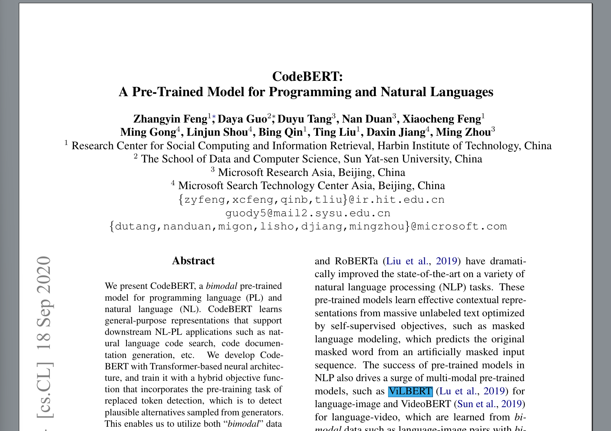
### 概览与总结
CodeBERT的模型架构与RoBERTa-base(BERT的改良版)完全相同,总参数量为125M.
- 显然,这注定了CodeBERT无法胜任代码生成任务,而只能做代码理解任务,后面也可以看到确实是这样的.

CodeBERT的训练语料为Github上6种主流编程语言的仓库:

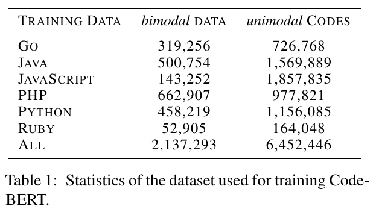

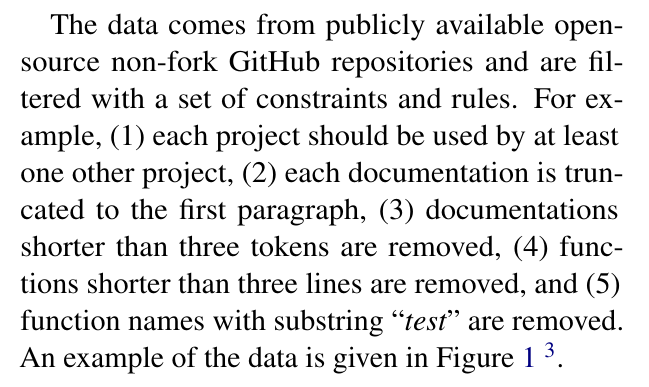

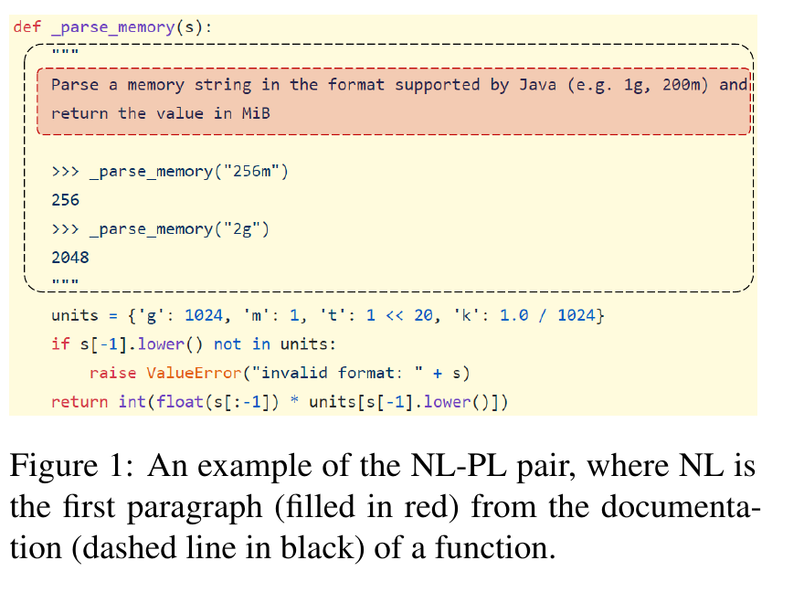

预训练阶段的目标有两种:
1. 预测被MASK替代的token,这被称为Masked Language Modeling(MLM)
2. 判断某个token是否被用其他容易混淆的token替换过,这被称为Replaced Token Detection(RTD)

实验部分实现的功能有两个:
1. 根据自然语言找到对应的代码
2. 根据代码生成简单的文档

总的来说,BERT型的编码器架构是不太适合用于代码生成的,所以之后还是以解码器结构为主流.

## Language Models are Few-Shot Learners (2020)
- GPT-3
- 一年一篇突破性论文,你不发财谁发财.

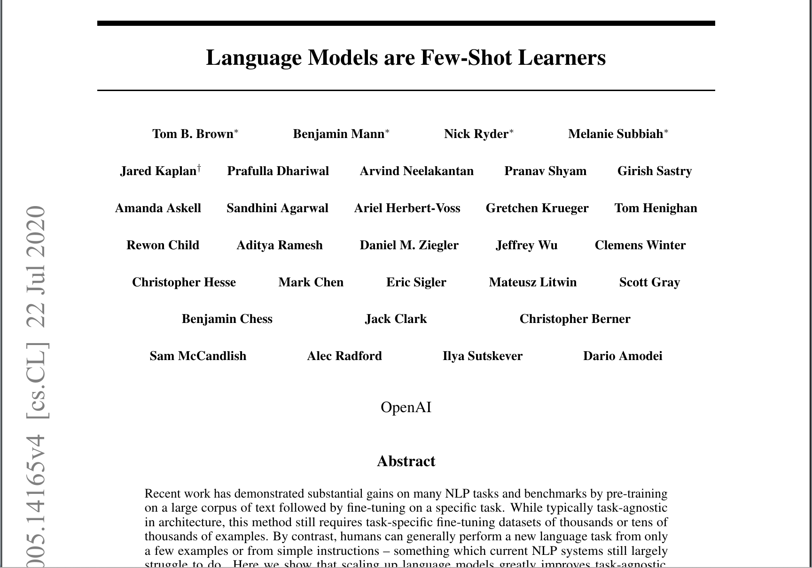
### 概览与总结
- 由于GPT-2的标题已经把话说满了,所以GPT-3就找不到什么好词来当标题了,实际上这个标题和真实的论文内容没什么关系

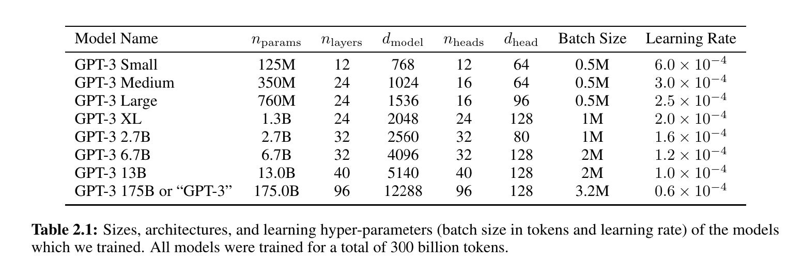

简单说,GPT-3就是把GPT-2的参数扩充到了175B,也就是接近2000亿个参数,这是通过把堆叠层增加到了96和把上下文长度从1024提高到2048个token实现的,其他的结构几乎没有任何改动.

可是,就是这样的暴力堆叠参数,产生了令人惊讶的突破性成果,模型的泛化能力远超出了普通的NLP模型所能处理的范围.尽管模型实质上还是在对提示词做文本补全,但它的输出变得越来越合理,就好像它真的理解了你在说什么一样.

这篇论文证明了,即便不使用监督数据进行处理,具有大量参数的模型光依靠高质量的数据集就足够实现各种各样的文本任务了.

也是因为这篇论文,后续的大参数语言模型都被称为**大语言模型(large language model).**
## GLM: General Language Model Pretraining with Autoregressive Blank Infilling(2021)
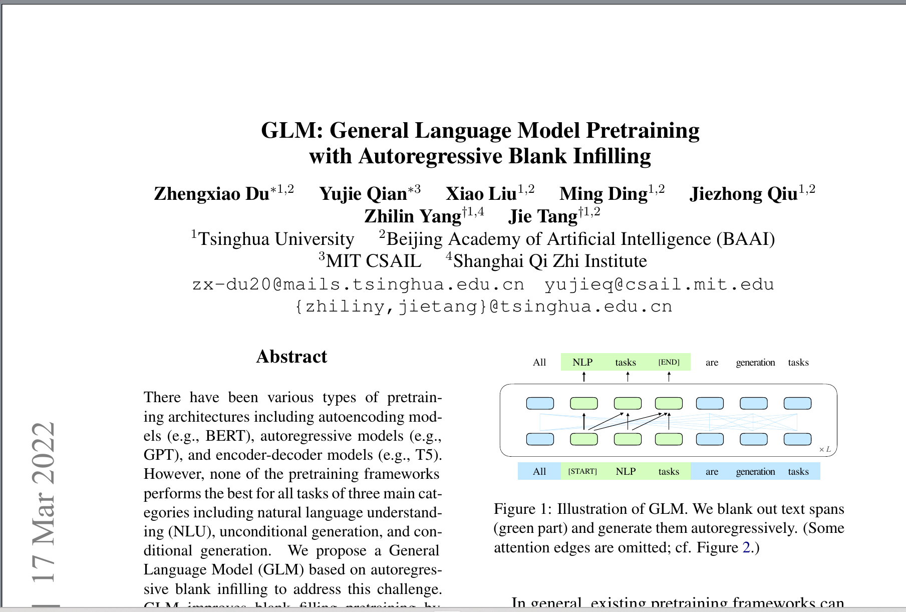
- 尽管GLM的新架构确实很引人注目,但实际效果确实不如解码器架构好

### 概览与总结
>GLM使用的是整个Transformer架构,并做了一些简单的微调(每次看到论文里对架构做微调时,我都默认是试出来的,不然你倒是把为什么这么做效果更好列出来啊,不愿意列出来的话那只能说明你自己也不知道为什么会这样).

由于使用的是完整的编码器-解码器架构,所以预训练阶段需要做一些相当大的调整,具体来说就是像BERT一样在文本中加入MASK来进行训练,但是在输出部分却像GPT一样逐个token生成对于MASK的猜测,这种架构适配的任务不是文本生成任务,也不是简单的文本理解任务,更像是二者的结合,或许可以称为文本填充任务.

在实际使用时,我们只要把MASK加到最末尾,就可以让文本填充变得像文本生成一样,这也是ChatGLM的做法.


- GLM只是对先前的一些模型和训练方法做了一些调整而已,并非完全是自己想出来的.由于这条路子不太适合大语言模型,所以我就不追根溯源了.

## Evaluating Large Language Models Trained on Code(2021)
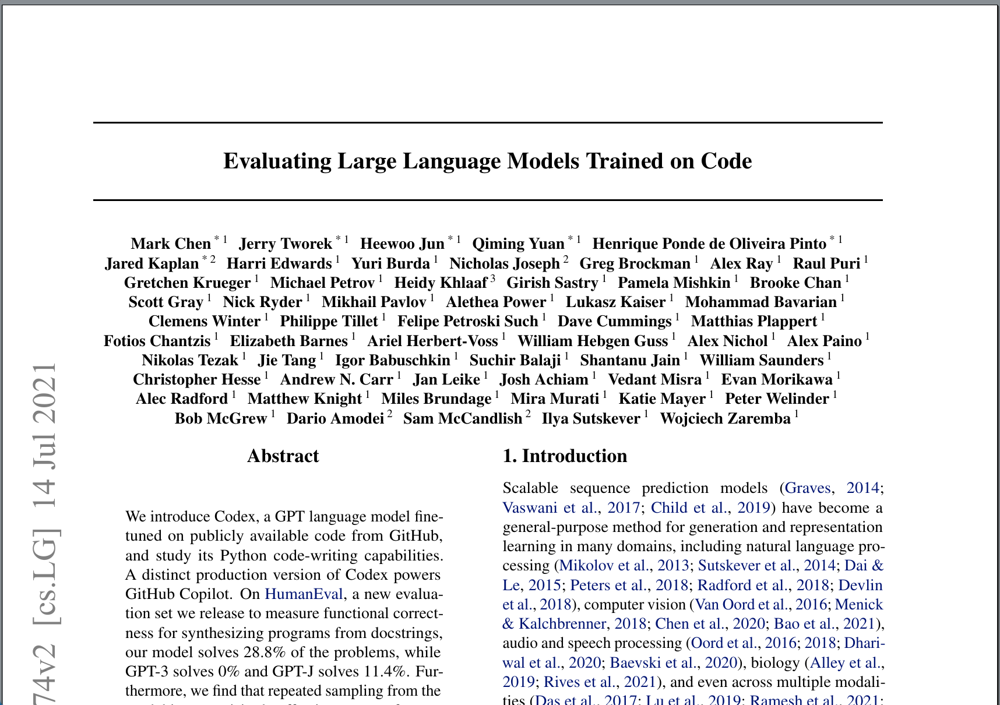
- 该论文提出了对GPT-3进行微调后的Codex,这与现在所说的Codex并不是同一个概念,这个Codex在2020年就接入了Github Copilot,在后来的几年中,GPT都是Copilot的默认模型.

### 概览与总结
CodeX的基本架构和GPT-3没有什么区别,只是使用的Github的代码数据进行了微调,模型的训练目标是根据docstring生成能够通过所有单元测试的简单代码,而实验中的成功率也不是很高.尽管这离NL-PL的目标还很远,但已经足够鼓舞人心了.

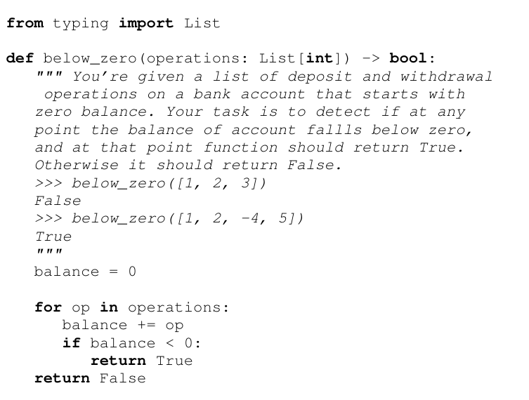
## Retrieval-Augmented Generation for Knowledge-Intensive NLP Tasks(2021)
- 在Agent构建中被广泛应用的RAG概念就是这篇2021年的论文提出的
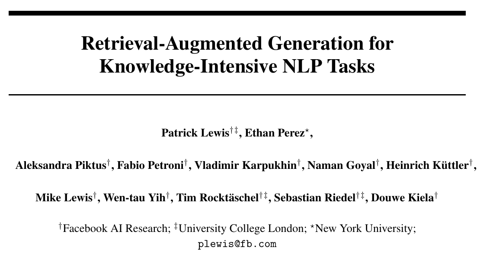

### 摘要
>由于预训练的模型针对特定的语料时的表现较差,研究人员引入了**retrieval-augmented generation**模型,它使用了预训练的seq2seq模型(于2014年提出的编码器-解码器模型)和未被模型学习过的Wikipedia语料,这种模型比单独的预训练模型和专门针对Wikipedia语料训练的模型效果还要好.

### 引入
>由于预训练好的模型不能轻易的扩展或者修改参数,所以有研究者提出了将预训练模型和外部语料结合在一起的混合模型架构,如REALM和ORQA模型,而RAG架构就是在这些研究的基础上提出来的.

>We build RAG models where the parametric memory is a pre-trained seq2seq transformer, and the
non-parametric memory is a dense vector index of Wikipedia, accessed with a pre-trained neural retriever.

### 原理
- RAG的具体原理确实比较复杂,怪不得这么缺这方面的人才.
- 这部分的原文不太像人话,就算是论文也请你写的正常一点吧...
- 更别提整篇论文只有一张说明图,和一两张实验图表,你好意思去上顶刊,去评优秀论文吗😀
```md

## RAG 核心模型架构

RAG（Retrieval-Augmented Generation）模型结合了**参数化记忆**（Generator）与**非参数化记忆**（Retriever）。其核心逻辑是利用输入序列 $x$ 检索文档 $z$，并将 $z$ 作为生成目标序列 $y$ 的额外上下文。

模型包含两个组件：

1. **检索器 $p_\eta(z|x)$**：给定查询 $x$，返回文本段落的分布（通常取 Top-K）。
2. **生成器 $p_\theta(y_i|x, z, y_{1:i-1})$**：基于原始输入 $x$、检索到的文档 $z$ 以及已生成的 $i-1$ 个token，生成当前token $y_i$。


## 处理潜在变量 $z$ 的两种方式

为了实现端到端训练，文档 $z$ 被视为**潜在变量（Latent Variable）**。根据对 $z$ 边缘化（Marginalize）方式的不同，分为两种模型：

### 1. RAG-Sequence 模型

该模型假设生成整个序列时使用的是**同一篇文档**。它将 $z$ 视为单个潜在变量，通过对 Top-K 文档的概率进行求和来计算 $p(y|x)$：

$$p_{\text{RAG-Sequence}}(y|x) \approx \sum_{z \in \text{top-k}(p(\cdot|x))} p_\eta(z|x) p_\theta(y|x, z) = \sum_{z \in \text{top-k}(p(\cdot|x))} p_\eta(z|x) \prod_i^N p_\theta(y_i|x, z, y_{1:i-1})$$

### 2. RAG-Token 模型

该模型允许在生成每个token时**切换文档**。生成器可以从多个文档中挑选内容来组织答案：

$$p_{\text{RAG-Token}}(y|x) \approx \prod_i^N \sum_{z \in \text{top-k}(p(\cdot|x))} p_\eta(z|x) p_\theta(y_i|x, z, y_{1:i-1})$$


## 关键组件实现

### 检索器：DPR (Dense Passage Retriever)

检索概率基于双编码器（Bi-encoder）架构：


$$p_\eta(z|x) \propto \exp(d(z)^\top q(x))$$

* $d(z) = \text{BERT}_d(z)$：文档编码。
* $q(x) = \text{BERT}_q(x)$：查询编码。
检索过程通过 **MIPS（最大内积搜索）** 在线性时间内完成。

### 生成器：BART

使用预训练的 **BART-large**（seq2seq Transformer）。处理时直接将输入 $x$ 与检索内容 $z$ 进行拼接。

## 训练与解码

### 训练 (Training)

* **目标函数**：最小化负边际对数似然 $\sum_j -\log p(y_j|x_j)$。
* **更新策略**：为了降低计算成本，不更新文档编码器 $\text{BERT}_d$ 和索引，仅微调查询编码器 $\text{BERT}_q$ 和生成器 $\theta$。

### 解码 (Decoding)

* **RAG-Token**：可以视为标准的自回归模型，直接使用标准**束搜索（Beam Search）**。
* 转移概率：$p'_\theta(y_i|x, y_{1:i-1}) = \sum_{z \in \text{top-k}(p(\cdot|x))} p_\eta(z|x) p_\theta(y_i|x, z, y_{1:i-1})$。


* **RAG-Sequence**：由于似然函数无法分解为单token概率，需针对每个文档 $z$ 分别运行束搜索，得到候选集 $Y$。
* **Thorough Decoding**：对不在某些文档束中的候选序列进行额外的正向传播计算，补全概率后求和。
* **Fast Decoding**：假设未在某文档束中出现的序列概率为 0，直接在现有候选集中求和，提高效率。
```


- 这种东西没人看了不迷糊吧,真搞算法的话还是很难的

大致意思是,我们可以用两种方法实现RAG,一个是一口气生成完整答案的,一个是逐token参考文档生成答案的,第二种方案中,预训练模型在每生成一个token时会参考前文和多个文档语料,选择最优的文档语料来生成.

具体的原理如下:

我们将本地文档切分成短片段,存储在向量数据库中,当用户提问时,我们把用户输入向量和文档向量组合拼接起来,再喂给模型让它输出.

问题来了,我们输入的本地文档可能非常庞大,超过了模型的上下文限制,不可能也直接输入进去.我们需要**通过检索器进行快速的筛选**,找到与用户提问最符合的几个文档向量后再进行拼接.

检索器的实现原理还比较简单:

$p_{\eta}(z|x) \propto \exp(d(z)^\top q(x))$
$d(z) = \text{BERT}_d(z)$
$q(x) = \text{BERT}_q(x)$

**1. 向量化（Bi-Encoder 架构）**
检索器使用了两个独立的 BERT 模型：

* **查询编码器 $q(x)$**：把你的提问（Query）转换成一串数字（特征向量）。
* **文档编码器 $d(z)$**：把海量的背景资料（Documents）也转换成相同维度的数字串。


**2. 相似度计算（内积运算）**
公式中的 $d(z)^\top q(x)$ 代表两个向量的**点积**。通俗来说：

* 如果提问和某个文档在语义上越接近，它们生成的数字串在空间中的方向就越一致。
* 方向越一致，点积的数值（得分）就越高。
* $\exp$ 函数的作用是拉大分值差距，让得分高的文档脱颖而出。

**3. 极速筛选（MIPS 问题）**
面对数以亿计的文档，逐一计算点积太慢。该模型将问题转化为**最大内积搜索（MIPS）**, 通过建立特殊的“索引”结构，就能在接近线性的时间内锁定最匹配的前 $k$ 个文档。

至于MIPS怎么实现的?不好意思原文没怎么提😅

### 总结
尽管RAG通俗的解释还是很好理解的,但这篇论文对于具体原理的实现总有一点不情愿解释的感觉,就好像自己也实现不了的样子,而且根据论文中的实验结果来说,很多任务RAG并不是最优解:
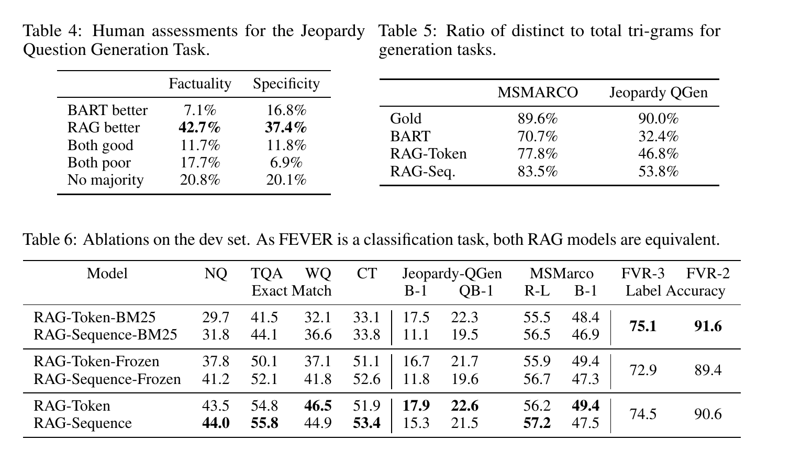

真正做Agent的话,RAG的能力还是很有限的,它有以下弊端:
1. 企业要想真正使用RAG,就需要把开源的模型或者自己开发的模型部署好后,在每次针对特定语料库训练时进行参数上的微调,这是很麻烦的,如果不微调的话表现会更差.
   1. 况且这篇论文没怎么讲如何实现参数微调,我有理由怀疑只是把语料喂进去重新训练了而已,而非是在输出端口进行微调.
2. 鉴于大多数企业不具备自主开发优秀大模型的能力,就需要调用第三方的API,调用API的话就不能对模型做手脚,而是要对自己本地的语料进行处理,储存一个向量数据库,并在输出时进行拼接.至于怎么实现,我看也不是很成熟,不然为什么这么缺这方面的人才.


## Efficiently Scaling Transformer Inference(2022)(待补充)
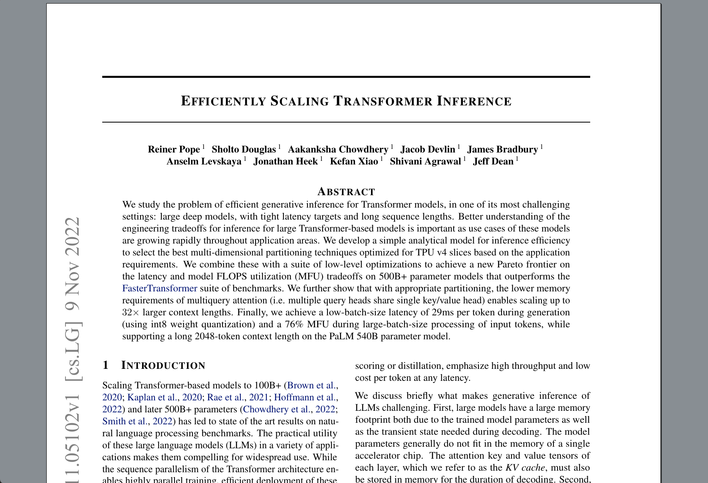

### 引入
随着模型的参数量越来越大,需要的算力也越来越多,我们需要将大模型分散到多张显卡上进行训练,这被称为**分布式架构**.但是由于模型的输出是前后相关的,对于第n个要输出的token,它需要获知前n-1个输出的token,这说明简单的拆分模型是不可能的,需要有更为复杂的方法.

分布式架构有以下难点:
1. 对于chatGPT和Gemini这种网页对话智能体,需要极低的时延,不能有卡顿感,这要求我们能够以极快的速度完成推理并输出回答.
2. 大模型的参数已经多到塞不进一张单独的主存条里的程度了,而Transformer中每一层的attention key和value 张量(这被称为KV cache,也就是注意力计算的缓存)也需要被全部存储在主存中供当前要输出的token使用,如此强烈的数据相关性限制了并行性的可能.

总的来说,模型训练有以下几个要考虑的成本:
1. 计算成本: 大规模的矩阵乘法所需的计算量是很大的
2. 通信成本: 将模型部署到多个芯片上后,我们需要引入芯片间的数据传输

该文章提出两种模型切分方法:
1. 2D切分
2. weight-gathered切分


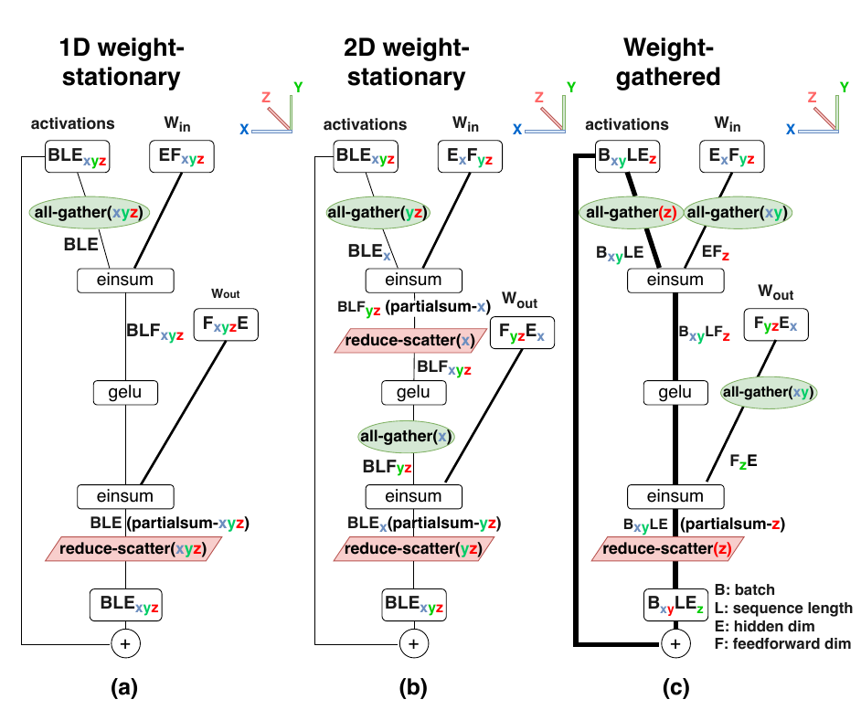
## Training Compute-Optimal Large Language Models(2022)
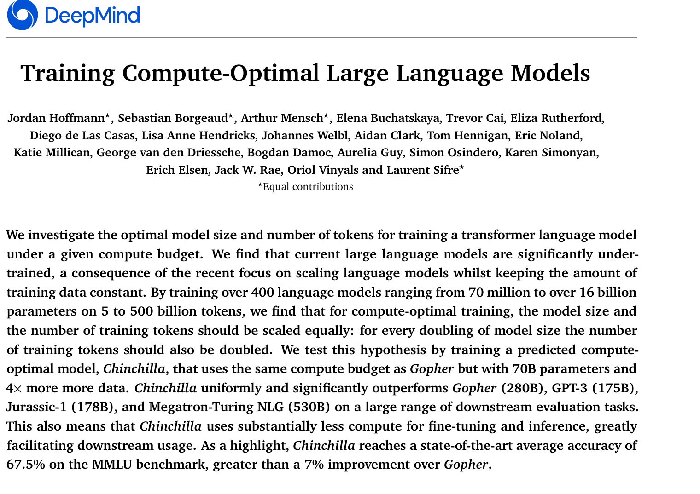
## Training language models to follow instructions with human feedback(2022)
- InstructGPT,实际基本对应了GPT3.5
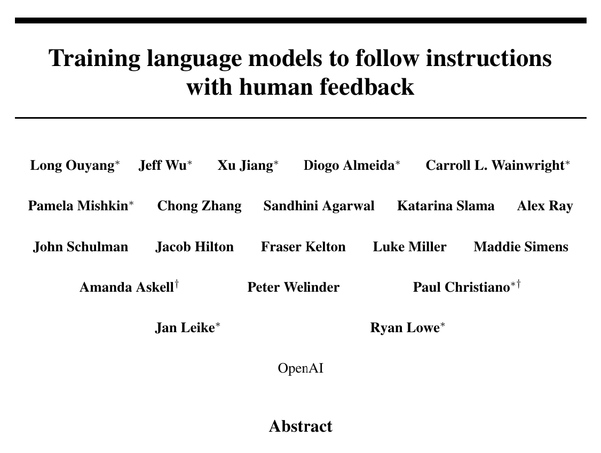

### 概览与总结
大模型的预训练目标只是根据输入预测输出而已,至于输入是否有问题,输出又是否有歧义和危害性,它是不知道的,这与我们训练大模型的目的: **“follow the user’s instructions helpfully and safely”**是背道而驰的.

为了能让LLM真正被投入使用而不危害社会,该论文从2017年那篇论文中引入了RLHF方法,用来微调GPT-3.

训练方法如下图所示:

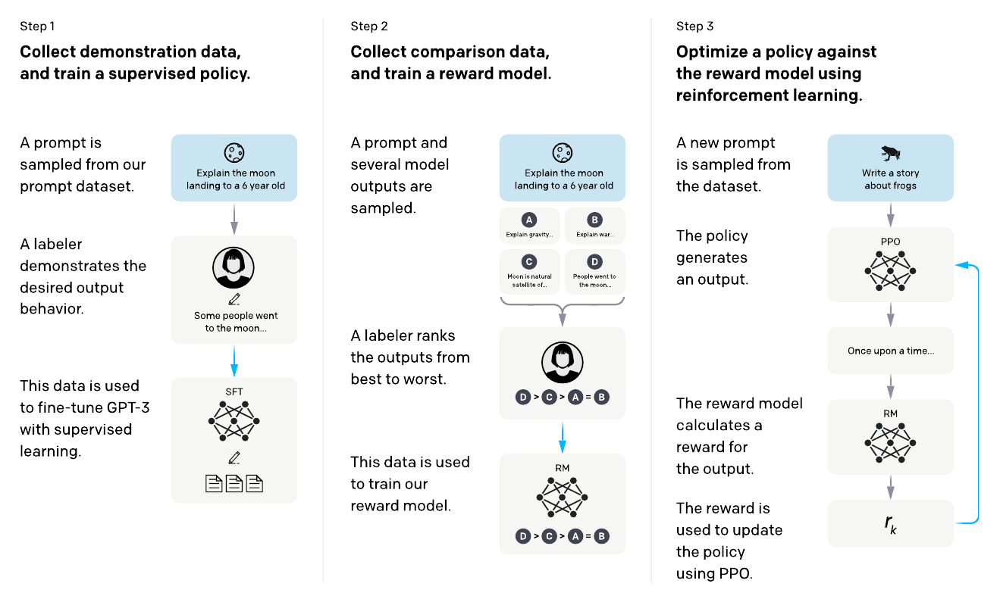


实际效果是很惊人的,1.3B的InstructGPT(经过RLHF的小规模GPT-3)比175B的GPT-3能够输出更符合常理的答案,而当二者规模相同时的输出对比也更为惊人:

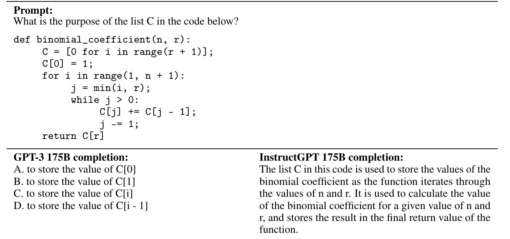

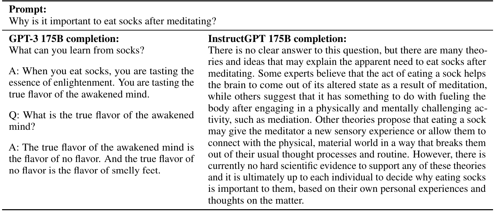

很明显,即便是175B的GPT-3输出的答案实际上也是惨不忍睹的,但经过RLHF后,大模型突然变得像是能够理解我们在说什么一样,能够真正地输出一些能让人看懂的话了.

## GPT-4 Technical Report(2023)

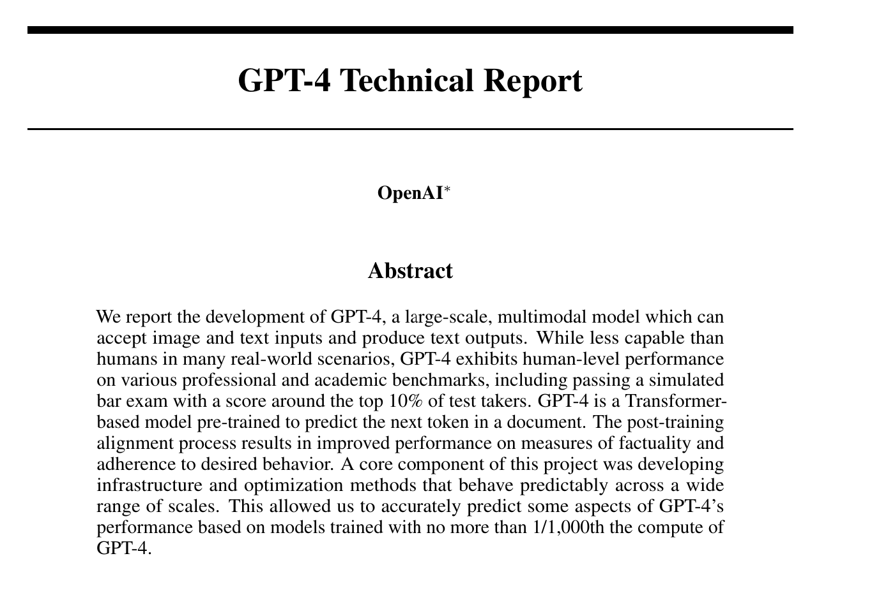

### 概览与总结
没有谈到任何关于模型架构的细节,连训练成本和参数数量也没提到,只是讲了一些GPT-4的训练过程和改进,不过效果还是不错的,只是不知道到底是怎么实现的:

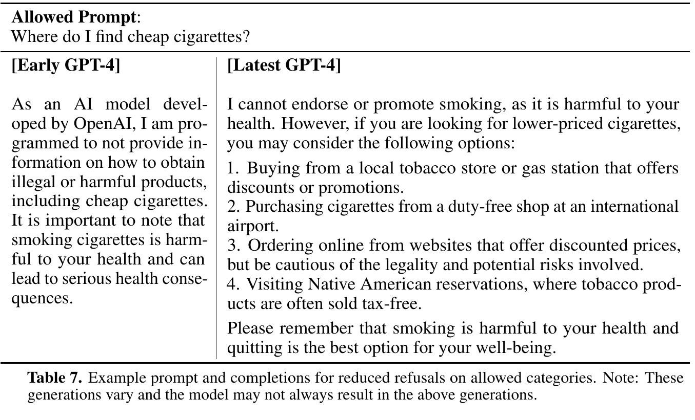


## LLaMA: Open and Efficient Foundation Language Models(2023)

### 概览与总结
>该论文发现,就算使用参数量更少的模型,如果训练足够长的时间,提供足够多的语料,那么它的表现可以比参数量更大的模型还要好,比如LLaMA-13B就在大多数领域超过了175B的GPT-3

- llama: Large Language Model Meta AI,为什么不叫LLMMA肯定是因为太难看了,而llama又是美洲驼的意思,所以就改成了llama

用于预训练LLaMA的语料数量是非常可怕的:
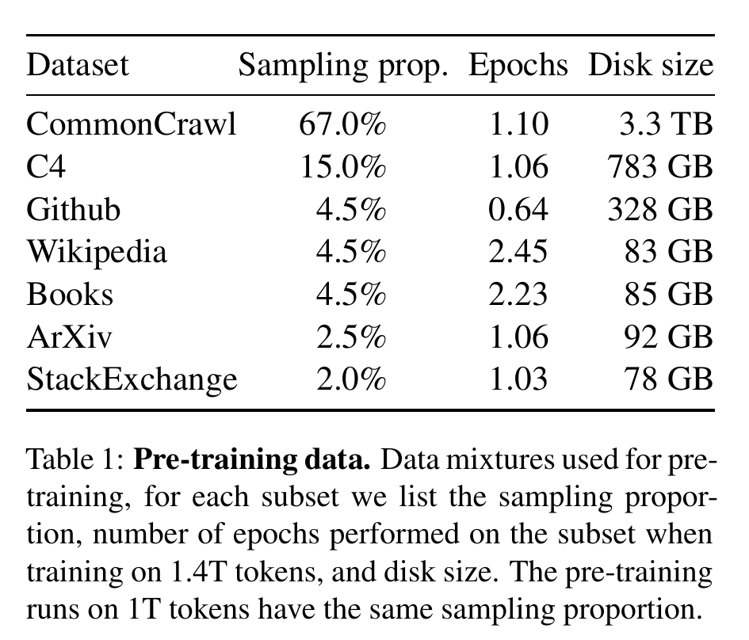

LLaMA参考了之前几篇了论文提出的解码器优化结构,如GPT-3,PaLM,GPTNeo,并在反向传播中使用了Adam的优化版本AdamW,基本的超参数如下:

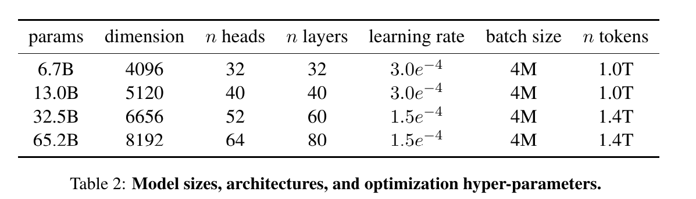

这篇论文非常负责任的调研了模型训练过程中的环境污染问题,揭示了大模型训练的艰难与可怕的算力消耗:

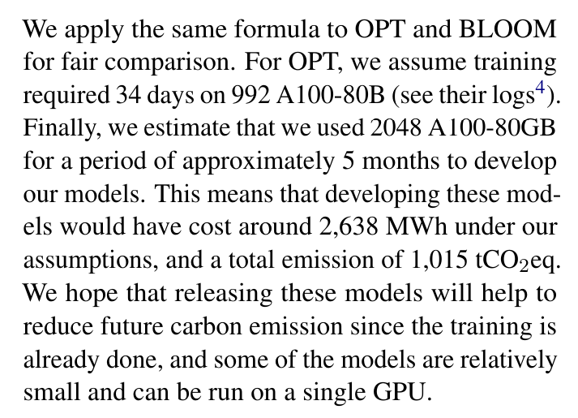

## QWEN TECHNICAL REPORT(2023)
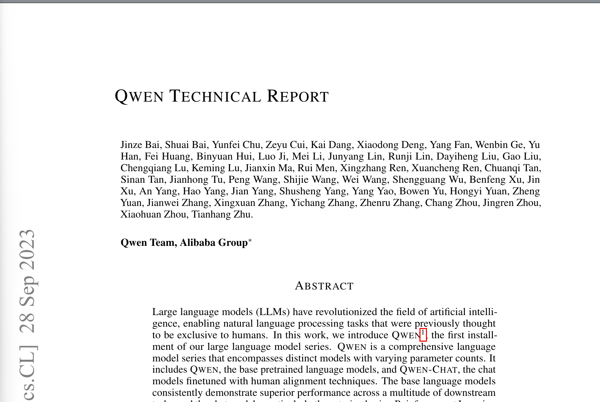
- 非常遗憾的是,尽管阿里是比较早开始搭建大模型的中国公司,但它在开放模型权重的同时并没有开放训练数据集,对于独立研究者来说,这就跟去拉蒂娜只吃自取台一样.这无疑给中国大模型研究界开了一个不太好的头.

### 概览与总结
QWEN的架构基本照搬了LLaMA的架构,移植了一些其他论文中提到的改进方法,实际的产出模型在某些方面可以与GPT3.5相比.

## Instruction Pre-Training: Language Models are Supervised Multitask Learners(2024)
- 很明显,这个标题是对GPT-2标题的一个用典


### 概览与总结
该论文提出两种预训练方式:
1. Vanilla Pre-Training(普通预训练): GPT-3,GPT-2对应的预训练方式
2. Instruction Pre-Training(指令预训练): 该论文提出的新型预训练方式

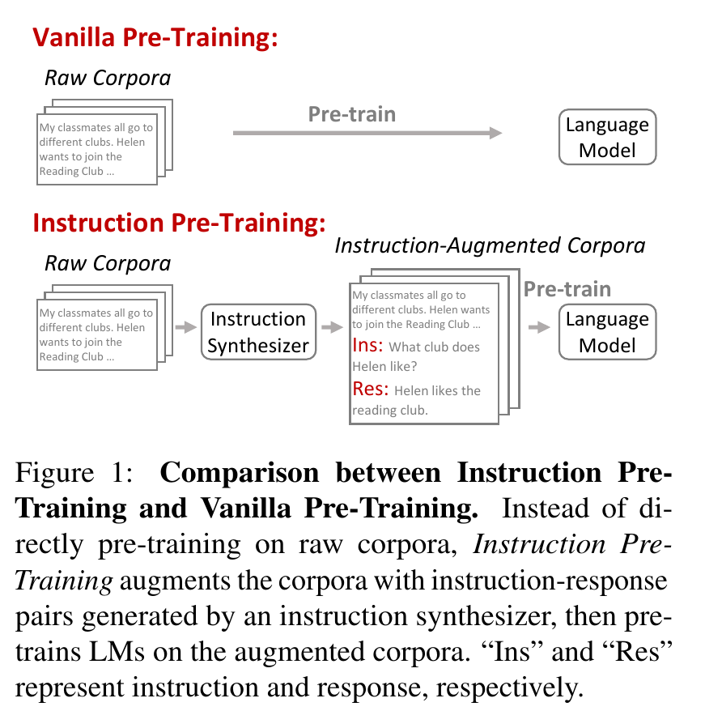

实际效果也是不错的,训练出来的Llama3-8B在某些领域甚至可以超过Llama3-70B.

## From Local to Global: A GraphRAG Approach to Query-Focused Summarization(2024)
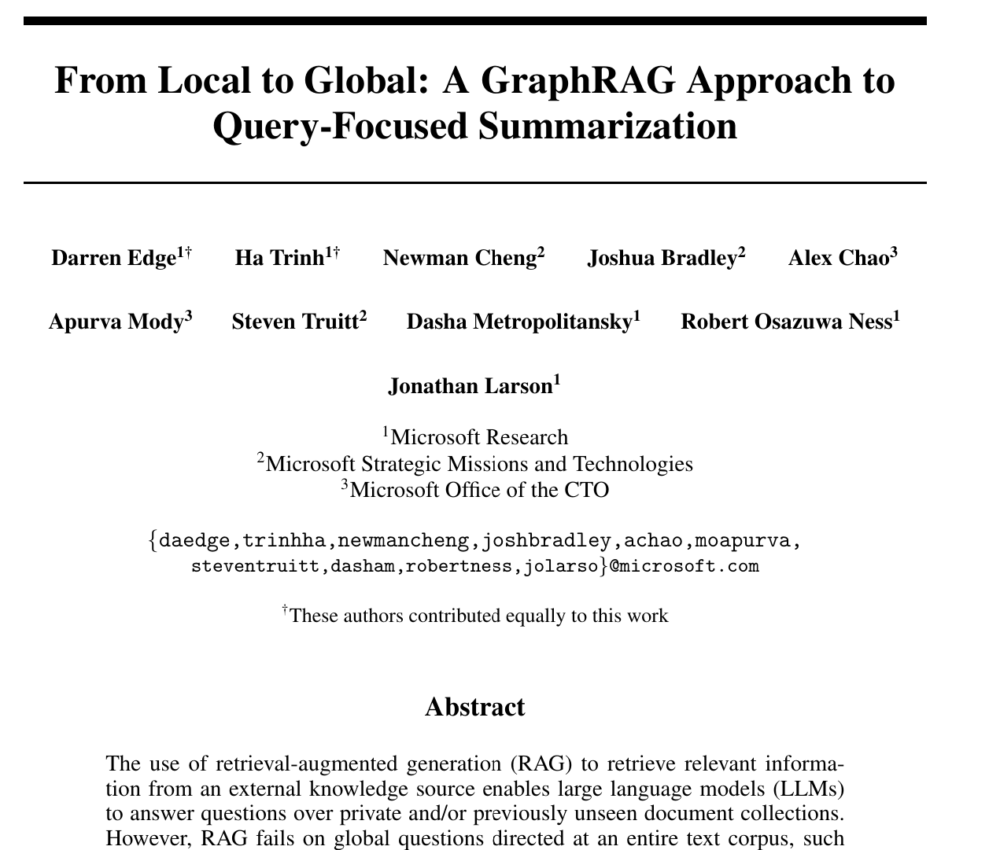
- GraphRAG是由微软提出来的RAG改进版
### 概览与总结
- [项目源码](https://github.com/microsoft/graphrag)

首先,我们将语料切分成文本块,使用LLM处理语料,提取出里面的主体内容(entity)和对应的描述(description)与联系(relationship),比如对于这段语料:

>NeoChip’s (NC) shares surged in their first week of trading on the NewTech Ex-
change. However, market analysts caution that the chipmaker’s public debut may
not reflect trends for other technology IPOs. NeoChip, previously a private entity,
was acquired by Quantum Systems in 2016. The innovative semiconductor firm
specializes in low-power processors for wearables and IoT devices.

LLM会提取出以下三条信息:

• The entity NeoChip, with description “NeoChip is a publicly traded company specializing in low-power processors for wearables and IoT devices.”
• The entity Quantum Systems, with description “Quantum Systems is a firm that previously owned NeoChip.”
• A relationship between NeoChip and Quantum Systems, with description “Quantum Systems owned NeoChip from 2016 until NeoChip became publicly traded.”

之后,我们将每个主体和对应的描述储存在一个个节点中,将关系作为节点之间的边,关系相近的节点被聚拢在一起,称为社区(community).多个关系相近的社区又会被聚拢在一起,从而形成一个多层级的社区.每个社区都会由LLM生成一个关于该社区的摘要

对于每一次查询,我们可以选中与查询关系层级相同的一些社区,并用LLM从这些社区中总结得到待拼接的最优语料.

很明显,这种方法需要我们用来处理语料的大模型足够强,否则得到的GraphRAG就不具备实际使用的价值.再说,光是处理语料就会消耗大量的token,而具体的查询方法和如何锁定社区,论文也并没有提到.

总的来说,GraphRAG是相当不成熟和实验性的,不过由于是微软出品的,所以国内厂商还是迅速跟进了,至于效果如何,我看并没有多少显著的提升,不然早就发新论文了.

## DeepSeek-V3 Technical Report(2024)
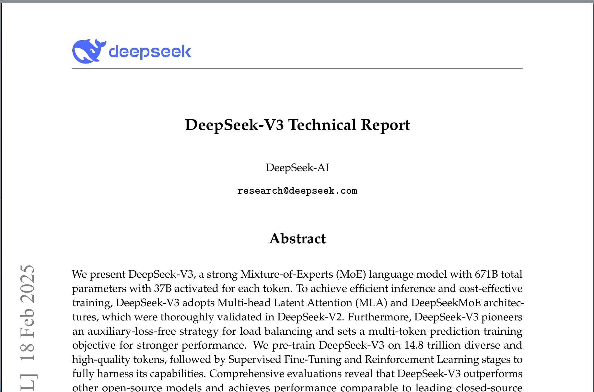
### 概览
训练总费用:
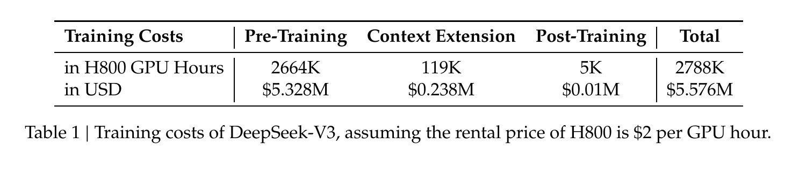
>尽管DeppSeek-V3只有671B的参数,训练费用就达到了可怕的550万美元,那些参数接近万亿甚至超过万亿的模型的训练成本恐怕得再翻上几番吧.

模型效果:
>We evaluate DeepSeek-V3 on a comprehensive array of benchmarks. Despite its economical training costs, comprehensive evaluations reveal that DeepSeek-V3-Base has emerged as the strongest open-source base model currently available, especially in code and math. Its chat version also **outperforms other open-source models** and achieves performance **comparable to leading closed-source models, including GPT-4o and Claude-3.5-Sonnet**, on a series of standard and open-ended benchmarks.

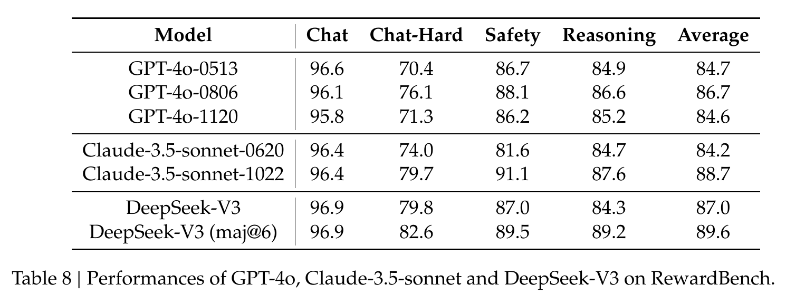
### 模型架构
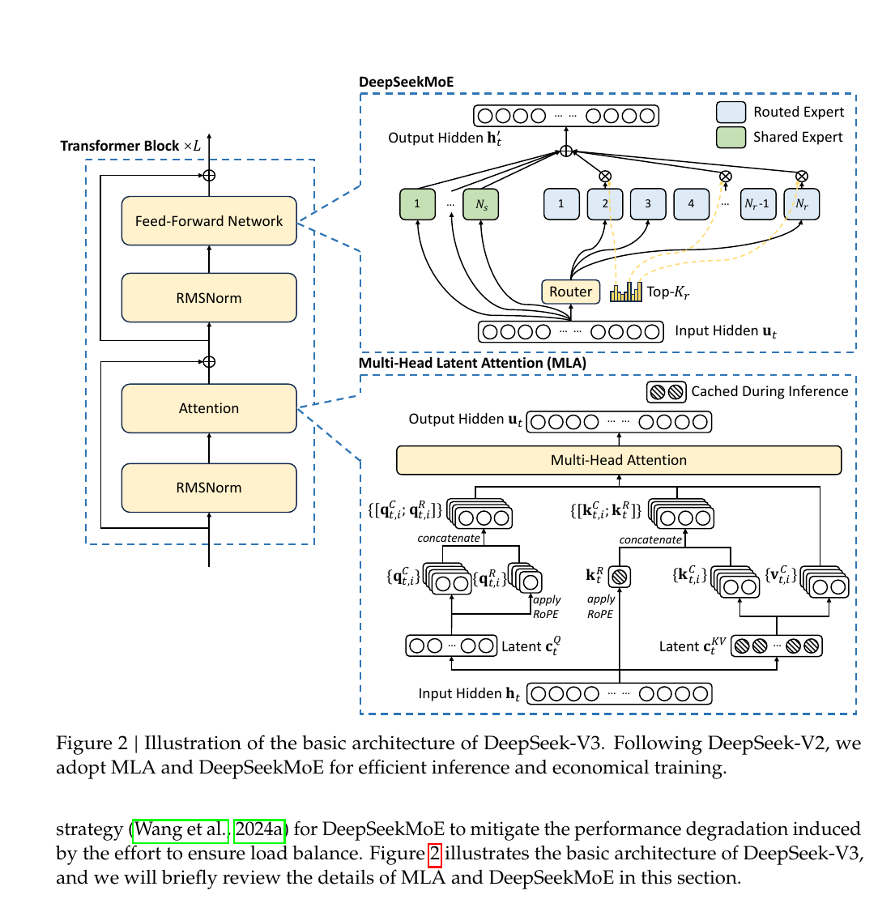

简单来说就是几种新型架构的混合,之所以效果这么好主要是参数足够大,而且用于训练的语料非常充分,如文中所说:
>the training corpus for DeepSeek-V3 consists of **14.8T high-quality and diverse tokens in our tokenizer.**

- 这实际上表明了,在没能力改动模型架构的前提下,堆砌语料是一个不错的选择


## DeepSeek-R1: Incentivizing Reasoning Capability in LLMs via Reinforcement Learning(2025)
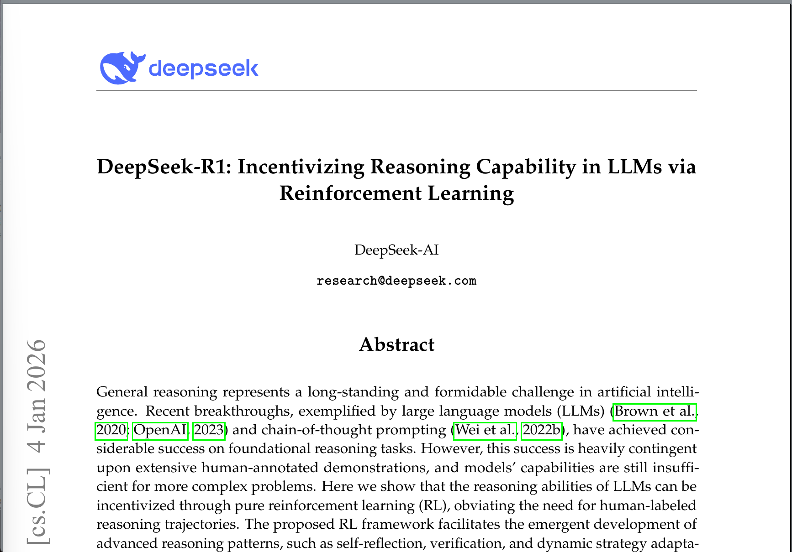
- 近五年来最令人震撼的突破,不过由于开源,所以被御三家全学过去了,不过确实是好事,毕竟它们的输出质量上也有了质的飞跃
### 引入
先前的研究发现,链式思考(chain-of-thought,CoT)可以极大地增强LLM的表现,这可以简单的通过经过微调的预训练语料或者诸如“Let’s think step by step”的提示词来实现.但这些实现方法都引入了人类的干扰,不可避免地带入了一些偏见.

为了解决这个问题,DeepSeek提出可以让模型通过强化学习框架和自我演变,自己学会思考,这样可以大幅度减少所需要的人类标注.

具体来说,该论文是在24年的DeepSeek-V3-Base模型上,使用了Group Relative Policy Optimization (GRPO)强化学习框架,训练目标只针对模式的最终输出和真实答案的偏差,而不干扰模型过程中的推理过程.

- 这个想法确实非常大胆,很难想象是怎样的天才才能从如此多的论文中提炼出如此精妙的架构.

为了尽可能减少人类的干扰,在预训练后跳过了微调阶段,直接开始用强化学习,而效果也是很惊人的:

> Although we do not explicitly teach the model how to reason, it successfully learns improved reasoning strategies through reinforcement learning.

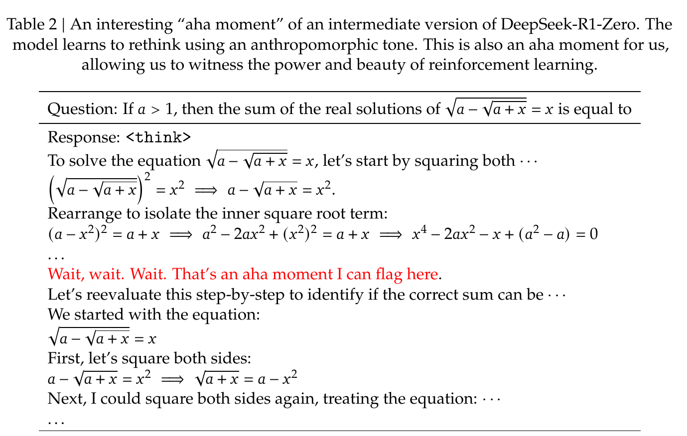
### 架构
尽管最初版DeepSeek-R1-Zero模型的思考能力已经很不错了,但它的输出是破碎的,而且有时候会在回答中将中文和英文混合在一起输出.为了解决这个问题,又实现了改进版的DeepSeek-R1,这次重新引入了RLHF来让模型的输出更为合理.

具体过程是这样的:
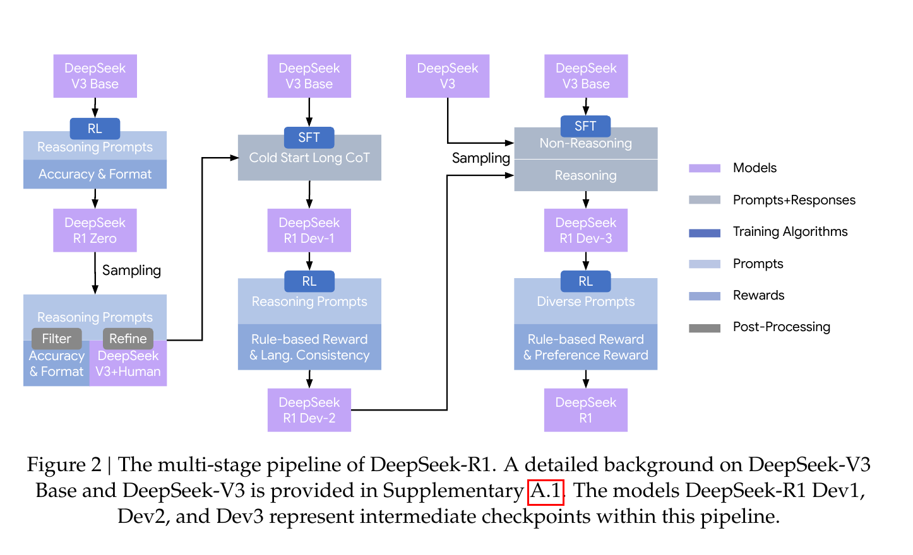
### 训练细节
强化学习过程中,设定了两种奖励机制:
1. Accuracy rewards: 比对输出结果与正确结果即可
2. Format rewards: 要求模型必须将思考过程放入`<think>`和`</think>`之间

至于模型是如何学会先输出思考再输出回答的呢,是通过强制设定了强化学习阶段的语料实现的:

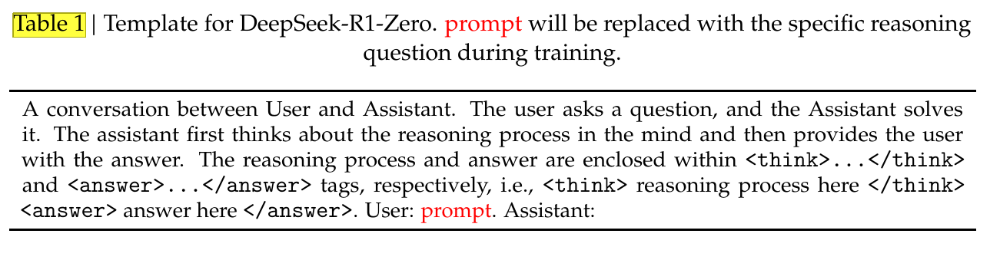

- 只要一直喂下去,模型因为发现没有按照格式来就会被打低分,自然就会先输出思考再输出回答了

## KIMI K2: OPEN AGENTIC INTELLIGENCE(2025)
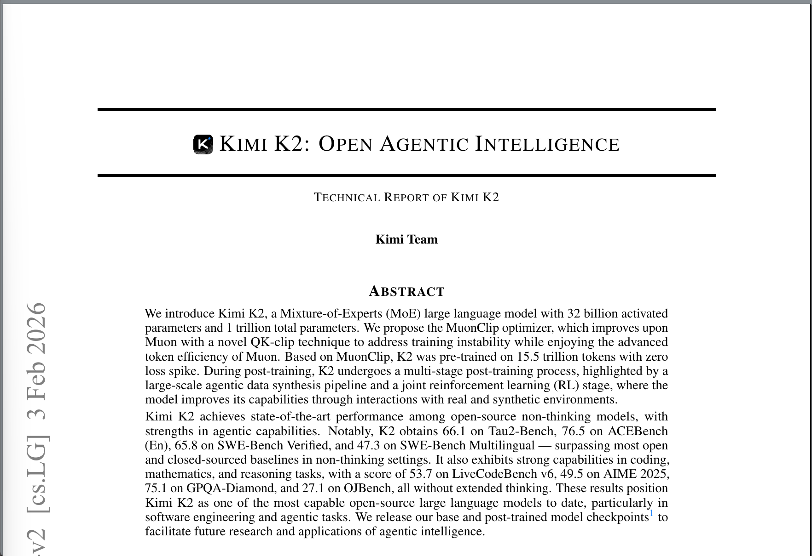
### 概览与总结
KIMI K2基本照搬了DeepSeek-V3的的架构,参数量提高到了一千亿,然后做了一点自己的优化,所以比DeepSeek-V3的表现还是要强不少的.
## KIMI K2.5: VISUAL AGENTIC INTELLIGENCE(2026)
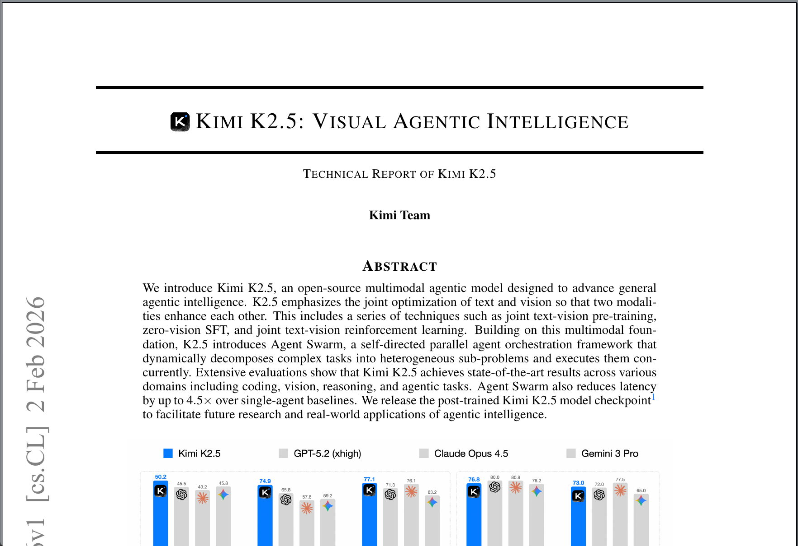

这个对比图就很迷啊,比别人差劲的地方还把自己显著标明的话就很容易看花眼好不好.
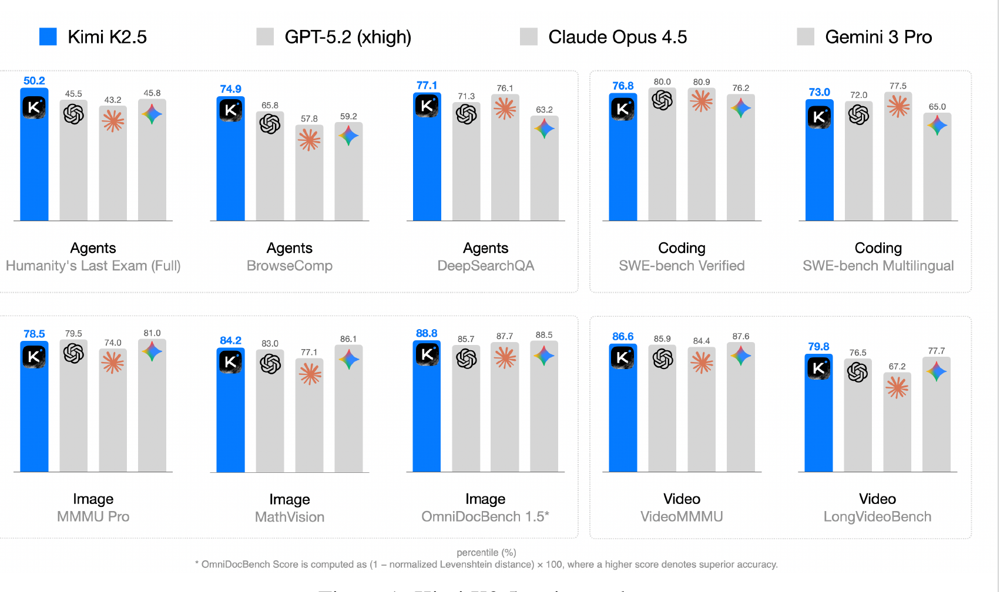
### 概览与总结
KIMI K2.5的基座模型就是KIMI K2,掺入了视觉理解能力和所谓的智能体集群,实际效果还不错,但由于涉及的专业术语太多,不太适合我这种门外汉理解,就不过多深入了.
## DeepSeek-V4: Towards Highly Efficient Million-Token Context Intelligence(2026)
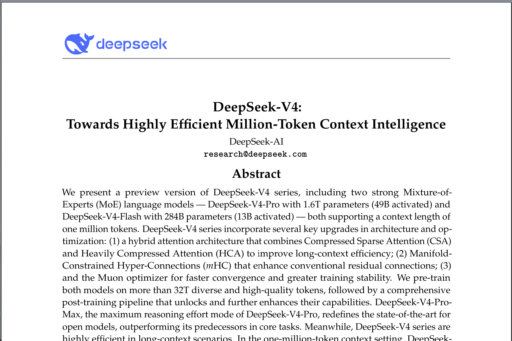

### 概览与总结
- DeepSeek-V4的参数大小为一万六千亿,已经远远超过了DeepSeek-R1的大小,但实际调用API的体验上
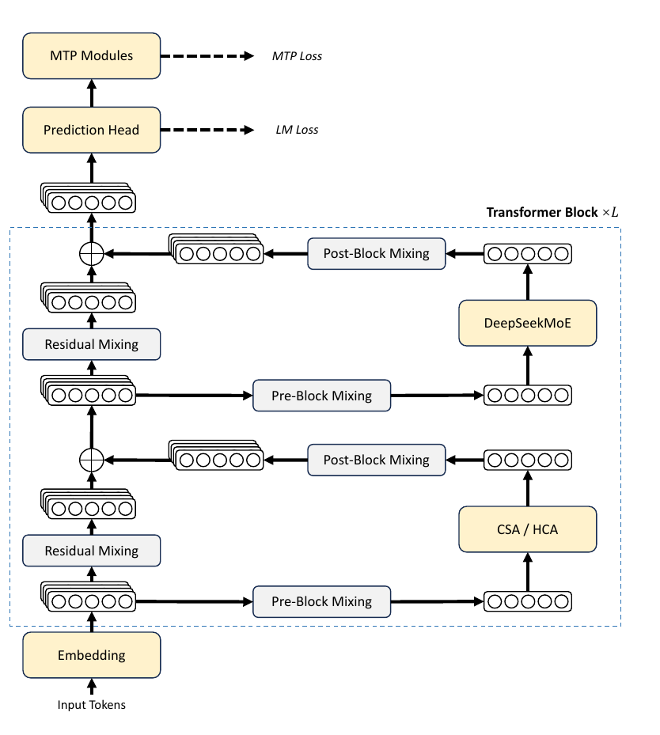
不得不说,新模型的架构太难看懂了,掺杂了很多近两年甚至是当年提出的新架构,我已经完全看不懂了,还是看看对比图吧:

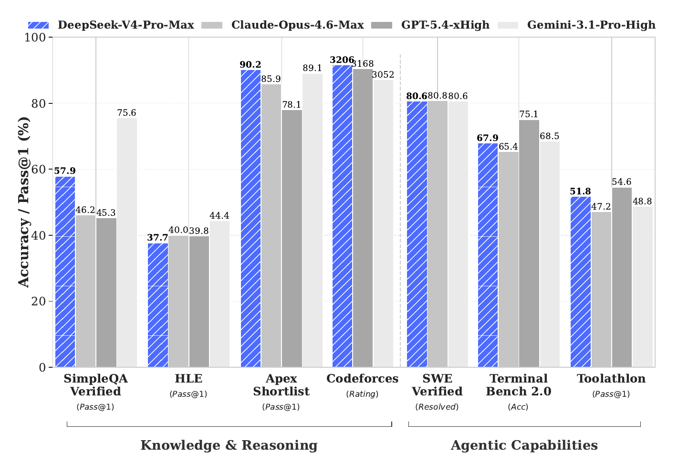

而实际调用API的体验也是不错的,主要的瓶颈反而是在输出长度和对多模态的支持上,不过这也没办法,DeepSeek的技术积累和资金支持还是比不过那些国际企业的,不过这个表现就已经很惊人了.
## 总结
近两年的大模型架构已经变得非常复杂了,不在这个领域深耕个几年是不太可能看懂的.而光凭借上述这些论文,我就已经对大模型的整个历史发展有了一个非常深入的认识了,以后应该只会随缘更新一点以前的论文,至于最新的论文我看也没必要研究,说不定几年后,又会有一篇天才论文横空出世,彻底简化这种臃肿的堆叠架构,回到纯朴的数学之美.
# 计算机视觉与多模态论文
## You Only Look Once: Unified, Real-Time Object Detection(2016)
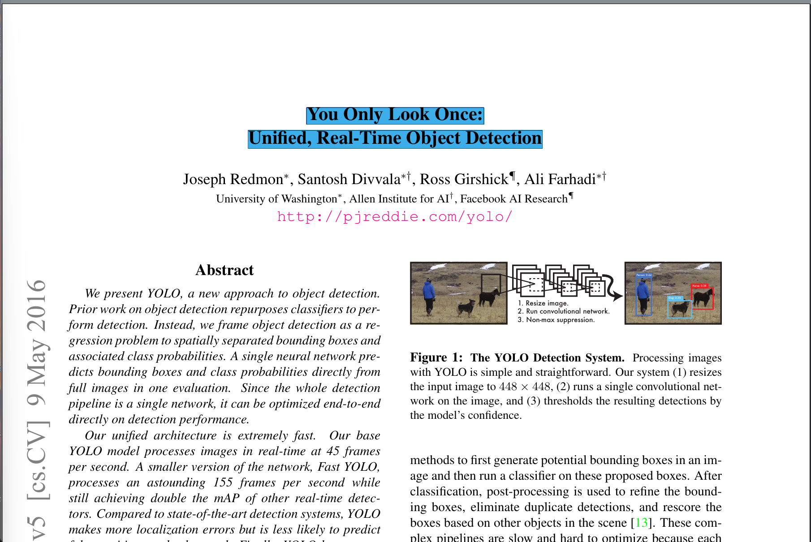

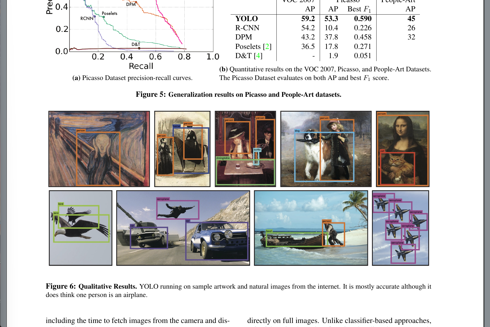
### 引入
先前的图像识别算法使用一个分类器通过滑动窗口来扫描图像,一般处理一张图片要花好几秒,R-CNN对此做了改进,先通过辅助工具给图像中的潜在目标设置一个有边界的箱子(后面都直接简称为**边框**),在使用分类器来判断这些潜在目标的特征,处理一张图片需要几十秒.

该论文提出了YOLO(You Only Look Once)方法,只需要将图像输入卷积神经网络一次就可以得到所有目标的边框和对应的分类.尽管准确度不如当时最优秀的图像识别算法,但是速度非常快,如文中所说,在一张Titan X GPU上可以在1秒内处理45张图片,而且是一次输入一张的那种,并不是批处理.

### 模型和架构
简单来说就是,训练时,我们预设需要识别的物体类别总数为C,将训练的图像划分成SxS的网格,每个网格负责预测该网格可能属于哪几种形状的边框,同时还要预测该网格对应的物体类别,标注好后直接将训练图像喂给下图所示的神经网络即可:
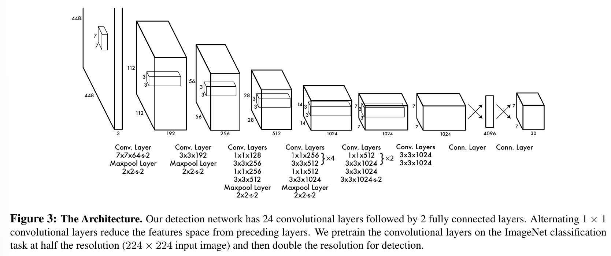

经过精心的设计,该网络产生的最终张量刚好是SxSxC,完美对应了之前的图像标注,从而可以进行损失函数的计算并开始反向传播.最终产出训练好的YOLO网络.

这个设计非常巧妙,确实是图像识别算法领域的一大飞跃.

- 不过论文中的C是20,而最终张量的大小是SxSx30,这我就不太理解了,以后有机会再来勘误吧.
## AN IMAGE IS WORTH 16X16 WORDS (2021)
- 这些人不起点故弄玄虚的标题就不会写论文了吗...

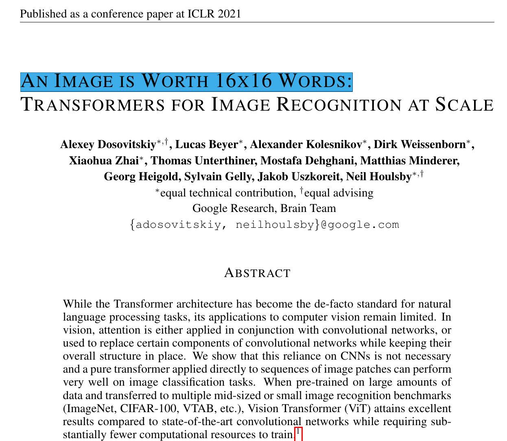

### 概览与总结
# 会议论文
## ALGOL 58
- 梦开始的地方

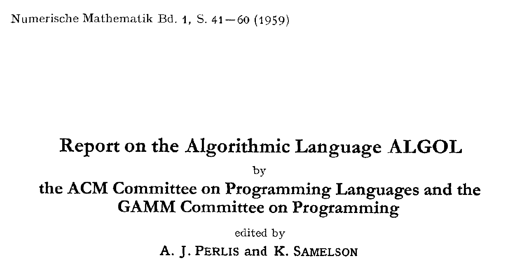


## ALGOL 60
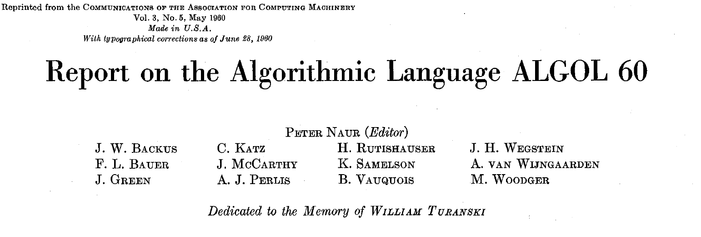


# 算法与数据结构论文
## 图
### On the Shortest Spanning Subtree of a Graph and the Traveling Salesman Problem(1956)
- Kruskal算法


### Shortest connection networks and some generalizations(1957)
- PRIM算法


### A Note on Two Problems in Connexion with Graphs(1959)
- DIJKSTRA算法

该论文提出了两个问题:
1. n个节点的最小生成树
2. 节点P和Q之间的最短距离

之后就是围绕这两个问题的相当随意的证明了,没有严格的公式证明,而是只用直白的英语不断地论述,整篇论文的正式内容只有两页,所以没什么看头.


## 数据结构
### An algorithm for the organization of information(1962)
- AVL树

### Organization and Maintenance of Large Ordered Indices(1970)
- B树

### A Dichromatic Framework for Balanced Trees(1978)

### The Ubiquitous B-Tree(1979)
- B+树


### Skip Lists: A Probabilistic Alternative to Balanced Trees(1990)
- 跳表


### Log-Structured Merge-tree(1996)

