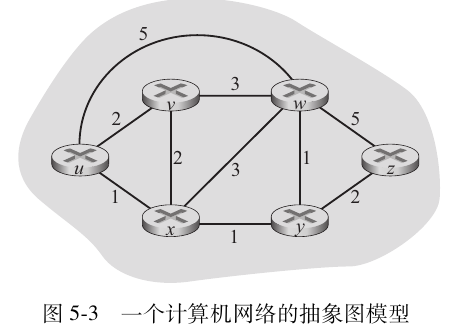
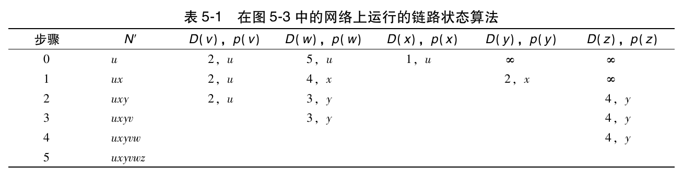

## 引子
期末也快靠近了,随便翻了翻算法课的课件,发现都是一些非常初级的算法问题,但是课件的布局非常烂,让人没有看下去的欲望,自然也就没有动力去认真学习.

某个瞬间,我恍然大悟,如果你不知道学习这个算法是为了什么,那么就无从谈起学习算法的兴趣了.比如打算法竞赛,有的人是为了高考保送,有的人是为了保研加分,还有的人是真的单纯喜欢算法,喜欢探究数学难题,不管怎样,你都有一个让自己不断尝试算法难题的理由.

而对于程序员来说,学习算法最大的理由就是为了找工作,可是如果你仔细看看那些常见的面试题就会知道,面试题里能够出现的算法其实也都是非常基础的,不需要你对问题进行多复杂的建模,也不需要你做一些有技巧性的优化,往往就能直接通过了.

那么,为什么算法仍然是我们面试中最头疼的问题呢?我能想到的唯一答案就是: **我们不知道这个算法有什么用**,拿我自己来举例,我曾经花了两三个月跟着洛谷的深入浅出题单刷题,但实际的收获相当有限,而且,随着难度的骤然提高,我对解算法题的兴致也越来越低,最终不了了之.这也很正常,因为我不知道自己在学什么,而只是跟着别人的指示在走而已,当方向上出了偏差,一不小心就会掉进坑里.

所以,为了解决这个让人头痛的问题,我会尽力做一些调研,把算法和实际的工程问题关联起来,不仅是为了帮别人答疑,更是为了自己解惑.

## 算法概览
- [wiki](https://en.wikipedia.org/wiki/Algorithm)

**算法**(algorithm)是通过计算和数据处理来解决一系列特定问题的有穷指令,这类问题都有特定的答案或者最优解,例如力扣和洛谷里面的所有题目.与之相对的概念是**启发式算法**(heuristic),求解的问题都没有标准答案,例如推荐算法.


按照算法的内置理念可以对算法进行分类,以下是常见的算法种类:
1. Brute-force and exhaustive search: 暴力计算,穷举搜索,只要能够找到最终答案就是胜利,代价通常是极高的内存占用或者时延,但对于特定的问题来说特别有效
2. Divide and conquer: 分治算法,将复杂问题拆分成多个独立子问题,分别解决后就得到了问题的答案.
3. Dynamic programming: 动态规划,将复杂问题拆分成多个相互依赖的子问题,通过状态转移方程来得到答案.
4. Search and enumeration: 很多问题都可以用图(graph)来表述,通过搜索和遍历算法我们可以解决这类问题
5. Randomized algorithm: 随机算法,代表性的算法就是模拟退火,通过高度随机性的参数来试出正确或者接近正确的答案.

不过实际来说,我们真在用算法的时候就没必要这么分类了,下面就直接深入具体的领域来看看算法的魔力吧.
## 前置基础
- (6/8): 很早写的文章,发现其实写的还可以,就先放着占位,以后再优化
### 二分大法
二分法本身的思想不难,最难的是考虑写`<=`还是`<`.
事实上,二分法总共只有两种写法,一个是左闭右闭,一个是左闭右开,但如果两种方法混着用,很容易就记混了,现场推导或许也可以,但总归是要想一下子的.
故我认为只使用左闭右闭就行了,因为两端均为闭区间最符合正常人的直觉.
```cpp
 while (l <= r) {
      int mid = (l + r) / 2;
      res = findsum(mid);
      if (res >= k)
        l = mid + 1;
      else
        r = mid - 1;
    }
```

### 搜索
事实上,翻遍全网,找不到一个真正详尽的入门教程,基本都是丢给你几道算法题的解答就结束了,却从来没有真正的讲明白为什么要这样写
#### 到底是用dfs还是bfs?(3/14)
- [参考文章](https://cuijiahua.com/blog/2018/01/alogrithm_10.html)
问ai或者上网查,很容易就知道bfs用来求最短路径,而dfs用来求路径条数,那么,为什么是这样呢?
先概览一下代码:
**dfs**
```cpp
#include <bits/stdc++.h>
using namespace std;

const int MAX = 105;

int n,m;
char g[MAX][MAX];
int vis[MAX][MAX];

int dx[4]={-1,1,0,0};
int dy[4]={0,0,-1,1};

void dfs(int x,int y)
{
    vis[x][y]=1;

    for(int i=0;i<4;i++)
    {
        int nx=x+dx[i];
        int ny=y+dy[i];

        if(nx<1||nx>n||ny<1||ny>m)
            continue;

        if(vis[nx][ny])
            continue;

        if(g[nx][ny]=='#')
            continue;

        dfs(nx,ny);
    }
}

int main()
{
    int sx,sy;

    cin>>n>>m;

    for(int i=1;i<=n;i++)
        for(int j=1;j<=m;j++)
        {
            cin>>g[i][j];
            if(g[i][j]=='S')
                sx=i,sy=j;
        }

    dfs(sx,sy);
}
```
可以看到dfs使用的是层层递归的方式,会一条路走到底,直到没有路可走或者找到答案才返回上一级,处理完后再返回上一级.
换句话说也就是**先进后出**,后来新出现的路径优先处理,这也是栈的工作原理.
所以,dfs的数据结构注定了它不能处理太大深度的复杂搜索,否则栈就很容易溢出.
比如下面这题:
```md
乔治有一些同样长的小木棍，他把这些木棍随意砍成几段，直到每段的长都不超过 50。

现在，他想把小木棍拼接成原来的样子，但是却忘记了自己开始时有多少根木棍和它们的长度。

给出每段小木棍的长度，编程帮他找出原始木棍的最小可能长度。

对于全部测试点，1≤n≤65，1≤a[i]≤50
```


**bfs**
```cpp
#include <bits/stdc++.h>
using namespace std;

const int MAX = 105;

int n,m;
char g[MAX][MAX];
int vis[MAX][MAX];

int dx[4]={-1,1,0,0};
int dy[4]={0,0,-1,1};

struct Node{
    int x;
    int y;
    int step;
};

int bfs(int sx,int sy)
{
    queue<Node> q;

    q.push({sx,sy,0});
    vis[sx][sy]=1;

    while(!q.empty())
    {
        Node cur=q.front();
        q.pop();

        int x=cur.x;
        int y=cur.y;
        int step=cur.step;

        if(g[x][y]=='E')  //终点
            return step;

        for(int i=0;i<4;i++)
        {
            int nx=x+dx[i];
            int ny=y+dy[i];

            if(nx<1||nx>n||ny<1||ny>m)
                continue;

            if(vis[nx][ny])
                continue;

            if(g[nx][ny]=='#') //墙
                continue;

            vis[nx][ny]=1;
            q.push({nx,ny,step+1});
        }
    }

    return -1;
}

int main()
{
    int sx,sy;

    cin>>n>>m;

    for(int i=1;i<=n;i++)
        for(int j=1;j<=m;j++)
        {
            cin>>g[i][j];
            if(g[i][j]=='S')
                sx=i,sy=j;
        }

    cout<<bfs(sx,sy);
}
```
最值得关注的便是bfs使用的是队列来存储要处理的节点,而队列的特点便是先进先出,如果遍历四个方向,那么bfs会依次处理这四个方向之后,再处理下一层的节点,这样依次扩展,直到找到终点.
那么bfs之所以能够找到最短路的原因就很明显了,如果当前层找不到终点,说明终点在下一层,如果找到了终点,说明当前路径就是最好的结果,不用继续找了.

事实上,下面才是更为常见的写法,由于OI选手一般能不写函数就不写,所以刚入门时看到这样的代码是比较难理解bfs的.
```cpp
#include <bits/stdc++.h>
using namespace std;

int main()
{
    const int MAX=105;

    int n,m;
    char g[MAX][MAX];
    int vis[MAX][MAX]={0};

    int dx[4]={-1,1,0,0};
    int dy[4]={0,0,-1,1};

    cin>>n>>m;

    int sx,sy;

    for(int i=1;i<=n;i++)
        for(int j=1;j<=m;j++)
        {
            cin>>g[i][j];
            if(g[i][j]=='S')
                sx=i,sy=j;
        }

    struct Node{
        int x,y,step;
    };

    queue<Node> q;

    q.push({sx,sy,0});
    vis[sx][sy]=1;

    while(!q.empty())
    {
        Node cur=q.front();
        q.pop();

        int x=cur.x;
        int y=cur.y;
        int step=cur.step;

        if(g[x][y]=='E')
        {
            cout<<step;
            break;
        }

        for(int i=0;i<4;i++)
        {
            int nx=x+dx[i];
            int ny=y+dy[i];

            if(nx<1||nx>n||ny<1||ny>m)
                continue;

            if(vis[nx][ny])
                continue;

            if(g[nx][ny]=='#')
                continue;

            vis[nx][ny]=1;
            q.push({nx,ny,step+1});
        }
    }
}
```

#### 为什么要写vis数组来标记访问路径


<div id="dfs-root" style="background: var(--card-background, #ffffff); border: 1px solid var(--border-color, #eee); border-radius: 12px; margin: 2rem 0; padding: 1.5rem; color: var(--body-text-color, #333); font-family: -apple-system, sans-serif;">
    <style>
        #dfs-root .grid-container { display: grid; grid-template-columns: repeat(3, 60px); gap: 8px; width: fit-content; margin: 20px auto; background: #f1f5f9; padding: 10px; border-radius: 8px; }
        #dfs-root .cell { width: 60px; height: 60px; display: flex; align-items: center; justify-content: center; font-size: 12px; border-radius: 4px; background: #fff; border: 1px solid #e2e8f0; font-weight: bold; color: #333; }
        #dfs-root .v { background-color: #cbd5e1 !important; color: #64748b !important; }
        #dfs-root .c { background-color: #3b82f6 !important; color: #fff !important; transform: scale(0.95); }
        #dfs-root .s { outline: 3px solid #22c55e !important; outline-offset: -2px; }
        #dfs-root .e { outline: 3px solid #ef4444 !important; outline-offset: -2px; }
        #dfs-root button { cursor: pointer; padding: 6px 12px; margin: 4px; border-radius: 6px; border: 1px solid #ddd; background: #fff; font-size: 13px; transition: 0.2s; }
        #dfs-root button:hover { border-color: #3b82f6; color: #3b82f6; }
        #dfs-root .active-btn { background: #3b82f6 !important; color: #fff !important; border-color: #2563eb !important; }
        #dfs-root .console { background: #f8fafc; padding: 12px; border-radius: 6px; font-family: monospace; font-size: 12px; border-left: 4px solid #3b82f6; min-height: 40px; color: #1e293b; }
    </style>

<div style="display: flex; flex-wrap: wrap; justify-content: center;">
    <button onclick="window.dfsApp.run('no_mark', this)">1. 无标记 (死循环)</button>
    <button onclick="window.dfsApp.run('no_unmark', this)">2. 无释放 (遗漏)</button>
    <button onclick="window.dfsApp.run('correct', this)">3. 标准回溯 (全空间)</button>
</div>

<div class="grid-container" id="dfs-grid"></div>

<div style="display: flex; justify-content: center; gap: 10px; margin-bottom: 15px;">
    <button id="dfs-pause" onclick="window.dfsApp.togglePause()">暂停</button>
    <button id="dfs-speed" onclick="window.dfsApp.toggleSpeed()">速度: 常速</button>
</div>

<div class="console" id="dfs-log">系统状态：准备就绪</div>
</div>

<script>
(function() {
    // 兼容 Pjax 重新加载
    const initApp = () => {
        const app = {
            N: 3, vis: [], ans: 0, steps: 0, isRunning: false, isPaused: false, delayMs: 200,
            dx: [0, 1, 0, -1], dy: [1, 0, -1, 0],
            
            sleep: async function() {
                await new Promise(r => setTimeout(r, this.delayMs));
                while (this.isPaused) await new Promise(r => setTimeout(r, 100));
            },

            render: function(cx, cy) {
                const g = document.getElementById('dfs-grid');
                if(!g) return;
                g.innerHTML = '';
                for(let i=0; i<this.N; i++) {
                    for(let j=0; j<this.N; j++) {
                        const d = document.createElement('div');
                        d.className = 'cell';
                        if (i === cx && j === cy) d.className += ' c';
                        else if (this.vis[i] && this.vis[i][j]) d.className += ' v';
                        if (i === 0 && j === 0) d.className += ' s';
                        if (i === this.N-1 && j === this.N-1) d.className += ' e';
                        d.innerText = i + ',' + j;
                        g.appendChild(d);
                    }
                }
                const log = document.getElementById('dfs-log');
                if(log) log.innerText = "方案数: " + this.ans + " | 当前步数: " + this.steps;
            },

            dfs: async function(x, y, mode) {
                if (!this.isRunning) return;
                this.steps++;
                if (this.steps > 120 && mode === 'no_mark') {
                    document.getElementById('dfs-log').innerText = "[崩溃] 检测到死循环，模拟栈溢出！";
                    throw new Error('Stop');
                }
                this.render(x, y);
                await this.sleep();
                if (x === this.N-1 && y === this.N-1) { this.ans++; return; }
                
                for (let i = 0; i < 4; i++) {
                    let nx = x + this.dx[i], ny = y + this.dy[i];
                    if (nx >= 0 && nx < this.N && ny >= 0 && ny < this.N) {
                        const alreadyVis = this.vis[nx] && this.vis[nx][ny];
                        if (mode === 'no_mark' || !alreadyVis) {
                            if (mode !== 'no_mark') this.vis[nx][ny] = 1;
                            try { await this.dfs(nx, ny, mode); } catch(e) { if(mode==='no_mark') return; }
                            if (mode === 'correct') this.vis[nx][ny] = 0;
                            if (this.isRunning) { this.render(x, y); await this.sleep(); }
                        }
                    }
                }
            },

            run: async function(mode, btn) {
                this.isRunning = false; this.isPaused = false;
                document.querySelectorAll('#dfs-root button').forEach(b => b.classList.remove('active-btn'));
                btn.classList.add('active-btn');
                await new Promise(r => setTimeout(r, 50));
                this.isRunning = true;
                this.vis = Array(this.N).fill(0).map(() => Array(this.N).fill(0));
                this.ans = 0; this.steps = 0;
                if (mode !== 'no_mark') this.vis[0][0] = 1;
                try { await this.dfs(0, 0, mode); } catch(e) {}
                this.render(-1, -1);
                this.isRunning = false;
            },

            togglePause: function() { 
                this.isPaused = !this.isPaused; 
                document.getElementById('dfs-pause').innerText = this.isPaused ? '继续' : '暂停'; 
            },
            toggleSpeed: function() {
                const b = document.getElementById('dfs-speed');
                if (this.delayMs === 200) { this.delayMs = 800; b.innerText = '速度: 慢速'; }
                else { this.delayMs = 200; b.innerText = '速度: 常速'; }
            }
        };
        window.dfsApp = app;
        app.render(-1, -1);
    };

    // 立即初始化并监听 Pjax 跳转
    initApp();
    document.addEventListener('pjax:success', initApp);
})();
</script>

```cpp
if (nx >= 1 && nx <= n && ny >= 1 && ny <= m && a[nx][ny] != -1 &&
        !vis[nx][ny]) {
      vis[nx][ny] = 1; // 【标记】占领这个点
      dfs(nx, ny);     // 【递归】继续深入
      vis[nx][ny] = 0; // 【回溯】释放这个点，让别的路径也能经过它
    }
```
以此代码为例,如果不写`vis[nx][ny] = 1;`,则会导致搜索时反复回到已经走过的路径,造成死循环;如果不在递归后写`vis[nx][ny] = 0;`,会导致一个已经遍历过的路径中的方格无法被其他其他路径使用.
- 再解释一下为什么不写vis就会死循环:
  - 从方格1到方格2后,方格2会遍历上下左右四个方向,因为方格1对于2来说是可达的,因此会回到方格1,以此往复.
因此,如果题目要求找到所有路径,或者所写算法中有往回走的可能,就需要使用vis数组,无论是dfs还是bfs.

## 图类算法
- 大致是按难度来排序的,一上来就放最难的我也消化不了.

### Dijkstra: 路由器网络调度
- [wiki](https://en.wikipedia.org/wiki/Dijkstra%27s_algorithm)

- 为了提供一个比较清晰的背景,我接下来会引用<<计算机网络:自顶向下方法>>中第5章第2节关于路由选择算法(routing algorithm)的论述,想要更透彻的了解该算法也可以去实际查阅这本书.

当我们将TCP/IP数据包从自家电脑发出时,为了到达目的服务器,我们的数据包需要经过多个路由器的中转,为了尽可能的降低网络时延,我们需要使用一个足够高效的算法,来找到到达目的服务器的最短路径.



根据线路的长度和先前的历史延迟记录,我们可以量化从某一个路由器到达其他直连路由器的开销(cost),那么我们所要找到的最短路径就是**最低开销路径**.

这一问题可以用两种算法解决,一个是**集中式路由选择算法**(也就是说有一些节点具有关于所有链路开销的信息),也被称为链路状态算法(Link State),另一种是分散式路由选择算法(节点只能通过迭代获知其他节点的开销).而Dijkstra就是我们这里要选用的集中式路由选择算法.

对于上图所示的路由器网络,我们可以通过初始节点到达其他节点的最短路径来建立状态表格:



其中,D(v)表示到达节点v的最小开销,p(v)表示从初始节点到达节点v的最小开销路径的前一个节点.

>这可以很容易地想到用bfs来实现Dijkstra,但是由于bfs只适合于边权完全相同的图,对于边权不同的图来说,如果第二次访问到的路径比第一次路径更短,由于途径的节点已经被visit数组标记,无法更改或者回撤,所以仍然会保留先前那条更长的路径,那么就无从谈起找到最短路径了.
#### 优先队列


#### Prim算法

### 拓扑排序: 解决包依赖问题

### 红黑树: Linux进程调度

### PageRank: 搜索引擎优化

### B+树: 磁盘I/O与数据库优化


### 跳表：Redis底层实现

### A*: NPC自动寻路

## 后端算法
- 这类算法我一开始不知道怎么起名,后来想到这些算法都能被用在后端,就叫后端算法算了

### 滑动窗口: 日志监控

### 哈希算法: 无处不在的底层算法
#### HTTPS与Token验证
#### 一致性哈希解决分布式缓存

### 动态规划: 搜索框提示与Git diff

### 压缩算法: ZIP与PNG

### 蒙特卡洛算法: 游戏图像处理


## 刷题笔记
### 二叉树和堆
#### luogu P4715

有 $2^n$（$n\le7$）个国家参加世界杯决赛圈且进入淘汰赛环节。已经知道各个国家的能力值，且都不相等。能力值高的国家和能力值低的国家踢比赛时高者获胜。1 号国家和 2 号国家踢一场比赛，胜者晋级。3 号国家和 4 号国家也踢一场，胜者晋级……晋级后的国家用相同的方法继续完成赛程，直到决出冠军。给出各个国家的能力值，请问亚军是哪个国家？

第一行一个整数 $n$，表示一共 $2^n$ 个国家参赛。

第二行 $2^n$ 个整数，第 $i$ 个整数表示编号为 $i$ 的国家的能力值（$1\leq i \leq 2^n$，能力值在 int 范围内）。

数据保证不存在平局。

一个非常简单的想法是构建一个二维数组`match[n+2][2<<n+1]`,一开始从最下端开始比较,每次合并两个编号,移动到上一级数组.

但是,在处理过程中我们可以发现,同一轮中,后面的比赛并不会覆盖前面的比赛结果,那么我们可以直接用两个一维数组来解决,一个存储编号,一个存储能力值,进行n轮比赛即可.

- 当然,用结构体数组也可以,不过实际效果是一样的.
#### P1030 [NOIP 2001 普及组] 求先序排列

给出一棵二叉树的中序与后序排列。求出它的先序排列。（约定树结点用不同的大写字母表示，且二叉树的节点个数 $ \le 8$）。

共两行，均为大写字母组成的字符串，表示一棵二叉树的中序与后序排列。

先看看二叉树的三种遍历结构:
- 前序遍历: 根左右
- 中序遍历: 左根右
- 后序遍历: 左右根

后序遍历帮助我们判断根节点,中序遍历帮助我们判断左子树和右子树对应的字符串.由于这道题不需要我们进行重构,而是输出前序遍历字符串即可,那么只要看到根节点就可以直接输出.

如果不写代码的话直接上手是很简单的,但是用语言来表达的话就有点难办了,我们可以分解成三个步骤:
1. 根据后序遍历找到字符串中的根节点
2. 拆分中序遍历和后序遍历的字符串
3. 不断遍历输出根节点

具体代码如下:
```cpp
#include <iostream>
#include <string>

using namespace std;

void getPreOrder(string inorder, string postorder) {
    if (inorder.empty()) {
        return;
    }

    // 1. 后序遍历的最后一个字符即为当前子树的根节点
    char root = postorder.back();
    cout << root; // 先序遍历先输出根节点

    // 2. 在中序遍历中找到根节点的位置，借此切分左右子树
    size_t root_idx = inorder.find(root);

    // 3. 切割左子树的中序与后序字符串
    string left_in = inorder.substr(0, root_idx);
    string left_post = postorder.substr(0, left_in.length());

    // 4. 切割右子树的中序与后序字符串
    string right_in = inorder.substr(root_idx + 1);
    string right_post = postorder.substr(left_in.length(), right_in.length());

    // 5. 递归求解左子树与右子树
    getPreOrder(left_in, left_post);
    getPreOrder(right_in, right_post);
}

int main() {
    string inorder, postorder;
    if (cin >> inorder >> postorder) {
        getPreOrder(inorder, postorder);
        cout << endl;
    }
    return 0;
}
```


