# 计算机系统结构
## outline
- 计算机系统结构教程(第三版)

考试范围为1-12章,其中以下部分不考:
1. ch1和ch2的套话部分
2. ch3的MIPS的流水线实现图
3. ch4全部
4. ch5的第五节: 多指令流出技术
5. ch6全部
6. ch7的第七,八节: 虚拟存储器以及LRU的硬件实现
7. ch8的第四节: 总线
8. ch9全部
9. ch10的大部分,只有第二,三节要考
10. ch11全部
11. ch12的第四节实例

总的来说就是,具体实现全部不考,只单纯考理论,实际内容还是很少的.不过还是对着ppt来看好一点.

看了一下往年试卷:
1. Cache部分每年必考,其中优化Cache的几个方法,写作废协议等必考
2. 流水线计算必考,必有时空图
3. Tomasulo算法必考
4. MIPS流水线流程必考,但只要知道书上给的那个例子即可
5. 多处理机偶尔会考,其中主要考目录协议
6. Amdhal定律和CPI计算必考,这纯粹拿来送分的


- 非常佩服这种教材,能够在与实战完全脱节的情况下把一个简单的事情讲的特别复杂,让学生学完了也不知道这门课有什么用.如果不是因为我提前学完了那两本经典教材,对这本书还真的是无从下手了.
- 现在发现这本书单纯就是作者的读书笔记而已,用诘屈聱牙的中文来破碎地从经典教材中抄袭.

## ch1: 基础知识
1. Amdhal定律计算加速比
2. CPU时间: 执行程序所需要的时钟周期数x时钟周期时间
3. CPI(cycles per instruction): 每条指令执行所需的平均时钟周期数
## ch2: 指令系统的设计(过)
考不了一点内容
## ch3: 流水线技术
### 计算题
-  吞吐率(Through Put,TP): 单位时间内流水线完成的任务数量

$$TP = \frac{n}{T_k} \qquad $$

其中，$n$ 为任务数；$T_k$ 是处理完 $n$ 个任务所用的时间。该式是计算流水线吞吐率最基本的公式。


- 加速比(Speedup): 使用顺序处理的方式和使用流水线处理方式处理同一批任务所用的时间之比.

设顺序执行所用的时间为 $T_s$，按流水线方式处理所用的时间为 $T_k$，则流水线的加速比为:

$$S = \frac{T_s}{T_k}$$

- 效率(Efficiency): 流水线中设备的利用率,即所有设备的实际使用时间和整个运行时间的比值.

在各段时间不等的情况下, $k$ 段流水线连续处理 $n$ 个任务的流水线效率为

$$E = \frac{n \cdot \sum_{i=1}^{k} \Delta t_i}{k \left[ \sum_{i=1}^{k} \Delta t_i + (n - 1) \cdot \max(\Delta t_1, \Delta t_2, \cdots, \Delta t_k) \right]}$$

### 相关与冲突
指令间有三种相关:
1. 数据相关: 指令j使用指令i产生的结果,或者递归的数据相关
   1. 这种相关无法消除,因为两条指令是彼此依赖的
2. 名相关: 彼此之间没有数据流动,但使用了相同的寄存器名字,有两种具体类别:
   1. 反相关: 同一个寄存器名字被用来读和写
   2. 输出相关: 两条指令都用该寄存器来写入数据
   3. 这两种相关都可以通过**寄存器换名**来消除,只要把用来写入的寄存器名字改掉就行了
3. 控制相关: 由分支指令引发,无法消除

流水线中存在三种冲突:
1. 结构冲突: 硬件无法满足指令重叠执行的要求
2. 数据冲突: 数据相关的指令无法重叠执行
3. 控制冲突: 控制相关的指令之间发生冲突

### 时空图
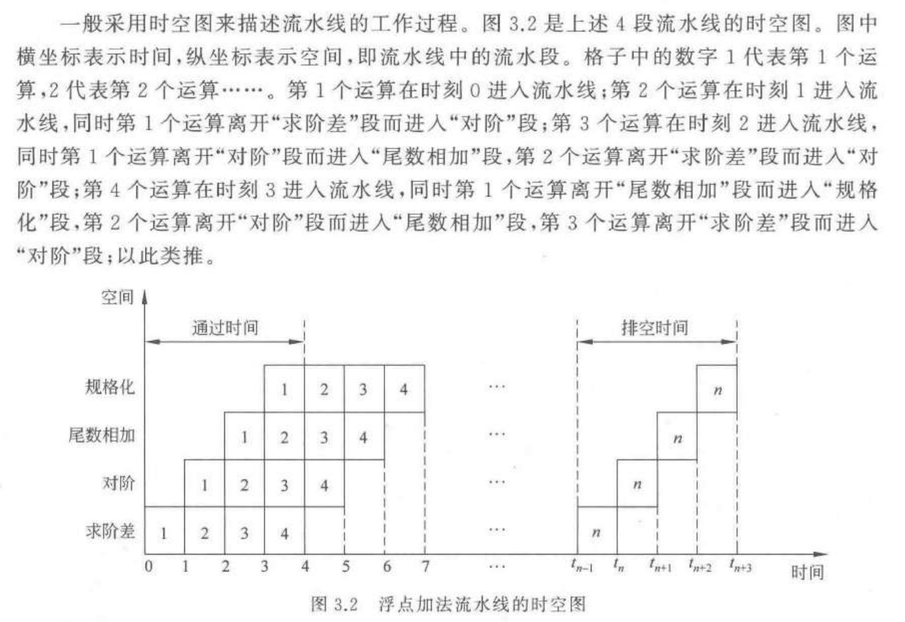

>看懂书上两道例题就够用了,忽然发现往届的期末考试是直接把例题搬过来的

### 流水线实现
经典的MIPS5段流水线如下:
1. IF: 取指令周期
2. ID: 指令译码
3. EX: 执行计算
4. MEM: 访问存储器
5. WB: 写回

如果是分支指令和store指令,只要前四段就足够了,其余的指令如load,ALU运算等都需要5段.
## ch5: 指令级并行及其开发(重点)
- 最难的一章
### 指令动态调度
静态调度依靠编译器实现,动态调度依靠硬件专门调度代码,这会将一些没有冲突和相关指令的无关指令提前运行,也就是**乱序执行**.


为了实现乱序执行,我们可以将5段流水线的译码(ID)阶段分成两个步骤:
1. 流出(issue): 指令译码,检查是否存在结构冲突,如果不存在结构冲突就流出指令
2. 读操作数: 等待数据冲突消失后读操作数

经典的动态调度算法有记分牌算法和Tomasulo算法.
#### 记分牌算法
CDC 6600计算机使用一个被称为记分牌的硬件实现对指令的动态调度,记分牌的目标是在没有结构冲突时,尽可能早地执行没有数据冲突的指令

该硬件中有三张表:
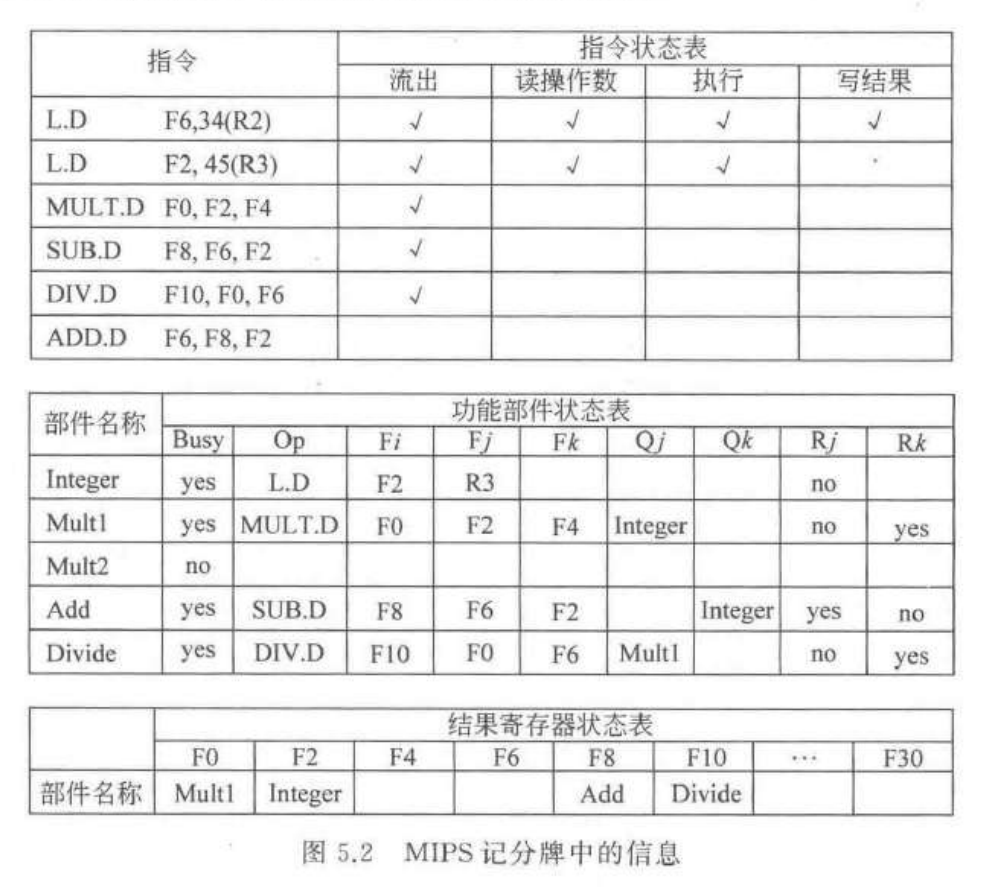

(1) **指令状态表**：记录正在执行的各条指令已经进入到了哪一段。

(2) **功能部件状态表**：记录各个功能部件的状态。每个功能部件有一项，每一项由以下 9 个字段组成。

* **Busy**：忙标志，指出功能部件是否忙。初值为 no。
* **Op**：该功能部件正在执行或将要执行的操作。
* **Fi**：目的寄存器编号。
* **Fj, Fk**：源寄存器编号。
* **Qj, Qk**：指出向源寄存器 Fj、Fk 写数据的功能部件（即 Fj、Fk 中的数据将由它们产生）。
* **Rj, Rk**：标志位，为 yes 表示 Fj、Fk 中的操作数就绪且还未被取走，否则就被置为 no。

(3) **结果寄存器状态表 Result**：每个寄存器在该表中有一项，用于指出哪个功能部件（编号）将把结果写入该寄存器。如果当前正在运行的指令都不以它为目的寄存器，则其相应项置为 no。Result 各项的初值为 no（全零）。

记分牌算法中每条指令的运行阶段有4步:
1. 流出: 如果指令所需的功能部件空闲,则向功能部件流出该指令
2. 读操作数: 检测该指令所需的操作数是否就绪,一旦可用就会读入操作数
3. 执行: 读入操作数后,功能部件开始执行
4. 写结果: 检测目的寄存器是否可用,若可用则写入结果,并释放所有资源

除了执行阶段可能需要画上多个时钟周期外,其他的阶段只需用一个时钟周期就可以完成.

#### Tomasulo算法
该算法的核心思想为:
1. 记录和检测指令相关,一旦操作数可用就立即执行,从而尽可能消除RAW冲突
2. 通过寄存器换名来消除WAR和WAW冲突

结构上也比较复杂:

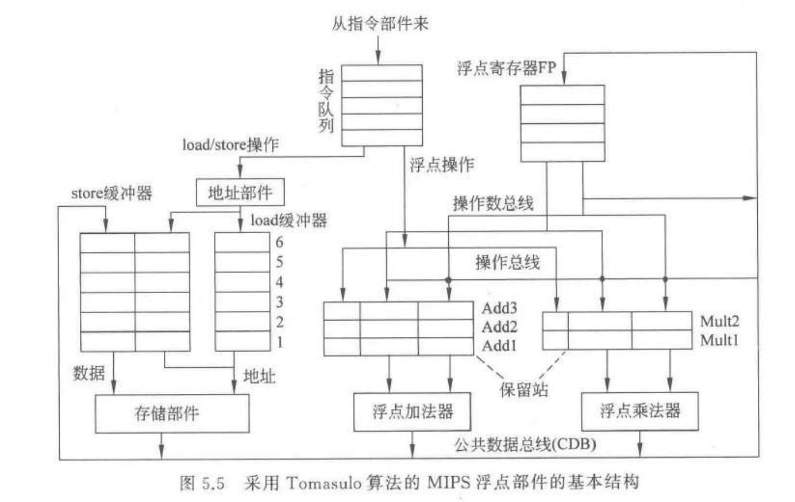

1. 保留站: 设置在运算部件的入口,如加法器的入口有三个保留站,而乘法器的入口有两个保留站,每个保留站保存一条已经流出并等待该部件执行的指令.如果该指令的操作数已经在寄存器中就绪,就将操作数加入到保留站中,如果没有就绪,就记录将会产生对应操作数的保留站标识.
2. load缓冲器: 存放用于计算有效地址的分量,记录正在进行的load指令,保存完成了的load结果
3. store缓冲器: 存放用于计算有效地址的分量,记录正在进行的store指令,保存完成了的store结果

>这两个缓冲器的结构和保留站基本相同.


Tomasulo算法中的指令运行步骤只要三步:
1. 流出: 若对应的保留站空闲,则将指令送出到保留站,若其中的操作数已经就绪,那么一同送入,如果没有就绪,就将会产生该操作数的保留站的标识送入,一旦完成计算就直接把数据送给保留站,这可能需要多个周期的等待,也可能一个周期就完成了.
2. 执行: 等到所有操作数就绪后开始执行指令,这也需要多个周期
3. 写结果: 指令执行完后,需要等待目的寄存器空闲才能写入,一个周期就能完成,之后清空该指令的所有内容

而Tomasulo算法的状态表和记分牌算法的状态表几乎完全相同:

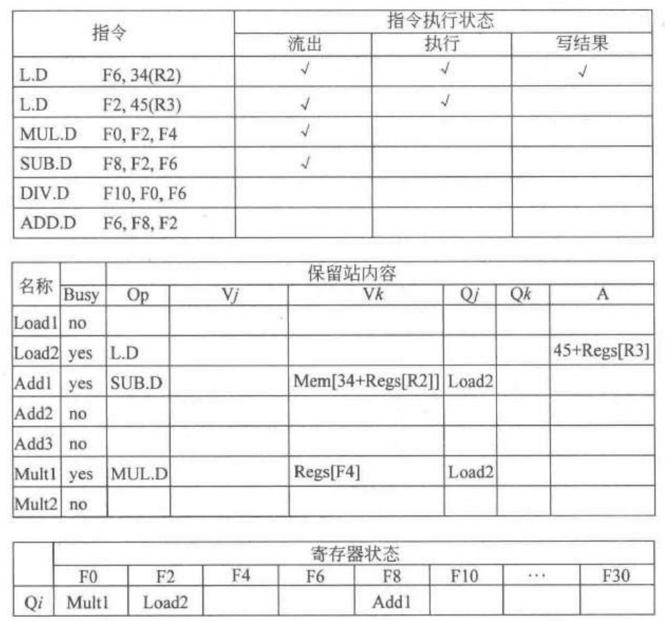

其中保留站内容表中的内容不太一样,需要讲解:

Op：要对源操作数进行的操作。

$Q_j, Q_k$：将产生源操作数的保留站号。等于 0 表示操作数已经就绪且在 $V_j$ 或 $V_k$ 中，或者不需要操作数。

$V_j, V_k$：源操作数的值。对于每一个操作数来说，V 或 Q 字段只有一个有效。对于 load 来说，$V_k$ 字段用于保存偏移量。

Busy：为 yes 表示本保留站或缓冲单元“忙”。

A：仅 load 和 store 缓冲器有该字段。开始是存放指令中的立即数字段，地址计算后存放有效地址。

$Q_i$：寄存器状态表。每个寄存器在该表中都有对应的一项，用于存放将把结果写入该寄存器的保留站的站号。为 0 表示当前没有正在执行的指令要写该寄存器，也即该寄存器中的内容就绪。


- [比较好的知乎讲解](https://zhuanlan.zhihu.com/p/499978902)

### 动态分支预测技术(过)
## ch7: 存储系统

### 替换算法
1. 随机法
2. FIFO
3. LRU: 选择最近使用次数最少的块,由于难以实现,所以实际都是选择最久没被访问的块

### 写策略
- 写命中: 所需写入的块刚好在Cache中

发生写命中时主要有两种方法:
1. 写直达法(Write Through): 写入时将数据同时写入Cache和下一级存储器
2. 写回法(Write Back):只将数据写入Cache中,等待该块被替换时才写入下一级存储器

发生写不命中时也有两种方法:
1. 按写分配: 先从主存调入Cache,再写入Cache
2. 不按照\写分配: 直接写入主存

### Cache优化
#### 伪相联Cache
这种相联方案首先按照与直接映像相同的方式进行访问,如果命中就直接读取即可,如果不命中,就将索引字段的最高位取反,再访问对应的块,如果命中就成为"伪命中".如果还不命中,就只好到主存中去找了.
## ch8: 输入输出系统
### RAID(待补充)
- 真背不了这么多
### 通道处理机
大型计算机中使用通道而非处理器来专门负责所有的输入输出,通道的主要硬件很简单:
1. 寄存器
2. 控制逻辑器件

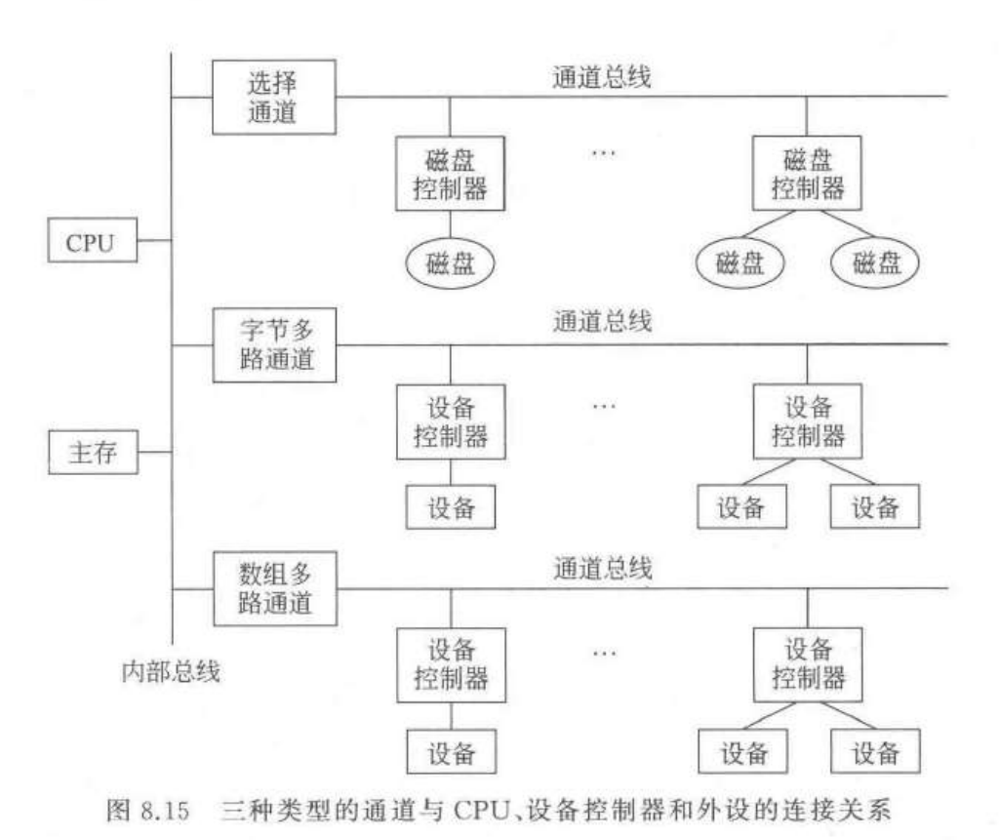

通道有三种类型:
1. 字节多路通道: 包含多个子通道,每个通道连接一个设备控制器,传输一个字节后就可以重新选择子通道.
2. 选择通道: 在传输过程中只允许使用一个设备,从而实现高速的IO
3. 数组多路通道: 每次传输固定长度的数据块后再重新选择设备,结合了前两种类型通道的特性,节约了等待磁盘寻址的开销.


## ch10: 多处理机
- 怎么看都应该叫多处理器...
### Cache一致性
如果使用共享存储器,就需要解决Cache一致性的问题,这本书认为,如果一个存储器满足以下三点则实现了一致性:
1. 处理器P在对存储单元X进行写操作后再读取,没有其他处理器在中途写入了存储单元X
2. P在写入X后,处理器Q读取了X,没有其他处理器在中途写入了X
3. 串行化写入: 任意两个处理器的写入顺序是固定的,不会随意打乱顺序,也就是说,P和Q先后写入X,那么其他处理器会先读到P的写入数据,再读到Q的写入数据.

有两种协议可以实现Cache一致性:
1. 目录式(directory): 共享数据的标签被保存在目录之中
2. 监听式(snooping): 所有Cache通过总线来监听共享数据的状态变化

监听式协议有两种实现方式:
1. 写更新协议(Write Update): 一个CPU写入新数据时就广播给所有CPU的Cache
2. 写作废协议(Write Invalidate): CPU写入某个数据时,把其他Cache中关于该数据的副本全部作废.
   1. 写作废协议的应用更为广泛,因为它需要的操作更少

目录式协议采用位图索引的方式来记录哪些Cache中有该共享数据的副本,有三种格式:
1. 全映像目录(full-mapped): 每个目录项都包含对所有CPU的映射


2. 有限映像目录(limited-mapped): 存储针对部分CPU的映射,若副本个数超过上限,则可以使用类似Cache的LRU替换策略
3. 链式目录(chained): 使用链表来存储共享的数据项
## ch12: 机群系统(过)
没有任何内容,美美结束.
## 总复习
### ch1
计算机系统结构有三种分类方法:
1. Flynn分类法: 即SISD,SIMD,MISD,MIMD四类
2. 冯氏分类法: 按照系统的最大并行度来分类
3. Handler分类法

耦合度: 处理机之间联系的紧密程度

并行性: 计算机在同一时间内完成多个操作的能力
### ch2
三种通用寄存器型的指令系统的优缺点:
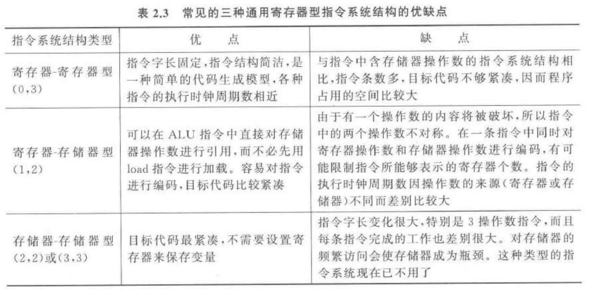


### ch3
流水线: 将一个重复的过程分解为若干个子过程,每个子过程用专门的功能部件实现,把多个处理过程在时间上错开,以此通过各功能段.流水线的段数被称为**深度**

吞吐率: 单位时间内流水线完成的任务数量

加速比: 顺序处理完成一批任务所用时间与流水线处理完成同一批任务所用时间之比

效率: 流水线中设备实际使用时间和整个运行时间的比值


MIPS 5段流水线:

1. IF(取指令): 以PC中的值为地址从存储器中取指令放入IR(指令寄存器),同时PC+4,放入NPC中
2. ID(指令译码): 对指令进行译码,将指令中的rs和rt作为地址访问通用寄存器组,并将读出的操作数放入A和B中,并对IR的低16位进行符号位扩展后存入Imm中
3. EX(执行): ALU对操作数进行运算,将结果存入ALU0
4. MEM(存储器访问)

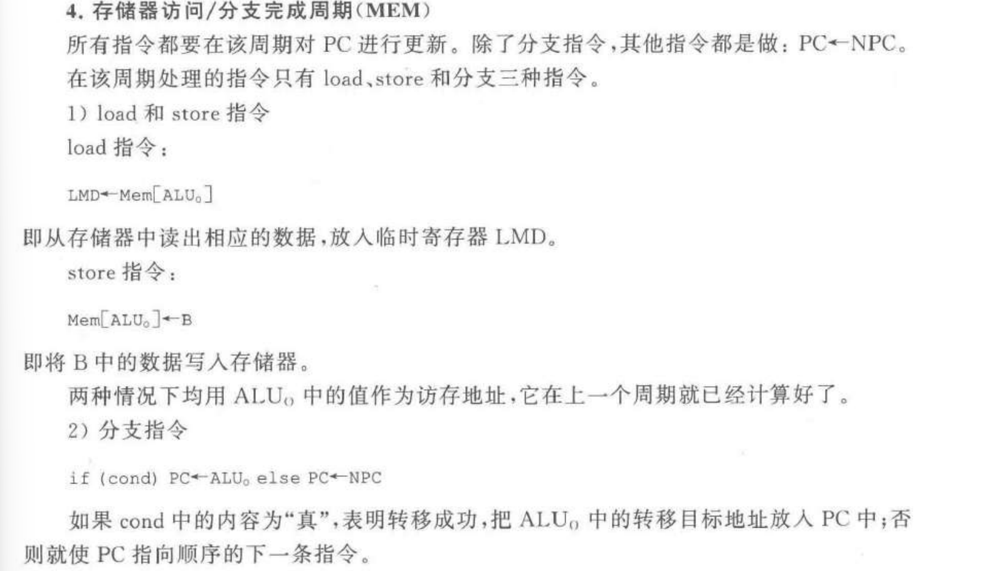

5. WB: 通用寄存器组

### ch5
- 指令级并行: 若干机器指令之间重叠执行
- IPC: 每个时钟周期内平均完成的指令条数
- 循环级并行: 程序循环的迭代中可以并行计算
- 指令动态调度: 硬件在程序运行时动态决定指令的执行顺序,通过Tomasulo算法,记分牌算法,ROB等实现.
- CDB: Common Data Bus,公共数据总线
- 动态分支预测: 预测某个分支指令是否跳转,减少控制冲突
- BHT: 分支历史表,记录分支指令过去的跳转情况
- BTB: 分支目标缓冲,保存分支指令的目标地址
- 前瞻执行: 处理器提前执行预测路径上的指令
- ROB: Reorder Buffer,重排序缓冲区,用于支持乱序执行中的按序提交.
### ch7
写策略有两种:
1. 写直达: 在写入时把数据写入Cache和主存
2. 写回法: 只写入Cache,在被替换时才写入主存

发生写不命中时,有两种选择:
1. 按写分配: 先从主存调入Cache,再写入
2. 不按写分配: 直接写入主存,而不调入Cache

不命中有三种:
1. 强制性不命中: 第一次访问某个块时一定不命中
2. 容量不命中: 程序执行时所需的块不能全部调入Cache中,那么必然会不命中
3. 冲突不命中: 太多的块映射到同一组中,那么就会发生大量的替换,也会不命中

降低不命中率:
1. 增加Cache块大小,不是越大越好,过大时由于容纳的块过少会降低命中率
2. 增加Cache容量
3. 伪相联Cache,设计比较复杂
4. 硬件预取,提前取回可能被访问的块
5. 编译优化

减少命中时间:
1. 使用容量小的Cache
2. 使用虚拟Cache
3. Cache访问流水化
### ch10
#### 监听协议
实现监听协议的关键有以下三个方面:
（1）处理器之间通过一个可以实现广播的互连机制相连，通常采用的是总线。
（2）当一个处理器的 Cache 响应本地 CPU 的访问时，如果它涉及全局操作，例如需要访问共享的存储器或需要其他处理器中的 Cache 进行相应的操作（例如作废等），其 Cache 控制器就要在获得总线的控制权后，在总线上发出消息（如图 10.4 中的 Cache A 所示）。
（3）所有处理器都一直在监听总线，它们检测总线上的地址在它们的 Cache 中是否有副本。若有，则响应该消息，并进行相应的操作（如图 10.4 中的 Cache B 所示）。

Cache发送到总线的消息有三种:
1. RdMiss,读不命中
2. WtMiss,写不命中
3. Invalidate,作废其他Cache中的副本


每个数据块有三种状态:
1. 无效(Invalid,I): 要访问的块还不在Cache中
2. 共享(Shared,S): 多个处理器中都有相同的副本
3. 已修改(Modified,M): 该块已经被修改,是整个系统中唯一的最新副本


#### 目录协议


目录协议中**主存块**的状态有三种:
1. 未缓冲(UnCached,U): 该块尚未调入Cache
2. 共享(Shared,S): 该块由多个Cache共享
3. 独占(Exclusive,E): 只有一个处理器有这个块的副本,而且已经进行了写入操作

目录协议将Cache视为节点,有三种节点:
1. 本地节点: 发出访问请求的节点
2. 宿主节点: 包含被访问的数据块的节点,对于给定的物理地址,宿主节点是唯一的
3. 远程节点: 拥有数据块的副本

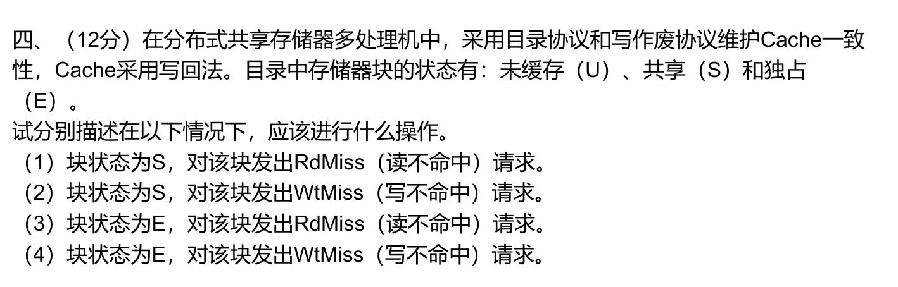

### ch12
机群: 多台独立计算机通过高速网络连接起来形成一个计算系统
# 算法设计与分析
## outline
>尽管用的是算法导论那本教材,但我不打算移过来,因为这门课的教学简直是在侮辱这本书.


大致来说,涉及了以下知识点:
1. 算法效率分析
2. 主方法计算
3. 分治法与减治法
4. 回溯法与分支限界法
5. 动态规划
6. 贪心

非常好奇这么点知识点是怎么能掰扯上一整个学期的,根据学长笔记来看的话,ppt中涉及的经典算法如下:
- 分治: 大整数乘法,Strassen算法,二分搜索,归并排序与快速排序,棋盘覆盖
- 减治: 拓扑排序,假币问题,俄罗斯农民乘法,欧几里得算法
- 变治法: 预排序,高斯消元,堆排序,霍纳法则
- 回溯与分治限界法: 暴力搜索,旅行商问题,0-1背包,N皇后问题
- 动态规划: 计算二项式系数,最长公共子序列（LCS）、动态矩阵乘法、0-1背包问题、多阶段决策过程、Warshall传递闭包算法、Floyd算法
- 贪心：找零问题、背包问题、单源最短路径Dijkstra算法、最小生成树Kruskal算法

根据作业来看,确实是需要把这些知识点全部过一遍的,不过好在都不是很难的题目,大部分都属于leetcode中等题,只有一两个leetcode困难题.

- (6/18): 现在发现,基本没有手写代码的可能,就是写一点伪代码,算法流程和画图而已,那这甚至不需要我去刷题了,把ppt上的例题搞定就行了,到了明年再刷也来得及.

## 复习进度
### 递归算法与主方法
* [x] 汉诺塔
* [x] 主方法
  * 还要刷题


### 分治法
分治法意为分而治之,也就是将一个问题拆分成多个子问题,分别解决后再合并.

* [x] 大整数乘法
* [x] Strassen算法求矩阵乘法

上面这两个我想都不会考.

* [x] 归并排序
* [x] 快速排序
* [x] 棋盘覆盖

>在一个2^k×2^k （k≥0）个方格组成的棋盘中，恰有一个方格与其他方格不同，称该方格为特殊方格。显然，特殊方格在棋盘中可能出现的位置有4^k种，因而有4^k种不同的棋盘。棋盘覆盖问题（chess cover problem）要求使用4种不同形状的L型骨牌覆盖给定棋盘上除特殊方格以外的所有方格，且任何2个L型骨牌不得重叠覆盖。


### 减治法
减治法意为减小问题规模,将复杂的问题拆分成一个更简单的子问题,不需要经过合并就得出最终答案

* [x] 插入排序
* [x] 拓扑排序
* [x] 折半查找
* [x] 假币问题
* [x] 俄罗斯农民乘法问题
* [x] 欧几里得算法（辗转相除法）


### 变治法
变治法意为将原问题转换成一个更容易解决的等价问题.

* [x] 预排序

在处理问题前先将数组排好序,从而简化问题
* [x] 高斯消元法

将矩阵转换成上三角阵后再来解方程.

* [x] 堆和堆排序
* [x] 霍纳法则

```md
**霍纳法则（Horner's Rule，在中国传统数学中被称为“秦九韶算法”）** 是用于高效计算多项式值（Polynomial Evaluation）的核心算法。它的底层物理机制是：**通过不断提取公因式 $x$，将多项式的加法与乘法项重新嵌套组合，从而消去所有的高次幂项**。

从算法范式上看，它属于变治法（Transform-and-Conquer）中的**表现改变（Representation Change）**——不改变问题的本质，仅通过改变多项式的数学表达结构，实现计算复杂度的断崖式下跌。

---

## 1. 核心数学重塑与执行行为

假设我们要计算一个常规的 $n$ 次多项式：


$$P(x) = a_n x^n + a_{n-1} x^{n-1} + \dots + a_1 x + a_0$$

### ❌ 传统暴力计算法

如果直接按原公式硬算：

1. 计算 $x^n$ 需要 $n-1$ 次乘法。
2. 算完全部项的幂次再乘以系数，总共需要约 $\frac{n(n+1)}{2}$ 次乘法和 $n$ 次加法。
3. **时间复杂度** 为 **$O(n^2)$**。

### 霍纳法则（秦九韶算法）变换

我们从内向外连续提取公因式 $x$，将多项式重构为如下的**完全嵌套形式**：


$$P(x) = \left( \dots \left( (a_n x + a_{n-1})x + a_{n-2} \right)x + \dots + a_1 \right)x + a_0$$

### 算法执行流程

我们引入一个中间变量 $v$，从最高次系数 $a_n$ 开始，自内向外迭代：


$$\begin{aligned}
v_0 &= a_n \\
v_1 &= v_0 x + a_{n-1} \\
v_2 &= v_1 x + a_{n-2} \\
&\dots \\
v_n &= v_{n-1} x + a_0
\end{aligned}$$


最终 $v_n$ 即为多项式的值。

---

## 2. 具体计算示例

**题目**：已知多项式 $P(x) = 2x^4 - x^3 - 3x^2 + x - 5$，求当 $x = 3$ 时的值。

* **系数准备**：$a_4=2,\ a_3=-1,\ a_2=-3,\ a_1=1,\ a_0=-5$。
* **嵌套重构**：$P(3) = (((2 \times 3 - 1) \times 3 - 3) \times 3 + 1) \times 3 - 5$

**迭代计算表**：

| 轮次 $i$ | 当前系数 $a_{4-i}$ | 迭代计算 $v_i = v_{i-1} \times 3 + a_{4-i}$ | 当前中间结果 |
| -------- | ------------------ | ------------------------------------------- | ------------ |
| 0        | $a_4 = 2$          | 初始赋值                                    | $v_0 = 2$    |
| 1        | $a_3 = -1$         | $2 \times 3 + (-1)$                         | $v_1 = 5$    |
| 2        | $a_2 = -3$         | $5 \times 3 + (-3)$                         | $v_2 = 12$   |
| 3        | $a_1 = 1$          | $12 \times 3 + 1$                           | $v_3 = 37$   |
| 4        | $a_0 = -5$         | $37 \times 3 + (-5)$                        | $v_4 = 106$  |

最终结果：$P(3) = 106$。

---

## 3. 第一性原理与工程应用

### ① 算法复杂度的理论极限

在整个计算过程中，迭代了 $n$ 轮，每一轮只做了一次乘法和一次加法。

* **总乘法次数**：$n$ 次
* **总加法次数**：$n$ 次
* **时间复杂度**：**$O(n)$**

在数值分析中，已从理论上证明：**没有任何算法可以用少于 $n$ 次乘法计算任意 $n$ 次多项式**。霍纳法则直接触及了该问题的计算性能极限。

### ② 现代计算机工程中的隐形基石

这个诞生于千年前的算法，至今仍是现代计算机底层硬件的核心高频算法：

* **哈希函数（Hash Functions）**：在计算字符串的哈希值时（如 Java 的 `String.hashCode()`），为了把字符串 `"cat"` 转成数字，实质是在计算多项式 $c \times 31^2 + a \times 31^1 + t \times 31^0$。其底层全部使用霍纳法则通过单循环实现。
* **进制转换**：将二进制/十六进制字符串转换为十进制整数（如将 `1101` 解析为 $1\times2^3 + 1\times2^2 + 0\times2^1 + 1\times2^0$），底层的循环乘基数累加逻辑，就是标准的霍纳法则。
```

### 解空间树
>这门课不知道从哪个旮旯引入了解空间树这个东西,然后用这个解空间树来解决常见的动态规划问题,要我说就是脱裤子放屁,你还不如考手写代码

解空间树可以用在两种算法中:
1. 回溯法(Backtracking)
2. 分支限界法(Branch&Bound Algorithm): 这门课的老师不知道为何特别喜欢这个算法呢,明明算法导论上都没有这个算法,有点呃呃了.

#### 回溯法
* **搜索起点**：搜索从开始结点（根结点）出发，以深度优先搜索整个解空间。
* **状态初始化**：这个开始结点成为**活结点**，同时也成为当前的**扩展结点**。在当前的扩展结点处，搜索向纵深方向移至一个新结点。这个新结点就成为新的活结点，并成为当前扩展结点。
* **状态转入死结点**：如果在当前的扩展结点处不能再向纵深方向扩展，则当前扩展结点就成为**死结点**。
* **回溯机制**：此时，应往回移动（回溯）至最近的一个活结点处，并使这个活结点成为当前的扩展结点；直到找到一个解或全部解。

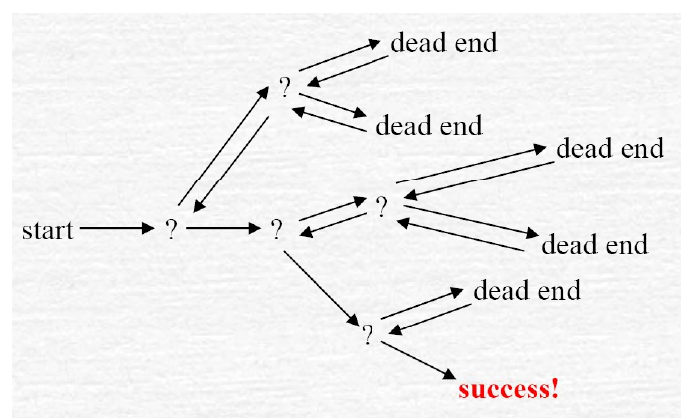


#### 分支限界法
分支限界法常以**广度优先**或以**最小耗费（最大效益）优先**的方式搜索问题的解空间树，裁剪那些不能得到最优解的子树以提高搜索效率。

* **基本搜索策略**：在扩展结点处，先生成其所有的儿子结点（分支），然后再从当前的活结点表中选择下一个扩展结点。为了有效地选择下一个扩展结点，以加速搜索的进程，在每一活结点处，计算一个函数值（优先值）。并根据这些已计算出的函数值，从当前活结点表中选择一个最有利的结点作为扩展结点，使搜索朝着解空间树上有最优解的分支推进，以便尽快地找出一个最优解。

常见的实现方法有FIFO和优先队列方法.

- 0-1背包和旅行商问题的例子需要在考前再看一遍.
### 动态规划法
* [x] 计算二项式系数
* [x] 最长公共子序列（LCS）

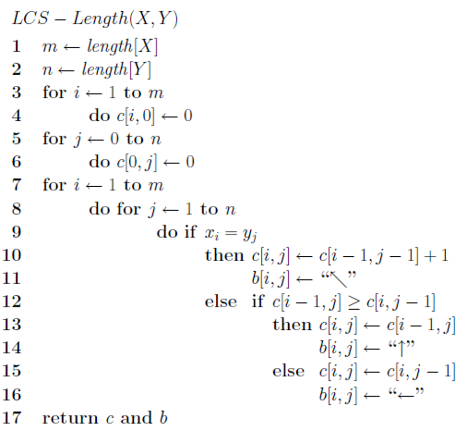


* [x] 矩阵链算法
* [x] 0-1背包问题

* [x] Warshall传递闭包算法

该算法用于计算有向图的传递闭包,即确定任意两点间是否存在任意长度的路径,用邻接矩阵(发出箭头记为1,其余全都记为0)递归即可,不过我觉得不会考大题,最多一个选择.

* [x] Floyd算法求最短路径

Floyd算法在Warshall算法上做了进一步的改进,从而可以求解每队顶点间的最短路径,这也是通过邻接矩阵递归实现的.

### 贪心法
* [x] 找零问题
* [x] 分数背包问题
* [x] 单源最短路径Dijkstra算法
* [x] 最小生成树Kruskal算法

## 总复习
### 基础概念
#### 三种conquer
分治法的核心思想是将一个规模为 n 的复杂问题分解为若干个规模较小且相互独立的子问题，求解子问题后再合并子问题的解，从而得到原问题的解，其求解问题的三个基本步骤依次为:
1. 将问题划分为若干个较小的问题
2. 对这些小的问题求解
3. 合并这些解

减治法的核心是将原问题的解与规模更小的同类型问题的解关联起来，通过求解小规模问题直接得到原问题的解，其求解思路可分为三种方法:
1. 减一个常量: 每次减1,插入排序
2. 减一个常因子: 直接除以2,折半查找
3. 减可变规模: 递归处理,欧几里得算法


变治法的核心思想是先对原问题进行变换，将其转化为一个更容易求解的等价问题，再求解变换后的问题，其主要分为三种方法:
1. 实例化简(instance simplification): 高斯消元,预排序
2. 改变表现(representation change): 霍纳法则
3. 问题化简(problem reduction): 线性规划

#### 复杂度分析与主定理
**（主定理）** 令 $a \ge 1$ 和 $b > 1$ 是常数，$f(n)$ 是一个函数，$T(n)$ 是定义在非负整数上的递归式：

$$T(n) = aT(n/b) + f(n)$$

其中我们将 $n/b$ 解释为 $\lfloor n/b \rfloor$ 或 $\lceil n/b \rceil$。那么 $T(n)$ 有如下渐近界：

1. 若对某个常数 $\epsilon > 0$ 有 $f(n) = O(n^{\log_b a - \epsilon})$，则 $T(n) = \Theta(n^{\log_b a})$。
2. 若 $f(n) = \Theta(n^{\log_b a})$，则 $T(n) = \Theta(n^{\log_b a} \lg n)$。
3. 若对某个常数 $\epsilon > 0$ 有 $f(n) = \Omega(n^{\log_b a + \epsilon})$，且对某个常数 $c < 1$ 和所有足够大的 $n$ 有 $a f(n/b) \le c f(n)$，则 $T(n) = \Theta(f(n))$。

尽管看上去很难理解,但我们可以巧妙地把这段分析变成人话:

把$n^{\log_b a}$记为C,那么当f(n)是C的下界时,它对复杂度的贡献就相对很小了,这对应了第一种情况,T(n)的确界就是C.

如果f(n)是C的确界,那么我们需要把f(n)考虑进去,也就得到了$T(n) = \Theta(n^{\log_b a} \lg n)$

如果f(n)是C的上界,那么f(n)就占据了主导地位,那么就可以大致认为$T(n) = \Theta(f(n))$

>至于原理我们没必要知道,能做题就行,不过我们可以对C这个值做一个定性分析,如果a越大,那么就说明这个分治算法会拆分出越多的子问题,增加复杂度,如果b越大,那么就说明这个分治算法能够迅速地拆分成更小的规模,更能降低复杂度,这也是为什么把b作为底数,而a作为真数的原因.

- 值得注意的是当a为1时,C恒为1


### 图算法
#### 回溯法
使用DFS,会找出解空间树中满足约束条件的所有解,而分支限界法只会找出满足条件的一个解
#### 分支限界法
有两种方案:
1. FIFO,即BFS
2. 优先队列,应该就考这个了

#### Prim,Kruskal,Dijkstra,Floyd

- Kruskal: 将边按权重从小到大排序,依次选择.得到最小生成树
- Prim: 任选一个起始点,依次选择距离最近的顶点,得到最小生成树
- Dijkstra: 从源点出发,依次选择最近的点加入集合,得到单源最短路径
- Floyd: 使用动态规划不断更新最短路径,最终得到全源最短路径
# 计算机网络
## outline
- 计算机网络: 自底向上方法(第五版)
  - 我发现这本书比自顶向下方法更适合这门课,后来发现这确实是这门课的参考教科书


按照大纲来的话,传输层和网络层都是重点了,链路层则是稍微次要的.

- 仔细看下来的话,内容确实很简单,教科书和ppt过一遍就结束了.
- (6/22): 不得不说,这本书关于底层原理讲的可比自顶向下清楚多了,很好奇为什么这本书却没有那么有名,或者说简直是默默无名.

## 概览
- 第5节的互联网历史讲的不错.


## 物理层
### 前置概念
所有的传输设施在传输过程中都要损失一些能量,对于导线而言,在0到某个频率f的范围内,信号的振幅在传输过程中不会衰减,而在此之上的所有频率的信号振幅都会有不同程度的减弱,这个安全区间就被称为**带宽(bandwidth)**,实际工程中采用使得接受能量刚好保留一半的频率位置.

1924年,Nyquist证明,如果一个信号通过了一个带宽为B的滤波器(可以理解为导线的抽象表述),那么只要经过每秒2B次的采样,就可以完全重构出被过滤的信号.

Shannon在Nyquist的基础上得出以下结论,对于一条带宽为B Hz,噪声比为S/N的有噪声信道,最大传输速率C为:

$$C = B \log_2 (1 + S/N)$$

因此,要像优化网络的传输速度,我们要么增加带宽,要么增加信噪比,换句话说,使用更好的线路.
### 传输介质
1. 双绞线: 由多对相互缠绕的铜线组成,传输速率低
2. 光纤: 由三个部件组成,光源,传输介质,探测器,传输速率至今都没有达到极限,理论上如果使用真空传输就可以达到真空中的光速
   1. 光源负责产生光脉冲,根据有无光脉冲表示比特1和0.
   2. 传输介质一般是超薄的玻璃纤维,通过调整光的入射角度可以确保只发生发射而不会发生透射,从而保证信号不会有任何丢失
   3. 探测器负责接收光信号,产生电脉冲传输给计算机


3. 无线传输: 根据公式 λf=c,频率与波长成反比,例如100MHz的波长大约为3米:


根据示意图可以看出来,有相当大部分的空白频段没有被使用,我们可以使用**扩频**的方式来将低频信号扩展到高频,尽管由于低频信号的限制,能够表达的信息量并没有变化,但却可以带来很多好处.

常用的扩频方式有三种:
1. 跳频扩频: 将信号以每秒几百次的速率从一个频率跳到另一个频率,早期用于军事领域的通信,后来被用在了**蓝牙和旧版的802.11**中
2. 码分多址(CDMA,Code Division Multiple Access): 将数据信号展开到一个更宽的频段,使得多个信号能够共享同一频段,**是移动信号的基础**
3. 超宽带通信(UWB,Ultra-WideBand): 发送一系列不断快速变化位置的脉冲,占用的带宽很多,实现高速传播.


#### 无线传输详解
### 数字调制
- 多路复用(multiplexing): 多个信号共享同一个信道.
- 通带传输(passband transmission): 不从零开始发送信号,而是把信号放置在给定的频段输出,因为低频信号的波长大,需要相当大的天线来发送.

#### 调制方法
我们可以修改原本简单的0,1信号,让它能够承载更多的信息或者增强抗干扰性,这被称为**调制**.

- ASK: Amplitude Shift Keying,通过两个不同的振幅分别标识0和1,也可以使用更多的振幅级别来标识不同信号
- FSK: Frequency Shift Keying,通过两个或者多个频率来标识0和1.
- BPSK: Binary Phase Shift Keying,0和1对应的波形相差180度
- QPSK: Quadrature Phase Shift Keying,使用4种波形来传输信号,比如使用45度,135度,225度,315度,这样一个波形就可以对应两个二进制数字,传递更多信息


如果想要用一个相位传递更多的信息,那么就可以使用正交调幅(Quadrature Amplitude Modulation,QAM),常见的有QAM-16和QAM-64,分别可以一次传递4个比特和6个比特,用星座图(constellation diagram)来表示是这样的:


#### 复用方法
复用(multiplexing)是为了让多个信号共享带宽,同时避免不同的信号之间相互影响.有三种常见的复用方法:

1. 频分复用(Frequency Division Multiplexing,FDM): 将一个频谱分成多个频段,用户之间有着足够大的频率间隔(保护带),不会互相干扰


正交频分复用(Orthogonal Frequency Division Multiplexing,OFDM)是FDM的改进版,多个频段之间可以相互交叉,这是通过傅里叶变换实现的,从而大大提高了带宽的利用率.该方法被用于802.11和4G/5G中.

2. 时分复用(Time Division Multiplexing,TDM): 用户循环占用信道,发送一小段消息后就退出,这与操作系统的进程调度非常类似.


3. 码分复用(Code Division Multiplexing,CDM): 将一个窄带信号扩展到一个很宽的频段,主要用于让不同用户的多个信号共享相同的频段,因此又被称为CDMA(Code Division Multiple Access).

CDMA允许每个用户同时用整个频段发送信号,这需要我们能够从杂乱的频段中过滤所有的无关信号得到所需的信号,具体原理如下:
1. CDMA中,每个比特传输时间被再分成m个更短的时间间隔,这被称为码片(chip),通常一个比特被分成64或者128个码片.
2. 每个用户分得唯一的m位码(原文没说,但我觉得可以叫做**识别码**),若要发送比特1,就发送自己的识别码,若要发送比特0,就发送识别码的反码

- 对于 m=8，如果站 A 分配得到的码片序列是 (-1 -1 -1 +1 +1 -1 +1 +1)，那么它发送该序列就表示发出的是比特 1，而发送 (+1 +1 +1 -1 -1 +1 -1 -1) 则表示发出的是比特 0。

按照这种编码方式,本来每秒发送b个比特,现在变成每秒要发送mb个码片了.

为了能够分辨出不同信号各自的识别码,我们需要使用Walsh码来精心配制,得到彼此正交的识别码,那么就可以简单的将信号频段乘以所需的信号识别码,就可以得到解码的信号.


>3G的复用方法使用的就是CDMA,但由于其本身的复杂度,所以不再被4G/5G采用.
## 数据链路层
### 概览
链路层的功能如下:
1. 向网络层提供一个服务接口
2. 处理传输错误
3. 调节数据发送的速率

链路层的服务接口有三种:
1. 无确认的无连接服务: 不提供任何保障,例如以太网
2. 有确认的无连接服务: 确认数据帧有没有正确的收到,如果没有则重传,例如802.11
3. 有确认的有连接服务: 适用于长距离且不可靠的链路,例如卫星通话

收到物理层传来的比特流后,链路层将其拆分成多个离散的帧,并为每个帧计算一个校验和,有四种拆分方法:
1. 字节计数法: 利用头部中的一个字段来表示该帧中的字符数,如果出现了传输错误,比如头部字段中的5变成了7,那么接收方就再也找不到正确的包读取顺序了,所以不会采用这种方案
2. 标志字节法: 用两个带有特殊标记的flag字段来标识一个帧的开始和结束,接收方在接收后删除flag字段再传递给网络层即可,这被称为**字节填充**(byte stuffing).
3. 标志比特法: 每个帧使用特殊的`01111110`来标记开始和结束
4. 靠物理层提供的冗余编码来标识每一帧的开始和结束

#### 差错控制概览
对于有确认的服务来说,如果帧丢失了,那么接收方并不会传来任何否定或者肯定的信号,唯一的方法是引入计时器,当接收方超时前都没能传回确认帧时,就执行重传
### 差错控制
有两种策略来控制差错:
1. 纠错码(error-correcting code): 在每一个数据块中包含足够多的冗余信息,即便发生了错误接收方也能推断出原本的数据是什么
2. 检错码(error-detecting code): 包含少量的冗余信息,供接收方判断是否发生了错误,让接收方来请求发送方重传

#### 纠错码
本书介绍了4种纠错码,它们的结构都高度相似: 一个n位的数据块由m个数据位和计算得到的r个冗余位构成.

两个码字不相同的位数称为**海明距离**,为了可靠地检测一串码字中的d个错误,我们可以构建一个彼此之间的海明距离为d+1的合法码字字典,也就是说,我们只设置一部分的有效码字,至于其他的码字都可以根据海明距离来判断它是由哪个合法码字出错后转变成的.

看一个纠错码实例，考虑一个只有下列 4 个有效码字的编码方案：


$$\text{0000000000},\quad \text{0000011111},\quad \text{1111100000},\quad \text{1111111111}$$


>该编码方案的距离是 5，这意味着它可以纠正 2 个错误或者检测双倍的错。如果接收到码字 0000000111 并且期望只有单个或者 2 个错误，则接收方知道原始的码字一定是 0000011111。然而，如果发生了三个错误，0000000000 变成了 0000000111，则以上编码就无法正确地纠正错误了。

这种纠错码被称为**海明码**,但实现起来是很麻烦的,一个应用更为广泛的纠错码是**卷积码**.

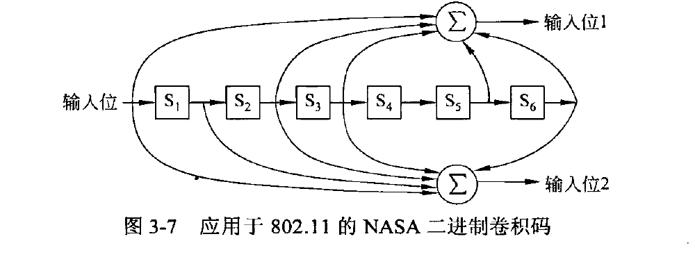

卷积码可以方便的进行编码和解码,缺点是码率(数据块与实际存储的数据位数的比值)过低,为0.5,即一个输入会得到两个输出.

#### 检错码
书中介绍的检错码有三种:
1. 奇偶校验位: 只使用一个校验码,根据让数据包中比特1的数目为偶数(奇数)的目的,分别称为奇校验和偶校验.
   1. 偶校验方式发送`1011 010`时,变成`1011 0100`
   2. 奇校验方式发送`1011 010`时,变成`1011 0101`
   3. 奇偶校验只能检测出1位错误
2. 校验和(checksum): 使用一组奇偶校验位来检测错误,由于设计很简单,被用在IP协议的数据包中
3. 循环冗余校验码(CRC,Cyclic Redundancy Check)

CRC将k位的帧看做是一个k-1次多项式的系数列表的系数，例如，`110001` 有 6 位，因此代表了一个有 6 项的多项式，其系数分别为 1、1、0、0、0 和 1：即 $1x^5+1x^4+0x^3+0x^2+0x^1+1x^0$。

发送方和接收方预先商定一个生成多项式(generator polynomial)G(x).该多项式的最高位和最低位系数都必须是1,假如一个数据帧有m位,对应了多项式M(x),为了计算它的CRC,该帧需要比生成多项式长.

CRC的基本思想是,在帧的尾部附加一个校验和,使得附加之后的多项式能够被G(x)除尽.当接收方收到帧之后,会用G(x)去除该帧,**如果有余数则说明传输过程中发生了错误.**

构造带有CRC的帧的过程如下:
1. 假设G(x)的阶为r,那么就在帧的低端加上r个0位,变成(m+r)位,例如G(x)为`10011`有5位,那么就加上4个0
2. 使用模2除法去除这个填充帧,得到余数
3. 使用模2减法从这个填充帧中减去余数,也就等价于加上余数.由于减去了余数,那么也就肯定可以被G(x)除尽了.

>需要注意的是,模2除法,加法,减法都是异或运算,没有借位和进位,所以即使除不尽也可以进行.

CRC方案可以检测出很多错误位,所以是最常用的检错码方案.
### 滑动窗口协议
本部分介绍三个属于滑动窗口(sliding window)的双向协议,该类协议的本质如下:

>发送方维持着一组序号,分别对应当前可以发送的帧,这些帧的范围被称为发送窗口(sending window),接收方也维持着一个接收窗口(receiving window),这两个窗口的大小和范围都不必相同.

>需要注意的是,滑动窗口只出现在早期的链路层协议中,以太网和802.11都不再使用,而全部依靠传输层协议实现.

1. 1位滑动窗口协议: 双方的滑动窗口大小为1,只有接收方正确接收到对应序号的包时才会移动窗口,其他时候双方都会被阻塞
2. Go-Back-N协议: 允许发送方在阻塞之前发送多达w个帧,并根据信道情况计算链路的带宽-延迟乘积(bandwidth-delay product)BD,w应该设置为2BD+1,那么当发送w个帧时,对方的确认帧就会刚好抵达,从而可以源源不断地发送.
   1. 当接收方发现某个帧损坏时,有两种方案,简单丢弃后续所有到达的帧,不返回确认,那么接收方的关于2号帧的计时器超时后,自然就会从2号帧开始重传,这就是Go-Back-N;另一种方案是**选择重传**
3. 选择重传协议: 接收方会缓存坏帧后的所有好帧,并在收到重传的坏帧时,跳到最新未被确认的帧序号.

## 介质访问控制(MAC,Medium Access Control)子层
### 信道分配概览
在物理层讨论的FDM,CDMA等协议都是静态分配信道的,无法在不同用户负载下做出相应的调整.

因此MAC层就是用来动态分配信道的,这本书认为MAC层有以下5个功能:
1. 流量独立: 通信网络有多个独立的站点组成
2. 单信道: 所有的站点共享一个信道,但可能有不同的优先级
3. 冲突可观察: 可以检测到同时发送的两帧引发的冲突
4. 时间连续或者分片: 要么任何时刻都可以发送数据,要么将时间分割成多个时间片,只要在时间片的开头才可以发送数据
5. 侦听: 站点可以侦听信道当前是否被占用,从而决定是否要继续传输

### 多路访问协议
#### ALOHA
ALOHA是历史上第一个无线通信计算机网络,这个名字并非是一些单词的首字母缩写,而是夏威夷语中你好的意思,因为这是在夏威夷大学实现的网络,用于让所有的用户与一个中央计算机进行通信.

ALOHA有两种方案: 连续的和离散的.

##### 连续ALOHA
ALOHA的基本思想很简单,**当用户有数据要发送时就传输**. 每个站点在给中央计算机发送帧后,就会把该帧重新广播给所有站,根据其他站的响应来判断这个帧是否损坏了,而损坏的唯一原因就是其他用户同时发送了信号,进而在信道上发送了冲突.如**果帧损坏了,发送方就要等待一段随机的时间后再次发送**.

显然,这种方案的效率太低,因为同一地区的用户作息时间相近,同时发送数据的可能性很高,从而导致大量的冲突.不久之后,离散ALOHA诞生了.

##### 离散ALOHA
离散ALOHA中,每个用户必须在时间片的开头才能发送帧,从而大幅度降低了用户的发送信号之间重叠的概率(而即便只有些微的重叠也会导致数据损坏,因为这会破坏校验和).

#### 载波侦听多路访问协议(Carrier Sense Multiple Access,CSMA)
最简单的CSMA方案称为1-坚持CSMA,当一个站要发送数据时,首先侦听信道,如果信道空闲,则发送数据,否则就一直等到信道空闲时再发送,如果出现冲突,那么就等待一段随机的时间后再从头开始上述过程.

- 之所以称为1-坚持型,是因为信道空闲时该方案传输数据的概率为1,这一方案与离散ALOHA并没有什么区别.

第二个方案是非坚持CSMA(nonpersistent CSMA),站点发现信道正在使用时,并不会一直守着,而是等待一段随机的时间后再来侦听,尽管这可以降低冲突,但在信道不是那么繁忙时会降低信道的利用率.

最后一个协议是p-坚持CSMA: 当站点要发送数据时,如果信道空闲,它以概率p发送数据,而以概率1-p将此次发送推迟到下个时间片.如果下个时间片也是空闲的,还是以概率p发送数据,这个过程会一直重复,直到该帧成功发送出去.如果发现信道繁忙,就等待一段随机的时间后再重新进行上述过程.

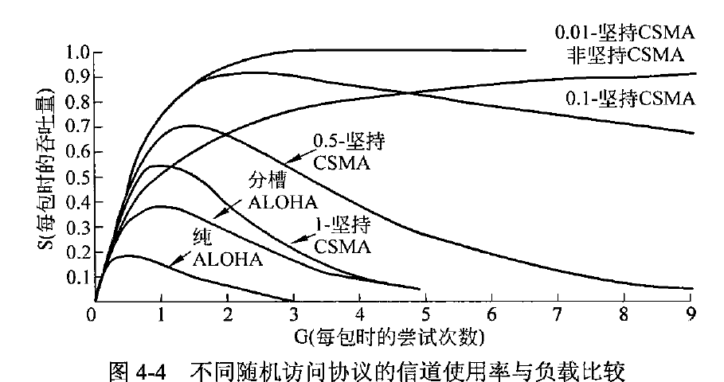

##### 带冲突检测的CSMA(CSMA/CD,CSMA with Collision Detection)
CSMA/CD做了进一步的改进,在冲突发生时立刻停止传输,从而节省时间和带宽.这是通过检测当前信道上的信号是否不同于它传输的信号实现的,也就是说,在接收信号相比发射信号没有那么微弱的时候,我们可以检测到是否发生了冲突.

我们可以设定一个检测冲突的最小时间T,当经过了时间T后某个站点仍未检测到冲突,那么它就确定自己独占了这个信道,从而可以继续传输,时间T通常是由两个相距最远的站点之间传播信号的来回时间决定的.
#### 无线局域网协议
无限局域网使用AP(Access Point)来提供通信服务,存在两个问题:
1. 隐藏终端(hidden station): 两个站点距离太远无法检测到潜在的竞争者
2. 暴露终端(exposed station): 某个站点在发送数据时检测到附近有站点在发送数据从而中断传输,但实际上那个站点传输数据的对象并不在这一个信道上.

### 以太网
#### 以太网帧

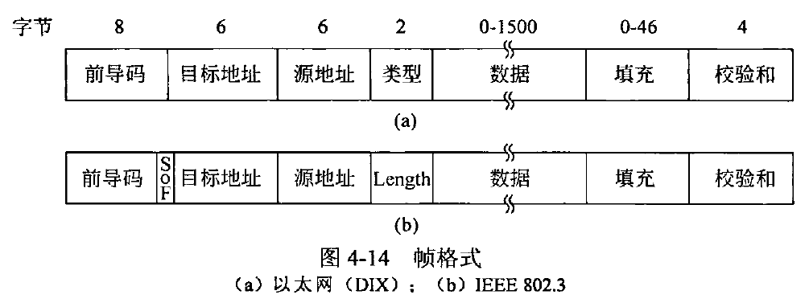

以太网帧格式如下:
1. 前导码(Preamble): 固定格式的8个字节,用于标识以太网帧和同步接收方和发送方的时钟.
2. 两个地址字段,目标地址和源地址,如果目标地址的第一位是1,则表示这是一个组地址,该组中的所有站都要接收它,这被成为组播(multicasting),由全1组成的地址用作广播(broadcasting),被网络上的所有站接收.源地址有48位,具有全球唯一性
3. 类型字段: 告诉接收方帧内的数据用的是什么网络层协议

>不幸的是，在 802.3 标准出炉时，已经有太多的 DIX 以太网硬件和软件在使用，以至
于很少有厂家和客户有热情来重新包装类型和长度字段。1997 年，IEEE 认输并表示这两
种字段都可以接受。幸运的是，所有在 1997 年之前使用的类型字段其值都大于 1500，因
此规定了最大数据长度。现在的规则是，任何值小于或等于 0x600（1536）可解释为长度
字段，任何大于 0x600 可解释为类型字段。现在 IEEE 可以认为每个人都使用了它的标准，
并且其他人可以继续做他们正在做的事情（不能打扰 LLC），它因而无须感到内疚。

4. 数据字段: 最多可包含1500个字节,而对于整个帧来说,最少要有64个字节,如果不够就需要在末尾进行填充.
5. 校验和(checksum): 32位CRC

#### 以太网优化
经典的以太网在使用1-坚持CSMA/CD算法的基础上加上了二进制指数后退(binary exponential backoff)算法: 在第i次冲突后,从0~2^i-1之间随机选择一个等待时间片数,在第十次冲突后就固定随机数的最大值为1023,这样一来,站点之间发生冲突的概率就大幅度下降.

>无论是CSMA/CD还是以太网都不提供确认,所以需要依靠高层协议来解决这个问题,但对于无线信道来说,由于出错率很高,还需要引入确认.

以太网使用交换机(switch)来中继链路传输,由4~48个端口组成,交换机接收到以太网帧后,就检查该帧的源地址和目的地址,从而确定要将这个帧转发到哪个端口.

- 由于两个帧可能在同一时刻转发到同一个端口,所以还需要交换机建立一个传输队列来及逆行缓冲.

快速以太网使用4对双绞线或者多对光纤来传输数据,由于接收信号和发送信号使用的是完全不同的信道,所以不会发生任何冲突,自然也就不需要使用CSMA/CD,从而保证了数据可以一直高速传输
### WLAN
#### 802.11设计
>802.11的物理层使用的是OFDM编码,而早期以太网使用的是曼彻斯特编码,后来则使用QAM等比较复杂的编码方式.

由于无线电几乎总是半双工的,也就是说无法在传输的同时接收到其他的信号,那么也就无法检测到是否发生了冲突,因此,802.11试图避免冲突,采用带有冲突避免的CSMA(CSMA/CA,CSMA with Collision Avoidance).这一协议类似于CSMA/CD,在发送前侦听信道,并在检测到冲突后指数后退.

由于冲突是难以主动检测的,所以需要在帧发送成功时由目的地的站点发回一个短确认帧,如果没有收到确认帧,则说明传输发生了错误,发送方需要加倍后退的时间片数.

更值得说明的是,站点要发送帧前就必须等待一段时间,无论信道是否空闲,等倒计时结束后再发送该帧,从而尽可能避免冲突.


### 宽带无线及之后(待补充,考完再来看)
## 网络层
### 网络层设计
在提供无连接服务的网络层中,传输的数据包被称为数据报(datagram),路由器根据内部的路由表来转发数据报,每个数据报的转发彼此独立.

而在提供有连接服务的网络层中,我们需要建立一个**虚电路网络**.当建立一个连接时,从源机器到目标机器的路径就被确定了,保存在中间路由器的表中.多协议标签交换(MPLS,MultiProtocol Label Switching)是该类协议的代表例子,通常用于ISP网络中,提高网络层的服务质量.

### 路由算法
路由器的核心功能有两个:
1. 转发: 根据路由表决定每个数据包的出境线路
2. 路由: 动态生成和更新路由表,这里就需要路由算法了.

路由算法有两大类: 非自适应算法(静态路由),预先在离线情况下决定路由表,不会动态更新,和自适应算法(动态路由),根据当前的网络状态动态更新路由表.

1979年以前ARPANET都使用距离矢量路由算法(Bellman-Ford Algorithm): 每个路由器维护一张表(即一个矢量),表中记录了到已知的每个目标的最佳距离和使用的链路,相邻的路由器之间不断交换信息更新路由表,最终每个路由器都知道了到所有目的地的最佳路径.

这种方案会引发无穷计算问题:

> 路由器 B、C、D 和 E 到 A 的距离分别为 1、2、3 和 4。突然间 A 停机了，或者 A 和 B 之间的链路断了（从 B 的角度来看这两种情况的效果是相同的）。
> 在第一次信息交换时，B 没有听到来自 A 的任何信息。幸运的是，C 说“别担心，我有一条通向 A 的长度为 2 的路径”。B 并不怀疑 C 的路径经过自身，B 能知道的全部只是 C 可能有 10 条链路，每条都独立地通向 A，并且长度为 2。因此，B 认为它可以通过 C 到达 A，路径长度为 3。在第一次交换之后，D 和 E 并不更新它们的 A 表项。
> 在第二次信息交换时，C 注意到，它的每一个邻居都声称有一条通向 A 的长度为 3 的路径。它随机地挑选出一条，并且将它到 A 的距离更新为 4，

由于每个路由器都不知道整体的链路情况,所以这个计数会无穷递归下去.

因此,**链路状态**路由算法(link state routing)诞生了,主要思想是,每个路由器必须完成以下的事情:
1. 发现它的邻居节点,并获取其网络地址
2. 设置到每个邻居节点的距离或者代价
3. 构造一个包含所有这些信息的数据包
4. 将这个包发送给所有的路由器,并接收来自其他路由器的数据包
5. 使用Dijkstra算法计算出到每个路由器的最短路径.

这种方案的问题是相比距离矢量算法需要更大的计算量,但在一般情况下都工作得很好,IP协议使用的OSPF算法(Open Shortest Path First)就是这一类型.

### 拥塞控制算法(过)
- congestion(拥塞): 网络中存在太多的数据包导致部分数据包延迟或者丢失,从而降低传输性能.

### 服务质量(Quality of Service,QoS)(过)
#### 应用需求
从发送方发到接收方的数据包被称为一个流(flow),在无连接网络中,一个流是从一个进程发到另一个进程的所有数据包.

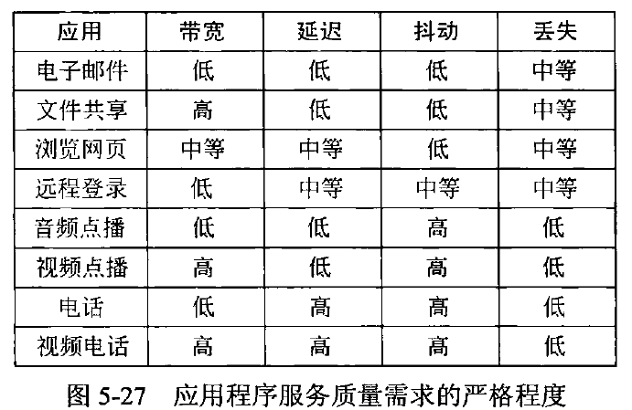
### 网络互联
链路层可以采用多种多样的方案如802.11和Ethernet,而在网络层中,也有MPLS这种独特的有连接服务,IP协议成功地将各种各样的协议整合到了一起,让不同类型的网络之间可以相互连接.这是通过针对不同的协议单独设计链路层外壳,但保留共同的IP数据包实现的.

当数据包从某个路由器发出时,都会封装为对应的链路层帧,到达目的路由器后再解包,这样就可以兼容各种协议了.

也就是说,交换机(网桥)主要用来连接链路层的同类网络,而路由器(网关,gateway)用来连接网络层的不同网络.

由于网络是由不同的运营商网络组成的,所以每个网络都可能使用不同的路由算法,我们通过边界网关协议(BGP,Border Gateway Protocol)来在不同的运营商网络之间沟通.

### IP协议
#### IPv4
IP数据报的头部有20字节的定长部分和一个可选的变长部分(很少被用到,所以单纯认为数据报头部长为20字节也可以):

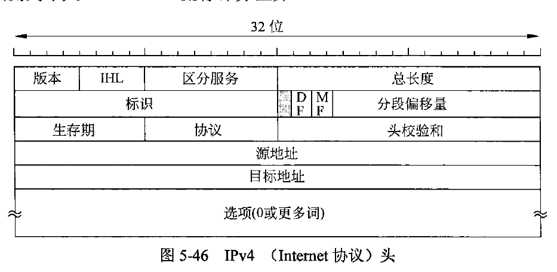

- 版本: 标明IP协议的版本,如IPv4,IPv6
- IHL: 标明IP头部的长度,最大为60字节
- 区分服务: 用于将不同服务类型的数据报分开,如电子邮件和语音电话
- 总长度: 头部加上数据的总长度,最大为65535个字节
- 标识: 将太大的数据报拆分成不同段后,用标识来标明这些段都属于同一个数据报
- 生存期(Time to live): 该数据报的生存时间.
- 校验和: 只计算头部的校验和,至于数据部分由传输协议负责校验.

#### IP地址
IP地址为32位,分为4个字节,每个字节取值范围为0-255,不同字节用`.`分隔开来.

同一网络中的所有主机具有相同的前缀,如128.255.255.0/24表示前24位都用于网络地址,只有后8位是自由分配的.

我们使用子网掩码(subnet mask)来快速标识IP地址的网络部分,如255.255.255.0表示前24位为网络地址.

网络地址转换(NAT,Network Address Translation)的基本思想是,ISP为每个公司/家庭只分配一个**公共IP地址**,即便这个家庭/公司内部有多台主机,它们都有通过DHCP分配的不同**内部IP地址**,但在这些主机向外发送信息时,必须**将自己的内部IP地址转换成公共IP地址.**

这种地址转换使用了 IP 地址的三个范围, 这些地址已经被声明为私有化。任何网络可以在内部随意地使用这些地址。仅有的规则是不允许包含这些地址的数据包出现在 Internet上。这 3 个保留的地址范围为:

- 10.0.0.0～10.255.255.255/8                （16 777 216 个主机）
- 172.16.0.0～172.31.255.255/12          （1 048 576 个主机）
- 192.168.0.0～192.168.255.255/16      （65 536 个主机）

如果在终端输入`ipconfig`的话,一般就能看到这些地址中的某一个被用作了该电脑的IPv4地址.

现在的问题是,NAT如何知道从远方发来的数据包要交给哪个内部主机?

唯一的解决方案是,NAT盒记录内部主机的TCP连接端口号,并将端口号与该主机的内部IP地址关联起来,如果有冲突就再做一次映射,转移到另一个没被占用的端口号.

如此一来,NAT就破坏了网络的分层性质,将魔爪伸向了传输层,尽管如此,它还是得到了广泛应用,因为这确实比配置DHCP要简单多了,不需要动脑子,最主要的优点是,可以提前截获流量,从而可以作为防火墙阻挡攻击.

#### IPv6
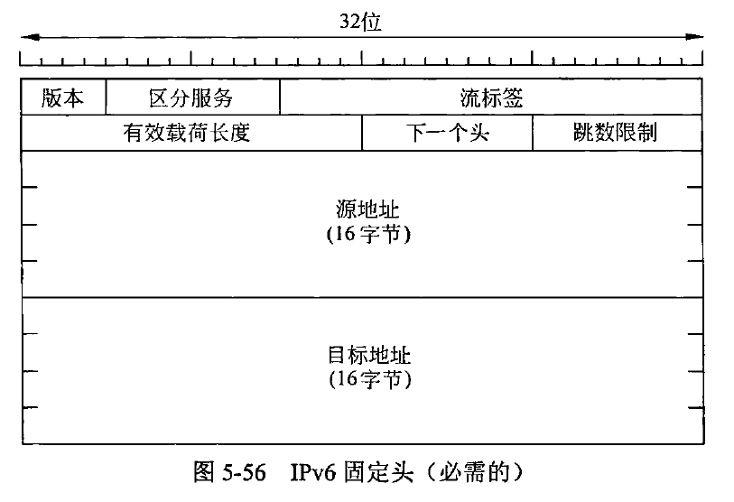

IPv6最明显的改动就是去掉了校验和,将所有的校验都留给传输层来完成,从而大大提高了IPv6的传输效率.
#### 辅助协议
除了IP协议外,网络层还有几个辅助的控制协议.
##### ICMP(Internet Control Message Protocol)
当路由器在处理一个数据报时发生了意外,就会使用ICMP向发送端报告事件.

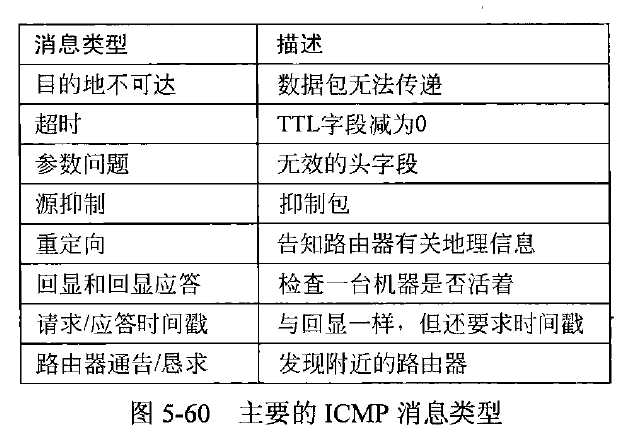

##### 地址解析协议(ARP,Address Resolution Protocol)
链路层并不知道IP地址的存在,所以需要我们使用ARP将IP地址映射到MAC地址,不过,链路层需要负责所有的数据报转发,所以我们在每一次转发时都需要获知下一跳路由器/交换机的MAC地址.

1. 首先通过DNS获知目标主机的IP地址,假设该目标主机恰好位于同一个网络中.
2. 发送主机发送一个带有自身MAC地址和IP地址的广播包,请求寻找拥有该IP地址的主机,目标主机对此做出应答,并返回自己的MAC地址.

如果目标主机不在同一个网络,那么发送主机就需要将流量发给默认网关(该网络的边界路由器).我们需要使用DHCP或者其他协议来获知默认网关的IP地址,再通过ARP来获知它的MAC地址,现在就可以把流量都送给默认网关了,之后再由路由器通过路由表层层转发该数据报给目标主机.

##### 动态主机配置协议(DHCP,Dynamic Host Configuration Protocol)
每个网络都有一个DHCP服务器负责IP地址的配置.当计算机启动时,它广播一个DHCP请求,DHCP服务器接收到该请求时就会为计算机分配一个空闲的IP地址,计算机也由此得知默认网关的IP地址.


## 传输层
### SOCKET设计

| 原语    | 含义                           |
| ------- | ------------------------------ |
| SOCKET  | 创建一个新通信端点             |
| BIND    | 将套接字与一个本地地址关联     |
| LISTEN  | 声明愿意接受连接；给出队列长度 |
| ACCEPT  | 被动创建一个入境连接           |
| CONNECT | 主动创建一个连接               |
| SEND    | 通过连接发送一些数据           |
| RECEIVE | 从连接上接收一些数据           |
| CLOSE   | 释放连接                       |

客户端调用socket建立与服务器ip地址和端口的连接,这个时候客户端的socket也运行在一个特定的随机端口上.

### 传输协议设计
#### 寻址
尽管我们在访问网站时可以通过DNS来获取它的ip地址,但这个网站使用的端口我们是不知道的.

因此,我们有两种方法解决这个问题:
1. 硬编码: 如http对应80,https对应443
2. 反向代理: 比如nginx运行在80或者443端口,将流量导向不规范的网站端口(如1234).
#### 建立连接
为了避免数据包重复传输,特别是重传的数据包先于第一次传输的数据包到达这类极端情况带来的影响,我们可以给传输协议加上以下限制:
1. 限制一个数据包的最大跳跃次数M和最长有效时间T
2. 发送方用一个在T秒内不会重复的序号来标识数据包,这样一来在任何时间段内只会有一个使用该序号的有效数据包.
3. 调整数据包的发送速率,确保序号不会过早开始循环.

虽然在连接建立后的每个请求都有唯一的序号,但对于建立连接的那个请求,我们无法判断这个请求是否是重复的,那么服务器就会建立两次连接,从而引发混淆.

为了解决这个特殊的问题,我们引入了三次握手:

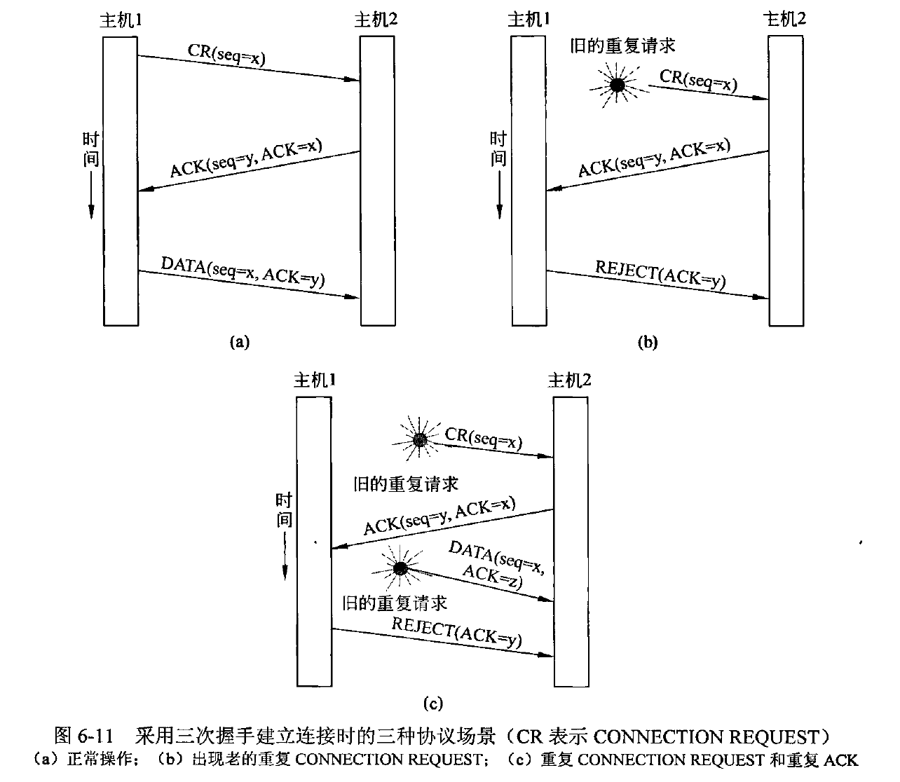

>为了解决这个问题，(Tomlinson, 1975) 引入了三次握手（three-way handshake）。这是一个建立连接采用的协议，它要求一方检查连接请求是否的确是当前的。图 6-11 (a) 显示了主机 1 发起连接请求时的正常建立过程。主机 1 选择一个序号 x，并且发送一个包含 x 的 CONNECTION REQUEST 段给主机 2。主机 2 回应一个 ACK 段作为对 x 的确认，并且宣告它自己的初始序号 y。最后，主机 1 在它发送的第一个数据段中，对主机 2 选择的初始序号进行确认。
>
>现在我们来看当出现延迟的重复控制段时三次握手协议是如何工作的。在图 6-11 (b) 中，第一个段是一个旧连接上被延迟了的重复 CONNECTION REQUEST。该段到达主机 2，而主机 1 对此并不知情。主机 2 对这个段的回应是给主机 1 发送一个 ACK 段，其效果相当于验证主机 1 是否真的请求建立一个新的连接。当主机 1 拒绝了主机 2 的连接建立请求后，主机 2 就意识到被一个延迟的重复段所欺骗了，于是放弃连接。这样，一个延迟的重复段没有造成任何伤害。

- 这一段论述很妙,完美阐释了为什么需要三次握手

#### 释放连接
如果允许通信的某一方单独断开连接的话,很容易导致数据丢失,所以我们需要通信双方都同意挂断这次连接,但这个问题并没有想象中那么简单.

如果任何一方需要在另一方做好了断开连接的准备之后才断开连接,那么这个连接永远都不可能发生,因为双方都会不断地循环向对方确认是否断开这次连接.

因此,一个简单的解决方案是把这个问题丢给应用层,比如用户关闭了这个网页,服务器在一段时间后不再接收到用户传来的请求,那么自然就会断开连接
#### 差错控制和多路复用(过)

### 拥塞控制
>给所有的流量都均分相同的带宽并不是一个好主意,我们可以使用max-min fairness方案,如果一个流的带宽在不减少分配给其他流带宽的前提下无法继续增长,就不给它分配更多的带宽.

- 加法递增乘法递减(AIMD,Additive Increase Multiplicative Decrease): 在带宽未满时线性递增占用的带宽,但当拥塞出现时,需要按照乘法倍数递减带宽.

### UDP
UDP(User Datagram Protocol)的头部只有四个部分,总共64位,每个部分2个字节:

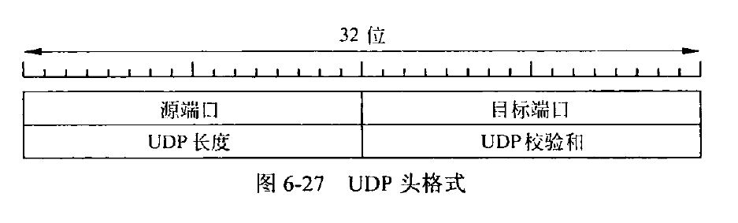

>UDP的校验和提供检错功能,当接收方发现错误时,就简单地把这个包丢弃,不会向发送方返回任何信号,因而UDP是无连接的传输协议.

### TCP
#### TCP格式
TCP(Transmission Control Protocol)负责将数据正确地交付到对方主机,是一个全双工的点对点协议.

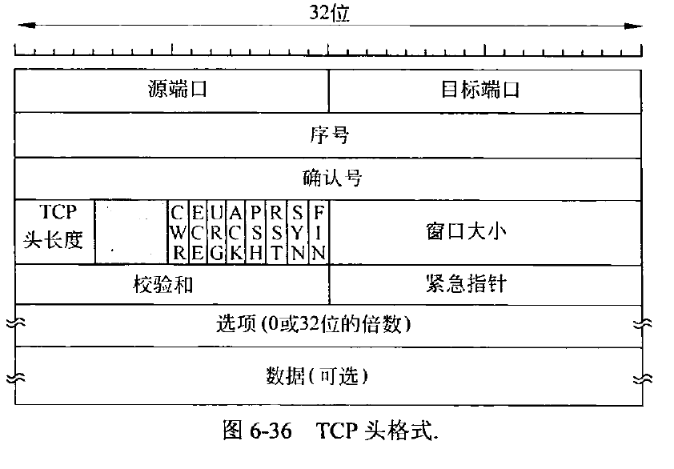

TCP的头部有20个字节,除了源端口,目的端口,校验和,TCP头长度(因为TCP头的长度是可变的,所以需要来做额外的标识好定位数据段),还有以下字段:
1. 序号(sequence number): 标识该TCP包在序列中的位置
2. 确认号: 接收方期待收到的下一个字节.
3. 8个1比特的标志位: 
   1. ACK表示确认号字段是有效的,若为0则表示该数据包不包含确认信息.
   2. PSH: 表示这是被push(推送)的数据,要求对方收到数据后不缓存而是直接送到应用程序
   3. RST: Reset,用于重置连接或者释放连接
   4. SYN: Synchronize,用于双方进行连接
   5. FIN: 用于释放连接
   6. URG: 标识使用了紧急指针(Urgent pointer),紧急指针用于确认某些紧急数据,很少被用到
   7. ECE/CWR: 用于拥塞控制,CWR由发送端发给接收端,ECE由接收端发给发送端.
4. 窗口大小: 标识发送方可以发送的序号范围
5. 选项: 用于指示一些额外的要求,如主机可以接收的最大数据包大小,用于计算来回时延的时间戳

#### TCP连接
TCP连接建立的过程就是如前所说的三次握手,而释放连接的过程被称为**四次挥手**,双方各自发送一次FIN和ACK,但尽管如此,第一个ACK和第二个FIN有可能被放在一个段中,也就变成了"三次挥手".

我们通过计时器和超时就断开连接的方案来解决释放连接时的两军对垒问题.

#### TCP拥塞控制
TCP连接过程中需要维护两个窗口:
1. 流量控制窗口: 这个窗口就是我们之前用的滑动窗口,用于限定双方发送和接收的序号范围.
2. 拥塞窗口(congestion window): 当前发送端可以往网络发送的字节数,用于拥塞控制.

有效窗口大小就是这两个窗口大小的交集,发送方根据有效窗口大小来发送数据.

由于802.11在链路层已经解决了无线信道的高误码率问题,而网络层的误码率极低,因此,当出现丢包时,TCP就可以认为信道发生了拥塞,需要开始调整拥塞窗口了.

TCP采用慢速启动(slow start)算法来试探性地发现拥塞:
- 建立连接时,一开始的拥塞窗口很小,不超过4个数据包大小.每有一个数据包在超时前得到确认,拥塞窗口就增加一个数据包的大小.例如以4个数据包大小开始,所有数据包都返回了确认,那么就增长到8个数据包大小
- 发送方需要维护一个**拥塞阈值**,该阈值用于标识可能会发送拥塞的窗口大小,当超过该阈值时,无论有没有丢包,都需要从指数增长切换为线性增长,每次只增加一个数据包的大小.
- 一旦检测到任何一个丢包,那么发送方就会将拥塞阈值减半,并重新从最小的拥塞窗口(1个到4个数据包大小)开始新的流程.

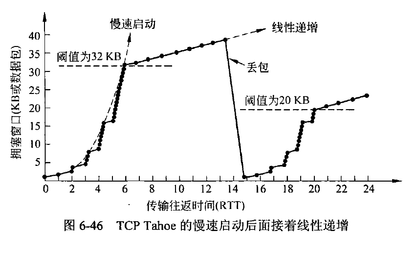

>如果接收端对同一个序号返回了三个重复确认,那么就认为这个包已经丢失,不需要等待计时器超时就可以开始重传,这被称为快速重传(fast retransmission).

后来的TCP做了一点新的改进,在检测到丢包时只将拥塞窗口降低到新的拥塞阈值,而不是全部清零,这显然更为合理,被称为**快速恢复**:

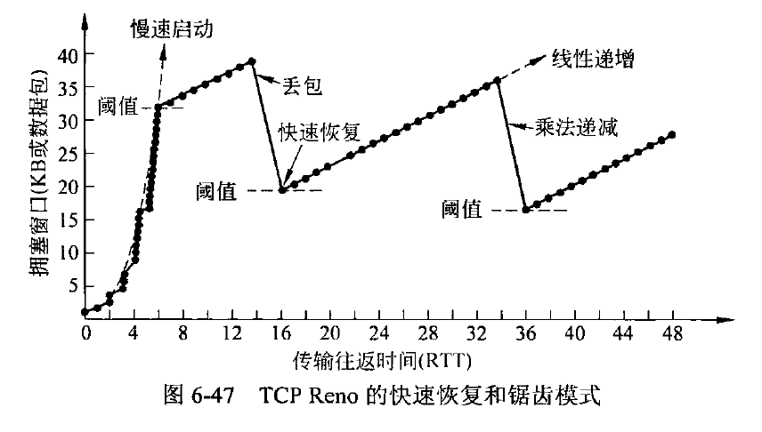


## 应用层
- 这一章能考的内容非常少
### DNS
DNS数据库中的记录格式如下:
```md
Domain_name Time_to_live Class Type Value
```
- Domain_name: 域名
- Time_to_live: 这条记录的稳定程度/存活周期
- Class: 对于因特网,该值总是IN,其他值很少见
- Type: 指示这是什么类型的记录
- Value: 不同Type有不同类型的值

| 类型  | 含义             | 值                       |
| ----- | ---------------- | ------------------------ |
| SOA   | 授权开始         | 本区域的参数             |
| A     | 主机的IPv4地址   | 32位整数                 |
| AAAA  | 主机的IPv6地址   | 128位整数                |
| MX    | 邮件交换         | 优先级，愿意接受邮件的域 |
| NS    | 域名服务器       | 本域的服务器名字         |
| CNAME | 规范名           | 域名                     |
| PTR   | 指针             | IP地址的别名             |
| SPF   | 发送者的政策框架 | 邮件发送政策的文本编码   |
| SRV   | 服务             | 提供服务的主机           |
| TXT   | 文本             | 说明的ASCII文本          |

- CNAME用于将一些别名导流到正确的域名上,例如`www.baidu.com`对应`baidu.com`.

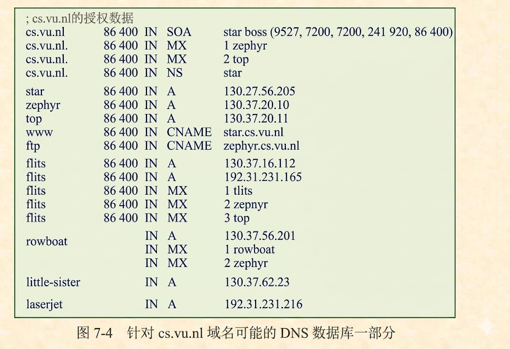


查询一个域名和其对应ip的过程称为域名解析(name resolution),当电脑内部的解析器需要查询一个域名时,就会把该查询传递给一个本地的域名服务器,如果缓存中刚好有这条记录,并且这条记录还有效,就返回这条记录.

如果没有找到这条记录,那么本地域名服务器就会从根域名服务器开始,逐级查询,找到最终结果时就将新记录存入缓存中并返回给原先提出请求的电脑:

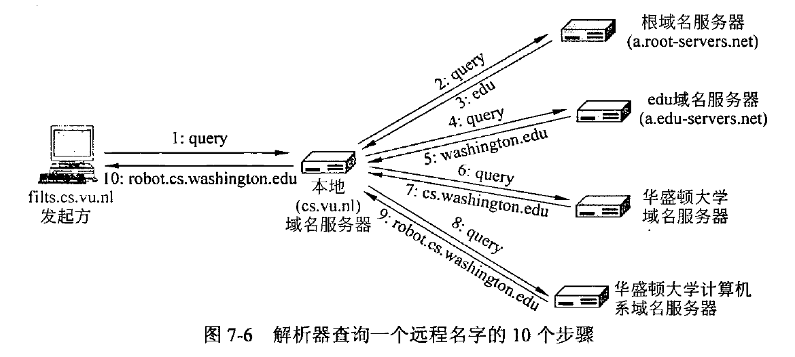


### Web
## 网络安全(过)
- 基本上全都是深入浅出密码学中覆盖的内容,遗憾的是基本都是浅尝辄止的,没有深入讲解,所以没什么看头

## ppt阅读

### ch1
#### Circuit Switching and Packet Switching
- Circuit Switching: 数据通过线路传播,不进行拆分.
- Packet Switching: 数据拆分成packet,通过多级跳转传播.
### ch2
#### 香农定律

- 香农定律中的信噪比用的是普通的单位,而不是分贝,所以需要看题目是怎么说的

### ch3(过)
### ch4
#### 海明编码
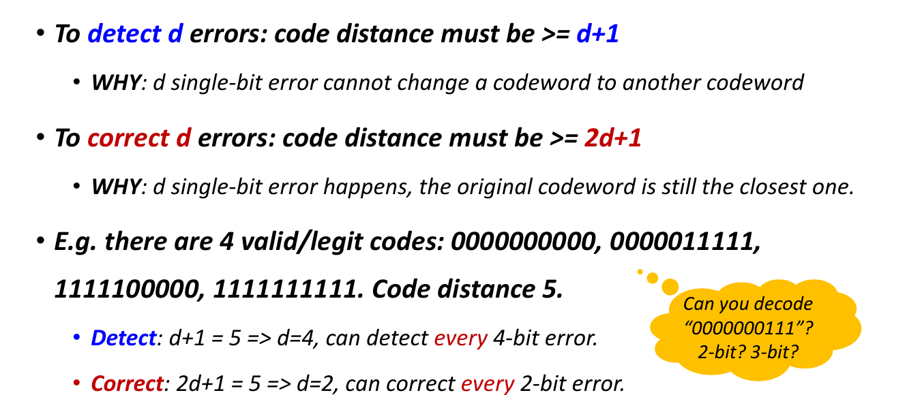


海明码只能找出2位错误,或者纠正1位错误,所以基本没有用处.

具体的编码方案很麻烦,但ppt中还是给了完整的实现出来,那还是得学习:
1. 将1,2,4,8,...等位数作为纠错码的位置,每个纠错码分别纠正和在它的最高位是1的位置.例如第1位是检错码,那么1,3(11),5(101),7(111)等奇数对应第一位的最高位都是1;第二位则对应了2,3(11),6(110),7(111)位.
2. 如果是偶校验(even),就让这些位中1的总个数为偶数,如果发现1的个数为奇数,那么就说明这组出错,校验结果记为1
3. 将出错的几个组取交集,再除去没出错的组,就可以知道哪个码出错了.


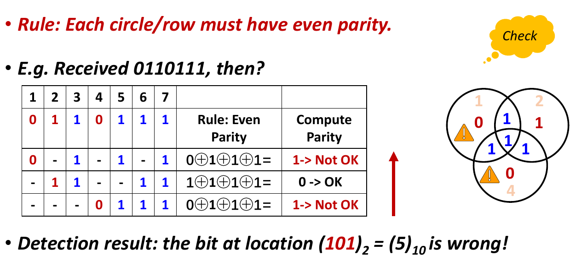


### ch5
#### Bellman-Ford
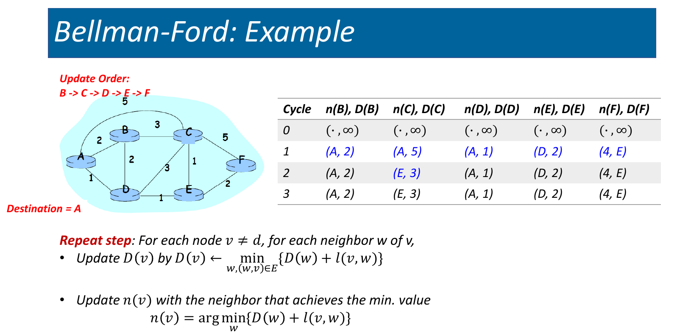

重要的是按照更新顺序来,第0轮的时候不做任何操作,第1轮开始,如果邻近节点就是目标节点或者有目标节点的路径,就开始更新.
### ch6,7,8(过)
## 总结
能拿来计算的大题如下:
1. 香农定律
2. 时延计算
3. CRC/海明码计算
4. Dijkstra路由
5. Bellman-Ford路由

看了一下简答题有5道,总共40分,而且肯定有一道概念题,那么上面5个应该都会考了,鉴于Bellman-Ford更不常用,所以考Dijkstra的概率更大.

# 操作系统
## outline
- 操作系统概念(第九版)

基本对应1-13章,看完后再翻翻ppt即可,实际来说,这本书写的确实非常烂,但也没办法,就当是复习吧.

这次考试概念题占60分,剩下40分拿来做5道大题,看了以下往年卷子,概念题基本涉及了所有的模块,所以都得记下来,主要的难点是这些:
1. 进程同步中的信号量问题
2. 进程的状态转换
3. 请求调页的存储管理机制
4. 物理地址转换计算
5. 文件索引计算


## 教材
### ch1: 导论(过)
### ch2: 操作系统结构(过)
### ch3: 进程
#### 生产者-消费者问题
>生产者进程生成信息,供消费者进程消费,这需要合理的安排共享内存区域和设置死锁来实现.
### ch4,ch5(过)
### ch6: 同步
#### 读者/作者问题(过)
#### 哲学家就餐问题(过)
真是无敌了,讲的不明不白的.

### ch7: 死锁
#### 银行家算法
- [wiki](https://zh.wikipedia.org/wiki/%E9%93%B6%E8%A1%8C%E5%AE%B6%E7%AE%97%E6%B3%95)

>在银行中，客户申请贷款的数量是有限的，每个客户在第一次申请贷款时要声明完成该项目所需的最大资金量，在满足所有贷款要求时，客户应及时归还。银行家在客户申请的贷款数量不超过自己拥有的最大值时，都应尽量满足客户的需要。在这样的描述中，银行家就好比操作系统，资金就是资源，客户就相当于要申请资源的进程。

为了实现银行家算法，需要有几个数据结构。这些数据结构对资源分配系统的状态进行了记录。我们需要以下数据结构，这里 $n$ 为系统进程的数量，$m$ 为资源类型的种类：

* **Available**：长度为 $m$ 的向量，表示每种资源的可用实例数量。如果 $\text{Available}[j] = k$，那么资源类型 $R_j$ 有 $k$ 个可用实例。
  * 指的是当前剩余可用的资源
* **Max**：$n \times m$ 矩阵，定义每个进程的最大需求。如果 $\text{Max}[i][j] = k$，那么进程 $P_i$ 最多可申请资源类型 $R_j$ 的 $k$ 个实例。
* **Allocation**：$n \times m$ 矩阵，定义每个进程现在分配的每种资源类型的实例数量。如果 $\text{Allocation}[i][j] = k$，那么进程 $P_i$ 现在已分配了资源类型 $R_j$ 的 $k$ 个实例。
* **Need**：$n \times m$ 矩阵，表示每个进程还需要的剩余资源。如果 $\text{Need}[i][j] = k$，那么进程 $P_i$ 还可能申请 $k$ 个资源类型 $R_j$ 的实例。注意 $\text{Need}[i][j] = \text{Max}[i][j] - \text{Allocation}[i][j]$。

如果新的分配破坏了Max或者Available的限制,那么就会拒绝这次分配,如果没有破坏,那么就执行这次分配.

- 总体来说,没有什么用
### ch8及以后
- 直接内存访问控制器(Direct Memory Access,DMA): 处理器将读写内存的任务交给DMA来执行,并在完成后发出中断.

- 发现还是得看ppt上的扯淡,教材里没有什么太有用的内容
## ch1: 概览
>**操作系统**是计算机中的一个系统软件，管理和控制计算机系统的软、硬件资源，合理地组织计算机的工作流程，以便有效利用这些资源为用户提供一个功能强、使用方便的工作环境，从而在计算机与用户之间起到接口的作用。

操作系统由以下部分组成:
1. 进程管理
2. 内存管理
3. I/O设备管理
4. 文件管理
## ch2&&3(过)

## ch4: 进程
#### 进程结构
进程控制块(Process Control Block,PCB): 操作系统为了管理进程而设置的数据结构,进程与PCB是一一对应的.

进程上下文(Process Context): 进程执行时的全部状态

#### 进程合作
- 直接作用: 进程间的相互作用是有意安排的
- 间接作用: 进程间通过某种中介发生联系,彼此不知道对方的存在.

#### 进程的基本状态及转换
进程有三种状态:
1. 就绪
2. 运行
3. 等待

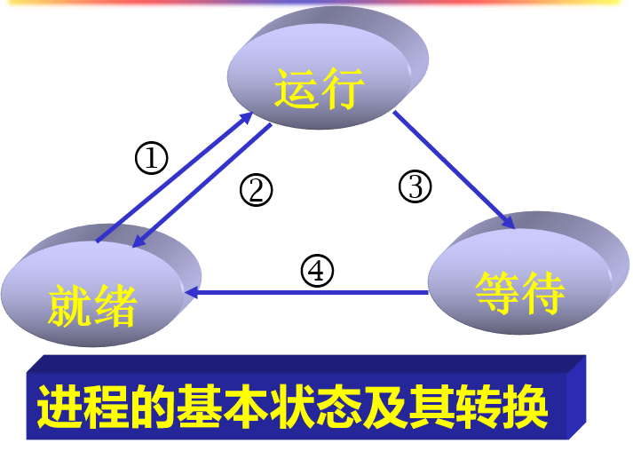


## ch5: 线程
线程的存在将进程的资源分配和任务调度分开.因此,进程是资源分配的基本单位,而线程是调度的基本单位.同一进程可以创建多个线程,多个线程之间彼此共享数据空间
## ch6: CPU调度
CPU调度的主要算法如下:
1. FCFS (First-Come, First-Served ) （先到先行调度）
2. SJF (Shortest-Job-First )（最短作业优先调度）
3. Priority Scheduling（优先级调度）
4. RR (Round Robin ) （轮转法调度）
5. Multilevel Queue（多级队列调度）

实时调度算法用于在实时操作系统(RTOS)中调度任务,目标不是追求最短的平均响应时间,而是保证所有任务在特定截止日期前完成.

按照时效强弱可分为两类:
1. Hard Real-Time: 截止时间是绝对红线,如安全气囊弹出
2. Soft Real-Time: 截止时间是期望线,偶尔超时只会导致服务质量下降,如流媒体等.

有三种实时调度算法:
1. 单调速调度(RMS,Rate Montonic Scheduling): 每个任务会被分配一个固定的优先级,周期越短优先级越高
2. 最早截止日期优先(EDF,Earliest Deadline First Scheduling): 根据任务的deadline动态调整进程的优先级,理论上是最优的
3. 比例分享调度(PSS,Proportional Share Scheduling): 按照比例分享CPU时间

## ch7: 进程同步(重点)
### 临界区问题(待补充)
### 信号量
信号量(Semaphore)用S指代资源:

- S>0 表示有S个资源可用
- S=0 表示无资源可用
- S<0 则|S|表示S等待队列中的进程个数

信号量中有两个操作P和V(荷兰语的缩写):
1. P操作(假设P为Please的缩写可以方便记忆): 用于申请资源,S减去1,如果S变为负数,那么就阻塞这个线程并加入等待队列,否则就继续运行该线程
2. V操作: 用于在线程执行完毕后释放资源,S加上1,如果S仍然为负数,那么就从队列中唤醒一个线程

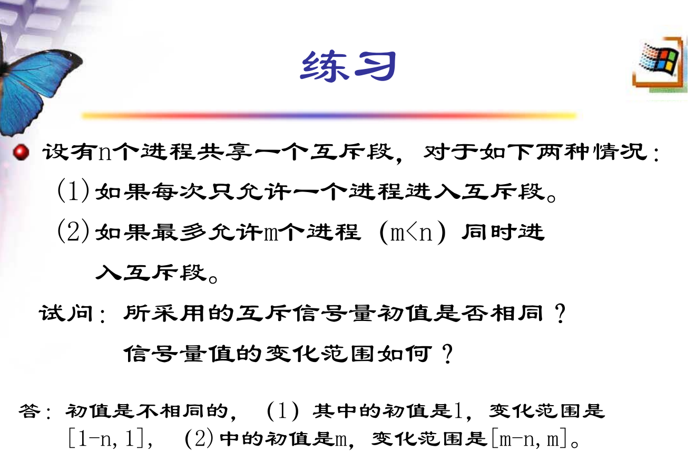


## ch8: 死锁
死锁的4个必要条件:
1. 互斥
2. 占有并等待
3. 非抢占
4. 循环等待

## ch9: 内存管理基础
### 分区
常用的分区算法如下:
1. 最先适配: 按照分区先后顺序,找到符合要求的第一个分区
2. 循环最先适配: 从上次分配的分区起开始查找符合要求的第一个分区,到地址末端时再回到第一个分区
3. 最佳适配: 在所有的可用空闲分区中找一个最小的分区,从而尽可能保留较大的空闲分区.
4. 最坏适配: 选择空闲分区中最大的

分区会产生大量的内存碎片,所以不推荐使用,上述4种最常用的反而是最先适配,因为花的时间最少.
### 段页式
将用户程序按照段划分,而将内存空间按照页来划分,就可以实现内存的灵活分配

## ch10: 虚拟内存管理
### 页面置换
页面置换有如下算法:
1.  先进先出算法(FIFO): 选择最先调入的页面
2.  最佳算法（OPT-optimal）: 选择未来不再使用的页面来置换,是LRU的理想情况
3.  最近最久未使用算法(LRU-Least Recently Used): 选择最近最久未被访问的页面来置换
4.  最不常用算法(LFU-Least Frequently Used): 选择累计访问次数最少的页面来置换
5.  轮转算法(clock): 置换时采用一个指针，从当前指针位置开始按地址先后检查各页，寻找user=0的页面作为被置换页，并将指针经过的页修改为user=0 ，最后指针停留在被置换页的下一个页。而每次有新页面调入时user都被置为1.


>刚被淘汰出去的页很快又被访问，需要重新调入；但是，调入不久又再次被淘汰出去。如此反复，使得整个系统的页面替换非常频繁，使大部分机器时间都用在来回进行的页面调度上，这种局面称为**系统颠簸(thrashing)**

后果:
- 缺页率急剧增加；
- 内存有效存取时间加长；
- 系统吞吐量骤减；
- 系统已基本不能完成什么任务

解决方案:
- 采用局部置换策略：如果一个进程出现抖动，它不能从另外的进程取帧，不会引发其它进程出现抖动，使抖动局限于一个小范围内。
- 利用工作集策略防止抖动
- 挂起某些进程：优先级低、缺页进程、最大的进程等

## ch11: 文件系统
### 文件的逻辑结构
文件有两种逻辑结构,与存储设备的特性无关:
1. 流式文件: 构成文件的基本单位是字符,是现代操作系统的文件结构
2. 记录文件: 文件由若干个记录组成,每个记录保留一部分的文件信息,主要用在老式的机器中.

### 文件存储(文件的物理结构)
有三种文件存储方式:
1. 连续(顺序)结构: 简单,支持随机存取;不利于文件的插入和删除,文件不能动态增长
2. 链接结构: 文件块之间通过指针链接;提高了磁盘空间的利用率,有利于文件的插入和删除;存取速度慢,不能随机存取
3. 索引结构: 文件块使用索引表来管理;充分利用了磁盘空间,还可以实现随机存取;索引表本身有存储开销
## ch12: 设备管理(过)
## ch13: 磁盘结构(过)
## 总结

# 数据库
## outline
- 数据库系统概念(第7版)

* Chapter 1: Introduction
* *Chapter 2: Introduction to Relational Model*
* **Chapter 3: Introduction to SQL**
* *Chapter 4: Intermediate SQL*
* Chapter 5: Advanced SQL (只要求前三节)
* **Chapter 6: Entity-Relationship Model**
* **Chapter 7: Relational Database Design**
* Chapter 8: Complex Data Types
* Chapter 9: Application Design
* Chapter 10: Big Data
* Chapter 11: Data Analytics
* Chapter 12: Physical Storage Systems (Sections 12.5 (RAID) omitted)
* Chapter 13: Storage and File Structure
* **Chapter 14: Indexing and Hashing**
* Chapter 15: Query Processing (Section 15.1, 15.2)
* Chapter 17: Transactions

基本对应中文版的1-13章,看中文版就够了,至于那些中文版没有的内容也不用看了,确实不会考.由于我的笔记记得很早,所以都挺稚嫩的,只好重构一次了.好在这门课最后一天考,所以时间倒是有的是.

- 斜体的为需要熟练的部分,黑体的为非常重要的部分

经过三次小测再来看,重点已经一目了然了:
1. 所有的SQL语法(初级和中级语法最重要)
2. 关系代数
3. E-R图绘制
4. 3NF与BCNF
5. B+树绘制


### 吐槽
教材详细过头了,而ppt基本是原封不动的搬运了整本书1300多页的内容,一个ppt最少五六十张,而总共有20多个ppt.
要说他敬业呢,ppt上的内容破碎无比,速览一遍发现不如看书完整,要说他不敬业呢,好歹有这么大的工作量.

- (3/26)这本书真的是又臭又长...
- (3/28)我服了原来这个ppt是[官网](https://db-book.com/slides-dir/index.html)上的,而我们老师实际啥都没干...
## 本教材核心: 大学数据库
keys used:
| 关系名     | 关系模式                                                                                                                               |
| ---------- | -------------------------------------------------------------------------------------------------------------------------------------- |
| classroom  | $classroom(\underline{building}, \underline{room\_number}, capacity)$                                                                  |
| department | $department(\underline{dept\_name}, building, budget)$                                                                                 |
| course     | $course(\underline{course\_id}, title, dept\_name, credits)$                                                                           |
| instructor | $instructor(\underline{ID}, name, dept\_name, salary)$                                                                                 |
| section    | $section(\underline{course\_id}, \underline{sec\_id}, \underline{semester}, \underline{year}, building, room\_number, time\_slot\_id)$ |
| teaches    | $teaches(\underline{ID}, \underline{course\_id}, \underline{sec\_id}, \underline{semester}, \underline{year})$                         |
| student    | $student(\underline{ID}, name, dept\_name, tot\_cred)$                                                                                 |
| takes      | $takes(\underline{ID}, \underline{course\_id}, \underline{sec\_id}, \underline{semester}, \underline{year}, grade)$                    |
| advisor    | $advisor(\underline{s\_ID}, i\_ID)$                                                                                                    |
| time_slot  | $time\_slot(\underline{time\_slot\_id}, \underline{day}, \underline{start\_time}, end\_time)$                                          |
| prereq     | $prereq(\underline{course\_id}, \underline{prereq\_id})$                                                                               |

- course: 课程,教程大纲,如数据库原理
- section: 教学班: course在某个学期的某个班,如数据库原理26春01班.

因此,section依附于course而存在.


schema diagram: 


### 关系表解析
```sql
create table classroom
  (building		varchar(15),
   room_number		varchar(7),
   capacity		numeric(4,0),
   primary key (building, room_number)
  );

create table department
  (dept_name		varchar(20), 
   building		varchar(15), 
   budget		        numeric(12,2) check (budget > 0),
   primary key (dept_name)
  );

create table course
  (course_id		varchar(8), 
   title			varchar(50), 
   dept_name		varchar(20),
   credits		numeric(2,0) check (credits > 0),
   primary key (course_id),
   foreign key (dept_name) references department (dept_name)
    on delete set null
  );

create table instructor
  (ID			varchar(5), 
   name			varchar(20) not null, 
   dept_name		varchar(20), 
   salary			numeric(8,2) check (salary > 29000),
   primary key (ID),
   foreign key (dept_name) references department (dept_name)
    on delete set null
  );

create table section
  (course_id		varchar(8), 
         sec_id			varchar(8),
   semester		varchar(6)
    check (semester in ('Fall', 'Winter', 'Spring', 'Summer')), 
   year			numeric(4,0) check (year > 1701 and year < 2100), 
   building		varchar(15),
   room_number		varchar(7),
   time_slot_id		varchar(4),
   primary key (course_id, sec_id, semester, year),
   foreign key (course_id) references course (course_id)
    on delete cascade,
   foreign key (building, room_number) references classroom (building, room_number)
    on delete set null
  );

create table teaches
  (ID			varchar(5), 
   course_id		varchar(8),
   sec_id			varchar(8), 
   semester		varchar(6),
   year			numeric(4,0),
   primary key (ID, course_id, sec_id, semester, year),
   foreign key (course_id, sec_id, semester, year) references section (course_id, sec_id, semester, year)
    on delete cascade,
   foreign key (ID) references instructor (ID)
    on delete cascade
  );

create table student
  (ID			varchar(5), 
   name			varchar(20) not null, 
   dept_name		varchar(20), 
   tot_cred		numeric(3,0) check (tot_cred >= 0),
   primary key (ID),
   foreign key (dept_name) references department (dept_name)
    on delete set null
  );

create table takes
  (ID			varchar(5), 
   course_id		varchar(8),
   sec_id			varchar(8), 
   semester		varchar(6),
   year			numeric(4,0),
   grade		        varchar(2),
   primary key (ID, course_id, sec_id, semester, year),
   foreign key (course_id, sec_id, semester, year) references section (course_id, sec_id, semester, year)
    on delete cascade,
   foreign key (ID) references student (ID)
    on delete cascade
  );

create table advisor
  (s_ID			varchar(5),
   i_ID			varchar(5),
   primary key (s_ID),
   foreign key (i_ID) references instructor (ID)
    on delete set null,
   foreign key (s_ID) references student (ID)
    on delete cascade
  );

create table time_slot
  (time_slot_id		varchar(4),
   day			varchar(1),
   start_hr		numeric(2) check (start_hr >= 0 and start_hr < 24),
   start_min		numeric(2) check (start_min >= 0 and start_min < 60),
   end_hr			numeric(2) check (end_hr >= 0 and end_hr < 24),
   end_min		numeric(2) check (end_min >= 0 and end_min < 60),
   primary key (time_slot_id, day, start_hr, start_min)
  );

create table prereq
  (course_id		varchar(8), 
   prereq_id		varchar(8),
   primary key (course_id, prereq_id),
   foreign key (course_id) references course (course_id)
    on delete cascade,
   foreign key (prereq_id) references course (course_id)
  );
```

- departname: 部门的办公地点和预算
- course: 培养计划中的课程
- instructor: 教师的信息
- section: 课表中的真实课程
  - section是course在某一学期的映射
- teaches: 教师教授的课程信息
- student: 学生的信息
- takes: 学生所选的真实课表


## ch3,4,5: SQL
### 基本概念
SQL支持很多数据类型,但出于应试考虑,只要知道以下几种就可以:
1. char(n): 固定长度为n的字符串
2. varchar(n): 最大长度为n的可变字符串
3. int: 整数
4. numeric(p,d): 定点数,总共有p位数字,小数点右边有d位.
5. null: 空值

任何涉及了null的比较运算的结果都是unknown,涉及unknown的`and`,`or`,`not`操作也需要单独记忆:

- and: The result of true and unknown is unknown, **false and unknown is false**, while unknown and unknown is unknown.
- or: The result of true or unknown is true, **false or unknown is unknown**, while unknown or unknown is unknown.
- not: The result of not unknown is unknown.

**为什么这样设计?**

- True And Unknown 为什么是 Unknown?
  - 如果 Unknown 实际上是 True：True And True = True
  - 如果 Unknown 实际上是 False: True And False =False
  - 由于结果可能是 True 也可能是 False，数据库无法给出定论，只能保守地标注为 Unknown。
- False And Unknown 为什么是 False?
  - 含有false的and语句恒为false,结果是确定的,故可标记为false.
- True Or Unknown 为什么是 True?
  - 同理,含有true的or语句恒为true.
- False Or Unknown 为什么是 Unknown?
  - 同理,结果可能是 True 也可能是 False,无法定论.


>SQL中有三种key的类型,第一种是普通的key,另外两种是primary key和foreign key.

### 初级语法
sql中的三个核心关键词是`select`,`from`,`where`,from用于定位表,`where`用于过滤不符合要求的项,`select`用于获取最终结果.

#### 限定与别名
1. 在`select`后面可以加上`all`和`distinct`,分别用来声明保留重复项和去除重复项,其中all是默认值可以不写.
2. 在`select`和from后面可以加上`as`,用于给表或者属性起一个别名:

```sql
select T.name,S.course_id
from instructor as T,teaches as S
where T.ID = S.ID;
```

3. 在`where`子句中使用模式匹配: 使用类似re的语法来匹配特定的字符串
   1. `%`匹配任意子串
   2. `_`匹配任意一个字符
   3. escape`&`用来说明用符号`&`作为转义符,来表示含有``%`和`_`的字符串.
   4. 使用like关键字来进行re匹配

```sql
select dept_name
from department
where building like '%Watson%`;
```

4. `*`在select子句中用来选取所有的属性.

#### 结果排序
`order by`用来给结果排序,有两种顺序,`desc`表示降序(descending),`asc`表示升序(ascending),其中asc为默认值.
   1. 还可以给出多个排序项,若第一个属性相同则按照第二个属性来排.

```sql
select *
from instructor
order by salary desc,name asc;
```

#### where处理
1. 在where中使用`between and`关键字:


```sql
select name
from instructor
where salary between 90000 and 100000;

-- 等价于

select name
from instructor
where salary >= 90000 and salary <= 100000;
```
2. 使用元组比较:

```sql
select name, course_id
from instructor, teaches
where instructor.ID= teaches.ID and dept_name = 'Biology';

-- 等价于

select name, course_id
from instructor, teaches
where (instructor.ID, dept_name) = (teaches.ID, 'Biology');
```
3. 使用`is null`判断是否非空

```sql
select name
from instructor
where salary is null
```


#### 集合运算
集合运算作用于两个查询之间,有`union`,`intersect`,`except`三个关键字,分别对应并集,交集,差运算,全都自动去重,如果想保留重复项就要使用`union all`等关键字.

#### 聚合函数(aggregate function)
有五种聚集函数:
1. avg: 求平均值
2. min: 求最小值
3. max: 求最大值
4. sum: 求总和
5. count: 求计数

使用聚集函数时如果要去重,就在作用的属性名前加上distinct即可:

```sql
select count (distinct ID)
from teaches
where semester = 'Spring' and year = 2018;
```

- `count(*)`用于统计所有的元组数量,包括空值,其余的聚集函数都会直接忽略空值.


##### 分组聚集
`group by`子句用于将查询结果按照select中的对应属性进行分组:

```sql
select dept_name, avg (salary) as avg salary
from instructor
group by dept_name;
```

而`having`子句用于过滤掉不符合要求的分组:
```sql
select dept_name, avg (salary) as avg_salary
from instructor
group by dept_name
having avg (salary) > 42000;
```


#### 嵌套查询(subqueries)
##### where中的嵌套查询
1. 使用`not in`和`in`来过滤掉不满足子查询条件的元组:
```sql
select distinct course_id
from section
where semester = 'Fall' and year= 2017 and
course_id in (select course_id
              from section
              where semester = 'Spring' and year= 2018);
```
2. 使用`some`和`all`来进行与子查询中元素的比较:

```sql
select name
from instructor
where salary > some (select salary
from instructor
where dept_name = 'Biology');
```

3. 使用`exists`测试子查询是否会返回元组.

```sql
select course_id
from section as S
where semester = 'Fall' and year= 2017 and
  exists (select *
          from section as T
          where semester = 'Spring' 
          and year= 2018 
          and S.course_id= T .course_id);
```

4. 使用`unique`测试子查询中是否为不重复的元组:

```sql
select T .course id
from course as T
where unique (select R.course id
from section as R
where T .course id= R.course id and
R.year = 2017);
```

##### from中的子查询
```sql
select dept_name, avg_salary
from (select dept name, avg (salary)
      from instructor
      group by dept name)
      as dept avg (dept_name, avg_salary)
where avg_salary > 42000;
```
但由于写在from中太过晦涩难懂了,所以我们又引入了with从句,用于将子查询单独分离出来.
##### with从句
```sql
with max_budget (value) as
    (select max(budget)
    from department)
select budget
from department, max_budget
where department.budget = max_budget.value;
```
with后跟着该查询的结果表名和表中的属性,再用as连接查询.

>即便用with声明了,还需要在from里再写一次,否则就不会生效.

### Table处理汇总
#### 创建
```sql
create table department
(
  dept_name varchar(20),
  building  varchar(15),
  budget    numeric(12,2),
  primary key(dept_name)
);
```
创建一个表的格式如上,首先是属性和属性的定义域,接着是完整性约束,共有三种: primary key,foreign key和not null.

一个比较详尽的例子如下:
```sql
create table department
  (dept_name		varchar(20), 
   building		varchar(15), 
   budget		        numeric(12,2) check (budget > 0),
   primary key (dept_name)
  );

create table course
  (course_id		varchar(8), 
   title			varchar(50), 
   dept_name		varchar(20),
   credits		numeric(2,0) check (credits > 0),
   primary key (course_id),
   foreign key (dept_name) references department (dept_name)
    on delete set null
  );

create table instructor
  (ID			varchar(5), 
   name			varchar(20) not null, 
   dept_name		varchar(20), 
   salary			numeric(8,2) check (salary > 29000),
   primary key (ID),
   foreign key (dept_name) references department (dept_name)
    on delete set null
  );
```

#### 删除
1. 删除表中的某些元组
```sql
delete from r
where P;
```

#### 插入
往表中插入一对元组:
```sql
insert into course
values ('CS-437', 'Database Systems', 'Comp. Sci.', 4);

-- 如果忘记了表的顺序,那么可以具体写出属性名来插入
-- 这三种写法的结果完全相同

insert into course (course id, title, dept_name, credits)
values ('CS-437', 'Database Systems', 'Comp. Sci.', 4);

insert into course (title, course id, credits, dept_name)
values ('Database Systems', 'CS-437', 4, 'Comp. Sci.');
```

#### 更新
```sql
update instructor
set salary= salary * 1.05;
-- 我们可以对某一列属性整体生效

update instructor
set salary = salary * 1.05
where salary < 70000;
-- 也可以对该列属性的部分值生效

update instructor
set salary = salary * 1.05
where salary < (select avg (salary)
from instructor);
-- 还可以对满足子查询的属性值生效
```


### 中级语法
#### 连接表达式
一个个比较属性太麻烦了,连接表达式可以快速得出两个表中在所有共同的属性上取值相同的元组,并得到合并后的表.

>这通常作用于联系集和实体集之间,因为二者具有相同的主键,否则就没什么意义了.

join有三种基本格式:
1. natural join: 如名字所说,是自然的join,会自动去重,也就是说,对于参与比较的所有属性,都只会保持其中的一列,毕竟保留两列完全相同的属性并没有任何意义.
2. `表1 join 表2 using (共同属性)`: 只在给定的属性上合并,自动去重,如果有没有涉及的共同属性,就全部保留
3. `表1 join 表2 on (条件)`: 基本完全等同于where,不会自动去重.

```sql
select name, course_id
from student natural join takes;
```
##### 外连接
很多时候我们希望保留只在一个关系中出现的元组,那么就需要用到外连接(outer join),相对的,所有没有直接写outer join的连接都默认为inner join.

outer join有三种写法:
1. left outer join: 保留左边关系的所有元组
2. right outer join: 保留右边关系的所有元组
3. full outer join: 保留两边的所有元组

join时,如果该元组只在一边出现,另一边关系所有的属性都置为null.


#### 视图
视图(view)用来向不具有完整权限的第三方展示必要的内容:
```sql
create view v as <query expression>;
```

例子:
```sql
create view faculty as
select ID, name, dept_name
from instructor;
```

当然,还可以更改视图的默认属性名:
```sql
create view departments_total_salary(dept_name, total_salary) as
    select dept_name, sum (salary)
    from instructor
    group by dept_name;
```

### 高级语法(可看可不看)
#### Procedure and function
说真的,也不是那么有必要去了解.

```sql
create function dept_count(dept_name varchar(20))
    returns integer
    begin
    declare d_count integer;

        select count(*) into d_count
        from instructor
        where instructor.dept_name = dept_name;

        return d_count;
    end
```
上述函数可以改写成一个过程,效果没有任何区别,之所以会有两种类型是因为这些语法在被标准化之前就存在了:

```sql
create procedure dept_count_proc(in dept_name varchar(20),out d_count integer)
begin
    select count(*) into d_count
    from instructor
    where instructor.dept_name = dept_count_proc.dept_name
end
```
仔细来看的话,还是很好理解的...

#### Trigger
触发器(trigger)在满足某个条件时自动执行,从而确保数据库的完整性.它可以在事件(插入,删除或更新)之前激活,而不仅仅是在事件之后被激活,一个例子如下:

```sql
create trigger timeslot_check1 after insert on section
referencing new row as nrow
for each row
when (nrow.time_slot_id not in (
        select time_slot_id
        from time_slot)) /* 在time_slot中不存在该time_slot_id */
begin
    rollback
end;

create trigger timeslot_check2 after delete on timeslot
referencing old row as orow
for each row
when (orow.time_slot_id not in (
        select time_slot_id
        from time_slot) /* 从time_slot中删除了对应于该time_slot_id的最后一个元组 */
    and orow.time_slot_id in (
        select time_slot_id
        from section)) /* 并且仍然存在section对该time_slot_id的引用 */
begin
    rollback
end;
```
### 例题
#### 第一题
使用教材中的大学数据库模式，用sql来找出多于一个教师授课的课程段，分别用以下两种方式来
表达：
1. 不使用聚集函数
2. 使用聚集函数

```sql
SELECT course_id, sec_id, semester, year
FROM teaches
GROUP BY course_id, sec_id, semester, year
HAVING COUNT(DISTINCT ID) > 1;
```

```sql
SELECT DISTINCT T1.course_id, T1.sec_id, T1.semester, T1.year
FROM teaches AS T1, teaches AS T2
WHERE T1.course_id = T2.course_id
  AND T1.sec_id = T2.sec_id
  AND T1.semester = T2.semester
  AND T1.year = T2.year
  AND T1.ID <> T2.ID;
```


## ch6: 关系代数
1. 选择(select)运算,使用σ来标识,作为`where`的谓词写在下标中,作为`from`的关系写在后面的括号中:

$$\sigma_{dept\_name = "Physics"} (instructor)$$

上述关系代数就等价于:
```sql
select *
from instructor
where dept_name="Physics";
```
如果要使用多个谓词,就要用∩来连接:

$$\Pi_{course\_id}(\sigma_{semester = "Fall" \wedge year = 2017}(section))$$

2. 投影(project)运算,使用Π来标识,获取关系中所需的属性,实质上就是`select`.

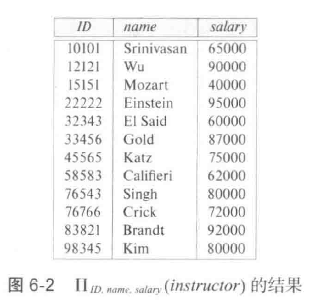

要想实现完整功能的sql,就需要吧选择运算和投影运算结合起来:

$$\Pi_{name}(\sigma_{dept\_name = "Physics"}(instructor))$$

3. 笛卡尔积(Cartesian Product)运算,使用`X`来标识,关系代数中的 $r_1 \times r_2$ 不是将来自动 $r_1$ 和 $r_2$ 的元组生成元组对 $(t_1, t_2)$，而是将 $t_1$ 和 $t_2$ 拼接成单个元组


$$\sigma_{instructor.ID = teaches.ID}(instructor \times teaches)$$

在选择运算中使用笛卡尔积,就可以实现`join...on...`的效果,不会自动去重,所以需要再套一层投影.另一种写法是使用连接运算.

4. 连接(join)运算,请考虑关系 $r(R)$ 和 $s(S)$，并令 $\theta$ 为 $R \cup S$ 模式的属性上的一个谓词。连接（join）运算 $r \bowtie_\theta s$ 定义如下：

$$r \bowtie_\theta s = \sigma_\theta (r \times s)$$

因此，$\sigma_{instructor.ID = teaches.ID} (instructor \times teaches)$ 可以等价地写为 $instructor \bowtie_{instructor.ID = teaches.ID} teaches$。

对于sql中的`union`,`intersect`,`except`三个关键字,同样有对应的三个关系代数,分别用`∪,∩,-`来表示.

如果要存储关系代数的结果,就要使用变量+左箭头的形式:

$$courses\_fall\_2017 \leftarrow \Pi_{course\_id}(\sigma_{semester = "Fall" \wedge year = 2017}(section))$$

$$courses\_spring\_2018 \leftarrow \Pi_{course\_id}(\sigma_{semester = "Spring" \wedge year = 2018}(section))$$

$$courses\_fall\_2017 \cap courses\_spring\_2018$$


## ch7: E-R图

### 实体集与联系集
实体集用方框表示,主键用下划线标明;而联系集用菱形表示,与实体集相互连接:

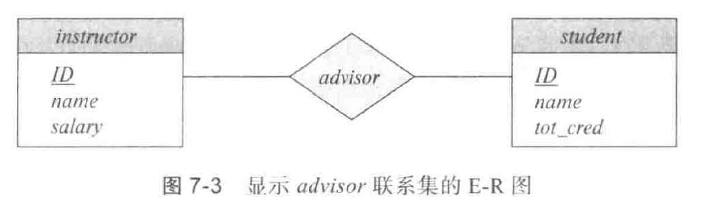

联系集可以有额外的描述性属性,用于标识该联系的结果,如学生(student)选择(takes)某门课(section)的**成绩**就是描述性属性.

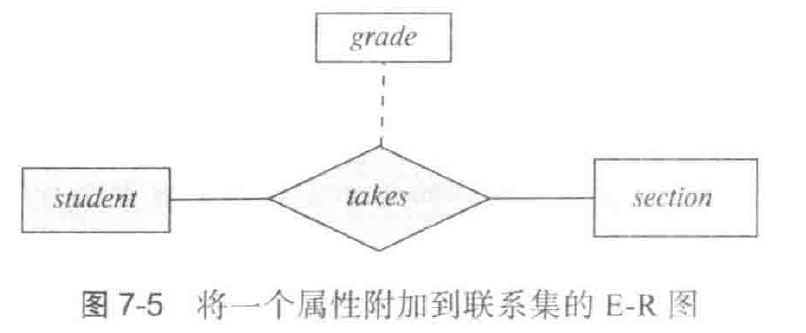
### 映射基数
映射基数标识一个实体能够通过一个联系集关联的另一些实体的数量,有以下四种情况:
1. 一对一: 用两个单向箭头表示
2. 一对多和多对一: "一"方使用单向箭头,"多"方使用普通线段,这表示从"多"方向"一"方过来是"有向的",即只能一一对应,而"一"方向"多"方过来是无向的,即可以选择多个实体.
3. 多对多: 双方都没有限制,用两个普通线段表示.

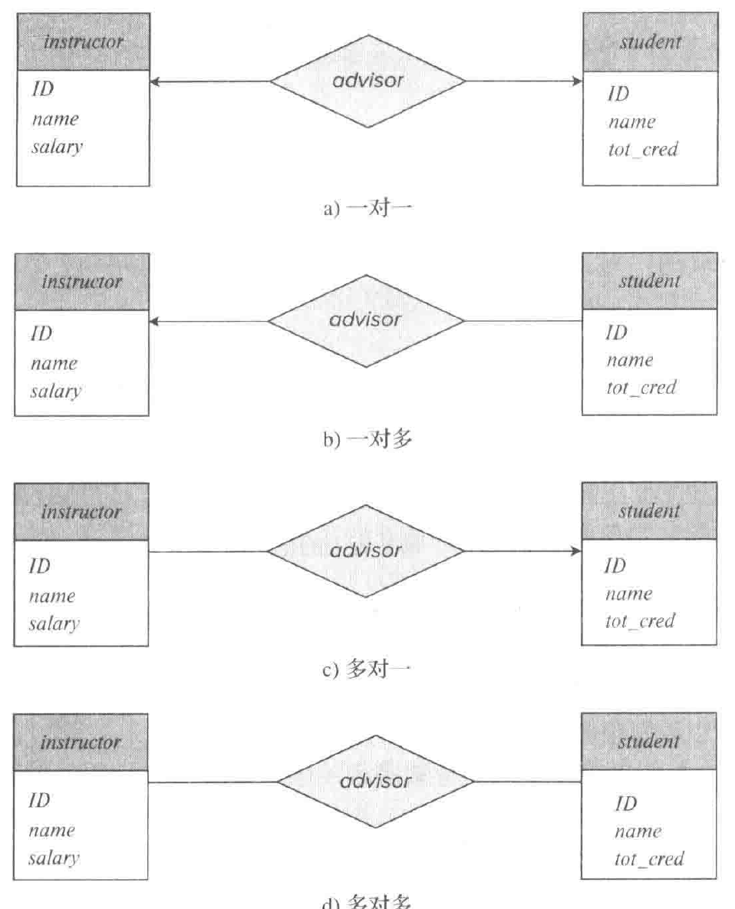

### 强弱实体集
弱实体集的存在依赖于另一个实体集,也就是说,它的主码中有一部分或者全部是外码,我们使用双边框标识弱实体集,其中弱实体集主码中不属于外码的一部分被称为分辨符属性,用虚下划线标识.关联强实体集和弱实体集的联系集用双边框的菱形表示:

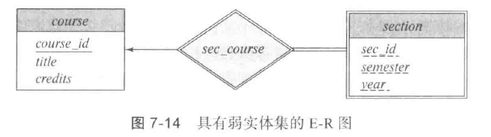

### 例题

#### 画E-R图


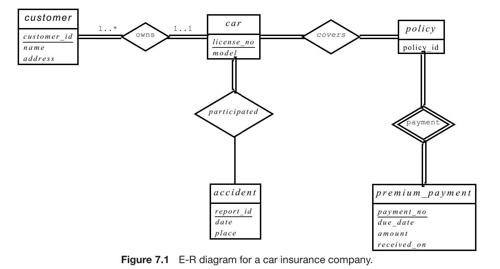

在画图的时候,我有以下疑问:
- 可不可以把`due_date`和`received_on`作为`payment`的描述性属性呢

怎么看都没什么错误,在翻阅其他例题时,我发现教材的设计在于尽可能地减少描述性属性的出现,只有在多对多关系中才会使用,例如同一门课程的学生成绩都不一样;而如果是在一对多或者多对一关系中,由于总有一边是一一对应的关系,所以就可以把描述性属性内置,从而简化设计.

#### 明确弱实体集
如何知道某个实体集是weak的呢?照理来说,所有的实体集都可以加上一个独特的id字段来变成强实体集啊.

答案是,我们并不知道.只要我们实在不需要给实体集加上独立id属性的时候,这个实体集才是弱实体集,所以需要看题目的要求.

而在真正的数据库设计中,一般都会加上独立的id,以应对各种犄角旮旯的查询要求.


## ch8: 范式
>范式(Normal Form)用来测试某个关系的设计是否合理,并对不好的设计进行拆分,而却不能用来建立一个合理的关系,如此看来,是非常鸡肋的.

### 概念
- 函数依赖: 关系表中任意两个或者多个元组之间的关系
- 闭包(closure): 可以从给定的集合F中推导出的所有函数依赖的集合.
- 平凡的(trival): 某个函数依赖可以被所有关系满足,**如果 β ⊆ α,则形如 α → β 的函数依赖是平凡的**.
  - 平凡的函数依赖一定会满足,所以可以直接忽略
- 无损的(lossless): 将一个表拆分成两个表后没有信息丢失.
  - 确保可以在拆分出的表中保留主码即可.
- 多值依赖(multivalued dependency): 是一种特殊的函数依赖,当α的值确定后,β可以有多个取值.

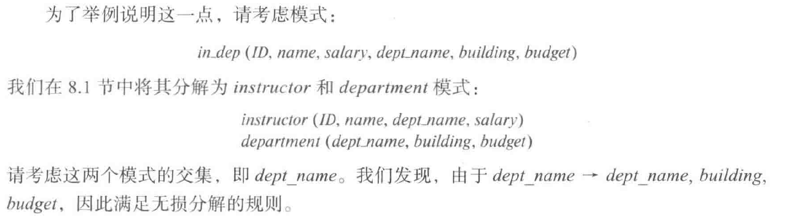

关系设计中有三种key: superkey,candidate key,primary key.

三种key存在一个递进关系,superkey可以唯一标识一个元组,但允许用多余的属性,candidate key一旦删去任何一个属性都不可以唯一标识元组,primary key是从candidate key中选取的最终主键.

### 3种范式
#### Boyce-Codd范式(BCNF)
检查方法如下:
1. 找到平凡的函数依赖并忽略它
2. 非平凡的函数依赖`α → β`中α 需要是该关系表的一个超码(superkey),即包含了或者刚好是该关系表的`candidate key`.

#### 3NF(Third Normal Form)

3NF放松了一点点要求,满足BCNF的一定满足3NF,反过来就不一定.

检查方法如下:
1. 找到平凡的函数依赖并忽略它
2. 非平凡的函数依赖`α → β`中α 需要是该关系表的一个超码(superkey)
3. `β - α`中的每个属性A都被包含于R的一个候选码(candidate key)中,但可以是不同的候选码.

也就是说,只要这个β足够特殊,也可以视为满足3NF.

#### 4NF(Fourth Normal Form)
4NF比BCNF更为严格(是BCNF的子集),要求如下,至少有一个成立:
* $\alpha \twoheadrightarrow \beta$ 是一个平凡的多值依赖。
* $\alpha$ 是 $R$ 的一个超码。

如果将4NF应用于 $(ID, dept\_name, street, city)$，我们发现 $ID \twoheadrightarrow dept\_name$ 是一个非平凡的多值依赖，并且 $ID$ 不是该模式的超码。按照该算法，我们将它替换为两个模式：

$$(ID, dept\_name)$$

$$(ID, street, city)$$


### 分解算法
#### 技巧
只出现在左侧的一定属于候选码,只出现在右侧的一定不属于候选码,如果两边都没出现,说明这个属性单独成立,也属于候选码,两边都出现的就需要仔细观察了

于是,在分解时,我们只需要检查各个函数依赖是否满足对应的范式即可,如果不满足,则拆分出来.

对于BCNF和4NF,上述说法是正确的,但对于3NF来说,有些微的不同,3NF分解算法又被称为3NF合成算法,过程如下:
1. 找出所有的候选码
2. 得到正则的函数依赖集
3. 用正则函数依赖集逐个生成关系,并删去冗余的关系
4. 如果缺失了候选码就补上一个候选码集.


### 例题

#### 无损分解证明

R₁ 和 R₂ 构成 R 的一个无损分解的条件是，以下函数依赖中至少有一个是在 F⁺ 中：

* R₁ ∩ R₂ → R₁
* R₁ ∩ R₂ → R₂

换句话说，如果 R₁ ∩ R₂ 要么构成 R₁ 的超码要么构成 R₂ 的超码，则 R 的该分解就是一个无损分解。

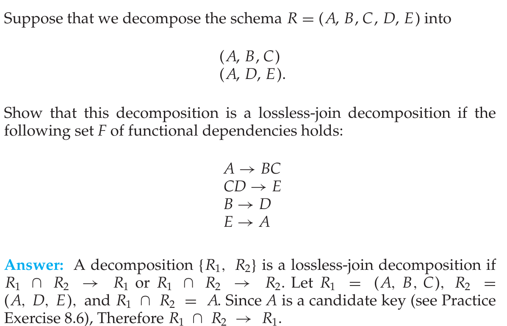

#### 找到候选码
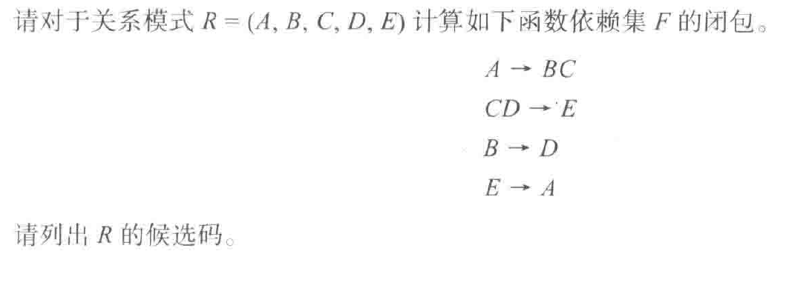

乍一看根本下不了手,因为所有属性都在两边出现了,只好一个个分析了.

不过有一个很重要的点就是,如果`A->BC`,那么就可以得到`A->B`和`A->C`,因为这里的BC是并集的意思,等价于{B,C}.

那么,可以看到,A一个码就可以推出所有的属性,而E能推出A,所以E也是候选码,然后CD能推出E,那么CD也是候选码,BC能推出CD,那么BC也是候选码,很惊讶的是,这就是我们的答案了.


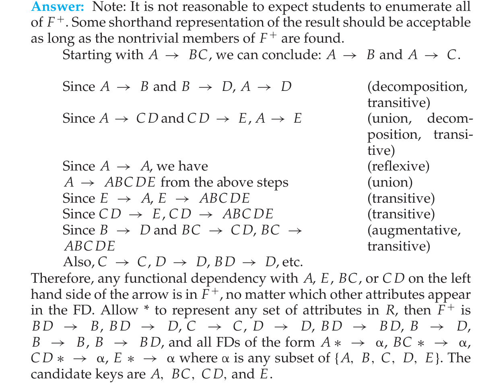
#### 奇形怪状的分解
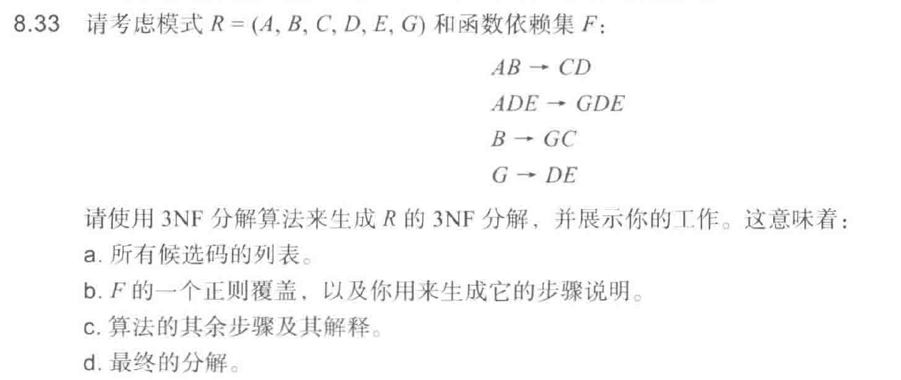

我们很容易就知道AB是候选码(超码),然后就需要对下面三个函数依赖动刀子,然后就傻眼了,这怎么分解,如果对其中一个动刀子,那么就会破坏另外两个函数依赖,显然这是因为这三个函数依赖互相包含才导致的结果.

所以我们需要使用函数依赖的分解,得到互不相关的依赖集,将所有的并集都拆分出来.

那么就有以下函数依赖:
$AB \to C, AB \to D, ADE \to G, ADE \to D, ADE \to E, B \to G, B \to C, G \to D, G \to E$

去掉冗余的函数依赖,得到:

$$\begin{aligned}
ADE &\to G \\
B &\to G \\
B &\to C \\
G &\to D \\
G &\to E
\end{aligned}$$


需要注意的是,因为已有`B→G`和`G→D`,所以`B→D`成立，因此`AB→D`也是冗余的，可以删除。

合并有:

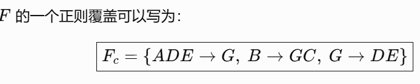

分解后得到:
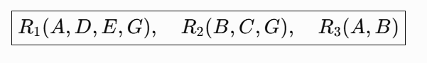

之所以会有R3,是因为3NF 分解算法有一个固定步骤：

>如果分解后的所有关系模式中，没有任何一个包含原关系 R 的候选码，那么必须额外加入一个包含候选码的关系模式。

#### 更变态的分解
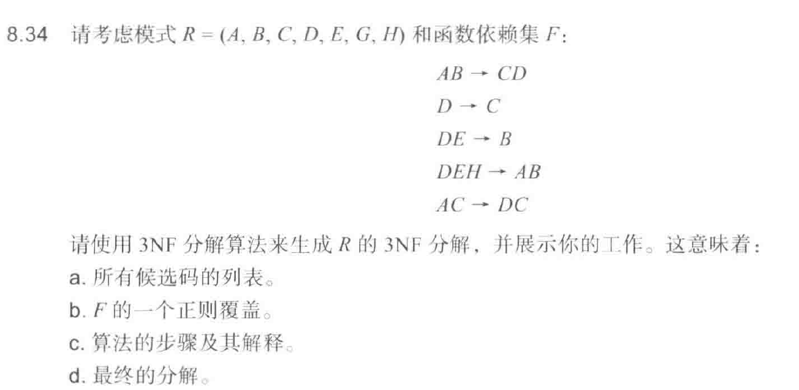

分解依赖后得到以下函数依赖:

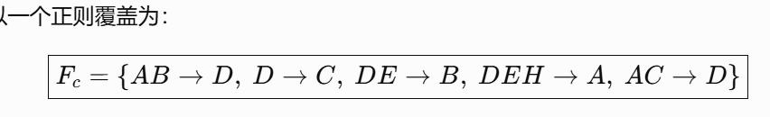

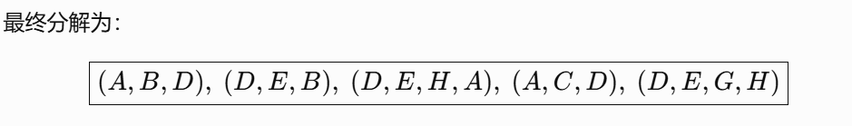


## ch11: 索引和B+树
### 补充: B-树
B-树分为内部节点和外部节点(叶节点): 本身是一个二叉搜索树,所有叶节点在同一层,m阶B树中的所有节点最多有m个分支,也就是`m-1`个元素.

对于根节点: 最少有2个分支,一个元素,其他的内部节点和叶节点最少有(m/2)个分支,也就是(m/2)-1个元素,向上取整.

### B+树
由于B-树遍历所有元素的效率很低,需要来回在子树之间穿梭.所以B+树诞生了,用于方便遍历所有的元素.

B+树的改进地方有以下几点(m阶):
1. 内部节点的要求不变,最多有m个指针,即(m-1)个搜索码,最少有(m/2)个指针,即(m/2)-1个搜索码,例如5阶B+树的内部节点最多有4个搜索码,最少有2个搜索码
2. 而叶节点不同,最多有(m-1)个值,最少有(m-1)/2个值,例如5阶B+树的叶节点最多有4个值,最少有2个值
3. 根节点仍然是最少可以有2个指针,即1个节点.

>如果仔细思考的话,就是奇数阶中内部节点和叶子节点的容纳范围相同,偶数阶中叶子节点的最少容纳量要多1个.


### B+树的插入与删除


## archive
以前又臭又长的笔记都删掉了,但索引部分还是留着吧.
### ch11: 索引
有两种基本的索引类型: 顺序索引(ordered index)和散列索引(hash index).

其中,用于在文件中查找某项记录的属性或者属性集被称为**搜索码(search key)**
#### 顺序索引
顺序索引按照一定的顺序存储搜索码的映射表,分为两种结构:
1. 聚集索引(clustering index): 也被称为主索引(primary index),搜索码的顺序与记录的排列顺序相同
2. 非聚集索引(nonclustering index): 也被称为辅助索引,搜索码的顺序与记录的排列顺序不同

按照记录搜索码是否稠密可以将顺序索引分成两类:
- 稠密索引(dense index): 每个搜索码值对应一个索引项,相同搜索码值的其他记录会以链表的形式存储在第一条记录之后
- 稀疏索引(sparse index):只存储少量的搜索码,需要沿着搜索码项向两边寻找找到对应的记录,这需要搜索码的顺序和记录顺序相同,也就是聚集索引.


#### B+树索引
B+树是对B树的改进,变成了一个多级索引结构,每一层都存储了下一层所需的索引,用于快速定位索要查找的搜索码.

B+树分为叶节点和内部节点,叶节点存储所需的所有搜索码值,内部节点则用于索引.

对于n阶B+树来说,叶节点最多可有n-1个值,最少要有`(n-1)/2`个值(向上取整),例如4阶B+树的叶节点最多有3个值,最少有2个值.

内部节点用于容纳指向下一层节点的指针,最多有n个指针,最少有`(n/2)`个指针(向上取整),一个节点中的指针数被称为fanout.

- 有n个指针表示该节点有n-1个关键字

根节点包含的指针数可以少于(n/2),但除非整棵树只有一个节点,否则根节点至少要有两个指针.

##### 补充: 第三方讲解的插入与删除
- [知乎文章](https://zhuanlan.zhihu.com/p/149287061)

B+树的查找方式与B树基本类似,不同的是每次查找必须辗转跳到最后一层叶节点,因为内部节点存放的都是指针,但遍历方法还是一样的.

但对于插入与删除来说,实际的做法是不太一样的,这本书讲的太烂了,具体可以看上面那篇知乎文章.

需要注意的是,文中关于插入和删除的说法都过于简单,比如这里:


最后上移的节点既可以是91,但也可以是95,具体是看算法怎么写的,而不是一定选择左边的最后一个元素

- 再说,应该是先插入95后再分裂,不然很容易搞混的.
- 不过就算这样,还是比这本书讲的要好.


总体来说,只要牢记,内部节点最多有n个指针,最少有n/2个指针,叶节点最多有n-1个索引,最少有(n-1)/2个索引.如果性质没有被破坏,就无需动脑直接插入/删除即可,如果性质被破坏了,就递归处理.
##### 插入
- 后来看了看,不同教科书对B+树的处理是不一样的,还是得来乖乖看书

每次拆分时,用右子树的**最小搜索码**更新父节点的索引,如果使用其他的搜索码,就无从谈起"索引"了.

拿这张图举例:


在该n=4的树中插入具有搜索码 “Lamport” 时,第一次是插入叶节点的"Kim"后面,由于超过限制,所以要进行拆分,将Kim提升到父节点中Gold的前面,这次又超过了限制,再次进行拆分,将Gold提升到了根节点Mozart的前面,最后的结果如下:


总体来说就是,**叶节点的提升需要保留原来的节点,这是B+树独有的性质,而内部节点的提升与B树一样,都需要删除原节点**.
##### 删除
对于删除来说,有时候需要进行合并操作,从而确保每个内部节点是半满的.

还是拿这张图举例,这次Srinivasan是要被删除的项:


先从叶节点开始着手,删除后由于不满足叶节点的限制,而他的兄弟又刚好只有两个节点,所以只能执行合并操作,合并之后,父节点随之更新搜索码为Mozart,由于内部节点最少需要2个指针,不满足限制条件,所以需要与兄弟节点合并,合并之后超过了限制,所以将Gold提升上去即可.


如果要继续删除Singh和Wu,第一次不会有任何影响,直接删除即可,第二次删除Wu导致叶节点只有一个搜索码,所以再次进行合并,由于超出限制,需要进行拆分,并用Kim这个右子树的最小搜索码更新父节点的搜索码.


如果还要在上述基础上删除Gold,这次需要再一次合并,并更新Kim为Katz,由于父节点只有一个指针,超出了限制,只能与兄弟节点合并,但这次又违反了**根节点必须要有两个指针的情况**,刚好可以把它删除.

但书上并没有把Gold更新为Katz,而是保留了原码:

- 要我说,这就是在扯淡,删除的时候明明可以顺带更新的

拿这个题目为例:


标准答案也并没有保留Perryridge,而是保留了Mianus.


# 操作系统课程设计笔记
## 前言
操作系统课程设计这门课有以下选题:
a. 完成《Orange's:一个操作系统的实现》项目要求

b. 完成 xv6 相关要求，要求详见《xv6 及 Labs 课程项目》文档说明：相关文档见课程群文件共享目录 “OS 小学期课程设计”

c. 蒋炎岩老师课程（[http://jyywiki.cn/OS/2026](http://jyywiki.cn/OS/2026)）配套的实验（包括系统实验+编程实验）

d. 完成对 Minix 操作系统的学习，详见 [http://www.minix3.org/](http://www.minix3.org/)

e. Linux 内核分析（版本号要求 2.0 以上）

f. 自选（需和老师确认选题）

由于我非常怕麻烦,所以就只锁定了d和e两个选题,由于从来没有听过minix这个东西,就先下载了minix3.3.0版本的代码,看了下代码量:

```bash
---------------------------------------------------------------------------------------
Language                             files          blank        comment           code
---------------------------------------------------------------------------------------
C++                                   8814         249768         336958        1389982
C                                     7887         244437         460398        1383144
C/C++ Header                          5153         173451         306565         608482
LLVM IR                               7436          80241         138815         364744
Assembly                              1840          29324         112588         242373
Bourne Shell                           499          21483          27468         167584
TableGen                               263          19768          25094         121916
Text                                   446          12574              0          58015
reStructuredText                       136          18436          13834          42693
Objective-C                           1121          11805          56441          41555
make                                  2157          10942           9183          40481
m4                                      99           3420           1253          32355
HTML                                    49           5479            362          32096
diff                                    18           2052          13010          22200
Python                                 137           4210           5295          16198
Objective-C++                          299           3328          21787          11467
PO File                                 16           2945           3635           9611
yacc                                    33           1584           1174           9143
BitBake                                348           1394            851           9091
Windows Module Definition               41           1061              9           7836
CMake                                  277           1298            968           7458
MSBuild script                          13              1              7           6162
XML                                     61            721            207           6083
Perl                                    29           1326           1280           5667
TeX                                      1            731           2941           5619
OCaml                                   68           1718           2918           5250
lex                                     84           1371           1801           4777
Pascal                                  18           1031           3956           2468
CSS                                     19            243            142           2074
Ada                                     10            599            560           1681
Gencat NLS                              14              5           1587           1620
SQL                                      7            295            613           1569
PHP                                     20            265            470           1498
GLSL                                     1              0              0           1368
awk                                     30            138            381           1121
Snakemake                                2            603           2417           1100
C#                                      14            247            571           1080
JavaScript                               7            159            211            817
OpenCL                                  62            280            299            764
XSLT                                     4             89             56            754
Bourne Again Shell                       9            129            157            685
DOS Batch                               10             93              6            638
Korn Shell                               3             90            135            595
Expect                                  13             58              0            575
Logos                                    2             38             14            528
Lua                                     21            101             92            507
Lisp                                     6             82            205            442
SWIG                                     1              0              0            347
YAML                                    15             55            157            292
Visual Studio Solution                   4              2              2            259
sed                                      7              7             88            259
Tcl/Tk                                   4             22             14            234
C Shell                                  3             40             21            233
Windows Message File                     2             23             46            224
Windows Resource File                    9             15             38            188
Clojure                                  2             42              0            174
R                                       29              2              0            162
CUDA                                    11             63             57            120
vim script                               2             23             21            119
JSON                                     5              6              0            117
Pawn                                     1             20              3             65
Igor Pro                                19              1              0             52
Brainfuck                                1              0              7             49
C# Designer                              1              9             23             32
SAS                                      1             14             19             32
NAnt script                              1              7              0             26
DTD                                      1              8             33             20
IDL                                      1              0              0             20
AppleScript                              1              3              8             16
Markdown                                 1              1              0             16
INI                                      1              1              0              6
Fortran 90                               1              0            244              0
---------------------------------------------------------------------------------------
SUM:                                 37721         909777        1557495        4676928
---------------------------------------------------------------------------------------
```

比起Linux肯定是要简单不少的,所以就直接开始学吧.

不过说是分析,其实需要仿照着结构搭建几个功能相近的模块出来,可不是写个实验报告这么简单的事.


显然,这个要求非常的随意,说明老师也非常的佛系,不过也不能随便应付了事,学点真东西为好.

## 概览
### 试运行MINIX
首先从官网下载打包好的镜像,并用Virtualbox(Oracle的开源虚拟机)试着运行一下,看看效果.

AI推荐的配置是这样的:
```md
名称：MINIX3
类型：Other
版本：Other/Unknown
内存：512 MB 或 1024 MB
硬盘：VDI，动态分配，2 GB 到 8 GB 都可以
```

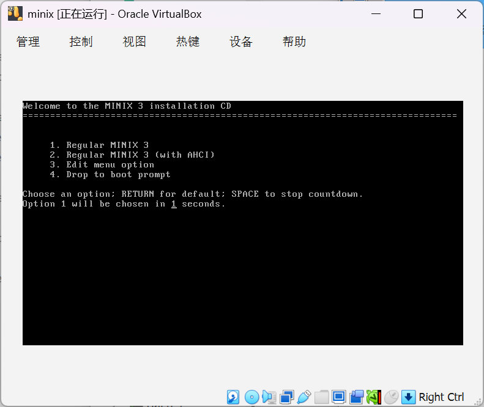


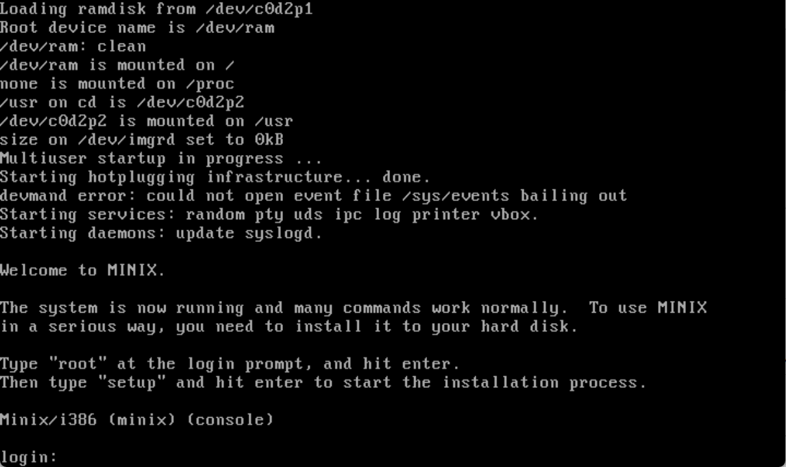

在输入`root`和`setup`后,就会进入漫长的操作系统安装环节,还是很有意思的.

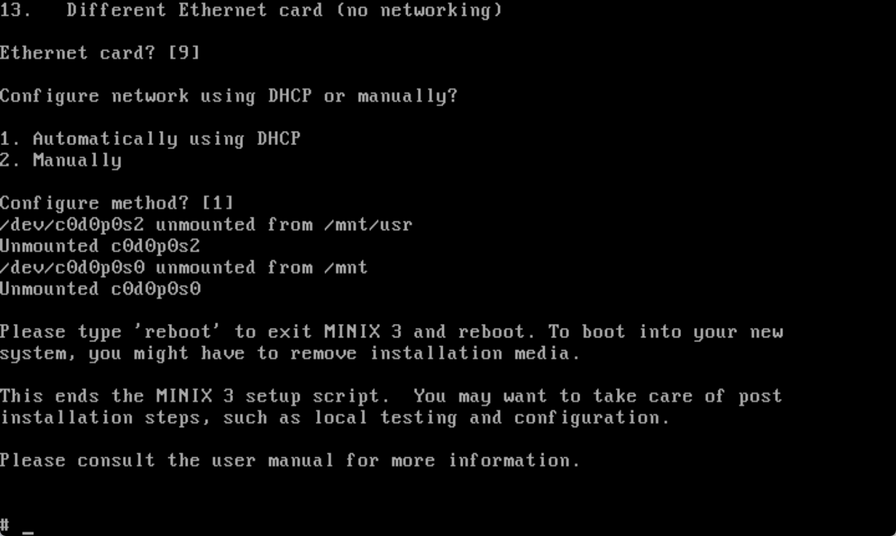

MINIX没有图形界面,只有终端,不少命令和Linux是通用的,所以用起来还是很清爽的.

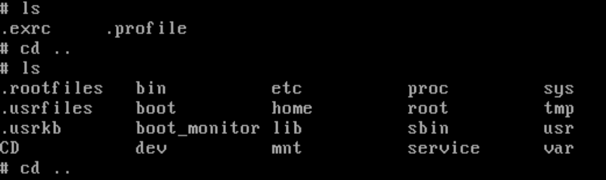

不过遗憾的是,MINIX不支持鼠标操作,所以无法应付长文本的显示:


### 学习MINIX
非常离谱的是,官方的代码仓库甚至没有一个ReadMe文件,而上官网查询后,有以下说明:

>The **main documentation** for MINIX 3 is the book Operating Systems: Design and Implementation 3/e by **Andrew S. Tanenbaum** and Albert S. Woodhull, Prentice Hall, 2006. 

- 谁能想到在这里也能看到这位大牛.

不过说实话这有点搞笑,号称开源,却不公开文档,而是把文档放在商业出版的书里面.没有办法,只好老老实实去看书了.(由于与这篇文章的主线无关,所以我直接放入阅读笔记中,之后再回来做一个总结.)

**(7.5)**
我以为这本书会涉及很多内容,但后来发现它只深入讲了minix子文件夹中的几个子模块:
1. kernel: 核心代码,用于进程调度
2. drivers: 驱动程序
3. servers: 进程管理和文件系统

然后这本书对于这些子模块的讲解是相当繁琐的,试图一下子塞给你一大堆概念,并在源代码的讲解上相当随意.

没有法子,只好硬着头皮先看源码了,再拿这本书当参考书,因为整个MINIX仓库没有一个真正意义上的Readme文件,我非常好奇他们内部是怎么开发的,难不成通过托梦来告诉新人怎么看源码吗.


