# 计算机系统结构
## outline
- 计算机系统结构教程(第三版)

考试范围为1-12章,其中以下部分不考:
1. ch1和ch2的套话部分
2. ch3的MIPS的流水线实现图
3. ch4全部
4. ch5的第五节: 多指令流出技术
5. ch6全部
6. ch7的第七,八节: 虚拟存储器以及LRU的硬件实现
7. ch8的第四节: 总线
8. ch9全部
9. ch10的大部分,只有第二,三节要考
10. ch11全部
11. ch12的第四节实例

总的来说就是,具体实现全部不考,只单纯考理论,实际内容还是很少的.不过还是对着ppt来看好一点.

- 非常佩服这种教材,能够在与实战完全脱节的情况下把一个简单的事情讲的特别复杂,让学生学完了也不知道这门课有什么用.如果不是因为我提前学完了那两本经典教材,对这本书还真的是无从下手了.

## ch1: 基础知识
1. Amdhal定律计算加速比
2. CPU时间: 执行程序所需要的时钟周期数x时钟周期时间
3. CPI(cycles per instruction): 每条指令执行所需的平均时钟周期数
## ch2: 指令系统的设计(过)
考不了一点内容
## ch3: 流水线技术
### 计算题
-  吞吐率(Through Put,TP): 单位时间内流水线完成的任务数量

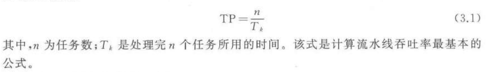

- 加速比(Speedup): 使用顺序处理的方式和使用流水线处理方式处理同一批任务所用的时间之比.

设顺序执行所用的时间为 $T_s$，按流水线方式处理所用的时间为 $T_k$，则流水线的加速比为:

$$S = \frac{T_s}{T_k}$$

- 效率(Efficiency): 流水线中设备的利用率,即所有设备的实际使用时间和整个运行时间的比值.

### 流水线实现
经典的MIPS5段流水线如下:
1. IF: 取指令周期
2. ID: 指令译码
3. EX: 执行计算
4. MEM: 访问存储器
5. WB: 写回

如果是分支指令和store指令,只要前四段就足够了,其余的指令如load,ALU运算等都需要5段.
## ch5: 指令级并行及其开发
### 指令动态调度
### 动态分支预测技术
## ch7: 存储系统
### 计算题

### cache原理
### cache优化
## ch8: 输入输出系统
### RAID(待补充)
- 真背不了这么多
### 通道处理机(待补充)

## ch10: 多处理机
- 怎么看都应该叫多处理器...
### Cache一致性
如果使用共享存储器,就需要解决cache一致性的问题,这本书认为,如果一个存储器满足以下三点则实现了一致性:
1. 处理器P在对存储单元X进行写操作后再读取,没有其他处理器在中途写入了存储单元X
2. P在写入X后,处理器Q读取了X,没有其他处理器在中途写入了X
3. 串行化写入: 任意两个处理器的写入顺序是固定的,不会随意打乱顺序,也就是说,P和Q先后写入X,那么其他处理器会先读到P的写入数据,再读到Q的写入数据.

有两种协议可以实现Cache一致性:
1. 目录式(directory): 共享数据的标签被保存在目录之中
2. 监听式(snooping): 所有Cache通过总线来监听共享数据的状态变化

监听式协议有两种实现方式:
1. 写更新协议(Write Update): 一个CPU写入新数据时就广播给所有CPU的cache
2. 写作废协议(Write Invalidate): CPU写入某个数据时,把其他cache中关于该数据的副本全部作废.
   1. 写作废协议的应用更为广泛,因为它需要的操作更少

目录式协议采用位图索引的方式来记录哪些cache中有该共享数据的副本,有三种格式:
1. 全映像目录(full-mapped): 每个目录项都包含对所有CPU的映射

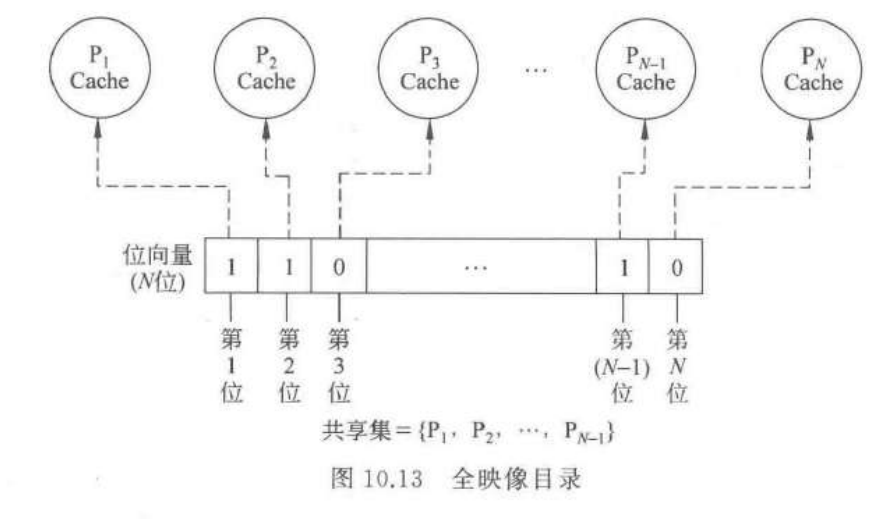

2. 有限映像目录(limited-mapped): 存储针对部分CPU的映射,若副本个数超过上限,则可以使用类似Cache的LRU替换策略
3. 链式目录(chained): 使用链表来存储共享的数据项
## ch12: 机群系统
没有任何内容,美美结束.
## 经典习题

# 算法设计与分析
## outline
>尽管用的是算法导论那本教材,但我不打算移过来,因为这门课的教学简直是在侮辱这本书.

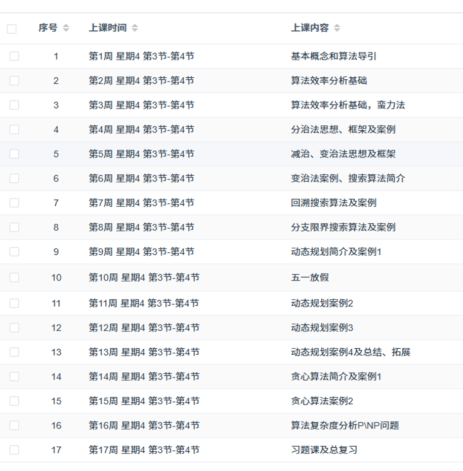
大致来说,涉及了以下知识点:
1. 算法效率分析
2. 主方法计算
3. 分治法与减治法
4. 回溯法与分支限界法
5. 动态规划
6. 贪心

非常好奇这么点知识点是怎么能掰扯上一整个学期的,根据学长笔记来看的话,ppt中涉及的经典算法如下:
- 分治: 大整数乘法,Strassen算法,二分搜索,归并排序与快速排序,棋盘覆盖
- 减治: 拓扑排序,假币问题,俄罗斯农民乘法,欧几里得算法
- 变治法: 预排序,高斯消元,堆排序,霍纳法则
- 回溯与分治限界法: 暴力搜索,旅行商问题,0-1背包,N皇后问题
- 动态规划: 计算二项式系数,最长公共子序列（LCS）、动态矩阵乘法、0-1背包问题、多阶段决策过程、Warshall传递闭包算法、Floyd算法
- 贪心：找零问题、背包问题、单源最短路径Dijkstra算法、最小生成树Kruskal算法

根据作业来看,确实是需要把这些知识点全部过一遍的,不过好在都不是很难的题目,大部分都属于leetcode中等题,只有一两个leetcode困难题.

# 计算机网络
## outline
- 计算机网络: 自底向上方法(第五版)
  - 我发现这本书比自顶向下方法更适合这门课,后来发现这确实是这门课的参考教科书

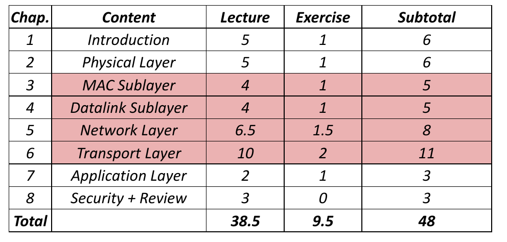

按照大纲来的话,传输层和网络层都是重点了,链路层则是稍微次要的.

- 仔细看下来的话,内容确实很简单,教科书和ppt过一遍就结束了.
## ppt阅读
后来发现ppt做的还是挺用心的,可以说是我见过做的最用心的教学ppt了.所以就还是看看吧,顺便刷点习题
### ch1
#### Circuit Switching and Packet Switching
- Circuit Switching: 数据通过线路传播,不进行拆分.
- Packet Switching: 数据拆分成packet,通过多级跳转传播.
### ch2

#### 香农定律和时延计算
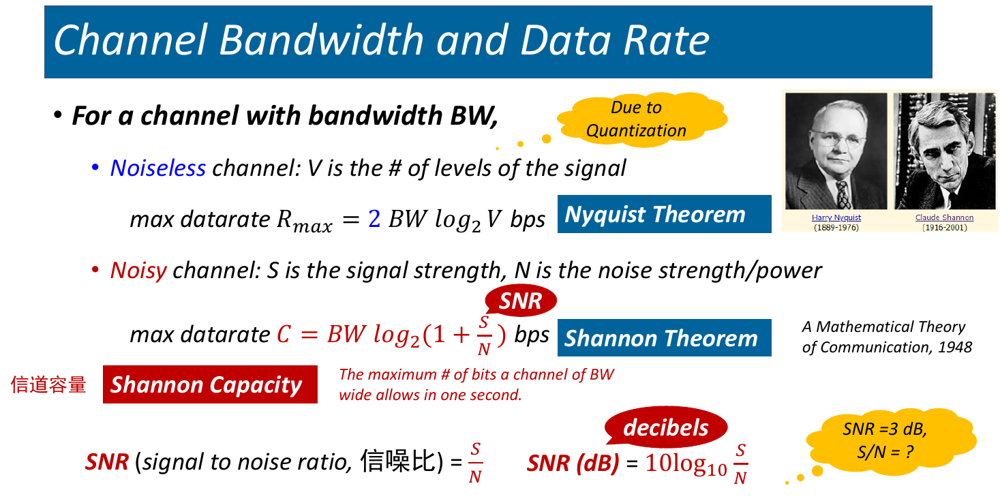
- 香农定律中的信噪比用的是普通的单位,而不是分贝,所以需要看题目是怎么说的


## 概览
- 第5节的互联网历史讲的不错.

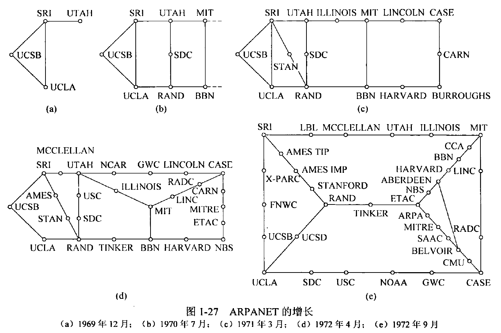

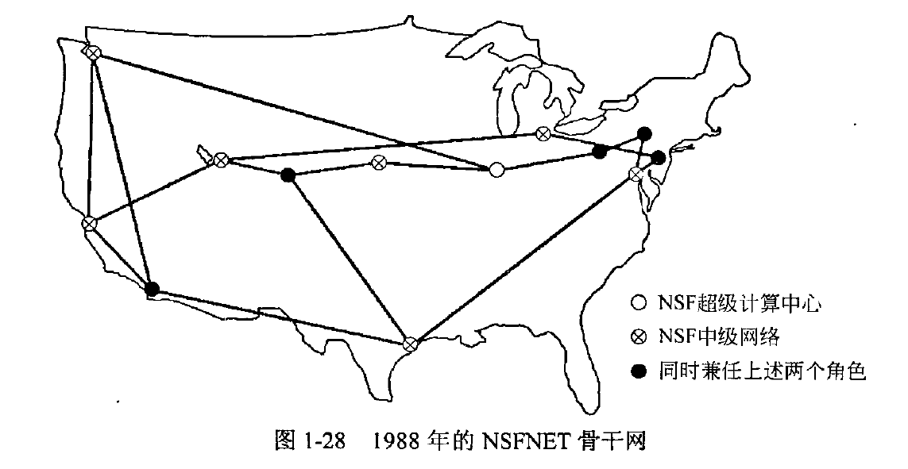
## 物理层
### 前置概念
所有的传输设施在传输过程中都要损失一些能量,对于导线而言,在0到某个频率f的范围内,信号的振幅在传输过程中不会衰减,而在此之上的所有频率的信号振幅都会有不同程度的减弱,这个安全区间就被称为**带宽(bandwidth)**,实际工程中采用使得接受能量刚好保留一半的频率位置.

1924年,Nyquist证明,如果一个信号通过了一个带宽为B的滤波器(可以理解为导线的抽象表述),那么只要经过每秒2B次的采样,就可以完全重构出被过滤的信号.

Shannon在Nyquist的基础上得出以下结论,对于一条带宽为B Hz,噪声比为S/N的有噪声信道,最大传输速率C为:

$$C = B \log_2 (1 + S/N)$$

因此,要像优化网络的传输速度,我们要么增加带宽,要么增加信噪比,换句话说,使用更好的线路.
### 传输介质
1. 双绞线: 由多对相互缠绕的铜线组成,传输速率低
2. 光纤: 由三个部件组成,光源,传输介质,探测器,传输速率至今都没有达到极限,理论上如果使用真空传输就可以达到真空中的光速
   1. 光源负责产生光脉冲,根据有无光脉冲表示比特1和0.
   2. 传输介质一般是超薄的玻璃纤维,通过调整光的入射角度可以确保只发生发射而不会发生透射,从而保证信号不会有任何丢失
   3. 探测器负责接收光信号,产生电脉冲传输给计算机
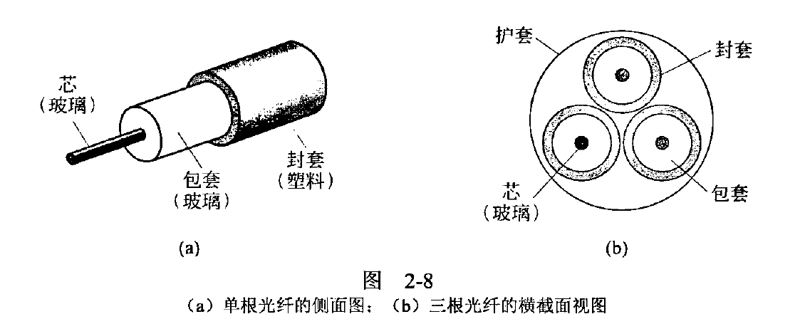

3. 无线传输: 根据公式 λf=c,频率与波长成反比,例如100MHz的波长大约为3米:

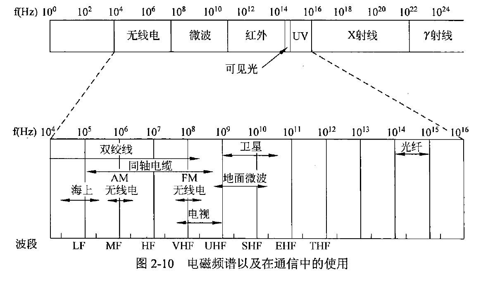

根据示意图可以看出来,有相当大部分的空白频段没有被使用,我们可以使用**扩频**的方式来将低频信号扩展到高频,尽管由于低频信号的限制,能够表达的信息量并没有变化,但却可以带来很多好处.

常用的扩频方式有三种:
1. 跳频扩频: 将信号以每秒几百次的速率从一个频率跳到另一个频率,早期用于军事领域的通信,后来被用在了**蓝牙和旧版的802.11**中
2. 码分多址(CDMA,Code Division Multiple Access): 将数据信号展开到一个更宽的频段,使得多个信号能够共享同一频段,**是移动信号的基础**
3. 超宽带通信(UWB,Ultra-WideBand): 发送一系列不断快速变化位置的脉冲,占用的带宽很多,实现高速传播.

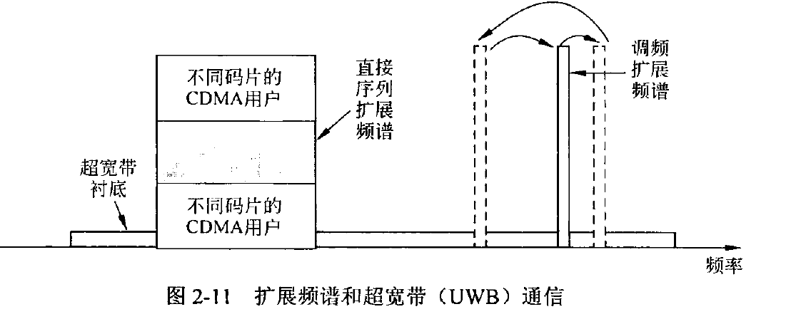
#### 无线传输详解
### 数字调制
- 多路复用(multiplexing): 多个信号共享同一个信道.
- 通带传输(passband transmission): 不从零开始发送信号,而是把信号放置在给定的频段输出,因为低频信号的波长大,需要相当大的天线来发送.

#### 调制方法
我们可以修改原本简单的0,1信号,让它能够承载更多的信息或者增强抗干扰性,这被称为**调制**.

- ASK: Amplitude Shift Keying,通过两个不同的振幅分别标识0和1,也可以使用更多的振幅级别来标识不同信号
- FSK: Frequency Shift Keying,通过两个或者多个频率来标识0和1.
- BPSK: Binary Phase Shift Keying,0和1对应的波形相差180度
- QPSK: Quadrature Phase Shift Keying,使用4种波形来传输信号,比如使用45度,135度,225度,315度,这样一个波形就可以对应两个二进制数字,传递更多信息

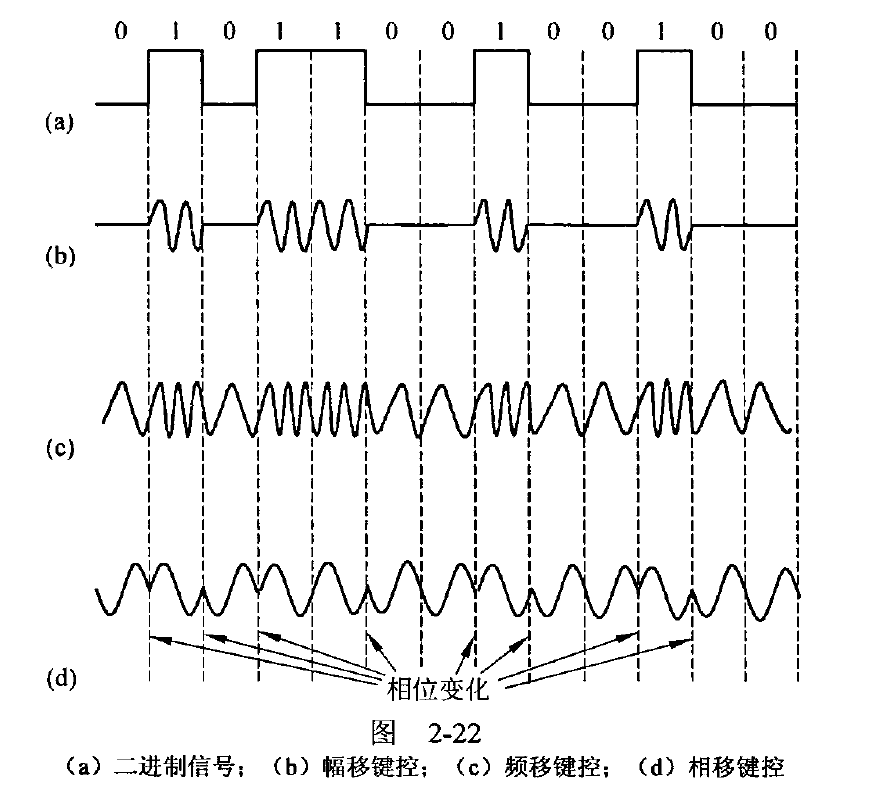

如果想要用一个相位传递更多的信息,那么就可以使用正交调幅(Quadrature Amplitude Modulation,QAM),常见的有QAM-16和QAM-64,分别可以一次传递4个比特和6个比特,用星座图(constellation diagram)来表示是这样的:

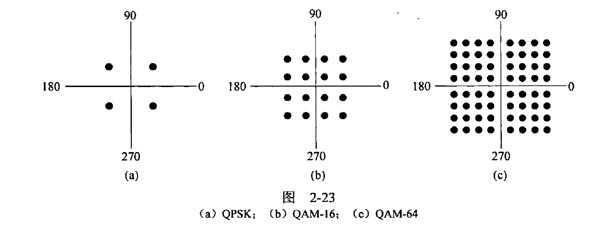
#### 复用方法
复用(multiplexing)是为了让多个信号共享带宽,同时避免不同的信号之间相互影响.有三种常见的复用方法:

1. 频分复用(Frequency Division Multiplexing,FDM): 将一个频谱分成多个频段,用户之间有着足够大的频率间隔(保护带),不会互相干扰

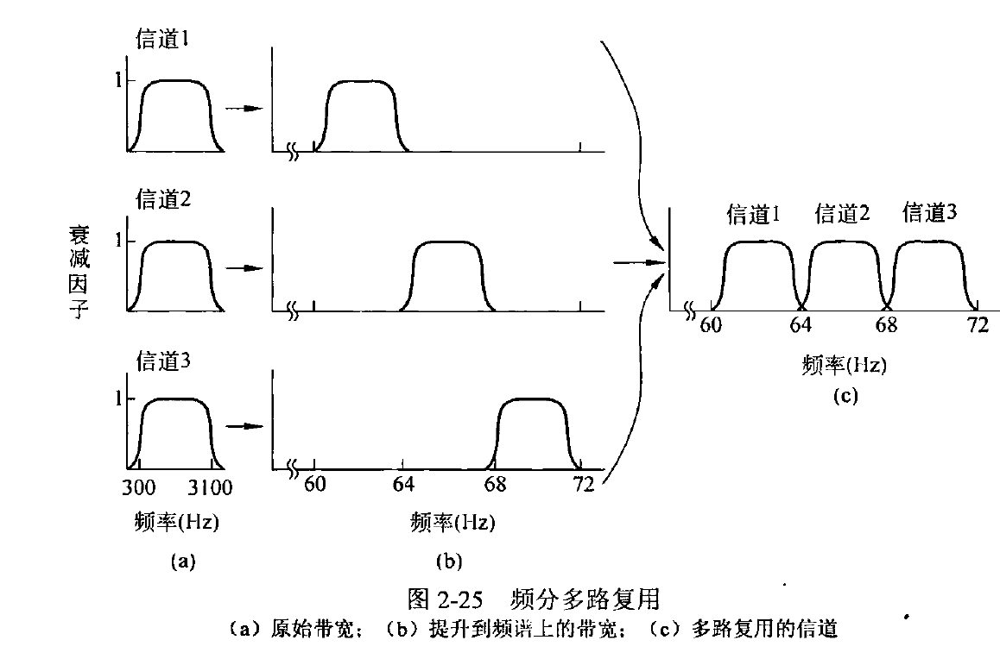

正交频分复用(Orthogonal Frequency Division Multiplexing,OFDM)是FDM的改进版,多个频段之间可以相互交叉,这是通过傅里叶变换实现的,从而大大提高了带宽的利用率.该方法被用于802.11和4G/5G中.

2. 时分复用(Time Division Multiplexing,TDM): 用户循环占用信道,发送一小段消息后就退出,这与操作系统的进程调度非常类似.

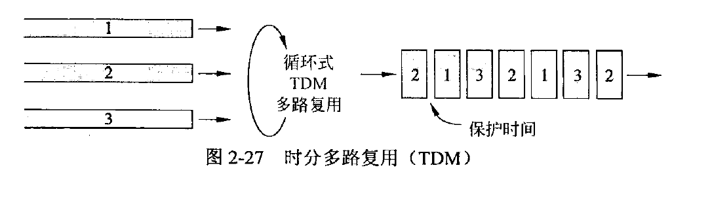

3. 码分复用(Code Division Multiplexing,CDM): 将一个窄带信号扩展到一个很宽的频段,主要用于让不同用户的多个信号共享相同的频段,因此又被称为CDMA(Code Division Multiple Access).

CDMA允许每个用户同时用整个频段发送信号,这需要我们能够从杂乱的频段中过滤所有的无关信号得到所需的信号,具体原理如下:
1. CDMA中,每个比特传输时间被再分成m个更短的时间间隔,这被称为码片(chip),通常一个比特被分成64或者128个码片.
2. 每个用户分得唯一的m位码(原文没说,但我觉得可以叫做**识别码**),若要发送比特1,就发送自己的识别码,若要发送比特0,就发送识别码的反码

- 对于 m=8，如果站 A 分配得到的码片序列是 (-1 -1 -1 +1 +1 -1 +1 +1)，那么它发送该序列就表示发出的是比特 1，而发送 (+1 +1 +1 -1 -1 +1 -1 -1) 则表示发出的是比特 0。

按照这种编码方式,本来每秒发送b个比特,现在变成每秒要发送mb个码片了.

为了能够分辨出不同信号各自的识别码,我们需要使用Walsh码来精心配制,得到彼此正交的识别码,那么就可以简单的将信号频段乘以所需的信号识别码,就可以得到解码的信号.


>3G的复用方法使用的就是CDMA,但由于其本身的复杂度,所以不再被4G/5G采用.
## 数据链路层
### 概览
链路层的功能如下:
1. 向网络层提供一个服务接口
2. 处理传输错误
3. 调节数据发送的速率

链路层的服务接口有三种:
1. 无确认的无连接服务: 不提供任何保障,例如以太网
2. 有确认的无连接服务: 确认数据帧有没有正确的收到,如果没有则重传,例如802.11
3. 有确认的有连接服务: 适用于长距离且不可靠的链路,例如卫星通话

收到物理层传来的比特流后,链路层将其拆分成多个离散的帧,并为每个帧计算一个校验和,有四种拆分方法:
1. 字节计数法: 利用头部中的一个字段来表示该帧中的字符数,如果出现了传输错误,比如头部字段中的5变成了7,那么接收方就再也找不到正确的包读取顺序了,所以不会采用这种方案
2. 标志字节法: 用两个带有特殊标记的flag字段来标识一个帧的开始和结束,接收方在接收后删除flag字段再传递给网络层即可,这被称为**字节填充**(byte stuffing).
3. 标志比特法: 每个帧使用特殊的`01111110`来标记开始和结束
4. 靠物理层提供的冗余编码来标识每一帧的开始和结束

#### 差错控制概览
对于有确认的服务来说,如果帧丢失了,那么接收方并不会传来任何否定或者肯定的信号,唯一的方法是引入计时器,当接收方超时前都没能传回确认帧时,就执行重传
### 差错控制

# 操作系统
## outline
- 操作系统概念(第九版)

基本对应1-13章,看完后再翻翻ppt即可,实际来说,这本书写的确实非常烂,但也没办法,就当是复习吧.

- 这本书无论是在深度还是广度上都远远比不过操作系统导论,怎么腆着脸出到第九版的

## ch1: 导论(过)
## ch2: 操作系统结构(过)
## ch3: 进程
### 生产者-消费者问题
>生产者进程生成信息,供消费者进程消费,这需要合理的安排共享内存区域和设置死锁来实现.
## ch4,ch5(过)
## ch6: 同步(待补充)
## ch7: 死锁
### 银行家算法
- [wiki](https://zh.wikipedia.org/wiki/%E9%93%B6%E8%A1%8C%E5%AE%B6%E7%AE%97%E6%B3%95)

>在银行中，客户申请贷款的数量是有限的，每个客户在第一次申请贷款时要声明完成该项目所需的最大资金量，在满足所有贷款要求时，客户应及时归还。银行家在客户申请的贷款数量不超过自己拥有的最大值时，都应尽量满足客户的需要。在这样的描述中，银行家就好比操作系统，资金就是资源，客户就相当于要申请资源的进程。

为了实现银行家算法，需要有几个数据结构。这些数据结构对资源分配系统的状态进行了记录。我们需要以下数据结构，这里 $n$ 为系统进程的数量，$m$ 为资源类型的种类：

* **Available**：长度为 $m$ 的向量，表示每种资源的可用实例数量。如果 $\text{Available}[j] = k$，那么资源类型 $R_j$ 有 $k$ 个可用实例。
  * 指的是当前剩余可用的资源
* **Max**：$n \times m$ 矩阵，定义每个进程的最大需求。如果 $\text{Max}[i][j] = k$，那么进程 $P_i$ 最多可申请资源类型 $R_j$ 的 $k$ 个实例。
* **Allocation**：$n \times m$ 矩阵，定义每个进程现在分配的每种资源类型的实例数量。如果 $\text{Allocation}[i][j] = k$，那么进程 $P_i$ 现在已分配了资源类型 $R_j$ 的 $k$ 个实例。
* **Need**：$n \times m$ 矩阵，表示每个进程还需要的剩余资源。如果 $\text{Need}[i][j] = k$，那么进程 $P_i$ 还可能申请 $k$ 个资源类型 $R_j$ 的实例。注意 $\text{Need}[i][j] = \text{Max}[i][j] - \text{Allocation}[i][j]$。

如果新的分配破坏了Max或者Available的限制,那么就会拒绝这次分配,如果没有破坏,那么就执行这次分配.

- 总体来说,没有什么用

## ppt纵览


# 数据库
## outline
- 数据库系统概念(第7版)

* Chapter 1: Introduction
* *Chapter 2: Introduction to Relational Model*
* **Chapter 3: Introduction to SQL**
* *Chapter 4: Intermediate SQL*
* Chapter 5: Advanced SQL (只要求前三节)
* **Chapter 6: Entity-Relationship Model**
* **Chapter 7: Relational Database Design**
* Chapter 8: Complex Data Types
* Chapter 9: Application Design
* Chapter 10: Big Data
* Chapter 11: Data Analytics
* Chapter 12: Physical Storage Systems (Sections 12.5 (RAID) omitted)
* Chapter 13: Storage and File Structure
* **Chapter 14: Indexing and Hashing**
* Chapter 15: Query Processing (Section 15.1, 15.2)
* Chapter 17: Transactions

基本对应中文版的1-13章,由于我的笔记记得很早,所以都挺稚嫩的,只好重构一次了.好在这门课最后一天考,所以时间倒是有的是.

- 斜体的为需要熟练的部分,黑体的为非常重要的部分

实际来说的话,这本书的内容确实很丰富,但架不住授课的老师不太拟人
### 吐槽
教材详细过头了,而ppt基本是原封不动的搬运了整本书1300多页的内容,一个ppt最少五六十张,而总共有20多个ppt.
要说他敬业呢,ppt上的内容破碎无比,速览一遍发现不如看书完整,要说他不敬业呢,好歹有这么大的工作量.

- (3/26)这本书真的是又臭又长...
- (3/28)我服了原来这个ppt是[官网](https://db-book.com/slides-dir/index.html)上的,而我们老师实际啥都没干...

## Introduction to the Relational Model
### Structure of Relational Databases
>A relational database consists of a collection of tables, each of which is assigned a
unique name.

>In mathematical terminology, a **tuple** is simply a sequence(or list) of values. A relationship between n values is represented mathematically by an n-tuple of values, that is, a tuple with n values, which corresponds to a row in a table.

Thus, in the relational model: 
- the term **relation** is used to refer to a table;
- the term **tuple** is used to refer to a row; 
- the term **attribute** refers to a column of a table.

>For each attribute of a relation, there is a set of permitted values, called the **domain** of that attribute. Thus, the domain of the salary attribute of the instructor relation is the set of all possible salary values, while the domain of the name attribute is the set of all possible instructor names.

A domain is atomic if elements of the domain are considered to be indivisible units.For example, suppose the table instructor had an attribute phone number, which can store a set of phone numbers corresponding to the instructor. Then the domain of phone number would not be atomic, since an element of the domain is a set of phonenumbers, and it has subparts, namely, the individual phone numbers in the set.

- 如果一个域的值在逻辑上/使用上还能再拆成更小的有意义的单元，那它就不是原子的

>The null value is a special value that signifies that the value is unknown or does not exist.

### Database Schema
- **schema**: the logical design of the database
  - 即数据库中所有关系,属性的处理
  - 这个概念其实很重要,会在之后多次出现.
### Keys


- **superkey**: a set of one or more attributes that identify uniquely a tuple in the relation.
> For example, the ID attribute of the relation instructor is sufficient to distinguish one instructor tuple from another. Thus, ID is a superkey. The name attribute of instructor, on the other hand, is not a superkey, because several instructors might have the same name.

- **candidate keys**: superkeys for which no proper subset is a superkey.
>It is possible that several distinct sets of attributes could serve as a candidate key.
Suppose that a combination of name and dept name is sufficient to distinguish among
members of the instructor relation. Then, both {ID} and {name, dept name} are candidate
keys. Although the attributes ID and name together can distinguish instructor tuples,
their combination, {ID, name}, does not form a candidate key, since the attribute ID
alone is a candidate key.

- **primary key**: denote a candidate key that is chosen by the database designer as the principal means of identifying tuples within a relation

>上述的三种key存在一个递进关系,superkey可以唯一标识一个元组,但允许用多余的属性,candidate key一旦删去任何一个属性都不可以唯一标识元组,primary key是从candidate key中选取的最终主键.

### Schema Diagrams
A database schema, along with primary key and foreign-key constraints, can be depicted by schema diagrams

>Primary-key attributes are shown underlined. Foreign-key constraints appear as
arrows from the foreign-key attributes of the referencing relation to the primary key of
the referenced relation. We use a two-headed arrow, instead of a single-headed arrow,
to indicate a referential integrity constraint that is not a foreign-key constraints.

### Relational Query Languages
* **Query Language**: A language used by a user to request information from a database. It operates at a higher level of abstraction than standard programming languages.
* **Categorization**:
  * **Imperative Query Language**: The user instructs the system to perform a specific sequence of operations. These languages maintain a notion of **state variables** that are updated during computation.
  * **Functional Query Language**: Computation is expressed as the evaluation of functions. These functions operate on database data or results of other functions. They are **side-effect free** and do not update program state.
  * **Declarative Query Language**: The user describes the desired information using mathematical logic without providing specific steps or function calls. The database system is responsible for determining the physical retrieval method.


* **Pure Query Languages**:
  * **Relational Algebra**: A **functional** query language that forms the theoretical basis of SQL.
  * **Tuple Relational Calculus** and **Domain Relational Calculus**: **Declarative** languages.


* **Characteristics**: These formal languages lack the "syntactic sugar" found in commercial languages but illustrate fundamental techniques for data extraction.

### The Relational Algebra(3/26)
#### The Select Operation
`σ dept_name = “Physics” (instructor)`
>We use the lowercase Greek letter sigma (σ) to denote **selection**.

>We can find all instructors with salary greater than $90,000 by writing:
`σ salary>90000 (instructor)`
#### The Project Operation
>**Projection** is denoted by the uppercase Greek letter pi (Π). 
`Π ID, name, salary (instructor)`
The **project** operation is a unary operation that returns its argument relation, with certain attributes left out. 
我们也可以在投影的时候进行计算:
`Π ID,salary∕12 (instructor)`
#### Composition of Relational Operations
“Find the names of all instructors in the Physics department.”:
`Π name (σ dept_name = “Physics” (instructor))`
#### The Cartesian-Product Operation
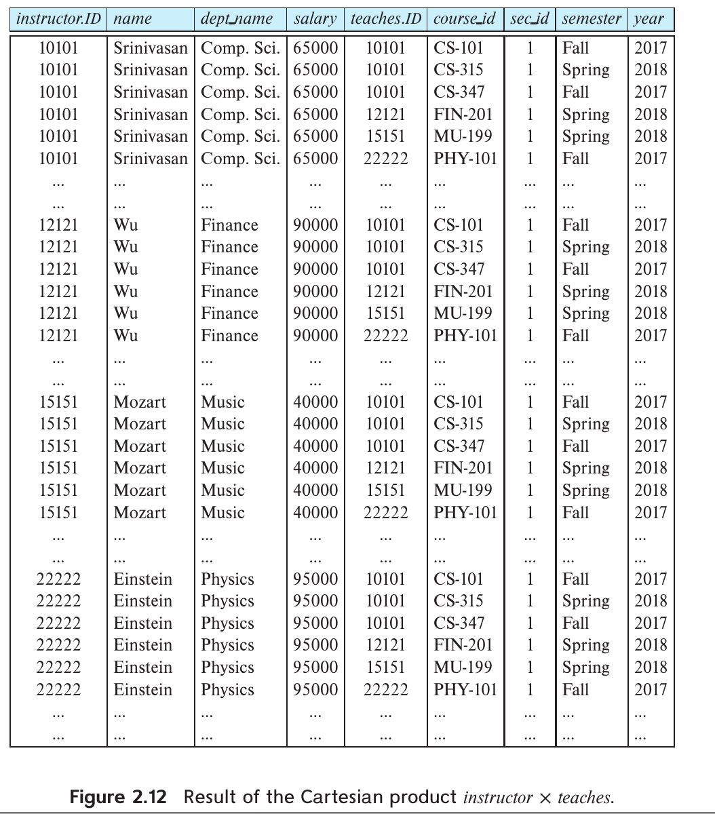
- 也就是说关系上的笛卡尔积会生成一个nxm大小的单元组表

#### The Join Operation
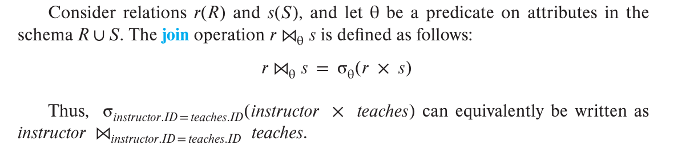
注意这里的join没有过滤掉重复的id列!
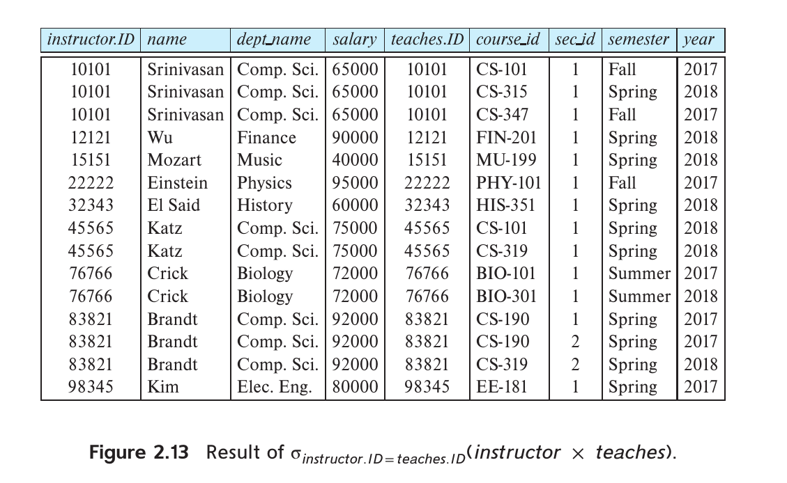

#### Set Operations
求并集(union)的前提条件:
1. 输入的两个关系具有相同数量的属性
2. 当属性相关联时,两个关系中对应属性的类型必须相同
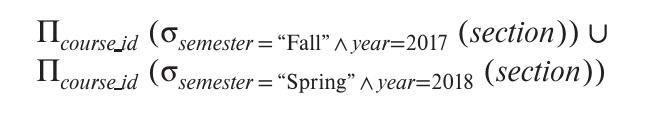

求交集(intersection):
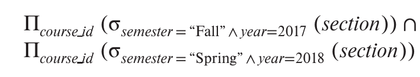

求集差(set-difference):
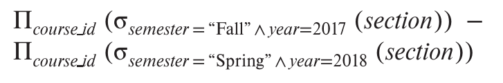
#### The Assignment Operation
>It is convenient at times to write a relational-algebra expression by assigning parts of it to temporary relation variables. 
The **assignment** operation, denoted by **←**, works like assignment in a programming language.

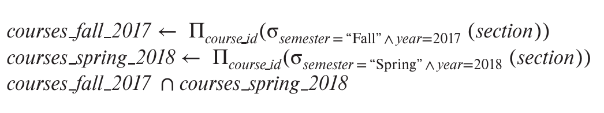
#### The Rename Operation
>The **rename** operator  refers to  the results of relational-algebra expressions,denoted by the lowercase Greek letter rho (ρ).


## Introduction to SQL
#### Overview of the SQL Query Language
- The SQL language has several parts:
  - **Data-definition language** (DDL). The SQL DDL provides commands for defining relation schemas, deleting relations, and modifying relation schemas.
  - **Data-manipulation language** (DML). The SQL DML provides the ability to query information from the database and to insert tuples into, delete tuples from, and modify tuples in the database.
    - 从这可以看到Data-manipulation是操作实例,Data-definition是操作关系模型
  - Integrity. The SQL DDL includes commands for specifying integrity constraints that the data stored in the database must satisfy. Updates that violate integrity constraints are disallowed.
    - 即规范性.
  - and so on

#### SQL Data Definition

##### Basic Types

The SQL standard supports a variety of built-in types, including:

- **char(n)**  
  Fixed-length character string.  
  Exactly n characters long.  
  Padded with spaces if shorter value inserted.  
  Full form: character(n).

- **varchar(n)**  
  Variable-length character string.  
  Maximum n characters.  
  Stores only actual characters (no padding).  
  Full form: character varying(n).

- **int**  
  Integer.  
  Machine-dependent range (usually 32-bit).  
  Full form: integer.

- **smallint**  
  Small integer.  
  Smaller machine-dependent range than int (usually 16-bit).

- **numeric(p, d)**  
  Fixed-point (exact decimal) number.  
  Total digits: p (including sign).  
  Decimal places: d.  
  Example: numeric(3,1) stores -99.9 to 99.9 exactly.  
  Cannot store 444.5 (exceeds p) or 0.32 (needs d≥2).

- **real**  
  Single-precision floating-point.  
  Machine-dependent precision (usually IEEE 32-bit).

- **double precision**  
  Double-precision floating-point.  
  Machine-dependent higher precision (usually IEEE 64-bit).

- **float(n)**  
  Floating-point with minimum precision of n decimal digits.  
  Implementation chooses actual precision ≥ n.

Each type may include a special value called the **null value**. A null value indicates
an absent value that may exist but be unknown or that may not exist at all. 

When comparing a char type with a varchar type, one may expect extra spaces to be added to the varchar type to make the lengths equal, before comparison; however, this may or may not be done, depending on the database system. As a result, even if the same value “Avi” is stored in the attributes A and B above, a comparison A=B may return false. We recommend you always use the varchar type instead of the char type to avoid these problems.
- 也就是说,可变数组在和固定长度数组比较时未必会加上对应长度的空格后再比较

#####  Basic Schema Definition
We define an SQL relation by using the create table command. The following command creates a relation department in the database:
```sql
create table department
(
  dept_name vacchar(20),
  building  varchar(15),
  budget    numeric(12,2),
  primary key(dept_name)
);
```

- 结尾的`;`在大多数sql版本中是可选的

SQL supports a number of different integrity constraints. In this section, we discuss only a few of them:
- primary key: required to be nonnull and unique
  - 也就是说不可重复,不可为null
  - Although the primary-key specification is optional, it is generally a good idea to specify a primary key for each relation.
- foreign key(A) references s: the value of A in this relation must correspond  to value of the primary key attributes in relation s.
  - 也就是说不允许把s关系中不存在的值写在这个关系中
- not null: the null value is not allowed for that attribute

- **drop table**: remove a relation from an SQL database
  - `drop table r;`只要这样就可以删除关系r了
- **delete from**:  retains relation r, but deletes all tuples in r.
  - `delete from r;`
- **alter table**:  add or drop attributes to an existing relation
  - `alter table r add A D;`:where r is the name of an existing relation, A is the name of the attribute to be added,and D is the type of the added attribute. 
  - `alter table r drop A;`:  drop attributes from a relation
**eg**
```sql
create table teaches
(
ID varchar (5),
course id varchar (8),
sec id varchar (8),
semester varchar (6),
year numeric (4,0),
primary key (ID, course id, sec id, semester, year),
foreign key (course id, sec id, semester, year) references section,
foreign key (ID) references instructor
);
alter table teaches  drop ID;
drop table teaches;
```
#### Basic Structure of SQL Queries
The basic structure of an SQL query consists of three clauses: **select, from, and where**.
A query takes as its input the relations listed in the from clause, operates on them as specified in the where and select clauses, and then produces a relation as the result. 
- 事实上在部分语句或者某些数据库系统中where,from是可选的,但select是必须出现的
#####  Queries on a Single Relation

```sql
select dept_name
from instructor;
```

Since more than one instructor can belong to a department, a department name could appear more than once in the instructor relation.
We can rewrite the preceding query as:
```sql
select distinct dept name
from instructor;
```
The result of the above query would contain each department name at most once.

Also,SQL allows us to use the keyword all to specify explicitly that duplicates are not removed:
```sql
select all dept name
from instructor;
```
Since duplicate retention is the default, we shall not use all in our examples. 

The select clause may also contain arithmetic expressions involving the operators +, −, ∗, and / operating on constants or attributes of tuples:
```sql
select ID, name, dept name, salary * 1.1
from instructor;
```
这不会改动原关系里的salary数值,只是在输出上将salary乘以1.1了


The where clause allows us to select only those rows in the result relation of the from clause that satisfy a specified predicate(断言)

```sql
select name
from instructor
where dept name = 'Comp. Sci.' and salary > 70000;
```

SQL allows the use of the logical connectives and, or, and not in the where clause.
The operands of the logical connectives can be expressions involving the comparison operators <, <=, >, >=, =, and <>.

#####  Queries on Multiple Relations
```sql
select instructor.dept_name, building, name
from instructor, department
where instructor.dept_name= department.dept_name;
```
注意到在不同关系中同时出现的attribute需要用关系名作为前缀来指明,而独特的attribute则不用

**from解析**
The from clause by itself defines a Cartesian product of the relations listed in the clause. It is defined formally in terms of relational algebra, but it can also be understood as an iterative process that generates tuples for the result relation of the from clause.

```text
for each tuple t1 in relation r1
  for each tuple t2 in relation r2
    …
      for each tuple tm in relation rm
        Concatenate t1 , t2 , … , tm into a single tuple t
        Add t into the result relation
```
也就是说from实际上会将所有关系用笛卡尔积制成一个nxm的表,如果不用where来过滤掉多余组合的话,在大型数据库中select将很难处理这么多数据

```sql
SELECT s.name, c.course_name
FROM students s, courses c;
```
→ 结果行数 = students 行数 × courses 行数（所有学生 × 所有课程的组合）

#### Additional Basic Operations
##### The Rename Operation
```sql
select name, course id
from instructor, teaches
where instructor.ID= teaches.ID;
```
The result of this query is a relation with the following attributes:
`name, course id`

We cannot, however, always derive names in this way, for several reasons:

First, two relations in the **from clause** may have attributes with the same name, in which case an attribute name is duplicated in the result.

Second, if we use an arithmetic expression in the **select clause**, the resultant attribute does not have a name.

Third, even if an attribute name can be derived from the base relations as in the preceding example, we may want to change the attribute name in the result.

Hence, SQL provides a way of renaming the attributes of a result relation. It uses the **as clause**, taking the form:
`old-name as new-name`

For example, if we want the attribute name **name** to be replaced with the name **instructor_name**, we can rewrite the preceding query as:

```sql
select name as instructor name, course id
from instructor, teaches
where instructor.ID= teaches.ID;
```

The **as clause** is particularly useful in renaming relations.

One reason to rename a relation is to replace a long relation name with a shortened version that is more convenient to use elsewhere in the query.

To illustrate, we rewrite the query **“For all instructors in the university who have taught some course, find their names and the course ID of all courses they taught.”**

```sql
select T.name, S.course_id
from instructor as T, teaches as S
where T.ID = S.ID;
```

Another reason to rename a relation is a case where we wish to compare tuples in the same relation. We then need to take the **Cartesian product** of a relation with itself and, without renaming, it becomes impossible to distinguish one tuple from the other.

Suppose that we want to write the query **“Find the names of all instructors whose salary is greater than at least one instructor in the Biology department.”**

We can write the SQL expression:

```sql
select distinct T.name
from instructor as T, instructor as S
where T.salary > S.salary and S.dept_name = 'Biology';
```
##### String Operations
SQL specifies strings by enclosing them in **single quotes**, for example, 'Computer'. A single quote character that is part of a string can be specified by using two single quote characters.

For example, the string “It’s right” can be specified by 'It''s right'.

The SQL standard specifies that the equality operation on strings is **case sensitive**;as a result, the expression “'comp. sci.' = 'Comp. Sci.'” evaluates to false.

- 但在MySQL和SQL Server中,在字符串比较时不区分大小写,故“'comp. sci.' = 'Comp. Sci.'” 为真.

Pattern matching can be performed on strings using the operator like. We describe patterns by using two special characters:
- Percent (%): The % character matches any substring.
- Underscore (_): The character matches any character.


Patterns are case sensitive.To illustrate pattern matching, we consider the following examples:

-  'Intro%' matches any string beginning with “Intro”.
-  '%Comp%' matches any string containing “Comp” as a substring, for example, 'Intro. to Computer Science', and 'Computational Biology'.
- '___' matches any string of exactly three characters.
- '___%' matches any string of at least three characters.

For patterns to include the special pattern characters (that is, % and ), SQL allows the
specification of an escape character. The escape character is used immediately before
a special pattern character to indicate that the special pattern character is to be treated
like a normal character. We define the escape character for a like comparison using the
escape keyword. To illustrate, consider the following patterns, which use a backslash(∖) as the escape character:

- **like 'ab∖%cd%' escape '∖'** matches all strings beginning with “ab%cd”.
- **like 'ab∖∖cd%' escape '∖'** matches all strings beginning with “ab∖cd”.

也就是说,sql没有通用的转义符,而是需要用户定义并写入字符串中

SQL allows us to search for mismatches instead of matches by using the not like com-
parison operator. Some implementations provide variants of the like operation that do
not distinguish lower- and uppercase.

##### Attribute Specification in the Select Clause
The asterisk symbol “ * ” can be used in the select clause to denote “all attributes.”

```sql
select instructor.*
from instructor, teaches
where instructor.ID= teaches.ID;
```
It indicates that all attributes of instructor are to be selected.

#### Ordering the Display of Tuples
The **order by** clause causes the tuples in the result of a query to appear in sorted order. 

By default, the order by clause lists items in ascending order. To specify the sort order,
we may specify desc for descending order or asc for ascending order. Furthermore,
ordering can be performed on multiple attributes. Suppose that we wish to list the
entire instructor relation in descending order of salary. If several instructors have the
same salary, we order them in ascending order by name. We express this query in SQL as follows:
```sql
select *
from instructor
order by salary desc, name asc;
```
#### Where-Clause Predicates
SQL includes a **between** comparison operator to simplify **where** clauses that specify
that a value be less than or equal to some value and greater than or equal to some other value.

Similarly, we can use the not between comparison operator.
```sql
select name
from instructor
where salary between 90000 and 100000;
```
尽管它等价于以下语句,但看上去就直白了一点
```sql
select name
from instructor
where salary <= 100000 and salary >= 90000;
```

SQL permits us to use the notation (v1 , v2 , … , vn ) to denote a tuple of arity n con-
taining values v1 , v2 , … , vn ; the notation is called a row constructor. The comparison
operators can be used on tuples, and the ordering is defined lexicographically. For ex-
ample, (a1 , a2 ) <= (b1 , b2 ) is true if a1 <= b1 and a2 <= b2 ; similarly, the two tuples
are equal if all their attributes are equal. Thus, the SQL query:
```sql
select name, course id
from instructor, teaches
where instructor.ID= teaches.ID and dept name = 'Biology';
```

can be rewritten as follows:
```sql
select name, course id
from instructor, teaches
where (instructor.ID, dept name) = (teaches.ID, 'Biology');
```

- 看似简写了,但其实看上去更懵了

### Set Operations
The SQL operations **union, intersect, and except** operate on relations and correspond to the mathematical set operations **∪, ∩, and −**.

#### The Union Operation
```sql
(select course id
from section
where semester = 'Fall' and year= 2017)
union
(select course id
from section
where semester = 'Spring' and year= 2018);
```
这里只是把两个结果合并了一下而已

Note that the parentheses we include around each select-
from-where statement below are optional but useful for ease of reading.

- The **union** operation automatically eliminates duplicates, unlike the **select** clause. 

If we want to retain all duplicates, we must write **union all** in place of **union**.

#### The Intersect Operation
```sql
(select course id
from section
where semester = 'Fall' and year= 2017)
intersect
(select course id
from section
where semester = 'Spring' and year= 2018);
```
找交集

- 同样可以加一个all来保留相同字段

```sql
(select course id
from section
where semester = 'Fall' and year= 2017)
intersect all
(select course id
from section
where semester = 'Spring' and year= 2018);
```
#### The Except Operation
To find all courses taught in the Fall 2017 semester **but not** in the Spring 2018 semester,we write:
```sql
(select course id
from section
where semester = 'Fall' and year= 2017)
except
(select course id
from section
where semester = 'Spring' and year= 2018);
```
The **except** operation outputs all tuples from its first input that do not occur in the second input.

- 同样可以加一个all来保留相同字段

```sql
(select course id
from section
where semester = 'Fall' and year= 2017)
except all
(select course id
from section
where semester = 'Spring' and year= 2018);
```
### Null Values
**Null values** present special problems in relational operations, including arithmetic operations, comparison operations, and set operations.

The result of an arithmetic expression (involving, for example, +, −, ∗, or ∕) is null.

If any of the input values is null. For example, if a query has an expression r.A + 5, and r.A is null for a particular tuple, then the expression result must also be null for that tuple.

- 也就是说null参与的数学运算结果都是null

Comparisons involving nulls are more of a problem.SQL therefore treats as **unknown** the result of any comparison involving a null value.This creates a third logical value in addition to true and false.

Since the predicate in a where clause can involve Boolean operations such as and,or, and not on the results of comparisons, the definitions of the Boolean operations are extended to deal with the value **unknown**.

- and: The result of true and unknown is unknown, **false and unknown is false**, while unknown and unknown is unknown.
- or: The result of true or unknown is true, **false or unknown is unknown**, while unknown or unknown is unknown.
- not: The result of not unknown is unknown.

**为什么这样设计?**
- TRUE AND UNKNOWN 为什么是 UNKNOWN?
  - 如果 UNKNOWN 实际上是 TRUE：true and true = true
  - 如果 UNKNOWN 实际上是 FALSE: true and false =false
  - 由于结果可能是 TRUE 也可能是 FALSE，数据库无法给出定论，只能保守地标注为 UNKNOWN。
- false and unknown 为什么是 false?
  - 含有false的and语句恒为false,结果是确定的,故可标记为false.
- true or unknown 为什么是 true?
  - 同理,含有true的or语句恒为true.
- false or unknown 为什么是 unknown?
  - 同理,结果可能是 TRUE 也可能是 FALSE,无法定论.

SQL uses the special keyword null in a predicate to test for a null value. 
Thus, to find all instructors who appear in the instructor relation with null values for salary, we write:

- 补充: `5*20+3=null`,`null=null`,返回值都是unknown.
```sql
select name
from instructor
where salary is null;
```
- 有`is null`当然就有`is not null`.

SQL allows us to test whether the result of a comparison is unknown,by using the clauses is unknown and is not unknown.For example:
```sql
select name
from instructor
where salary > 10000 is unknown;
```
### Aggregate Functions
Aggregate functions are functions that take a collection (a set or multiset) of values as
input and return a single value. SQL offers five standard built-in aggregate functions:
1. Average: avg
2. Minimum: min
3. Maximum: max
4. Total: sum
5. Count: count


#### Basic Aggregation
```sql
select avg (salary) as avg_salary
from instructor
where dept name = 'Comp. Sci.';
```
- 找到salary的平均值

```sql
select count (distinct ID)
from teaches
where semester = 'Spring' and year = 2018;
```
- 使用count关键字统计()内的具有对应属性的行数

#### Aggregation with Grouping
```sql
select dept_name, avg (salary) as avg salary
from instructor
group by dept_name;
```
这里把instructor用dept_name分组,从而统计出每个部门的avg_salary.
- 也就是说`group by` 需要在select语句中写明操作的对象,才能在结果中反映出来分组的结果
```sql
/* erroneous query */
select dept_name, ID, avg (salary)
from instructor
group by dept_name;
```
- 上述sql语句由于一个分组中的tuple可以有不同的id属性,故不能变成一个分组,会引发错误

>总结一下:
当 SQL 查询包含 GROUP BY 子句时，SELECT 子句中的任何属性（列名）**必须满足以下两个条件之一**，否则该查询在逻辑上是错误的：

1. 该属性出现在 GROUP BY 子句中。
2. 该属性被包裹在聚合函数（如 SUM, COUNT, AVG, MAX, MIN）之中。


**进阶版**
```sql
select dept_name, count (distinct ID) as instr count
from instructor, teaches
where instructor.ID = teaches.ID and
semester = 'Spring' and year = 2018
group by dept_name;
```
- “Find the number of instructors in each department who teach a course in the Spring 2018 semester.” 

#### The Having Clause
为了处理分组,而不是处理分组后的tuples,引入了**having** clause.
```sql
select dept name, avg (salary) as avg_salary
from instructor
group by dept name
having avg (salary) > 42000;
```
- 上述语句会过滤掉ayg_salary小于等于42000的分组

The logical execution sequence of an SQL query containing aggregation, `GROUP BY`, or `HAVING` clauses is defined as follows:

1.  **Evaluate the `FROM` clause**
    The `FROM` clause is first evaluated to generate a relation (the initial set of data from specified tables or joins).
2.  **Apply the `WHERE` clause** (if present)
    The predicate in the `WHERE` clause is applied to the result relation of the `FROM` clause. Only tuples satisfying this predicate proceed.
3.  **Apply the `GROUP BY` clause** (if present)
    Tuples satisfying the `WHERE` predicate are placed into groups based on the `GROUP BY` clause. If the `GROUP BY` clause is absent, the entire set of filtered tuples is treated as a single group.
4.  **Apply the `HAVING` clause** (if present)
    The `HAVING` clause is applied to each group. Groups that do not satisfy the `HAVING` clause predicate are removed entirely.
5.  **Evaluate the `SELECT` clause**
    The `SELECT` clause uses the remaining groups to generate the final result tuples. Aggregate functions are applied here to produce a single result tuple for each group.

**长难句分析**
```sql
select course_id, semester, year, sec_id, avg (tot_cred)
from student, takes
where student.ID= takes.ID and year = 2017
group by course_id, semester, year, sec_id
having count (ID) >= 2;
```
- 这里把学生按照“班级”扔进不同的筐里。比如“数据库-2017-秋-01班”是一个筐，“算法-2017-秋-02班”是另一个筐

>也就是说,group by后面的属性全部相同时才会被归为一组
####  Aggregation with Null and Boolean Values
```sql
select sum (salary)
from instructor;
```
当salary中有null值的时候,并不会像普通的`5+null=null`一样返回null,而是会忽略null

>In general, aggregate functions treat nulls according to the following rule: All aggre-
gate functions except count (*) ignore null values in their input collection. As a result
of null values being ignored, the collection of values may be empty. The count of an
empty collection is defined to be 0, and all other aggregate operations return a value
of null when applied on an empty collection

- 由于count是统计行数的,故当某一行有null时也会计入

### Nested Subqueries
>A subquery is a **select-from-where** expression that is nested within another query. A common use of subqueries is to perform tests for set membership, make set comparisons, and determine set cardinality by nesting subqueries in the **where** clause. 
#### Set Membership
```sql
select distinct course_id
from section
where semester = 'Fall' and year= 2017 and
course_id in (select course_id
              from section
              where semester = 'Spring' and year= 2018);
```
We use the not in construct in a way similar to the in construct. For example, to find
all the courses taught in the Fall 2017 semester but not in the Spring 2018 semester,
which we expressed earlier using the except operation, we can write:
```sql
select distinct course id
from section
where semester = 'Fall' and year= 2017 and
course id not in (select course id
from section
where semester = 'Spring' and year= 2018);
```
- 也就是说,之前提到的intersect和except都可以用subquery的形式来解决


#### Set Comparison
The phrase “greater than at least one” is represented in SQL by **> some**.
```sql
select name
from instructor
where salary > some (select salary
from instructor
where dept_name = 'Biology');
```
>SQL also allows < some, <= some, >= some, = some, and <> some comparisons.
As an exercise, verify that = some is identical to in, whereas <> some is not the same as not in.

The construct **> all** corresponds to the phrase “greater than all.”

```sql
select name
from instructor
where salary > all (select salary
from instructor
where dept name = 'Biology');
```
As it does for some, SQL also allows < all, <= all, >= all, = all, and <> all comparisons.
As an exercise, verify that <> all is identical to not in, whereas = all is not the same as
in.

#### Test for Empty Relations
The **exists** construct returns the value true if the argument subquery is nonempty. 
```sql
select course_id
from section as S
where semester = 'Fall' and year= 2017 and
  exists (select *
          from section as T
          where semester = 'Spring' 
          and year= 2018 
          and S.course_id= T .course_id);
```
>The above query also illustrates a feature of SQL where a correlation name from
an outer query (S in the above query), can be used in a subquery in the where clause.
A subquery that uses a correlation name from an outer query is called a correlated
subquery.

当然,有exists就有`not exists`:
```sql
select S.ID, S.name
from student as S
where not exists ((select course_id
                    from course
                    where dept_name = 'Biology')
                    except
                    (select T .course_id
                    from takes as T
                    where S.ID = T .ID));
```
**长难句分析**
首先计算“Biology 系开设了，但该学生没选”的课程,如果这类课程not exists,说明该学生选了所有Biology系的课程.

#### Test for the Absence of Duplicate Tuples(3/18)
Using the **unique** construct, we can write the query “Find all courses that were offered at most once in 2017” as follows:
- 如果你记忆力够好的话,可能会记得之前在create table的时候会用unique来保证对应的属性不能有重复值

```sql
select T .course id
from course as T
where unique (select R.course id
from section as R
where T .course id= R.course id and
R.year = 2017);
```
>Note that if a course were not offered in 2017, the subquery would return an empty result, and the unique predicate would evaluate to true on the empty set.
也就是说即使结果为空,但由于是unique,故也会返回true.

当然,有了unique就有`not unique`,要求返回结果中的每个tuple至少出现两次
```sql
select T .course id
from course as T
where not unique (select R.course id
                  from section as R
                  where T .course id= R.course id and
                  R.year = 2017);
```
- 可以看到,where部分的subquery可以访问外层的关系
#### Subqueries in the From Clause
```sql
select dept name, avg salary
from (select dept name, avg (salary)
      from instructor
      group by dept name)
      as dept avg (dept name, avg salary)
where avg salary > 42000;
```
- 是的,from的关系也能用别名...

但是值得注意的是,**在from中的subquery不能访问外层的关系**,因为from中的关系是相互并列的,不存在嵌套关系,只能通过lateral关键字来强制让后继关系能够获取前置关系

```sql
select name, salary, avg_salary
from instructor I1, lateral (select avg(salary) as avg_salary
from instructor I2
where I2.dept name= I1.dept_name);
```
>如果你跟我一样从头看到这里的话,你会清楚的记得前面都是写类似`instructor as I1`的方式来起别名的,但是as实际上是**可选的**!
#### The With Clause
>The **with** clause provides a way of defining a temporary **relation** whose definition is available only to the query in which the **with** clause occurs. 
```sql
with max_budget (value) as
  (select max(budget)
  from department)
select budget
from department, max_budget
where department.budget = max_budget.value;
```
注意到这里是先写别名再在as后写原关系,而我们之前都是先写原关系再写as的

> with得到的是关系而非属性,因此我们每次都需要用关系(属性)的方式来使用with

- 实际上,上述的with语句完全可以放到where中
```sql
select budget
from department
where budget = (select max(budget) from department);
```
>We could have written the preceding query by using a nested subquery in either the from clause or the where clause. 
However, using nested subqueries would have made the query harder to read and understand. The with clause makes the query logic clearer;
it also permits this temporary relation to be used in multiple places within a query.

#### Scalar(标量) Subqueries
>SQL allows subqueries to occur wherever an expression returning a value is permitted,provided the subquery returns only one tuple containing a single attribute; such sub-queries are called scalar subqueries.

- 也就是说只返回一行一列
**长难句分析**
```sql
select dept_name,
        (select count(*)
          from instructor
          where department.dept_name = instructor.dept_name)
        as num_instructors
from department;
```
- `select count(*)`在这里是无论是否有空值都返回满足`epartment.dept_name = instructor.dept_name`的所有行的意思
#### Scalar Without a From Clause
```sql
(select count (*) from teaches) / (select count (*) from instructor);
-- 在某些数据库中会由于没有from语句而报错
select (select count (*) from teaches) / (select count (*) from instructor) from dual;
-- 提供了一个dummy relation来提供from语句且不产生其他副作用
```
### Modification of the Database(3/19)
#### Deletion
>A delete request is expressed in much the same way as a query. We can delete only whole tuples; we cannot delete values on only particular attributes. SQL expresses a deletion by:
```sql
delete from r
where P;
-- where P represents a predicate and r represents a relation.
-- The where clause can be omitted, in which case all tuples in r are deleted.
```

```sql
delete from instructor
where salary between 13000 and 15000;
--  Delete all instructors with a salary between $13,000 and $15,000.
```
- 事实上delete与select的用法没有什么区别,只不过一个是选择关系,一个是删除关系而已.

#### Insertion
> The attribute values for inserted tuples must be members of the corresponding attribute’s domain. Similarly, tuples inserted must have the correct number of attributes.
```sql
insert into course
values ('CS-437', 'Database Systems', 'Comp. Sci.', 4);

-- 如果忘记了表的顺序,那么可以具体写出属性名来插入,这三种写法的结果完全相同
insert into course (course id, title, dept name, credits)
values ('CS-437', 'Database Systems', 'Comp. Sci.', 4);

insert into course (title, course id, credits, dept name)
values ('Database Systems', 'CS-437', 4, 'Comp. Sci.');

```

```sql
insert into instructor
      select ID, name, dept name, 18000
      from student
      where dept name = 'Music' and tot cred > 144;
```
当然,我们可以从其他关系中获取tuple后再插入,而不是只用value来具体写.
#### Updates
>n certain situations, we may wish to change a value in a tuple without changing all values in the tuple. For this purpose, the **update** statement can be used. 
```sql
update instructor
set salary= salary * 1.05;
-- 我们可以对某一列属性整体生效

update instructor
set salary = salary * 1.05
where salary < 70000;
-- 也可以对该列属性的部分值生效

update instructor
set salary = salary * 1.05
where salary < (select avg (salary)
from instructor);
-- 还可以对满足子查询的属性值生效
```
**进阶写法**
```sql
update instructor
set salary = case
              when salary <= 100000 then salary * 1.05
              else salary * 1.03
            end
-- 具体模板如下
-- case
  -- when pred 1 then result1
  -- when pred 2 then result2
  -- …
  -- when pred n then resultn
  -- else result0
-- end
```

## Intermediate SQL(3/15)
### Join Expressions
事实上,单独的join语句不加任何前缀和后缀会报错,因为不存在只写一个join而不进行过滤操作的语法.
#### The Natural Join
```sql
select name, course_id
from student, takes
where student.ID = takes.ID;
```
上述语句在执行的中间结果中会保留两个ID列,只是在select时抛弃掉了而已.
```sql
select name, course id
from student natural join takes;
```
而`natural join`的中间结果只保留一个ID列
规则:
1. 找到同名列
2. 过滤掉同名列中的值不相等的行
3. 两个同名列只保留一列

```sql
select name, title
from (student natural join takes) join course using (course_id);
```
The operation **join … using** requires a list of attribute names to be specified. Both relations being joined must have attributes with the specified names.
- 也就是说只用using()里面那个属性在join的时候来判断,而不像natural join一样在有多个同名属性的情况下全都要求相等.
####  Join Conditions
>The **on** condition allows a general predicate over the relations being joined. 
```sql
select *
from student join takes on student.ID = takes.ID;
```
完全等价于下面语句,也就是结果都保持了两个ID列
```sql
select *
from student, takes
where student.ID = takes.ID;
```
- 所以基本用不上on
#### Outer Joins
```sql
select *
from student natural join takes;
```
由于natural join会丢弃`takes.id!=student.id`的行,对于只在一个表中存在的ID,由于在另一个表中找不到对等的值,也会被抛弃,但在实际需求中,即使没选课的学生,我们也希望展示出来,故这里需要使用**outer join**.

There are three forms of outer join:
- The left outer join preserves tuples only in the relation named before the left outer join operation.
- The right outer join preserves tuples only in the relation named after the right outer join operation.
- The full outer join preserves tuples in both relations.

In contrast, the join operations we studied earlier that do not preserve nonmatched tuples are called **inner-join** operations, to distinguish them from the **outer-join** operations.

>We now explain exactly how each form of outer join operates. We can compute
the left outer-join operation as follows: First, compute the result of the inner join as
before. Then, for every tuple t in the left-hand-side relation that does not match any
tuple in the right-hand-side relation in the inner join, add a tuple r to the result of the
join constructed as follows:

- The attributes of tuple r that are derived from the left-hand-side relation are filled in with the values from tuple t.
- The remaining attributes of r are filled with null values.

```sql
select *
from student natural left outer join takes;
```
如果对于在student里出现但在takes里没有的id,会将student表中的值填入,对应takes部分的值均为null.

>The **full outer join** is a combination of the left and right outer-join types. After the
operation computes the result of the inner join, it extends with nulls those tuples from
the left-hand-side relation that did not match with any from the right-hand-side relation
and adds them to the result. Similarly, it extends with nulls those tuples from the right-
hand-side relation that did not match with any tuples from the left-hand-side relation
and adds them to the result. Said differently, full outer join is the union of a left outer
join and the corresponding right outer join.

- 也就是说保留两边的缺值

**进阶例子**
```sql
select *
from (select *
from student
where dept name = 'Comp. Sci.')
natural full outer join
(select *
from takes
where semester = 'Spring' and year = 2017);
```
>一开始明明都是用`student natural full outer join takes`的,这里为什么要单独把两个结果提出来呢?

```sql
select *
from student
natural full outer join takes
where dept_name = 'Comp. Sci.'
  and semester = 'Spring'
  and year = 2017;
```
因为如果这样写的话,尽管在from部分保留了null,但where部分又把null全部过滤掉了

>The **on** condition is part of the outer join specification, but a **where** clause is not. 

```sql
select *
from student left outer join takes on student.ID = takes.ID;
```
也就是说上面这个语句不等价于下面的,因为on是在join阶段生效,即使不匹配也会置为null;
而where是在join之后生效,因此where会过滤掉null行,而上面语句中的on则会保留
```sql
select *
from student left outer join takes on true
where student.ID = takes.ID;
```

#### Join Types and Conditions
The keyword **inner** is optional:
```sql
select *
from student join takes using (ID);
```
is equivalent to:
```sql
select *
from student inner join takes using (ID);
```
Similarly, natural join is equivalent to natural inner join.

### Views
>SQL allows a “virtual relation” to be defined by a query, and the relation conceptually contains the result of the query. The virtual relation is not precomputed and stored but instead is computed by executing the query whenever the virtual relation is used.

因此就有了view这个概念用来代表尚未执行的sql语句
#### View Definition
```sql
create view v as <query expression>;
```
where < query expression > is any legal query expression. The view name is represented v

```sql
create view faculty as
select ID, name, dept name
from instructor;
```
通过这样写,可以给低权限用户传递view这个关系而不直接接触instructor这个关系.

####  Using Views in SQL Queries
The attribute names of a view can be specified explicitly as follows:
```sql
create view departments total salary(dept name, total salary) as
select dept name, sum (salary)
from instructor
group by dept name;
```
Since the expression sum(salary) does not have a name, the attribute name is specified explicitly in the view definition.

####  Update of a View
Not recommended!
### Transactions
blablabla...

### Integrity Constraints
#### Constraints on a Single Relation
- not null
- unique
- check(<predicate>)

#### Not Null Constraint
```sql
name varchar(20) not null
budget numeric(12,2) not null
```
The not null constraint prohibits the insertion of a null value for the attribute, and is an example of a domain constraint. 

####  Unique Constraint
The unique specification says that no two tuples in the relation can be equal on all the listed attributes.

####  The Check Clause
>When applied to a relation declaration, the clause check(P) specifies a predicate P that must be satisfied by every tuple in a relation.
```sql
create table section
(course id
 varchar (8),
sec id
 varchar (8),
semester
 varchar (6),
year
 numeric (4,0),
building
 varchar (15),
room number varchar (7),
time slot id varchar (4),
primary key (course id, sec id, semester, year),
check (semester in ('Fall', 'Winter', 'Spring', 'Summer')));
```
Here, we use the **check** clause to simulate an enumerated type by specifying that semester must be one of 'Fall', 'Winter', 'Spring', or 'Summer'.

还可以把check写在定义的属性之后
```sql
CREATE TABLE classroom (
    building    VARCHAR(15),
    room_number VARCHAR(7),
    capacity    NUMERIC(4,0),
    PRIMARY KEY (building, room_number)
);

CREATE TABLE department (
    dept_name   VARCHAR(20),
    building    VARCHAR(15),
    budget      NUMERIC(12,2) CHECK (budget > 0),
    PRIMARY KEY (dept_name)
);

CREATE TABLE course (
    course_id   VARCHAR(8),
    title       VARCHAR(50),
    dept_name   VARCHAR(20),
    credits     NUMERIC(2,0) CHECK (credits > 0),
    PRIMARY KEY (course_id),
    FOREIGN KEY (dept_name) REFERENCES department 
);

CREATE TABLE instructor (
    ID          VARCHAR(5),
    name        VARCHAR(20) NOT NULL,
    dept_name   VARCHAR(20),
    salary      NUMERIC(8,2) CHECK (salary > 29000),
    PRIMARY KEY (ID),
    FOREIGN KEY (dept_name) REFERENCES department 
);

CREATE TABLE section (
    course_id    VARCHAR(8),
    sec_id       VARCHAR(8),
    semester     VARCHAR(6) CHECK (semester IN ('Fall', 'Winter', 'Spring', 'Summer')),
    year         NUMERIC(4,0) CHECK (year > 1759 AND year < 2100),
    building     VARCHAR(15),
    room_number  VARCHAR(7),
    time_slot_id VARCHAR(4),
    PRIMARY KEY (course_id, sec_id, semester, year),
    FOREIGN KEY (course_id) REFERENCES course ,
    FOREIGN KEY (building, room_number) REFERENCES classroom 
);
```

#### Referential Integrity

**默认引用 (Implicit Reference)**
`foreign key (dept_name) references department`

* **底层行为**：当你省略括号中的属性名时，SQL 标准规定该外键必须引用被参照表的 **主键 (Primary Key)**

**显式引用 (Explicit Reference)**
`foreign key (dept_name) references department(dept_name)`

* **底层行为**：目标列（dept_name）不必是主键，但必须具有 唯一性约束 (UNIQUE) 或本身就是 主键。即它必须是一个 超键 (Superkey)。

#### Assigning Names to Constraints

```sql
-- 使用constraint关键字命名该限制
salary numeric(8,2), constraint minsalary check (salary > 29000),
-- 删除该限制
alter table instructor drop constraint minsalary;
```
#### Complex Check Conditions and Assertions
>An **assertion** is a predicate expressing a condition that we wish the database always
to satisfy. 

**格式**
```sql
create assertion <assertion-name> check <predicate>;
```
```sql
create assertion credits earned constraint check
(not exists (select ID
            from student
            where tot_cred <> (select coalesce(sum(credits), 0)
            from takes natural join course
            where student.ID= takes.ID
              and grade is not null and grade<> ’F’ )))
```
- 非常好的是这种东西不会考,因为主流数据库也不用

### SQL Data Types and Schemas
>There are additional built-in data types supported by SQL, which we describe below. 

#### Date and Time Types in SQL

- date: A calendar date containing a (four-digit) year, month, and day of the month.
- time: The time of day, in hours, minutes, and seconds. 
- timestamp: A combination of date and time.

Date and time values can be specified like this:
```sql
date '2018-04-25'
-- Dates must be specified in the format year followed by month followed by day
time '09:30:00'
timestamp '2018-04-25 10:29:01.45'
```
#### Type Conversion and Formatting Functions(过)
- 由于我找到了中文版教材,故从现在开始大部分使用中文版,少部分使用英文版(因为这本书真的是又臭又长)


**1. 显式类型转换 (Type Casting)**
**语法：** `cast(expression as data_type)`  
**用途：** 物理改变数据的解析方式，常用于修正字符串排序逻辑。

```sql
/* 修正前：'11' 会排在 '2' 前面（字符串字典序） */
select ID from instructor order by ID;

/* 修正后：将字符串物理转为数字，实现数值大小排序 */
select ID 
from instructor 
order by cast(ID as numeric);
```

---

**2. 格式化函数 (Formatting Functions)**
**用途：** 不改变物理类型，只给数据套上“显示滤镜”。各数据库系统实现不同。

```sql
-- MySQL: 数字千分位格式化
select format(salary, 2) from instructor; 

-- PostgreSQL/Oracle: 日期转特定格式字符串
select to_char(now(), 'YYYY-MM-DD'); 

-- SQL Server: 风格化转换
select convert(varchar, getdate(), 101); -- 返回 mm/dd/yyyy
```


---

**3. 空值合并 (Coalesce)**
**语法：** `coalesce(arg1, arg2, ...)`  
**逻辑：** 物理扫描参数列表，返回第一个非 `null` 的值。要求所有参数**物理类型一致**。

```sql
/* 如果 salary 是 null，物理替换为 0 以便后续数学运算 */
select ID, coalesce(salary, 0) as actual_salary
from instructor;

/* 错误示例：coalesce(salary, 'N/A') 会报错，因为数字和字符串类型不匹配 */
```

---

**4. 条件解码 (Decode - Oracle 特有)**
**语法：** `decode(value, search, result, default)`  
**逻辑：** 类似于 `switch-case`。它允许 `null = null` 的物理匹配，且**不强制要求类型一致**。

```sql
/* 将物理空值直接翻译成业务描述字符串 'N/A' */
select ID, decode(salary, null, 'N/A', salary) as salary_text
from instructor;
```

- 随便一看就知道不会考的...

#### Default Values
SQL allows a default value to be specified for an attribute as illustrated by the following
create table statement:
```sql
create table student
    (ID varchar (5),
    name varchar (20) not null,
    dept_name varchar (20),
    tot_cred numeric (3,0) default 0,
    primary key (ID));
```

#### Large-Object Types
>SQL provides large-object data types for character data (clob) and binary data (blob). 
The letters “lob” in these data types stand for “Large OBject.”

```sql
book_review clob(10KB)
image blob(10MB)
movie blob(2GB)
```
#### User-Defined Types(过)
>SQL supports two forms of user-defined data types. 
The first form, which we cover here, is called **distinct types**.

The create type clause can be used to define new types:
```sql
create type Dollars as numeric(12,2) final;
create type Pounds as numeric(12,2) final;

create table department
(dept name
 varchar (20),
building
 varchar (15),
budget
 Dollars);
```


- 这一节也不重要,因为主流数据库也不支持

#### Generating Unique Key Values
```sql
ID number(5) generated always as identity
-- When the always option is used, any insert statement must avoid specifying a value
-- for the automatically generated key. 

insert into instructor (name, dept_name, salary)
values ('Newprof', 'Comp. Sci.', 100000);
```

#### Create Table Extensions
>Applications often require the creation of tables that have the same schema as an existing table. 
```sql
-- SQL provides a create table like extension to support this task
create table temp_instructor like instructor;
```

### Schemas, Catalogs, and Environments(过)

### Index Definition in SQL(过)
由于这部分基本什么都没讲,还是得到index章节去看

### Authorization
>We may assign a user several forms of authorizations on parts of the database. Authorizations on data include:

• Authorization to **read** data.
• Authorization to **insert** new data.
• Authorization to **update** data.
• Authorization to **delete** data.

- Each of these types of authorizations is called a privilege. 
#### Granting and Revoking of Privileges

```sql
-- grant的使用格式
grant <privilege list>
on <relation name or view name>
to <user/role list>;

-- grants database users Amit and Satoshi select authorization on the department relation:
grant select on department to Amit, Satoshi;

-- If the list of attributes is omitted, the update privilege will be granted on all attributes of the relation.
grant update (budget) on department to Amit, Satoshi;

-- To revoke an authorization, we use the revoke statement. It takes a form almost identical to that of grant:
revoke <privilege list>
on <relation name or view name>
from <user/role list>;

revoke select on department from Amit, Satoshi;
revoke update (budget) on department from Amit, Satoshi;
```
#### Roles
- 我们使用Roles来解决需要多次指定相同权限的问题
```sql
create role instructor;

-- Roles can then be granted privileges just as the users can,
grant select on takes
to instructor;

-- Roles can be granted to users, as well as to other roles,
create role dean;
grant instructor to dean;
grant dean to Satoshi;
```
#### Authorization on Views
```sql
-- 为了让某个工作人员能够看到地质系的所有教师但不能看到其他系的教师表,我们可以这样写:
create view geo_instructor as
(select *
from instructor
where dept name = 'Geology');

-- 但是,下面的操作实际上还是间接的访问了instructor表
select *
from geo_instructor;
```
#### Authorizations on Schema
>SQL includes a **references** privilege that permits a user to declare **foreign keys** when creating relations.

```sql
grant references (dept_name) on department to Mariano;
```
为什么要限制引用外码呢?
>However, recall that foreign-key constraints
**restrict deletion and update** operations on the referenced relation. Suppose Mariano
creates a foreign key in a relation r referencing the dept name attribute of the department
relation and then inserts a tuple into r pertaining to the Geology department. It is no
longer possible to delete the Geology department from the department relation without also modifying relation r. 

#### Transfer of Privileges
当我们授予某用户一个权限时,默认他是无法将获得的权限传递给其他用户的,如果希望他能够传递权限,我们可以这样写:
```sql
grant select on department to Amit with grant option;
```
- 当然,关系/视图/角色(relation/view/role) 的创建者拥有该对象的所有权限并且可以给其他用户授权(不然就没人能授权了)

#### Revoking of Privileges(过)


## Advanced SQL
- 事实上,这部分我觉得期末不考,我猜老师自己也不会😅
  - (4/8): 第一次小测考了前三节,...
### Accessing SQL from a Programming Language(过)
#### JDBC
- 你猜怎么着,我们的课程安排是在学完这门课后再学java...
>The **JDBC** standard defines an application program interface (API) that Java programs can use to connect to database servers. (The word JDBC was originally an abbreviation for **Java Database Connectivity**, but the full form is no longer used.)

#### ODBC
>The **Open Database Connectivity** (ODBC) standard defines an API that applications can use to open a connection with a database, send queries and updates, and get back results. 


### Functions and Procedures(待补充)

### Triggers(待补充)
>A **trigger** is a statement that the system **executes automatically** as a side effect of a modification to the database. 
- 也就是说,trigger是一个满足条件时自动执行的函数


## 第一次小测复习
### ch1
#### 使用文件处理系统而不是数据库的弊端
- Data redundancy and inconsistency: 可能有多个文件记录了相同的信息,又或者不同文件的记录不相同,没有同步更新
- Difficulty in accessing data: 普通的编程语言不能做到用高效又便利的方式取回数据
- Data isolation: 数据被存储在不同类型的不同文件中,很难统一管理
- Integrity problems: 很难通过普通的编程语言去给存储的数据加上各种限制
- Atomicity problems: 转账时,如果在付款方付钱后系统故障,那么收款方账户未必会收到钱,但付款方账户已经扣了钱.也就是说,很难实现这样一种效果:要么两边操作全都发生,要么都不发生
- Concurrent-access anomalies: 并发访问数据时可能导致异常
- Security problems: 很难设置不同管理员的权限
#### 数据库结构的基础: 数据模型
本书介绍了4种模型:
1. **Relational Model**: uses a collection of tables to represent **both data and the relationships among those data**. Each table has multiple columns, and each column has a unique name. Tables are also known as relations.
2. Entity-Relationship Model: The entity-relationship (E-R) data model uses a collection of basic objects, called *entities*, and relationships among these objects.
3. Semi-structured Data Model: individual data items of the same type may have different sets of attributes. 
4. Object-Based Data Model: 仅仅是第一种类型的扩展,适用于面向对象的编程语言
### ch2: Introduction to the Relational Model
#### schema到底是什么
- Relation Schema（关系模式）：对应编程中的“类型定义”或“类声明”。
  - 物理组成：由属性名（Attributes）及其对应的域（Domains/Data Types）组成。
  - 示例分析：`department (dept_name, building, budget)` 物理规定了任何存入该表的记录必须且只能包含这三个维度。
- Database Schema（数据库模式）：对应软件架构中的“逻辑设计”。
### ch3
#### 数据类型
- char(n): 固定长度为n的字符串
- varchar(n): 最大长度为n的可变长字符串
- int: 整数
- numeric(p,d): 有p位数字(加上一个符号位)和小数点右边的p位中的d位数字
- float(n): 精度至少为n位数字的浮点数

#### 操纵关系表 
**创建表**时可以对变量使用以下六个限制:
1. primary key(d): d非空且唯一
2. foreign key(d) references s: d的值必须出现在s的对应主码上
3. foreign key(d) references s(t): d的值必须与t对应,要求t是唯一的,即具有unique约束
4. not null: 非空
5. unique: 唯一
6. check(d...): 要求新加入的d满足对应条件,否则插入时报错
```sql
create table department(
  dept_name varchar(20) not null,
  building varchar(15) unique,
  budget numeric(12,2),check(buget>0),
  primary key(dept_name)
);
```

**删除表或更改属性**
```sql
-- 删除表r
drop table r;

-- 增加(删除)属性A,类型为D
alter table r add A D;
-- alter table r drop A 很多数据库系统不支持
```
**删除元组**
```sql
-- 删除表r中的所有元组,保留框架
delete from r;
-- 删除满足条件P的元组
delete from r
where P;
```

**插入元组**
```sql
-- 需要按照属性名顺序来,否则可能会插入失败
insert into r
  values(a1,a2,a3,....)
-- 指定插入值的对应属性
insert into course (course id, title, dept name, credits)
values ('CS-437', 'Database Systems', 'Comp. Sci.', 4);

-- 插入查询结果
insert into instructor
select ID, name, dept_name, 18000
from student
where dept name = 'Music' and tot_cred > 144;
```

**更新元组**

```sql
-- 更改满足条件的属性名
update instructor
set salary = salary * 1.05
where salary < 70000;
```

#### select...from...where 
##### **select基础部分**
```sql
-- !!!select会选中null行,不自动过滤!!!
-- 默认启用all保留重名行
select (all) dept_name
from instructor;
-- 去掉重名行
select distinct dept_name
from instructor;
-- 简单计算
select ID,salary*1.1
from insructor;

-- 选中所有关系的所有属性
select *
from instructor
-- 选中一个关系的所有属性
select instructor.*
from instructor, teaches
where instructor.ID= teaches.ID;
```
##### **select进阶部分**
```sql
-- max,min,avg,sum:均为op(attribute)格式
select avg (salary)
from instructor
where dept_name = 'Comp. Sci.';
-- 启用as
select avg (salary) as avg_salary
from instructor
where dept_name = 'Comp. Sci.';

-- count(attribute)和count(*)

-- count(attribute): 过滤重名行,一个ID统计一行,但会忽略ID为null的行
select count (distinct ID)
from teaches
where semester = 'Spring' and year = 2018;

-- count(*): 统计所有行,包括存在空值的行
select count (*)
from course;
```

##### **from基础部分**
```sql
-- 启用as
select T .name, S.course_id
from instructor as T , teaches as S
where T .ID= S.ID; 
```
##### **where基础部分**
```sql
-- =判断符
select name
from instructor
where dept_name = 'Comp. Sci.'
-- >,<,>=,<=判断符
select distinct T .name
from instructor as T , instructor as S
where T.salary > S.salary
-- and,or联结词
select name
from instructor
where dept_name = 'Comp. Sci.' and salary > 70000;
-- (not) between...and...联结词
select name
from instructor
where salary between 90000 and 100000;
-- 等价于
select name
from instructor
where salary <= 100000 and salary >= 90000;


-- 字符串比较: like,not like
-- 注意sql中只有单引号,没有双引号
-- %: 匹配任意子串
-- _: 匹配任意一个字符
-- ___%: 匹配至少含有任意三个字符的字符串

select dept_name
from department
where building like '%Watson%';

```
##### **where进阶**
```sql
-- 构造器写法: (a,b)=(c,d)-> a=c and b=d
select name, course_id
from instructor, teaches
where (instructor.ID, dept_name) = (teaches.ID, 'Biology');

-- unknown: 如果对于某一个元组来说,判断符(即使是=)的一边为null,那么结果就是unkown ,则该元组不能被加入到结果中

-- is (not) null,is (not) unknown
select name
from instructor
where salary is null;

select name
from instructor
where salary > 10000 is unknown;
-- 解释: 只有salary为null的行才可以出现在结果中
```
##### where中的子查询
**in,not in**
```sql
select distinct course_id
from section
where semester = 'Fall' and year= 2017 and
course_id in (select course_id
              from section
              where semester = 'Spring' and year= 2018);
```
**some**
```sql
select name
from instructor
where salary > some (select salary
from instructor
where dept_name = 'Biology');
-- 至少比生物学部门的一个老师工资要高
```
>SQL also allows **< some**, **<= some**, **>= some**, **= some**, and **<> some** comparisons.
As an exercise, verify that **= some** is identical to **in**, whereas **<> some** is not the same as **not in**.
**all**
```sql
select name
from instructor
where salary > all (select salary
from instructor
where dept_name = 'Biology');
-- 比生物学部门的所有老师工资都高
```
>SQL also allows **< all**, **<= all**, **>= all**, **= all**, and **<> all** comparisons.
As an exercise, verify that **<> all** is identical to **not in**, whereas **= all** is not the same as **in**.
**(not) exists**
```sql
select course_id
from section as S
where semester = 'Fall' and year= 2017 and
  exists (select *
          from section as T
          where semester = 'Spring' 
          and year= 2018 
          and S.course_id= T .course_id);
```
exists的原理: 当括号内的查询第一次被满足时即返回true,让sql引擎继续扫描下一行.

**unique**
```sql
select T .course id
from course as T
where unique (select R.course id
from section as R
where T .course id= R.course id and
R.year = 2017);
```
如果无重复元组则返回true,无论元组是否为空

##### from中的子查询
```sql
select dept_name, avg_salary
from (select dept_name, avg (salary)
      from instructor
      group by dept_name)
      as dept_avg (dept_name, avg_salary)
where avg_salary > 42000;
```
##### with: 子查询的变种
```sql
with max_budget (value) as
(select max(budget)
from department)
select budget
from department, max_budget
where department.budget = max_budget.value;
```
##### 标量子查询
```sql
select dept_name,
(select count(*)
from instructor
where department.dept_name = instructor.dept_name)
as num_instructors
from department;
```

#### having和group by
**group by**
```sql
-- 在group子句中的所有属性取值相同的元组将被分在一个组内,显然,当涉及的属性名越多,分的组也会越多
select dept_name, avg (salary)
from instructor
group by dept_name;
```
注意,没有出现在group by中的属性只能以聚集函数的参数形式在select语句中出现,如下方的例子中ID就是不该出现的属性,因为一个组中的教师可以有不同的ID,那就无法选定保留哪一个ID:

```sql
/* erroneous query */
select dept_name, ID, avg (salary)
from instructor
group by dept_name;
```
##### having: 作用于group的条件判断
```sql
select dept_name, avg (salary) as avg_salary
from instructor
group by dept_name
having avg (salary) > 42000;
-- 平均薪资低于42000的部门分组将被过滤掉
```
#### 关系的集合
- 三种运算均自动去重
```sql
-- union(并集): 找到至少在一个关系中出现的被select选中的元组,自动去重
-- union all: 保留重复项
(select course_id
from section
where semester = 'Fall' and year= 2017)
union
(select course_id
from section
where semester = 'Spring' and year= 2018);
-- intersect(交集): 找到在两个关系中都出现的被select选中的元组,自动去重
-- intersect all: 保留重复项
(select course_id
from section
where semester = 'Fall' and year= 2017)
intersect
(select course_id
from section
where semester = 'Spring' and year= 2018);
-- except(差集): 找到在前一个关系中出现,但不在第二个关系中出现的,被select选中的元组,自动去重
-- except all: 保留重复项
```


#### 排在最末尾的order by: 结果排序
```sql
-- 不写默认为升序asc
select name
from instructor
where dept_name = 'Physics'
order by name; -- 排序按字典序,首字母大的在后面
-- 先排第一个,同名再按第二个排
select *
from instructor
order by salary desc, name asc;
```
#### 习题3.1
**a**
```sql
select title
from course
where credits = 3 and dept_name = 'Comp.Sci.'
```
**b**
```sql
select distinct ID
from instructor,teaches,student,takes
where instructor.name='Einstein' and instructor.ID = teaches.ID  and student.ID =takes.ID and(takes.semester ,takes.sec_id,takes.year,teaches.course_id)=(teaches.semester ,teaches.sec_id,teaches.year,takes.course_id)
-- 写疯了
```
**c**
```sql
select max(salary)
from instructor
```

**d**
```sql
with max_salary(v) as (select max(salary) from instructor)
select ID,name
from instructor
where salary =max_salary(v)

-- 炫技写法1
select ID,name
from instructor
where salary >= all(select salary from instructor)

-- 2
select ID,name
from instructor 
where salary = (select max(salary)from instructor)
```
**e**
目标: 2017年 秋季 每个课程段 选课人数
approach: section,takes
```sql
select count(ID),course_id,sec_id;
from section natural join takes
where year=2017 and semester='autumn'
group by coures_id,sec_id;
```
**f**
target: max enrollment in Autumn 2009
```sql
with enrollment(counts) as (
  select count(ID)
  from section natural join takes
  where semester = 'Autumn' and year = 2009
  group by course_id, sec_id
)
select max(counts) from enrollment;
```

### ch4
#### join
##### natural join: 自动去重的发散join
自动去重,多列匹配
```sql
select name, course id
from student, takes
where student.ID = takes.ID;

-- 两者作用相同,尽管from的结果不同,但select时没有选择ID列,所以看不出来区别
select name, course id
from student natural join takes;
```
##### join...using: 自动去重的定向join
>using 只能用于等值连接,不能配合其他谓词使用

```sql
select name, title
from (student natural join takes) join course using (course id);
```
相当于一个仅比对所需列的natural join,更加安全

##### join...on: 不自动去重的定向join
```sql
select *
from student join takes on student.ID = takes.ID;

-- 等价
select *
from student, takes
where student.ID = takes.ID;
```
- 当然,on在大多数情况下都可以用where直接替换,但对于outer join来说,二者是有所不同的
##### outer join: 保留空值的发散join前缀
>outer join本身不能直接使用,需要搭配on,natural或者using

当我们希望即便一边的ID有值,但另一边不存在这个ID时,也保留该行时,可以使用`outer join`.

有三种形式:
1. left outer join: 只保留左边关系中的元组
2. right outer join: 只保留右边关系中的元组
3. full outer join: 保留两边关系的元组

以left outer join为例子来说明:
1. The attributes of tuple r that are **derived from** the left-hand-side relation are filled in with the values from tuple t.
2. The remaining attributes of r are filled with **null values**.
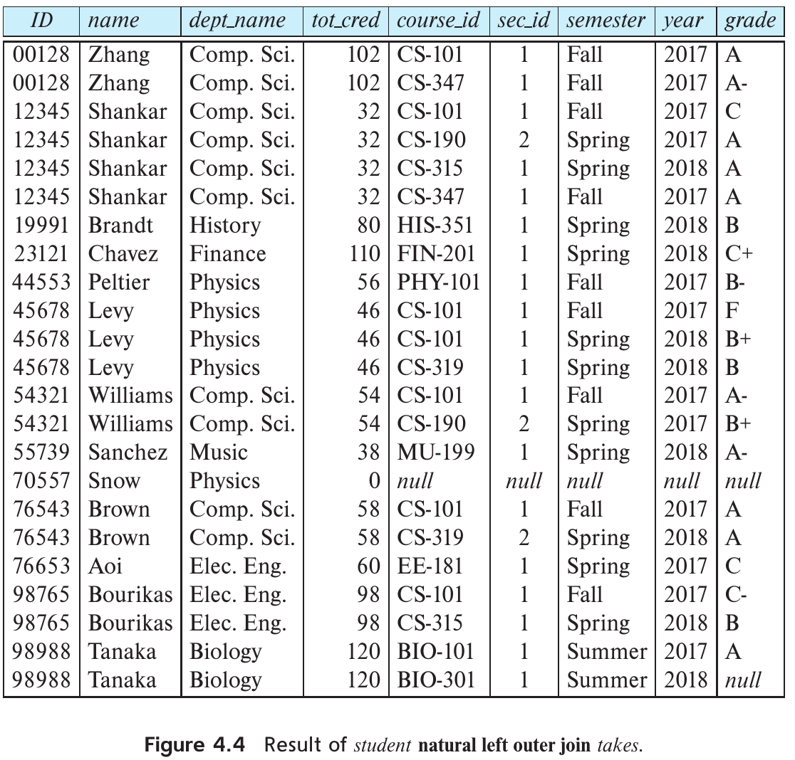

```sql
select ID
from student natural left outer join takes
where course id is null;


select *
from (select *
from student
where dept name = 'Comp. Sci.')
natural full outer join
(select *
from takes
where semester = 'Spring' and year = 2017);
```

## Database Design Using the E-R Model
数据库的设计并不简单,所以我们需要一些好用的模型来组织数据库,比如这章涉及的E-R模型.

### The Entity-Relationship Model
- entity: a “thing” or “object” in the real world that is distinguishable from all other objects.
  - 实体是一个独一无二的个体
- attribute: 实体通过一组属性来表示,每个实体在它的每个属性上都有一个值(value)
- entity set: 共享部分属性的实体集合
- relationship: 多个实体之间的关系
- relationship set: 相同类型的联系集合

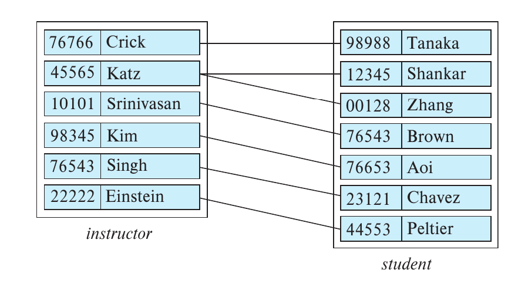

- 看这个图就很好理解了,单独的两个实体,如Crick和Tanaka之间的关系就是relationship,而实体集之间的映射关系就是relationship set
### E-R图
- entity set: 使用矩形来表示,分为两个部分,一部分是实体集的名称,一部分是实体集所有属性的名称
- 实下划线: 标识实体集的主键
- 虚下划线: 在弱实体集中表示普通属性
- relationship set: 使用菱形来标识,通过线条连接到多个实体集
  - relationship set的**描述性属性**用单矩形虚线连接

- **描述性属性**: 单独用虚线从联系集中引出,该属性只属于联系本身.

以“学生（Student）选修（Enroll）课程（Course）”为例：

- 学生有属性：学号、姓名。
- 课程有属性：课程号、课程名。
- 成绩（Grade）：这个属性既不能放在学生表（因为学生选不同课成绩不同），也不能放在课程表（因为不同学生上这门课成绩不同）。它必须依附于“选修”这个联系。

转换成关系模式时,将多对多的联系集单独转换成一张独立的物理表即可,该表的主键为两端实体主键的集合,而描述性属性作为普通字段.
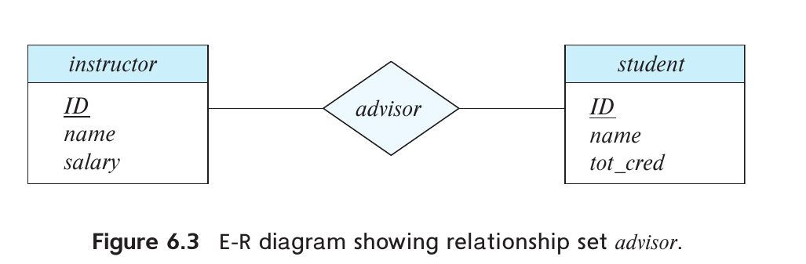

- **映射基数(mapping cardinality)**: 一个实体通过一个联系集关联的其他实体的数量,有以下四种:
  - 一对一: 从联系集到两个实体集各画一个有向线段
  - 一对多: "多方"使用无向线段连接,"一方"使用有向线段
  - 多对一: 与一对多刚好相反
  - 多对多: 两边都是无向线段
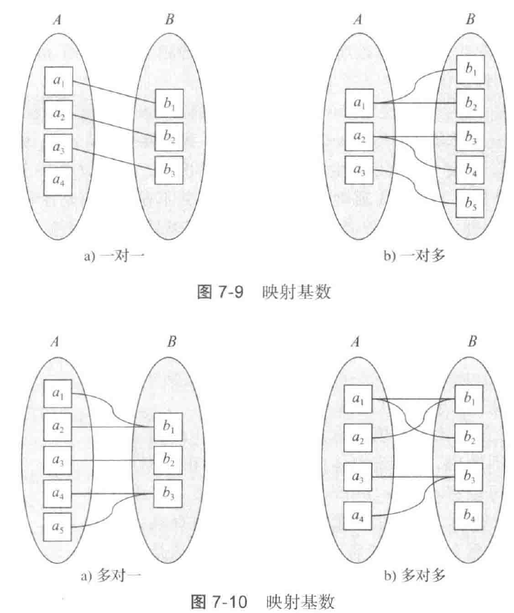

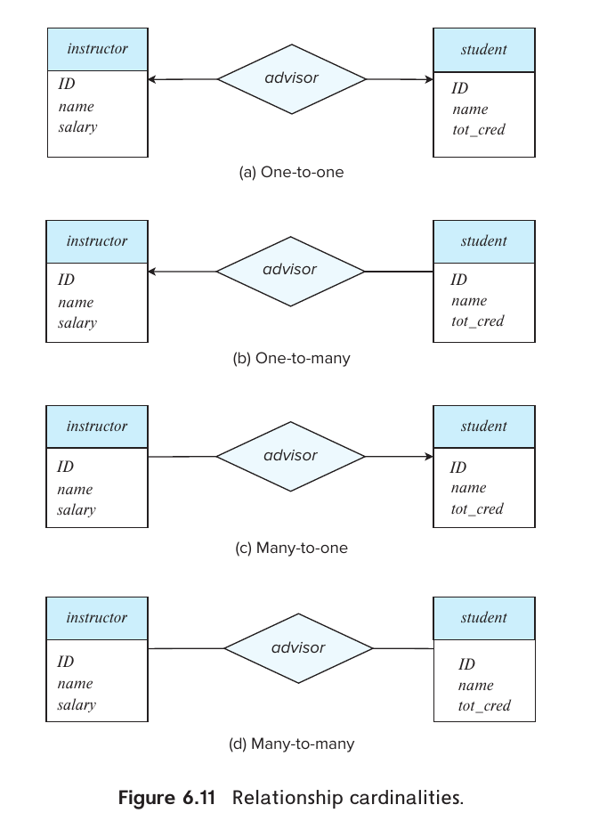

>The participation of an entity set E in a relationship set R is said to be **total** if every entity in E must participate in **at least one** relationship in R. 
If it is possible that some entities in E do not participate in relationships in R, the participation of entity set E in relationship R is said to be **partial**.

使用双线来表示一个实体集在联系集中全部参与.


#### 汇总
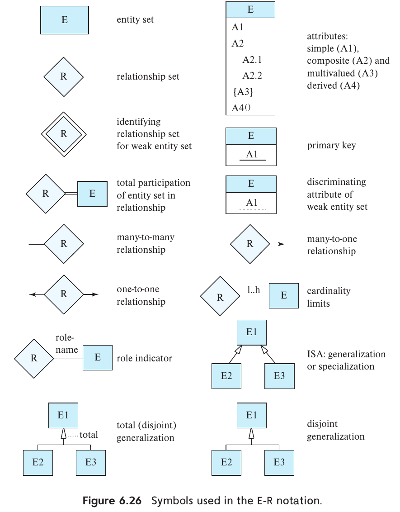


## Relational Database Design
尽管这一章都在说胡话,但是有一道真题是这样的:

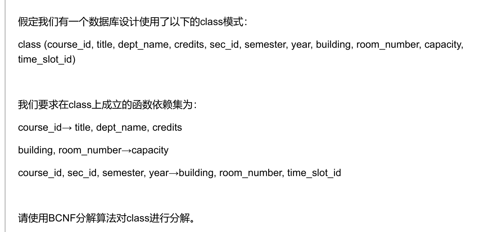

如果看不懂的话还是得老老实实学习的.
### 前置概念
- **关系模式(relational schema)**: 创建关系表的sql代码
- **无损分解(lossless decomposition)**: 如果将一个关系模式分解成两个关系模式的并集后没有丢失信息,那么就称这是一个无损分解

如果用公式定义的话,是这样的:
```sql
select * 
from(select R1 from r)
    natural join
    (select R2 from r)
```

- **函数依赖**(functional dependency): 如果关系表中的任意两个元组t1和t2,对于其中的某两个属性α和β,如果满足当`t1[α]=t2[α]`时,`t1[β]=t2[β]`,则说该关系表**满足函数依赖**`α->β`.
- 如果所有使用了r(R)关系模式的表都满足函数依赖`α->β`,就称该函数依赖在r(R)上成立(hold).
- **平凡(trivial)**: 如果某些函数依赖被所有关系都满足,则称这类函数依赖是平凡的,一个非常常见的例子是,**如果 β ⊆ α,则形如 α → β 的函数依赖是平凡的**. 

- **闭包(closure)**: 从给定的关系r(R)上成立的函数依赖集合F中推导出的所有函数依赖的集合,*类似于离散数学中的闭包概念*.

那么R1和R2能够构成R的无损分解的条件是,以下函数依赖中至少有一个是在R导出的闭包中:
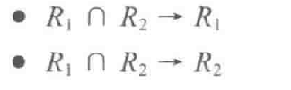

例如:
```sql
instructor (ID, name, dept_name, salary)
department (dept_name, building, budget)
```
>请考虑这两个模式的交集，即 dept_name。我们发现，由于 dept_name → dept_name, building, budget，因此满足无损分解的规则。

- **多值依赖**: 在关系模式中，当属性集 A 的值确定时，属性集B 有一组确定的值与之对应，且这组值的取值仅取决于 A 而与表中其他属性 C 完全无关。
  - 更通俗的说,当B的取值与C无关时,若C有n种取值,如果A增加一个B的值,那么就需要再插入n行从而保证不会有信息丢失.
  - 所有的函数依赖都是多值依赖.

### 范式
我们根据范式(Normal Form)来设计和更改数据库的关系表,减少数据的冗余和堆叠.
#### 概览

1. 第一范式 (1NF)：属性原子性

* **核心：** 每一列都是不可分割的最小数据单元。
* **要求：** 表中不包含集合、数组或组合属性（如“地址”不能同时包含省、市、区，必须拆分）。

2. 第二范式 (2NF)：完全函数依赖

* **核心：** 在满足 1NF 的基础上，消除非主属性对码的**部分函数依赖**。
* **要求：** 如果主键由多个属性组成（复合主键），非主属性必须依赖于整个主键，而不能只依赖于其中的一部分。

3. 第三范式 (3NF)：消除传递依赖

* **核心：** 在满足 2NF 的基础上，消除非主属性对码的**传递函数依赖**。
* **要求：** 属性不应通过另一个非主属性间接依赖于主键。例如，在 `instructor` 模式中，如果 `dept_name` 决定了 `building`，则 `building` 对主键 `ID` 存在传递依赖，应拆分为独立模式。

4. BCNF (Boyce-Codd 范式)：主属性的约束

* **核心：** 在满足 3NF 的基础上，消除**主属性**对码的部分或传递函数依赖。
* **要求：** 对于任何非平凡函数依赖 $\alpha \rightarrow \beta$，$\alpha$ 必须是一个超码。
* **示例：** 如图中所示，通过将原始模式分解为 `instructor (ID, name, dept_name, salary)` 和 `department (dept_name, building, budget)`，由于 `dept_name` 是其所在模式的码（即满足 $dept\_name \rightarrow building, budget$），这种分解保证了数据一致性并满足无损分解规则。


>不太像人话,接下来详细解释.
#### Boyce-Codd(BCNF)范式
该范式要求对于闭包中所有形如α->β的函数依赖,至少满足下面的一项:
1. α->β是平凡的函数依赖(即β ⊆ α)
2. α是模式R的一个超码(即可以区分出R中的任何一个元组)

>用人话来说,**当β不属于α时,需要确保α能够唯一标识这个元组,才能够保证在α相等时β也一定相等.**

- 第一个条件都是凑数的,α中的所有属性取值相等时,β中的所有属性自然取值相等.
#### 第三范式
它的约束比BCNF范式要弱一点,对于闭包中所有形如α->β的函数依赖,至少满足下面的一项:
1. α->β是平凡的函数依赖(即β ⊆ α)
2. α是模式R的一个超码(即可以区分出R中的任何一个元组)
3. β - α中的每个属性A都被包含于R的一个候选码(candidate key)中.

>用人话说,就算β中有部分属性不属于α,而且α本身不能唯一标识一个元组,但是这些多余的属性能够帮助标识元组,就不会丢失信息.
#### 第四范式
4NF是在BCNF的基础上设定的,需要满足以下条件:
1. α->β是一个平凡的多值依赖
2. α是R的一个超码

一个更为正常的说法是: 第四范式（4NF）要求关系模式在满足 BCNF 的基础上，消除所有非平凡且不以超码为前提的多值依赖，确保表中每一对独立的一对多关系都被剥离到独立的物理表中。

#### 第一范式
如果一个属性是不可再分的,即没有集合和字典,只是单个值,那么就说它是**原子的(atomic)**.

如果一个关系R中的所有属性都是原子的,那么就说R满足第一范式(First Normal Form,1NF).

- 显然这个范式基本所有关系模式都可以满足.


### 函数依赖的计算
- 逻辑蕴含(logically imply): 如果关系r(R)上的每一个满足F的实例也满足f,那么就称R上的函数依赖f被R上的函数依赖集F所逻辑蕴含.
- 闭包: F的闭包是被F所逻辑蕴含的所有函数依赖的集合,记作$F^+$

- Armstrong's axiom(阿姆斯特朗公理)用于寻找被逻辑蕴含的函数依赖:
  * **自反律**（reflexivity rule）：若 $\alpha$ 为一个属性集且 $\beta \subseteq \alpha$，则 $\alpha \rightarrow \beta$ 成立。
  * **增补律**（augmentation rule）：若 $\alpha \rightarrow \beta$ 成立且 $\gamma$ 为一个属性集，则 $\gamma \alpha \rightarrow \gamma \beta$ 成立。
  * **传递律**（transitivity rule）：若 $\alpha \rightarrow \beta$ 成立且 $\beta \rightarrow \gamma$ 成立，则 $\alpha \rightarrow \gamma$ 成立。

>两个集合写在一起表示**并集**

我们可以加上一些附加规则让它更有用一点:
* **合并律**（union rule）：若 $\alpha \rightarrow \beta$ 成立且 $\alpha \rightarrow \gamma$ 成立，则 $\alpha \rightarrow \beta\gamma$ 成立。
* **分解律**（decomposition）：若 $\alpha \rightarrow \beta\gamma$ 成立，则 $\alpha \rightarrow \beta$ 成立且 $\alpha \rightarrow \gamma$ 成立。
* **伪传递律**（pseudotransitivity rule）：若 $\alpha \rightarrow \beta$ 成立且 $\gamma\beta \rightarrow \delta$ 成立，则 $\alpha\gamma \rightarrow \delta$ 成立。

伪代码计算闭包:

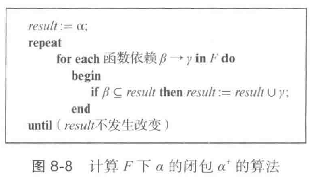

- 真这么写的话是要疯的

### 函数依赖分解算法(重点!)
#### BCNF分解
##### 验证函数依赖是否符合BCNF
使用BCNF分解前,我们需要先判断关系模式是否满足BCNF,即检查某个非平凡的依赖是否违反BCNF: **验证`α->β`中的α是否是R的一个超码**

更为通俗的检查步骤如下:
1. 如果α是β的超集,那肯定满足,不必验证,所以需要找非平凡的函数依赖
2. 根据BCNF范式,我们需要验证α是否是R的一个超码(实际题目中我们往往找到的都是候选码)

##### 一个详尽的例子
上述的说明不太形象,但我有一个很好的例子:

模式 $R = (\text{course\_id, title, dept\_name, credits, sec\_id, semester, year, building, room\_number, capacity, time\_slot\_id})$
函数依赖集 $F$：

1. $f_1: \text{course\_id} \rightarrow \text{title, dept\_name, credits}$
2. $f_2: \text{building, room\_number} \rightarrow \text{capacity}$
3. $f_3: \text{course\_id, sec\_id, semester, year} \rightarrow \text{building, room\_number, time\_slot\_id}$


**候选码（Candidate Key）检查**：
通过属性闭包计算，该模式的候选码为 $(\text{course\_id, sec\_id, semester, year})$。

这个候选码是怎么计算出来的呢,我们按照以下准则判断属性是否在候选码中:
1. L 类（仅出现在左侧）：这些属性一定包含在候选码中。
2. R 类（仅出现在右侧）：这些属性一定不包含在候选码中。
3. N 类（两侧均未出现）：这些属性一定包含在候选码中。
4. LR 类（两侧均出现）：可能包含在候选码中

这个准则其实很好理解: 如果某个属性可以由其他属性推出,那么它一定不在候选码中;如果一个属性不能被其他属性推出,它一定在候选码中.

##### 对不符合BCNF的函数依赖进行模式分解
如果某个函数依赖不符合BCNF,我们就需要将这个函数依赖提取出来独立成表,并将左侧属性保留在原表中,将右侧属性提取到新表中,这样产生的两个表就都满足BCNF了
##### 一个详尽的例子
- 接着上述的例子进行说明

检查 $f_1: \text{course\_id} \rightarrow \text{title, dept\_name, credits}$。

* $\text{course\_id}$ 不是 $R$ 的超码。
* 该依赖违反 BCNF，需进行分解。

**分解结果**：

* $R_1 = (\text{course\_id, title, dept\_name, credits})$，候选码为 $\text{course\_id}$。满足 BCNF。
* $R_{\text{rest1}} = (\text{course\_id, sec\_id, semester, year, building, room\_number, capacity, time\_slot\_id})$。


在 $R_{\text{rest1}}$ 中，候选码依然是 $(\text{course\_id, sec\_id, semester, year})$。
检查 $f_2: \text{building, room\_number} \rightarrow \text{capacity}$。

* $\{\text{building, room\_number}\}$ 不是 $R_{\text{rest1}}$ 的超码。
* 该依赖违反 BCNF，需继续分解。

**分解结果**：

* $R_2 = (\text{building, room\_number, capacity})$，候选码为 $(\text{building, room\_number})$。满足 BCNF。
* $R_{\text{rest2}} = (\text{course\_id, sec\_id, semester, year, building, room\_number, time\_slot\_id})$。


在 $R_{\text{rest2}}$ 中，剩下的函数依赖为：

* $f_3: \text{course\_id, sec\_id, semester, year} \rightarrow \text{building, room\_number, time\_slot\_id}$
此时，决定因素 $\{\text{course\_id, sec\_id, semester, year}\}$ 正是 $R_{\text{rest2}}$ 的候选码。
* 该模式满足 BCNF。

最终分解为以下三个模式，均满足 BCNF：

1. **Course** $(\text{course\_id, title, dept\_name, credits})$
2. **Room** $(\text{building, room\_number, capacity})$
3. **Class_Section** $(\text{course\_id, sec\_id, semester, year, building, room\_number, time\_slot\_id})$

##### 总结
整体上来看是非常好理解的,只不过书上说的不太像人话而已.

#### 3NF分解
原理与BCNF分解别无二致,不同的地方只有一个: 验证函数依赖是否满足3NF时,就算α不是超码,如果β中的属性都是候选码的话,也说明它满足3NF

一道例题如下,不用过多讲解:

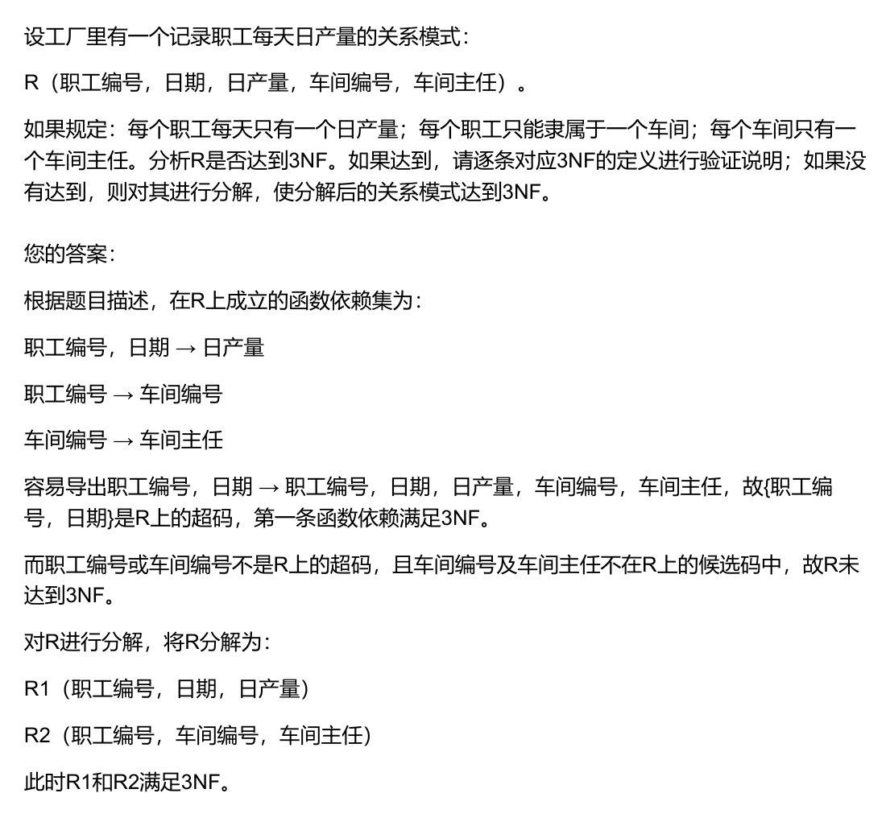

#### 4NF分解
如果一个满足BCNF的关系表中有两个关于同一个属性R的多值依赖,那么它仍然违反了4NF,需要将这两个多值依赖分别拆分出来,才能让属性R变成超码.
### 时态函数依赖
有时候我们会对一个数据设定有效期,用`start`和`end`两个变量表示:
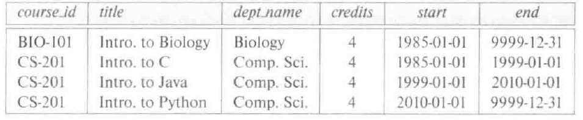

- 快照(snapshot): 某个元组在特定时刻的数据值.

那么,时态函数依赖的定义如下:

- 对于r(R)的所有实例,r的所有快照都满足函数依赖α->β.


## Complex Data Types
>In this chapter, we discuss several non-atomic data types that are widely used,including **semi-structured data, object-based data, textual data, and spatial data**.
### Semi-structured Data
#### Overview of Semi-structured Data Models
##### Flexible Schema
Some database systems allow each tuple to potentially have a different set of attributes;
such a representation is referred to as a **wide column** data representation. 
The set of attributes is not fixed in such a representation; **each tuple may have a different set of attributes**, and new attributes may be added as needed.

A more restricted form of this representation is to have a fixed but very large number of attributes, with each tuple using only those attributes that it needs, leaving the rest with null values; such a representation is called a **sparse column**(稀疏表)  representation.

##### Multivalued Data Types
>Some representations allow attributes to store key-value maps, which store key-value pairs. A **key-value map**, often just called a map, is a set of (key, value) pairs, such that each key occurs in at most one element. 
##### Nested Data Types
All of these data types represent a hierarchy of data types, and that structure leads to the use of the term nested data types. 
- JSON和XML是该数据库类型的最重要的两个代表

#### JSON(JavaScript Object Notation)
>The **JavaScript Object Notation** (JSON), is a textual representation of complex data types that is widely used to transmit data between applications and to store complex data. 
JSON supports the primitive data types integer, real and string, as well as arrays,
and “objects,” which are a collection of (attribute name, value) pairs.


```json
{
  "ID": "22222",
  "name": {
    "firstname: "Albert",
    "lastname: "Einstein"
  },
  "deptname": "Physics",
  "children": [
    {"firstname": "Hans", "lastname": "Einstein" },
    {"firstname": "Eduard", "lastname": "Einstein" }
  ]
}
```
#### XML(Extensible Markup Language)
>The **XML** data representation adds tags enclosed in angle brackets, <>, to mark up information in a textual representation. 
Tags are used in pairs, with <tag> and </tag> delimiting the beginning and the end of the portion of the text to which the tag refers.
```xml
<course>
  <course_id> CS-101 </course_id>
  <title> Intro. to Computer Science </title>
  <dept_name> Comp. Sci. </dept_name>
  <credits> 4 </credits>
</course>
```
### Object Orientation
Three approaches are used in practice for integrating object orientation with
database systems:
1. Build an **object-relational database system**, which adds object-oriented features to a relational database system.
2. Automatically convert data from the native object-oriented type system of the programming language to a relational representation for storage, and vice versa for retrieval. Data conversion is specified using an **object-relational mapping**.
3. Build an **object-oriented database system**, that is, a database system that natively supports an object-oriented type system and allows direct access to data from an object-oriented programming language using the native type system of the language.

We provide a brief introduction to the first two approaches in this section. 
#### Object-Relational Database Systems
**User-Defined Types**
```sql
create type Person
(ID varchar(20) primary key,
name varchar(20),
address varchar(20))
ref from(ID);

create table people of Person;

-- We can create a new person as follows:

insert into people (ID, name, address) values
('12345', 'Srinivasan', '23 Coyote Run');
```
**Type Inheritance**
```sql
create type Student under Person
(degree varchar(20)) ;
create type Teacher under Person
(salary integer);
```

**Table Inheritance**
```sql
-- PostgreSQL
create table students
(degree varchar(20))
inherits people;
create table teachers
(salary integer)
inherits people;
```
#### Object-Relational Mapping(ORM)
>**A fringe benefit** of using an ORM is that any of a number of databases can be used
to store data, with exactly the same high-level code. ORMs hide minor SQL differences
between databases from the higher levels. Migration from one database to another is
thus relatively straightforward when using an ORM, whereas SQL differences can make
such migration significantly harder if an application uses SQL to communicate with
the database.

>**On the negative side**, object-relational mapping systems can suffer from significant
performance inefficiencies for bulk database updates, as well as for complex queries
that are written directly in the imperative language. It is possible to update the database
directly, bypassing the object-relational mapping system, and to write complex queries
directly in SQL in cases where such inefficiencies are discovered.
### Textual Data
>Textual data consists of unstructured text. The term **information retrieval** generally refers to the querying of unstructured textual data.
#### Keyword Queries
A keyword query retrieves documents whose set of keywords contains all the keywords in the query.

搜索引擎是information retrieval systems的典型例子,根据关键词返回网页内容.

#### Relevance Ranking
>The set of all documents that contain the keywords in a query may be very large; in
particular, there are billions of documents on the web, and most keyword queries on
a web search engine find hundreds of thousands of documents containing some or all of the keywords.

Information-retrieval systems therefore estimate relevance of documents to a query and return only highly ranked documents as answers.
##### Ranking Using TF-IDF
- **term**: refers to a keyword occurring in a document, or given as part of a query.
- TF: term frequency

One way of measuring TF(d, t), the relevance of a term t to a document d, is:
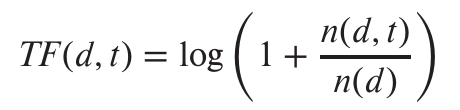
where n(d) denotes the number of term occurrences in the document and n(d, t) denotes the number of occurrences of term t in the document d.

>However, not all terms used as keywords are equal. Suppose a query uses two terms, one
of which occurs frequently, such as “database”, and another that is less frequent, such
as “Silberschatz”. A document containing “Silberschatz” but not “database” should be
ranked higher than a document containing the term “database” but not “Silberschatz”.

To fix this problem, weights are assigned to terms using the inverse document fre-
quency (IDF), defined as:
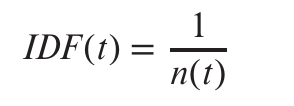

where n(t) denotes the number of documents (among those indexed by the system) that contain the term t. The **relevance** of a document d to **a set of terms Q** is then defined as:
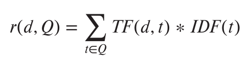

>Almost all text documents (in English) contain words such as “and,” “or,” “a,” and
so on, and hence these words are useless for querying purposes since their inverse doc-
ument frequency is extremely low. Information-retrieval systems define a set of words,
called **stop words**, containing 100 or so of the most common words, and ignore these
words when indexing a document. Such words are not used as keywords, and they are
discarded if present in the keywords supplied by the user.
- 这就是为什么输入`python和爬虫`得到的结果与`python 爬虫`相差无几的原因
##### Ranking Using Hyperlinks
>Hyperlinks between documents can be used to decide on the overall importance of
a document, independent of the keyword query; for example, documents linked from
many other documents are considered more important.

Pagerank是该排序方法的著名代表之一

### Spatial Data
Two types of spatial data are particularly important:
1. Geographic data: such as road maps, land-usage maps, topographic elevation maps, political maps showing boundaries.
2. Geometric data:  include spatial information about how objects— such as buildings, cars, or aircraft— are constructed

游戏建模,谷歌地图都属于空间数据这一范畴
## 第二次小测复习(5/7)
- 这次小测考6,7,8章

对比一下中英文版本,所有标题都有对应,那就直接看中文版了,而第8章只有英文版可以看了:

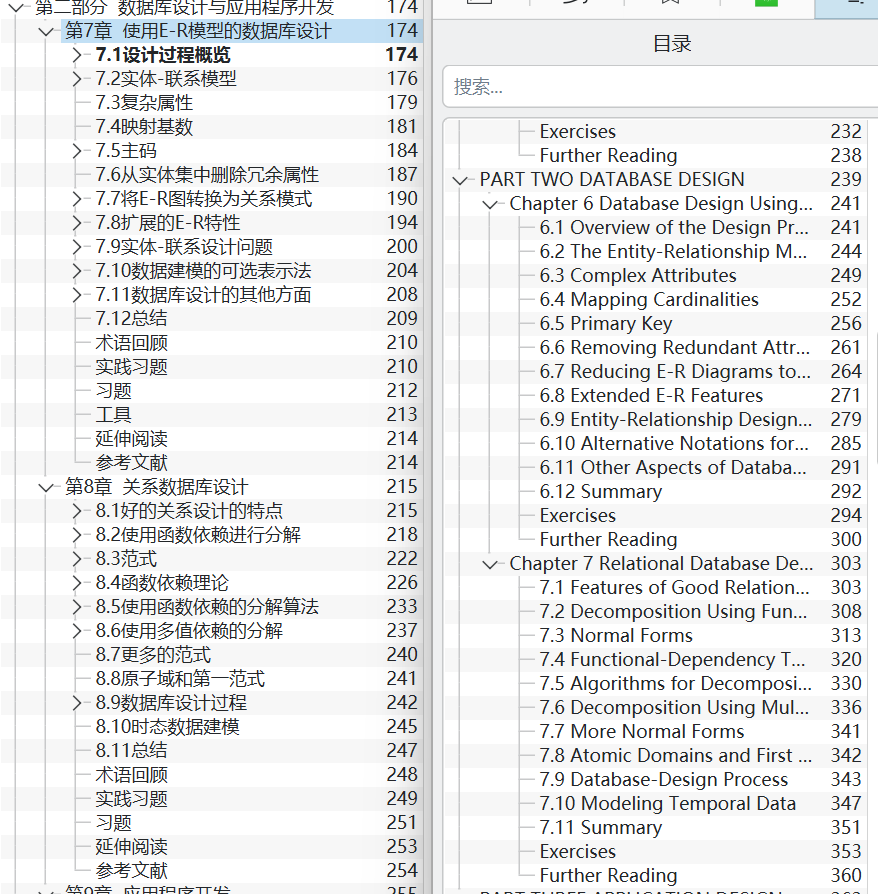

### ch6: E-R模型引入

#### 概念
- **entity(实体)**: 对应关系表中的某一项,可以通过特定的标签与其他实体区分开来
- **entity set(实体集)**: 对应关系表,是实体的一个集合,例如所有教师,所有学生.
- **relationship(联系)**: 两个或者多个实体间的关联
- **relationship set(联系集)**: 相同类型联系的集合
- **弱实体集(weak entity)**: 该实体集的主码有一部分是来自其他实体集的,不能独立存在;相对的,如果主码是独立的,就称为**强实体集**
- **特化(specialization)/概化(generalization)**: 类似于OOP中的子类/父类.
  - 特化是将父类继承给多个子类,如果只允许子类与父类一对一继承,那么称为**不相交特化**,如果允许多个子类继承一个父类,那么称为**重叠特化**
  - 概化则是说将多个子类抽象成一个父类,与特化相对
##### 映射基数
- 映射基数: 一个实体通过一个联系集关联的另一些实体的数量.

对于实体集A和B之间的二元联系集R来说,映射基数有四种情况:

1. 一对一
2. 一对多: A中的一个实体可以与B中任意数量的实体相关联.
3. 多对一: A中的一个实体至多与B中的一个实体关联,但B中的一个实体可以与A中任意数量的实体相关联.
4. 多对多

这里的`一对多`和`多对一`如果不好理解的话,可以把`对`看成一个动作指向动词.比如说`一对多`中,A的一个实体**对应了**B中的多个实体.

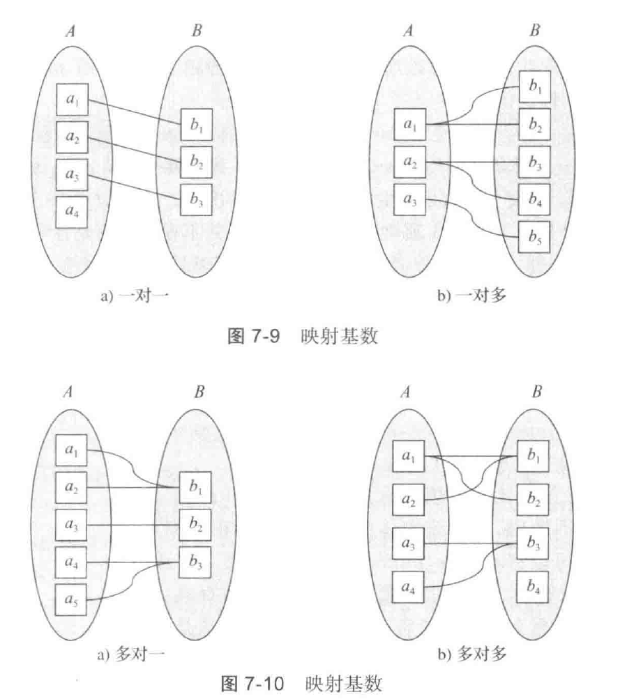
#### E-R图
**实体集**用矩形来表示:
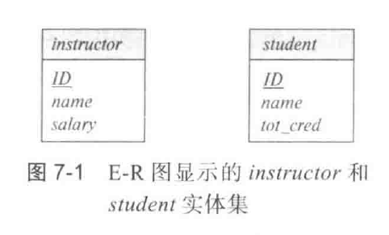

**弱实体集**用双边框矩形表示:
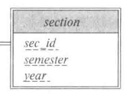

**联系集**用菱形来表示:
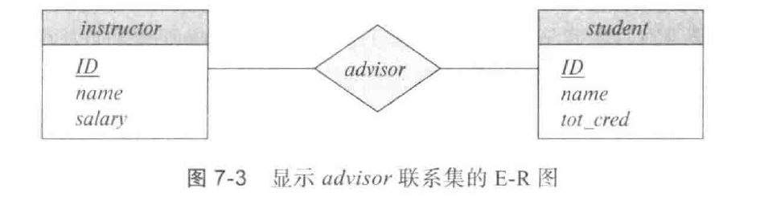

关联弱实体集的强实体集与弱实体集之间的**联系集**用双边框菱形来表示:
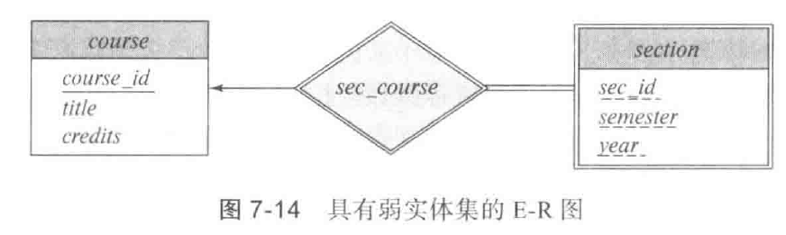

**映射基数**用有向线段和无向线段来区分,有向线段表示从另一边**只能触及箭头指向方的一个实体**,无向线段表示从另一边指向这一方**没有任何指向限制**:

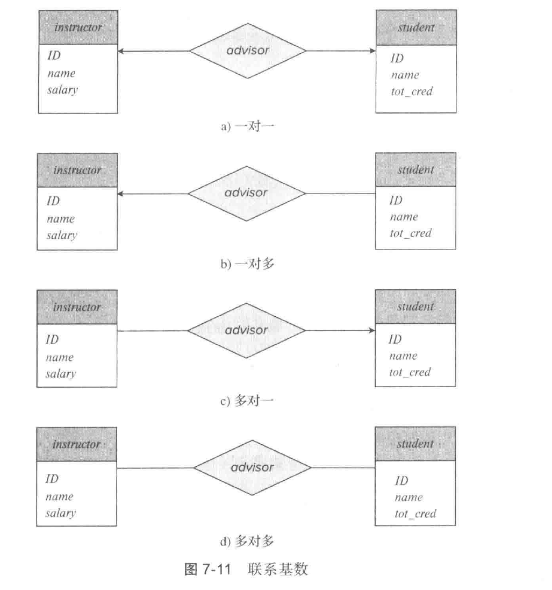

如果实体集中的所有实体都必须参与到联系集R中,那么就称实体集在R中的参与是**全部的**,用**双线**表示,如果允许部分实体不参与,则称为**部分的**,仍然用单线表示.
#### 考点
1. 画E-R图
   1. 考试应该会给出属性和联系,不然根本不好改卷,那就很好画了
2. 将E-R图转换成关系模式
   1. 首先所有的实体集都可以轻松的转换成关系模式,标注主键即可
   2. 联系集需要分别引用双方的主键,并加入自身的描述性属性

应该就3道大题30分.
### ch7: 关系数据库设计
#### 考点
1. 范式分解
   1. 可能考一个3NF分解和一个BCNF分解,不管怎样确实都很简单
   2. BCNF分解如果不是超码就直接分解,而3NF分解还需要考虑β中的属性是否属于候选码.
   3. 鉴于内容太少,有可能会考一个多值依赖分解.

应该就三道大题40分.

### ch8: Complex Data Types(过)
#### 关系型数据库的面向对象特性
- **构造函数**
```sql
create type Person
    (ID varchar(20) primary key,
    name varchar(20),
    address varchar(20))
    ref from(ID);
create table people of Person;
```
上述代码中我们使用自定义的type构造了一个新的关系表,使用`of`关键字实现构造.

我们还可以使用type自定义新的数据类型:
```sql
create type interest as table (
topic varchar(20),
degree of interest int
);
create table users (
ID varchar(20),
name varchar(20),
interests interest
);
```

- type间的**继承**
```sql
create type Student under Person
(degree varchar(20)) ;
create type Teacher under Person
(salary integer);
```
- 括号内是继承后新增的属性

- table间的**继承**
```sql
create table people of Person;
create table students of Student
under people;
create table teachers of Teacher
under people;
```
- 通过`inherits`关键字实现继承

##### 引用的处理
- 习题里都是这个,期末考试肯定不考,但小测可能会考.
- 这个特性只有Oracle支持

```sql
create type Person
(ID varchar(20) primary key,
name varchar(20),
address varchar(20))
ref from(ID);
create table people of Person;

create type Department (
dept name varchar(20),
head ref(Person) scope people);
create table departments of Department;
```
- 这里的ref关键字是Oracle的写法,而前面的教材使用通用的references写法.
- `scope`关键字用于将引用限定到某一个表实例上

#### RDF和SPARQL
- 鉴于数据库老师非常非常sb,所以有可能会考这种犄角旮旯的语法.

RDF(Resource Description Framework)使用以下两种形式的三元组来标识数据:
1. `(ID, attribute-name, value)`
2. `(ID1, relationship-name, ID2)`

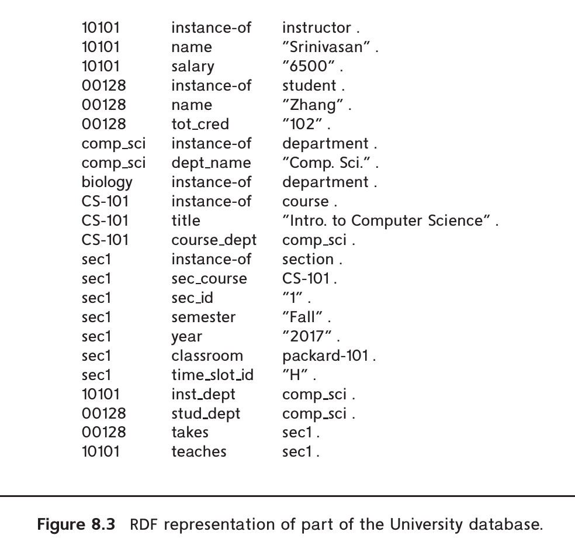
三元组中的第一个属性被称为subject,第二个被称为predicate(谓词),第三个被称为object.

RDF有以下特性:
1. 只支持二元关系,无法表示多元关系
2. 可以简单的用图像来表示

**一张示意图**
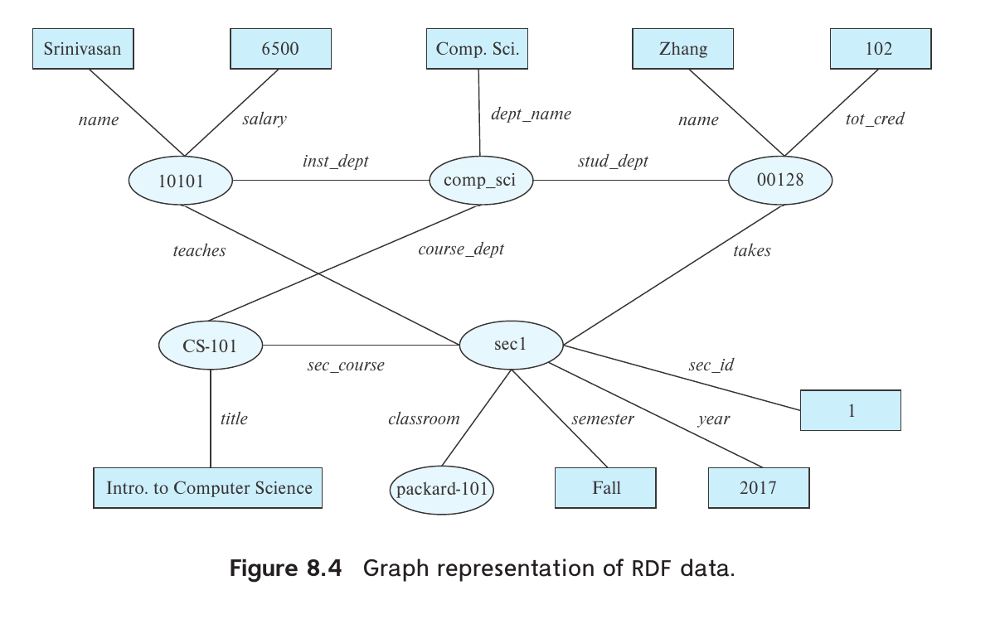

>For example, the question “Which city is the capital of the U.S.A.?” can be answered by looking for an edge labeled capital-of, linking an entity to the country U.S.A.

由于RDF的特殊结构,使用SQL语句是无法处理的,需要用特殊的三元模式语法:
```sql
?cid title "Intro. to Computer Science"
```
上述语句会匹配所有的predicate是title,object是  “Intro. to Computer Science”的三元组,也就是说`?cid`是一个通配符,匹配所有的值.

- `?cid`可以随便起名,只要用`?`打头就是通配符,叫`?dog`也可以.

我们还可以将多个三元模式写在一起:
```sql
?cid title "Intro. to Computer Science"
?sid course ?cid
```
- 同名通配符表示这两个属性得是相同的值.

#### 搜索引擎算法
为了衡量搜索语句中某个关键词的分量,我们可以使用这个简单的算法:
$$TF(d, t) = \log \left( 1 + \frac{n(d, t)}{n(d)} \right)$$

- t(term): 文档中的某个关键字
- d(document): 文档的内容
- TF(Term Frequency): 关键字在文档中的出现频率
- n(d,t): t在d中出现的次数
- n(d): d中的总字数.

在搜索引擎中,不常用的关键词(如slizerbetz)显然需要比常用的关键词(如the)设置更高的权重,才可以更好的获取合适的搜索结果.

因此我们引入了inverse document frequency (IDF),用以下公式定义:

$$IDF(t) = \frac{1}{n(t)}$$

- n(t): 搜索引擎中含有该关键词t的文档总数

结合上述的两个式子,我们可以计算出一个文档d与查询关键字集合Q的相关程度:

$$r(d, Q) = \sum_{t \in Q} TF(d, t) * IDF(t)$$

- 这被称为TF-IDF计算方法.
##### PageRank算法

$$P[j] = \delta / N + (1 - \delta) * \sum_{i=1}^{N} (T[i, j] * P[i])$$


* **$P[j]$**：节点 $j$ 的 PageRank 值，代表访问者停留在该页面的概率。
* **$N$**：网络中节点的总数。
* **$\delta$**：**阻尼系数**（Damping Factor）。它代表用户随机跳转到网络中任意一个页面的概率。
* **$\delta / N$**：平滑项，确保每个节点都有一个基础的最小得分，防止由于“悬挂节点”（没有出链的页面）导致概率丢失。
* **$1 - \delta$**：用户通过点击当前页面上的链接继续浏览的概率（通常取值为 $0.85$ 左右）。
* **$\sum_{i=1}^{N}$**：对所有指向节点 $j$ 的入链节点 $i$ 进行求和。
* **$P[i]$**：节点 $i$ 在上一次迭代中的重要性得分。
* **$T[i, j]$**：**转移概率矩阵**。表示从节点 $i$ 跳转到节点 $j$ 的概率。通常定义为 $1 / L(i)$，其中 $L(i)$ 是节点 $i$ 的出链总数。

我看这个应该不会考

#### 考点
1. 面向对象的SQL
   1. 应该会让我们写一个`create type`并进行构造,然后再写一个`create type... under`用来继承
2. 搜索引擎算法
   1. 先计算TF和IDF,然后再针对查询词集合进行汇总.
3. SPARQL语句,应该会拿一个最简单的例子来说明即可.

应该就三道大题30分.


## 第三次小测复习(6/9)
### 小测内容
- 这次小测考第九章之后的部分
* Chapter 9: Application Design
  * 中文版完全对应
* Chapter 10: Big Data
  * 无对应
* Chapter 11: Data Analytics
  * 无对应
* Chapter 12: Physical Storage Systems (Sections 12.5 (RAID) omitted)
  * 刚好对应第十章前四节
* Chapter 13: Storage and File Structure
  * 刚好对应第十章第四节后面的内容
* **Chapter 14: Indexing and Hashing**
  * 基本完全对应11章
* Chapter 15: Query Processing (Section 15.1, 15.2)
  * 刚好对应12章1,2节
* Chapter 17: Transactions
  * 完全对应13章

我现在可以完全确定了,英文班的提纲完全是按照中文版教材来的,所以只看中文版就够了,那些改版后没提到的直接不管就行了,反正也不会考,这也是上次小测带来的血的教训

### ch9: 应用程序开发
- 尽管这章确实没有任何能用的内容,但是由于后面的章节能考的部分太少了,我开始理解为什么会考Java了
- 好的,在看了后面的内容后,我确定这次会考Java了.

#### Java Servlet速通
Servlet是Java的一个网络框架
### ch10: 存储管理(过)
这章没有任何能考的内容.
### ch11: 索引
有两种基本的索引类型: 顺序索引(ordered index)和散列索引(hash index).

其中,用于在文件中查找某项记录的属性或者属性集被称为**搜索码(search key)**
#### 顺序索引
顺序索引按照一定的顺序存储搜索码的映射表,分为两种结构:
1. 聚集索引(clustering index): 也被称为主索引(primary index),搜索码的顺序与记录的排列顺序相同
2. 非聚集索引(nonclustering index): 也被称为辅助索引,搜索码的顺序与记录的排列顺序不同

按照记录搜索码是否稠密可以将顺序索引分成两类:
- 稠密索引(dense index): 每个搜索码值对应一个索引项,相同搜索码值的其他记录会以链表的形式存储在第一条记录之后
- 稀疏索引(sparse index):只存储少量的搜索码,需要沿着搜索码项向两边寻找找到对应的记录,这需要搜索码的顺序和记录顺序相同,也就是聚集索引.

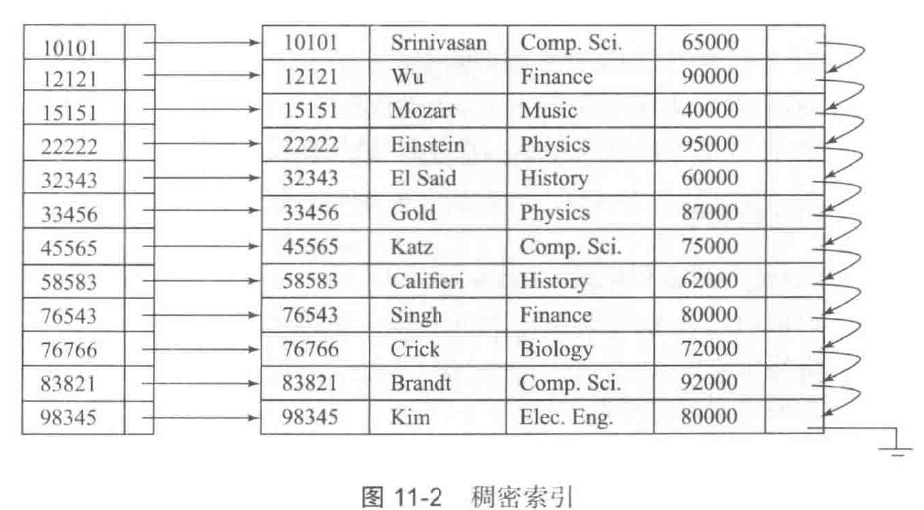

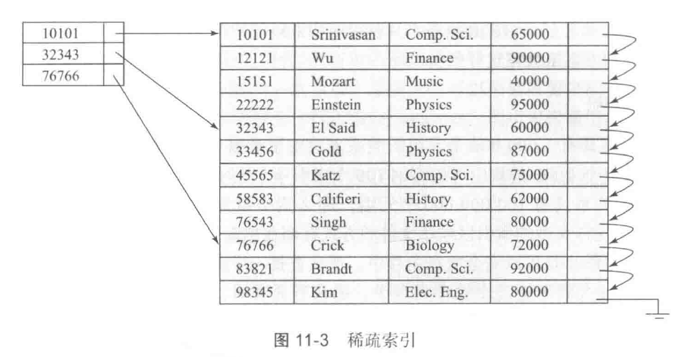


#### B+树索引
B+树是对B树的改进,变成了一个多级索引结构,每一层都存储了下一层所需的索引,用于快速定位索要查找的搜索码.

B+树分为叶节点和内部节点,叶节点存储所需的所有搜索码值,内部节点则用于索引.

对于n阶B+树来说,叶节点最多可有n-1个值,最少要有`(n-1)/2`个值(向上取整),例如4阶B+树的叶节点最多有3个值,最少有2个值.

内部节点用于容纳指向下一层节点的指针,最多有n个指针,最少有`(n/2)`个指针(向上取整),一个节点中的指针数被称为fanout.

- 有n个指针表示该节点有n-1个关键字

根节点包含的指针数可以少于(n/2),但除非整棵树只有一个节点,否则根节点至少要有两个指针.

##### 补充: 第三方讲解的插入与删除
- [知乎文章](https://zhuanlan.zhihu.com/p/149287061)

B+树的查找方式与B树基本类似,不同的是每次查找必须辗转跳到最后一层叶节点,因为内部节点存放的都是指针,但遍历方法还是一样的.

但对于插入与删除来说,实际的做法是不太一样的,这本书讲的太烂了,具体可以看上面那篇知乎文章.

需要注意的是,文中关于插入和删除的说法都过于简单,比如这里:

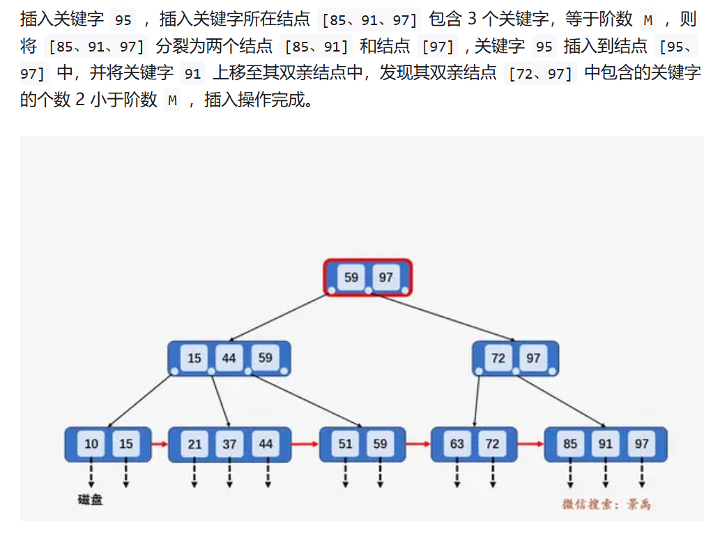

最后上移的节点既可以是91,但也可以是95,具体是看算法怎么写的,而不是一定选择左边的最后一个元素

- 再说,应该是先插入95后再分裂,不然很容易搞混的.
- 不过就算这样,还是比这本书讲的要好.


总体来说,只要牢记,内部节点最多有n个指针,最少有n/2个指针,叶节点最多有n-1个索引,最少有(n-1)/2个索引.如果性质没有被破坏,就无需动脑直接插入/删除即可,如果性质被破坏了,就递归处理.
##### 插入
- 后来看了看,不同教科书对B+树的处理是不一样的,还是得来乖乖看书

每次拆分时,用右子树的**最小搜索码**更新父节点的索引,如果使用其他的搜索码,就无从谈起"索引"了.

拿这张图举例:
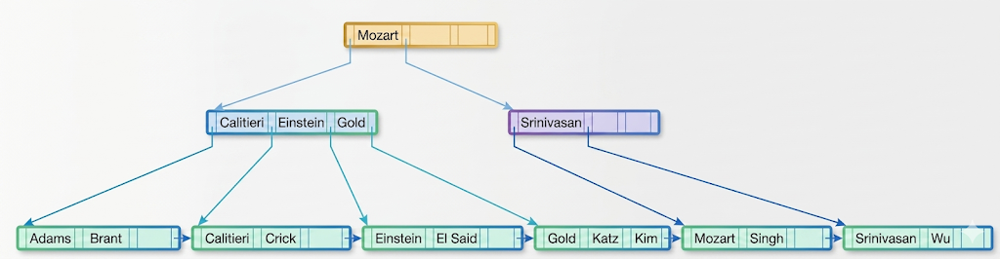

在该n=4的树中插入具有搜索码 “Lamport” 时,第一次是插入叶节点的"Kim"后面,由于超过限制,所以要进行拆分,将Kim提升到父节点中Gold的前面,这次又超过了限制,再次进行拆分,将Gold提升到了根节点Mozart的前面,最后的结果如下:

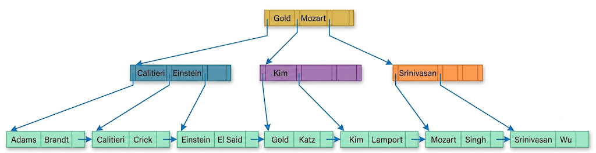

总体来说就是,**叶节点的提升需要保留原来的节点,这是B+树独有的性质,而内部节点的提升与B树一样,都需要删除原节点**.
##### 删除
对于删除来说,有时候需要进行合并操作,从而确保每个内部节点是半满的.

还是拿这张图举例,这次Srinivasan是要被删除的项:


先从叶节点开始着手,删除后由于不满足叶节点的限制,而他的兄弟又刚好只有两个节点,所以只能执行合并操作,合并之后,父节点随之更新搜索码为Mozart,由于内部节点最少需要2个指针,不满足限制条件,所以需要与兄弟节点合并,合并之后超过了限制,所以将Gold提升上去即可.

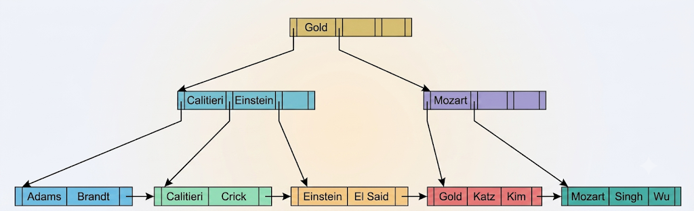

如果要继续删除Singh和Wu,第一次不会有任何影响,直接删除即可,第二次删除Wu导致叶节点只有一个搜索码,所以再次进行合并,由于超出限制,需要进行拆分,并用Kim这个右子树的最小搜索码更新父节点的搜索码.

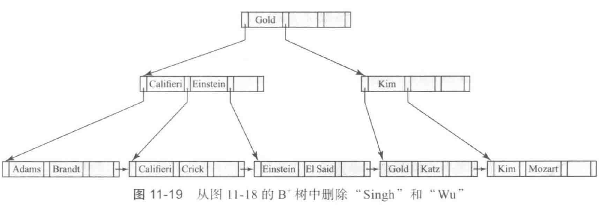

如果还要在上述基础上删除Gold,这次需要再一次合并,并更新Kim为Katz,由于父节点只有一个指针,超出了限制,只能与兄弟节点合并,但这次又违反了**根节点必须要有两个指针的情况**,刚好可以把它删除.

但书上并没有把Gold更新为Katz,而是保留了原码:
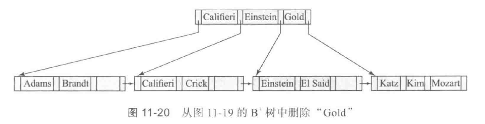
- 要我说,这就是在扯淡,删除的时候明明可以顺带更新的

拿这个题目为例:

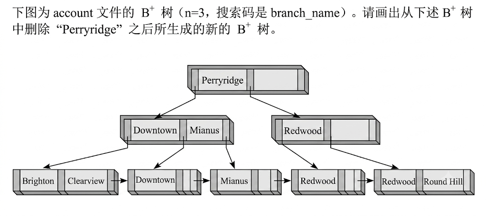

标准答案也并没有保留Perryridge,而是保留了Mianus.


#### 散列索引(过)
#### sql中的索引
尽管SQL标准没有指定创建索引的语法,但大多数数据库都支持创建/删除索引:
```sql
create/drop index <index-name> on <relation-name> (attribute-name);
```

#### 位图索引(过)
### ch12: 查询处理与查询优化(过)
- 只要看1,2节,不太理解为什么,无所谓,反正没有任何内容
### ch13: 事务管理
- 事务(transactions): 对数据库中部分数据的一次操作,需要满足ACID特性,即原子性(atomicity),一致性(consistency),隔离性(isolation),持久性(durability).
  - 分别表示: 事务要么发生要么就不发生,满足所有的数据库依赖,并发执行的事务不会相互影响,事务一旦执行完毕就无法撤销或者被打断后可以再次恢复.
#### 一个简单的事务模型
我们假设有两个事务:
- read(X): 从数据库读取数据项X
- write(X): 将数据项X写入数据库

那么从账户A转账50美元到账户B可以用下述代码体现:

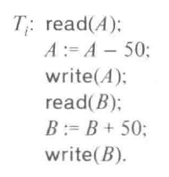

如果要满足ACID特性的话,需要这么做:
- 一致性: 事务执行前后A和B的总和不变
- 原子性: 使用日志记录事务的执行过程,即便在转账过程中出现故障也可以在之后恢复
- 持久性: 在事务执行完毕前就将数据写入磁盘
- 隔离性: 使用并发控制系统管理事务.


## 本教材核心: 大学数据库
- keys used
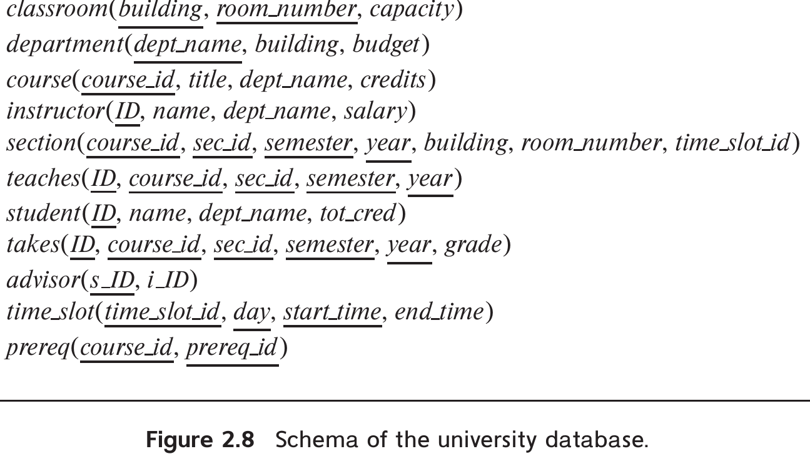

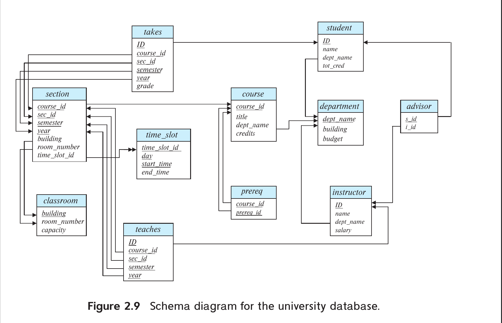
- schema diagram

## 关系表解析
```sql
create table classroom
  (building		varchar(15),
   room_number		varchar(7),
   capacity		numeric(4,0),
   primary key (building, room_number)
  );

create table department
  (dept_name		varchar(20), 
   building		varchar(15), 
   budget		        numeric(12,2) check (budget > 0),
   primary key (dept_name)
  );

create table course
  (course_id		varchar(8), 
   title			varchar(50), 
   dept_name		varchar(20),
   credits		numeric(2,0) check (credits > 0),
   primary key (course_id),
   foreign key (dept_name) references department (dept_name)
    on delete set null
  );

create table instructor
  (ID			varchar(5), 
   name			varchar(20) not null, 
   dept_name		varchar(20), 
   salary			numeric(8,2) check (salary > 29000),
   primary key (ID),
   foreign key (dept_name) references department (dept_name)
    on delete set null
  );

create table section
  (course_id		varchar(8), 
         sec_id			varchar(8),
   semester		varchar(6)
    check (semester in ('Fall', 'Winter', 'Spring', 'Summer')), 
   year			numeric(4,0) check (year > 1701 and year < 2100), 
   building		varchar(15),
   room_number		varchar(7),
   time_slot_id		varchar(4),
   primary key (course_id, sec_id, semester, year),
   foreign key (course_id) references course (course_id)
    on delete cascade,
   foreign key (building, room_number) references classroom (building, room_number)
    on delete set null
  );

create table teaches
  (ID			varchar(5), 
   course_id		varchar(8),
   sec_id			varchar(8), 
   semester		varchar(6),
   year			numeric(4,0),
   primary key (ID, course_id, sec_id, semester, year),
   foreign key (course_id, sec_id, semester, year) references section (course_id, sec_id, semester, year)
    on delete cascade,
   foreign key (ID) references instructor (ID)
    on delete cascade
  );

create table student
  (ID			varchar(5), 
   name			varchar(20) not null, 
   dept_name		varchar(20), 
   tot_cred		numeric(3,0) check (tot_cred >= 0),
   primary key (ID),
   foreign key (dept_name) references department (dept_name)
    on delete set null
  );

create table takes
  (ID			varchar(5), 
   course_id		varchar(8),
   sec_id			varchar(8), 
   semester		varchar(6),
   year			numeric(4,0),
   grade		        varchar(2),
   primary key (ID, course_id, sec_id, semester, year),
   foreign key (course_id, sec_id, semester, year) references section (course_id, sec_id, semester, year)
    on delete cascade,
   foreign key (ID) references student (ID)
    on delete cascade
  );

create table advisor
  (s_ID			varchar(5),
   i_ID			varchar(5),
   primary key (s_ID),
   foreign key (i_ID) references instructor (ID)
    on delete set null,
   foreign key (s_ID) references student (ID)
    on delete cascade
  );

create table time_slot
  (time_slot_id		varchar(4),
   day			varchar(1),
   start_hr		numeric(2) check (start_hr >= 0 and start_hr < 24),
   start_min		numeric(2) check (start_min >= 0 and start_min < 60),
   end_hr			numeric(2) check (end_hr >= 0 and end_hr < 24),
   end_min		numeric(2) check (end_min >= 0 and end_min < 60),
   primary key (time_slot_id, day, start_hr, start_min)
  );

create table prereq
  (course_id		varchar(8), 
   prereq_id		varchar(8),
   primary key (course_id, prereq_id),
   foreign key (course_id) references course (course_id)
    on delete cascade,
   foreign key (prereq_id) references course (course_id)
  );
```

- departname: 部门的办公地点和预算
- course: 培养计划中的课程
- instructor: 教师的信息
- section: 课表中的真实课程
  - section是course在某一学期的映射
- teaches: 教师教授的课程信息
- student: 学生的信息
- takes: 学生所选的真实课表

