# 计算机系统结构
- 国产垃圾书


# 计算机网络
- 计算机网络:自顶向下方法

## 应用层
### 应用层协议
#### http协议(2026/1/28)
事实上我把之前博客里写的内容直接搬过来了,比书上还是要详细不少的
##### 概览
- [参考链接](https://developer.mozilla.org/zh-CN/docs/Web/HTTP/Guides/Overview)
>HTTP 是一个客户端—服务器协议：请求由一个实体，即用户代理（user agent），或是一个可以代表它的代理方（proxy）发出。大多数情况下，这个用户代理都是一个 Web 浏览器，不过它也可能是任何东西，比如一个爬取网页来充实、维护搜索引擎索引的机器爬虫。
>
>每个请求都会被发送到一个服务器，它会处理这个请求并提供一个称作响应的回复。在客户端与服务器之间，还有许许多多的被称为代理的实体，履行不同的作用，例如充当网关或缓存。

**客户端发送的请求**
```HTTP
POST /api/v1/user/update?id=1024 HTTP/1.1
Host: www.example.com
Content-Type: application/json
User-Agent: Mozilla/5.0
Authorization: Bearer eyJhbGci...
Content-Length: 45

{
  "nickname": "Apollo",
  "gender": "male"
}
```
- POST: 客户端发起的请求所用方法
- `/api/v1/user/update?id=1024`:服务器对应资源的路径和Query参数
- Host: 目标服务器域名
- Content-Type: 传输数据格式声明
- User-Agent: 使用的浏览器代理
- Authorization: cookie或token等身份识别头
- Content-Length: 请求体字节长度
- `{"nickname": "Apollo","gender": "male"}`: 传输的数据

**服务端返回的报文**
```
HTTP/1.1 200 OK
Date: Sat, 09 Oct 2010 14:28:02 GMT
Server: Apache
Last-Modified: Tue, 01 Dec 2009 20:18:22 GMT
ETag: "51142bc1-7449-479b075b2891b"
Accept-Ranges: bytes
Content-Length: 29769
Content-Type: text/html

<!DOCTYPE html>…（此处是所请求网页的内容）
```
##### METHOD
- [wiki](https://zh.wikipedia.org/wiki/%E8%B6%85%E6%96%87%E6%9C%AC%E4%BC%A0%E8%BE%93%E5%8D%8F%E8%AE%AE)

HTTP/1.1 协议中共定义了八种方法来以不同方式操作指定的资源,下面我列举常用的几种
**GET**
The request is for a representation of a resource.The server should only retrieve data; not modify state.

**HEAD**
The request is like a GET except that the response should not include the representation data in the body. 
HEAD = GET − Response Body

**POST**
The request is to process a resource in some way.
**PUT**
The request is to create or update a resource with the state in the request.
**DELETE**
The request is to delete a resource.


##### status code
>In HTTP, you send a numeric status code of 3 digits as part of the response.
These status codes have a name associated to recognize them, but the important part is the number.

>In short:
100 - 199 are for "Information". You rarely use them directly. Responses with these status codes cannot have a body.
200 - 299 are for "Successful" responses. These are the ones you would use the most.
200 is the default status code, which means everything was "OK".
Another example would be 201, "Created". It is commonly used after creating a new record in the database.
A special case is 204, "No Content". This response is used when there is no content to return to the client, and so the response must not have a body.
300 - 399 are for "Redirection". Responses with these status codes may or may not have a body, except for 304, "Not Modified", which must not have one.
400 - 499 are for "Client error" responses. These are the second type you would probably use the most.
An example is 404, for a "Not Found" response.
For generic errors from the client, you can just use 400.
500 - 599 are for server errors. You almost never use them directly. When something goes wrong at some part in your application code, or server, it will automatically return one of these status codes.

##### [User Agent](https://developer.mozilla.org/zh-TW/docs/Web/HTTP/Reference/Headers/User-Agent)

>[wiki](https://zh.wikipedia.org/wiki/%E7%94%A8%E6%88%B7%E4%BB%A3%E7%90%86)
用户代理（user agent）在计算机科学中指的是代表用户行为的程序（软件代理程序）。例如，网页浏览器就是一个“帮助用户获取、渲染网页内容并与之交互”的用户代理

简单来说,user agent是http header里的客户端标识,告诉目标服务器自己是通过哪个浏览器进行访问的

- 爬虫总是需要伪装自己是通过某个代理访问服务器的,否则容易被拦截

**一般格式**
```html
User-Agent: <product> / <product-version> <comment>
```

**web浏览器的通用格式**
```html
User-Agent: Mozilla/5.0 (<system-information>) <platform> (<platform-details>) <extensions>
```

**具体示例**
```html
Mozilla/5.0 (X11; Linux x86_64) AppleWebKit/537.36 (KHTML, like Gecko) Chrome/51.0.2704.103 Safari/537.36
Mozilla/5.0 (Windows NT 10.0; Win64; x64) AppleWebKit/537.36 (KHTML, like Gecko) Chrome/91.0.4472.124 Safari/537.36 Edg/91.0.864.59
```


##### cookie
>[MDN](https://developer.mozilla.org/zh-CN/docs/Web/HTTP/Guides/Cookies)
服务器收到 HTTP 请求后，服务器可以在响应标头里面添加一个或多个 Set-Cookie 选项。浏览器收到响应后通常会保存下 Cookie，并将其放在 HTTP Cookie 标头内，向同一服务器发出请求时一起发送。你可以指定一个过期日期或者时间段之后，不能发送 cookie。你也可以对指定的域和路径设置额外的限制，以限制 cookie 发送的位置

##### Web cache
>Web缓存是用于临时存储（缓存）Web文档（如HTML页面和图像），以减少服务器延迟的一种信息技术。Web缓存系统会保存下通过这套系统的文档的副本；如果满足某些条件，则可以由缓存满足后续请求

流程如下：

1. 浏览器建立 **TCP 连接** 到 **Web Cache**，发送 HTTP 请求获取某个对象。

2. Web Cache 查询本地缓存。

   * 若存在对象副本（cache hit），直接返回 HTTP 响应给浏览器。

3. 若本地没有该对象（cache miss），Web Cache 建立 **TCP 连接** 到 **Origin Server**。

4. Web Cache 通过该 TCP 连接向 Origin Server 发送 HTTP 请求。

5. Origin Server 返回包含对象的 HTTP 响应。

6. Web Cache 接收响应后：

   * 在本地缓存该对象副本
   * 通过已有的 **浏览器 ↔ Web Cache TCP 连接** 将 HTTP 响应返回给浏览器。

##### 从HTTP/1到HTTP/3
HTTP1采用非持续连接,每个HTTP请求都使用独立的TCP连接,可想而知慢的吓人
因此,HTTP1.1采用了并行的TCP持续连接,共享带宽,但这会增加连接占用的带宽,容易引发网络阻塞
这也是HTTP2推出的原因,只使用一个TCP持续连接来处理多个并行请求,将每个HTTP报文划分为帧单位,在第一个请求发送第一帧后,发送第二个请求的第一帧,以此类推,不断循环
至于HTTP3,改进的程度比较有限,且基于UDP而非TCP连接,在22年已经标准化
#### SMTP协议(3/4)
SMTP,一种广泛使用,历史悠久的邮件传输协议,与HTTP一样使用的是持续的TCP连接
流程如下:
1. Alice 在 **用户代理（Mail User Agent）** 中输入 Bob 的邮箱地址（如 `bob@someschool.edu`），编写邮件并发送。

2. 用户代理将邮件发送到 **Alice 的邮件服务器（Mail Server）**，邮件进入服务器的 **邮件队列（message queue）**。

3. Alice 邮件服务器上的 **SMTP 客户端** 从队列中发现该邮件，并建立 **TCP 连接** 到 **Bob 的邮件服务器上的 SMTP 服务器**。

4. 完成 **SMTP 握手** 后，SMTP 客户端通过该 TCP 连接发送邮件内容。

5. Bob 的邮件服务器上的 **SMTP 服务器** 接收邮件，并将邮件存入 **Bob 的邮箱（mailbox）**。

6. Bob 在需要时启动 **用户代理**，从邮箱中读取邮件。

#### DNS
>识别主机有两种方式———主机名(hostname)和 IP 地址。人们喜欢便于记忆的主机名标识方式,而路由器则喜欢定长的、有着层次结构的 IP 地址,因为hostname(如www.baidu.com)不能给路由器任何有关这个主机所在位置的信息

因此,我们需要一种能够将主机名转换成IP地址的服务,也就是 域名系统（ Domain Name System ， DNS ）,由DNS服务器和DNS协议构成,运行在UDP之上,故也是应用层协议
##### 常用查询方法
* **A 记录查询 (Address Record)**
  * **物理定义**：将域名直接映射到一个具体的 **IPv4 地址**。
  * **工作机制**：当发起 A 记录查询时，DNS 服务器会返回一个由 4 组数字组成的物理地址（如 `192.168.1.1`）。
  * **特性**：它是最基础、速度最快的解析方式。浏览器拿到 A 记录后，可以直接根据该 IP 地址物理寻找目标服务器并建立 TCP 连接。


* **CNAME 记录查询 (Canonical Name Record)**
  * **物理定义**：将一个域名指向**另一个域名**，而不是具体的 IP 地址。
  * **工作机制**：
    1. 客户端查询 `www.example.com`。
    2. DNS 返回一个 CNAME 记录（如 `example.cdn.com`）。
    3. 客户端必须针对这个新域名**再次发起** DNS 查询，直到最终获得一个 A 记录（IP 地址）。
  * **特性**：
  * **别名逻辑**：常用于 CDN 加速或云服务。当后端物理服务器 IP 变动时，只需更改最终域名的 A 记录，所有指向它的 CNAME 无需修改。
  * **性能成本**：相比 A 记录，CNAME 至少会增加一轮 DNS 查询的物理往返时间。
---
- [阮一峰教程](https://www.ruanyifeng.com/blog/2016/06/dns.html)

>[为什么DNS用UDP](https://draven.co/whys-the-design-dns-udp-tcp/)
我们可以简单总结一下 DNS 的发展史，1987 年的 RFC1034 和 RFC1035 定义了最初版本的 DNS 协议，刚被设计出来的 DNS 就会同时使用 UDP 和 TCP 协议，对于绝大多数的 DNS 查询来说都会使用 UDP 数据报进行传输，TCP 协议只会在区域传输的场景中使用，其中 UDP 数据包只会传输最大 512 字节的数据，多余的会被截断；两年后发布的 RFC1123 预测了 DNS 记录中存储的数据会越来越多，同时也第一次显式的指出了发现 UDP 包被截断时应该通过 TCP 协议重试
##### 实际应用举例

来看这样一个图,这是我在服务器上部署好了网站后,并在dynadot购买域名进入后台时将服务器的IP地址与对应域名绑定的过程.

使用A记录时,只要将服务器的ip地址填入就可以生效,但是别人访问这个服务器的时候只能在地址栏输入类似`qin******.com`的内容来访问.
但用户可能会输入`www.qin******.com`来访问这个服务器,但DNS并不会自动帮我将www前缀删除,所以我需要增加一条CNAME记录,将`www.qin******.com`指向`qin******.com`.
- www前缀代表着这个网站使用的是http协议,是一个web网站,但由于现在基本都是web网站,少有类似`ftp.qin*****.com`这样的网站名了
#### P2P协议
BitTorrent是里面最为著名的代表,简单来说是一种多人之间互相传数据分包的协议,从而避免多人仅通过连接一台服务器导致的下载速度延缓.
磁力链接,torrent等资源链接都采用这一协议进行传输

#### DASH和CDN
DASH(Dynamic Adaptive Streaming over HTTP),将视频编码为不同清晰度的版本,根据用户的可用带宽来动态选择对应画质版本的视频

CDN(Content Distribution Network),由名字可以看出来,CDN相当于一个存储视频,文档等数据的分布式服务器,避免只用一个服务器来接受http请求导致的各种问题

### Port(端口)
>可以理解为通信接口,也就是说,应用层的进程通过特定的端口实现与运输层TCP/UDP的连接.
- 一个端口号使用16位无符号整数（unsigned integer）来表示，其范围介于0与65535之间
- 在TCP协议中，端口号0是被保留的，不可使用。1--1023 系统保留，只能由root用户使用。1024--4999 由客户端程序自由分配。5000--65535 由服务器端程序自由分配。在UDP协议中，来源端口号可选择是否填上，如果设为0，则代表无来源端口号。


## 运输层

### Reliable Data Transfer Protocol (RDT)

- 显然书上这部分的引入太长了,而且并没有作者自以为的讲得很详细很清晰,还是让AI来总结一下吧
可靠数据传输协议（Reliable Data Transfer Protocol，RDT）是计算机网络中用来保证**发送方的数据能够完整、正确、按顺序送达接收方**的一类协议。即使底层信道可能存在丢包、乱序或传输错误，RDT 也能通过设计机制让数据安全传输
---

#### 1. RDT 的核心问题

在现实网络中，直接发送比特流存在很多潜在问题：

1. **丢包**：数据包在传输中可能完全丢失。
2. **数据错误**：信道噪声或硬件故障可能导致比特翻转，接收方收到的数据与发送方发送的数据不同。
3. **重复数据**：网络重传机制或路由问题可能导致同一个数据包被接收多次。
4. **乱序**：数据包可能通过不同路径传输，先发送的包晚到达。

可靠数据传输协议需要解决这些问题，保证**端到端**的可靠性。

---

#### 2. 核心机制概览

RDT 的核心机制可以概括为五个部分：

1. **分包（Segmentation）**

   * 将大数据拆分成较小的数据包，每个包称为 **segment**。
   * 优点：小包更容易重传，减少重发的代价，同时便于序列号管理。
   * 每个包通常包含以下内容：

     * 数据内容（payload）
     * 序列号（Sequence Number）
     * 校验和（Checksum）

2. **错误检测（Error Detection）**

   * 利用 **Checksum** 或 **CRC（Cyclic Redundancy Check）** 检测数据在传输中是否被破坏。
   * 发送方：计算数据包的校验和并附加在包头。
   * 接收方：收到包后重新计算校验值，如果与包头的值相同，则认为数据正确，否则认为数据出错。
   * 示例：

     ```text
     数据内容: 10110011
     校验和:   0110
     ```

     接收方校验，如果不匹配，就触发重传。

3. **序列号（Sequence Number）**

   * 每个数据包被赋予唯一的序列号（Sequence Number），用于：

     * **防止重复包处理**
     * **保证接收顺序**
   * 序列号通常为 0、1 或更大的整数，循环使用。
   * 接收方通过序列号判断是否收到新的包还是重复包。

4. **确认机制（Acknowledgment, ACK / Negative Acknowledgment, NAK）**

   * **ACK（确认）**：接收方收到正确的数据包后发送 ACK 给发送方。
   * **NAK（否定确认）**：接收方收到错误数据包时发送 NAK，要求发送方重发。
   * **作用**：

     * 让发送方知道哪些数据包成功到达。
     * 在丢包或错误情况下触发重传。
   * 示例流程：

     ```text
     发送方 -> 数据包 1 -> 接收方
     接收方 -> ACK 1 -> 发送方
     ```

5. **重传机制（Timeout & Retransmission）**

   * 发送方设置 **超时时间（Timeout）**。
   * 如果在超时时间内没有收到 ACK，发送方会自动 **重发数据包**。
   * 与 ACK/NAK 配合，可以保证即使网络丢包，最终数据仍然完整送达。
   * 关键点：

     * 超时必须合理，否则可能导致过早重发或等待过久。
     * 与序列号结合，保证重发的数据仍能正确排序，不被重复处理。

---

#### 3. 可靠数据传输模型示例

##### 3.1 Stop-and-Wait RDT（最基础模型）

* **发送端**：

  1. 发送一个数据包，附带序列号。
  2. 等待接收方发送 ACK。
  3. 如果超时未收到 ACK，重发数据包。
  4. 收到 ACK 后发送下一个包。

* **接收端**：

  1. 收到数据包，检查校验和。
  2. 如果正确，处理数据并发送 ACK。
  3. 如果错误或重复，丢弃数据或发送 NAK。

* 优点：简单易实现，理解方便。

* 缺点：效率低，因为发送方在等待 ACK 期间 **无法发送下一个数据包**。

##### 3.2 Sliding Window RDT（滑动窗口机制,流水线机制）

* 改进 Stop-and-Wait，允许 **发送方在等待 ACK 的同时发送多个包**。
* 核心概念：

  * **发送窗口**：发送方未确认的数据包集合。
  * **接收窗口**：接收方能够接收的序列号范围。
* 优点：提高链路利用率，尤其是高延迟链路。
* 实现机制：

  1. 发送方维护一个窗口，窗口内的包可以连续发送。
  2. 接收方按序号接收，并发送 ACK。
  3. 窗口滑动：收到 ACK 后，发送方窗口向前滑动，可以发送新的包。
* 常见变种：

  * **Go-Back-N**：出错时从错误包开始重发之后所有包。
  * **Selective Repeat**：只重发出错的包，更高效。

---

#### 4. RDT 的工作流程总结

以最简单的 Stop-and-Wait 为例，端到端流程如下：

```text
发送方: [数据包 seq=0] -------->
接收方: 检查校验 -> 正确 -> [ACK seq=0] -------->
发送方: 收到 ACK -> 发送下一个数据包 seq=1
```

**异常情况：**

1. 数据包丢失：

   * 发送方超时重发。
2. 数据包出错：

   * 接收方丢弃包并发送 NAK 或不发送 ACK。
3. ACK 丢失：

   * 发送方超时重发数据包，接收方根据序列号判断重复，避免重复处理。

> 核心思想：**发送方持续重发，接收方持续确认，直到每个包安全到达**。

---


### UDP(User Datagram Protocol)
UDP的原理非常简单,就是将`src post`传输的数据 打包进UDP报文,并传递给网络层,再分发给`dst post`
d
- 使用 UDP 时，在发送报文段之前,发送方和接收方的运输层实体之间没有握手.正因为如此，UDP 被称为无连接的.

#### 为什么要用UDP
- 无连接状态。TCP 需要在端系统中维护连接状态。此连接状态包括接收和发送缓存、拥塞控制参数以及序号与确认号的参数。另一方面， UDP 不维护连接状态 ， 也不跟踪这些参数。 因此， 当应用程序运行在 UDP 之上而不是运行在 TCP 上时，某些专门用于某种特定应用的服务器一般都能支持更多的活跃客户。
- 分组首部开销小 。每个 TCP 报文段都有 20 字节的首部开销 ， 而 UDP 仅有 8 字节的开销。
- TCP 的拥塞控制会导致如因特网电话、视频会议之类的实时应用性能变得很差 。由于这些原因，多媒体应用开发人员通常将这些应用运行在 UDP 之上而不是 TCP 之上
#### UDP包分析
一个完整的 UDP 包由 UDP 头部 + 数据负载（Payload）组成
##### UDP头部(固定8字节)
| 字段                 | 字节数 | 说明                           |
| -------------------- | ------ | ------------------------------ |
| **Source Port**      | 2      | 源端口                         |
| **Destination Port** | 2      | 目标端口                       |
| **Length**           | 2      | UDP 头 + 数据总长度            |
| **Checksum**         | 2      | 校验和，验证头部和数据是否损坏 |

```py
0      15 16     31
+---------+---------+
| src port| dst port|
+---------+---------+
| length  | checksum|
+---------+---------+
```
##### UDP 数据负载（Payload）
- 长度 = UDP Length – 8（头部大小）
- 完全由应用程序生成

**UDP检验和**
检验和用于确定当 UDP 报文段从源到达目的地移动时，其中的比特是否发生了改变 （ 例如，由于链路中的噪声干扰或者存储在路由器中时引入问题 ）。发送方的 UDP 对报文段中的所有 16 比特字的和进行反码运算，求和时遇到的任何溢出都被回卷(把最高位进位送入最低位相加) 。 得到的结果被放在 UDP 报文段中的检验和字段.
显然接收方可以再进行一次求和与反码相加,如果出现了0就说明数据有地方出错了.

### TCP(Transmission Control Protocol)
>TCP 被称为是面向连接的 （ connection-oriented），这是因为在一个应用进程可以开始向另一个应用进程发送数据之前 ， 这两个进程必须先相互 “ 握手 ”，即它们必须相互发送某些预备报文段，以建立确保数据传输的参数
#### TCP报文段分析

一个完整的 TCP 报文段由 **TCP头部（Header）+ 选项（Options，可选）+ 数据负载（Payload）**组成，其中最小 TCP 头部固定 **20 字节**。

##### TCP头部（最小20字节）

| 字段                      | 字节数 | 说明                                           |
| ------------------------- | ------ | ---------------------------------------------- |
| **Source Port**           | 2      | 源端口，标识发送应用进程                       |
| **Destination Port**      | 2      | 目标端口，标识接收应用进程                     |
| **Sequence Number**       | 4      | 序列号，标识第一个数据字节编号                 |
| **Acknowledgment Number** | 4      | 确认号，期望收到的下一个字节编号（ACK置1有效） |
| **Data Offset**           | 4位    | TCP头部长度（单位：32位字/4字节）              |
| **Reserved**              | 3位    | 保留，必须置0                                  |
| **Flags（控制位）**       | 9位    | URG, ACK, PSH, RST, SYN, FIN 等                |
| **Window Size**           | 2      | 接收端可接收缓冲区大小（流量控制）             |
| **Checksum**              | 2      | TCP头+数据+伪首部校验和                        |
| **Urgent Pointer**        | 2      | 紧急指针，URG置1时有效                         |

##### TCP头部字段示意图

```
0                   15 16                  31
+-------------------+--------------------+
|  Source Port      |  Destination Port  |
+-------------------+--------------------+
|               Sequence Number          |
+---------------------------------------+
|            Acknowledgment Number      |
+----+---+---+--------------------------+
|Data|Res|Flags|       Window Size       |
|Offset|  |     |                        |
+----+---+---+--------------------------+
|      Checksum      |  Urgent Pointer   |
+-------------------+--------------------+
|          Options (可选, 0~40 字节)    |
+---------------------------------------+
|          TCP Payload (数据)           |
+---------------------------------------+
```

* **Flags（控制位）**：

  * URG：紧急指针有效
  * ACK：确认号有效
  * PSH：接收端应用立即读取数据
  * RST：重置连接
  * SYN：同步序列号，用于建立连接
  * FIN：关闭连接

* **数据偏移（Data Offset）**：

  * 表示 TCP 头部长度，单位4字节
  * 最小值 5（20字节），最大 15（60字节，包括选项）

* **窗口大小**用于流量控制，控制发送端发送未确认的数据量。

* **校验和**覆盖 TCP 头部、数据以及伪首部（IP源/目的地址、协议号、TCP长度）。

#### 序号和确认号
>报文段的序号 （ sequence number for a segment ） 是该报文段首字节的字节流编号
>
>举例来说 ，假设主机 A 上的一个进程想通过一条 TCP 连接向主机 B 上的一个进程发送一个数据流 。主机 A 中的 TCP 将隐式地对数据流中的每一个字节编号 。假定数据流由一个包含 500 000 字节的文件组成，其 MSS 为 1000 字节，数据流的首字节编号是 0。则该 TCP 将为该数据流构建 500 个报文段。给第一个报文段分配序号 0 ，第二个报文段分配序号 1000 ，第三个报文段分配序号 2000，以此类推。每一个序号被填入到相应TCP报文段首部的序号字段中。

至于确认号,首先我们需要明确为什么需要确认号这样一个东西,由于TCP连接是双向的,故发送方也需要收到接收方传来的信息,故需要在确认号字段里填写缺失的来自接收方传来的包序号

> 假设主机 A 已收到一个来自主机 B 的包含字节 0 ～ 535 的报文段，以及另一个包含字节 900 ～ 1000 的报文段。 由于某种原因， 主机 A 还没有收到字节 536 ～ 899 的报文段。 在这个例子中， 主机 A 为了重新构建主机 B 的数据流，仍在等待字节 536 （ 和其后的字节）。 因此 ， A 到 B 的下一个报文段将在确认号字段中包含 536 

#### TCP连接的建立(三次握手)
* **第一步：SYN 报文段**
客户端向服务器发送一个首部 **SYN 比特**置为 **1** 的特殊报文段。该报文不含应用层数据，但包含客户端随机选择的初始序号 **client_isn**。该报文段被封装在 IP 数据报中发送。
* **第二步：SYNACK 报文段**
服务器接收到 SYN 后，为连接分配 **TCP 缓存和变量**，并回送允许连接的报文段。此时 **SYN 比特**置为 **1**，确认号字段设为 **client_isn + 1**，同时服务器选择自己的初始序号 **server_isn**。此报文段表明服务器同意建立连接。
* **第三步：ACK 报文段**
客户端收到 SYNACK 后，也为连接分配缓存和变量，并向服务器发送最后的确认报文。此时 **SYN 比特**置为 **0**，确认号字段设为 **server_isn + 1**。该阶段的报文段负载可以开始携带实际的客户数据。
- 注意,第三步的时候客户端可以主动选择终止连接

>拓展:[为什么要三次握手](https://draven.co/whys-the-design-tcp-three-way-handshake/)
想象一下这个场景，如果通信双方的通信次数只有两次，那么发送方一旦发出建立连接的请求之后它就没有办法撤回这一次请求，如果在网络状况复杂或者较差的网络中，发送方连续发送多次建立连接的请求，如果 TCP 建立连接只能通信两次，那么接收方只能选择接受或者拒绝发送方发起的请求，它并不清楚这一次请求是不是由于网络拥堵而早早过期的连接。
>
>使用三次握手和 RST 控制消息将是否建立连接的最终控制权交给了发送方，因为只有发送方有足够的上下文来判断当前连接是否是错误的或者过期的，这也是 TCP 使用三次握手建立连接的最主要原因。

#### TCP连接的终止(四次挥手)
TCP 协议是对称的全双工协议，连接的任何一方（无论最初是客户端还是服务器）都可以主动调用 `close()` 发送 **FIN** 报文段来开启连接终止流程。在**RFC 793**中，通常将发起关闭的一方称为 **Active Closer**（主动关闭方），将接收关闭请求的一方称为 **Passive Closer**（被动关闭方）。
- 全双工:双方都可以同时发送和接收消息
**主流程**

1. **主动方 (Active Closer) 发送 FIN**
该方应用进程决定不再发送数据。TCP 实体构造首部 **FIN** 位为 1 的报文段。发送后，主动方进入 **FIN-WAIT-1** 状态。
2. **被动方 (Passive Closer) 确认 ACK**
被动方收到 FIN 后，由 TCP 协议栈自动回送 **ACK**。此时被动方进入 **CLOSE-WAIT** 状态，并通知上层应用进程对端已关闭。主动方收到 ACK 后进入 **FIN-WAIT-2**。
3. **被动方 (Passive Closer) 发送 FIN**
当被动方的应用进程处理完所有剩余数据后，显式关闭套接字。TCP 发送 **FIN** 位为 1 的报文段，被动方进入 **LAST-ACK** 状态。
4. **主动方 (Active Closer) 发送最终 ACK**
主动方收到对端的 FIN 后，发送最后一个 **ACK**，进入 **TIME-WAIT** 状态。被动方收到此 ACK 后直接进入 **CLOSED** 状态，释放所有资源。
5. **主动方的资源释放延迟**
主动方必须在 **TIME-WAIT** 状态维持 **2MSL** 时长，以确保最后一个 ACK 到达被动方，并清空网络中残存的旧报文段。倒计时结束后，主动方进入 **CLOSED** 并释放资源。
#### TCP中的可靠数据传输
为了实现可靠数据传输,TCP有以下三个机制: 超时间隔,冗余ACK和快速重传

首先,TCP设置一个初始**超时间隔**,发出某个包时开始计时,如果接收方未能在超时间隔内将ACK确认包传来,则标记为**超时**.
每当超时事件发生时,TCP**重传**具有最小序号的还未被确认的报文段。只是每次 TCP 重传时都会将下一次的超时间隔设为先前值的两倍.

接收方保存一个连续接收到的包末端序号,比如说,"已经收到了 100-200 和 300-400，但中间缺了 201-299",那么末端序号就是201,尽管接收到了300-400的包,接收方仍会返回`ACK=201`,如果这次仍未收到201-299的包,则继续发送`ACK=201`,直到收到该部分的包为止,这被称为**冗余ACK**,之后,接收方立刻将序号调整为`ACK=401`.

如果发送方接收到对相同数据的3个ACK时,这说明之后的报文段已经丢失,那么发送方就执行**快速重传**,即重新发送之后的报文段.
- 换句话说,只收到**两个ACK**时不进行重传,原因如下:
  - 如果包 A 比包 B 稍微晚了一点点到达（仅仅是走错了路或者在路由器队列里被插了队），接收方就会因为先收到 B 而发回一个重复 ACK。如果此时发送方立即重传，会导致网络中充斥着大量无谓的重传包，极大地浪费带宽。

因此,重传只在以下两种情况中发生:
1. 超出超时间隔未收到该包对应的ACK时重传,这被称为**超时重传**
2. 收到该包的三个重复ACK则立刻重传,这被称为**快速重传**

#### TCP流量控制
TCP 为它的应用程序提供了流量控制服务 （ flow-control service ） 以消除发送方使接收方缓存溢出的可能性.
为了实现流量控制,发送方维护一个**接收窗口**(receive window,rwnd),接收方为该TCP连接分配了一个接收缓存,并维护以下三个变量:
* **LastByteRead**：应用进程从缓存读出的最后一个字节编号。
* **LastByteRcvd**：放入接收缓存中的最后一个字节编号。
* **RcvBuffer**：接收缓存的总大小。

为防止缓存溢出，必须满足：
**LastByteRcvd - LastByteRead ≤ RcvBuffer**

那么接收窗口就需要根据缓存可用的空间来设置：
**rwnd = RcvBuffer - [ LastByteRcvd - LastByteRead ]**

##### 具体实现
* **通知机制**：主机 B 将当前的 **rwnd** 值放入发给主机 A 的报文段“接收窗口”字段中。
* **发送方限制**：主机 A 跟踪 **LastByteSent**（已发送编号）和 **LastByteAcked**（已确认编号）。
* **发送准则**：主机 A 必须保证在连接生命周期内：
    **LastByteSent - LastByteAcked ≤ rwnd**

如果B的接收缓存已经存满,即 **rwnd = 0** ,主机 B 随后清空缓存但没有数据回传，主机 A 将因无法获知新空间而被阻塞,因此当 **rwnd = 0** 时，主机 A 持续发送仅含**一个字节数据**的探测报文段,这些报文段会被确认，最终主机 B 的确认报文将包含非 0 的 **rwnd** 值，从而恢复传输。
### 拥塞控制原理(3/11)
由于实际应用中网络层总是不能实现具有无限容量的,无数据丢失的信道,故当数据传输量很大时信道很容易发生拥塞,故需要运输层使用拥塞控制方法来尽可能减小拥塞的可能.
在最为宽泛的级别上,我们可根据网络层是否为运输层拥塞控制提供了显式帮助,来区分拥塞控制方法。
#### 端到端拥塞控制
在端到端拥塞控制方法中，网络层没有为运输层拥塞控制提供显式支持。即使网络中存在拥塞，端系统也必须通过对网络行为的观察 （ 如分组丢失与时延） 来推断之
#### 网络辅助的拥塞控制
路由器会向发送方提供关于网络中拥塞状态的显式反馈信息
### TCP拥塞控制
>TCP 所采用的方法是让每一个发送方根据所感知到的网络拥塞程度来限制其能向
连接发送流量的速率 。 
如果一个 TCP 发送方感知从它到目的地之间的路径上没什么拥塞 ， 则 TCP 发送方增加其发送速率 ； 
如果发送方感知沿着该路径有拥塞 ， 则发送方就会降低其发送速率 。 

但是,这种方法提出了三个问题:

1. TCP 发送方如何限制它向其连接发送流量的速率呢 ？ 
2. TCP 发送方如何感知从它到目的地之间的路径上存在拥塞呢 ？ 
3. 当发送方感知到端到端的拥塞时 ， 采用何种算法来改变发送速率呢 ？
#### TCP发送方如何限制发送速率
> 如之前的TCP流量控制所说,TCP 连接的每一端都是由一个接收缓存,一个发送缓存和几个变量 （ LastByteRead 、rwnd 等） 组成。
> 运行在发送方的 TCP 拥塞控制机制跟踪一个额外的变量,即**拥塞窗口(congestion window,cwnd)**,它对一个 TCP 发送方能向网络中发送流量的速率进行了限制,即在一个发送方中未被确认的数据量不会超过 cwnd 与 rwnd 中的最小值.

**`LastByteSent -LastByteAcked≤ min{cwnd，rwnd}`**

因此,在接收窗口比较大的时候,通过调节cwnd的值,发送方可以调整发送数据的速率.

####  TCP发送方如何感知拥塞以及如何调整速率
至于如何感知发生了拥塞,TCP使用下列指导性原则：
* **丢失报文段意味着拥塞**：当丢失报文段时，应当降低 TCP 发送方的速率。一个超时事件或四个确认（一个初始 ACK 和其后的三个冗余 ACK）被解释为“丢包事件”的隐含指示。TCP 发送方应当减小它的拥塞窗口长度，以应对这种推测的丢包事件。
* **确认报文段指示网络交付正常**：当对先前未确认报文段的确认到达时，能够增加发送方的速率。确认的到达被认为是一切顺利的隐含指示，即报文段正成功交付，网络不拥塞。拥塞窗口长度因此能够增加。
* **带宽探测**：TCP 调节其传输速率的策略是增加其速率以响应到达的 ACK，除非出现丢包事件，此时才减小传输速率。为探测拥塞开始出现的速率，TCP 发送方增加它的传输速率，从该速率后退，进而再次开始探测。网络中没有明确的拥塞状态信令，ACK 和丢包事件充当了隐式信号，每个 TCP 发送方根据异步于其他发送方的本地信息而行动。
#### 完整的论述: TCP拥塞控制算法
该算法由三个阶段组成: 
1. 慢启动(Slow Start)
2. 拥塞避免(Congestion Avoidance)
3. 快速恢复(Fast Recovery) - 非必需
##### 慢启动
cwnd的初始值通常都设置的很小,对于发送方而言,希望能够迅速找到可用带宽的大小.因此,cwnd的值以一个**MSS(最大报文长度)**开始,每当传输的报文段被确认就增加一个MSS,这样一来,每经过一个RTT(往返时间),发送速率就翻倍,以指数级别增长,如图所示:
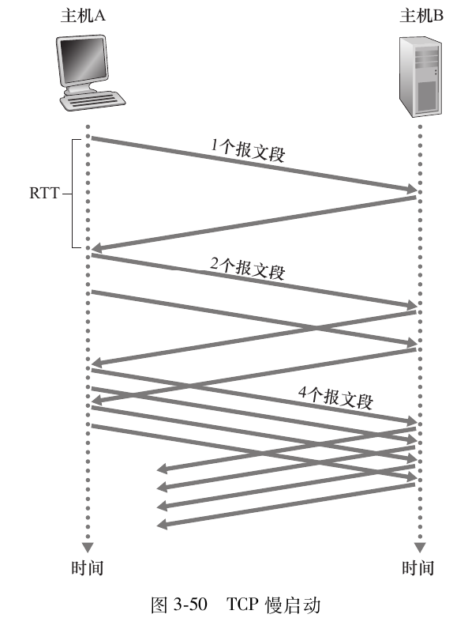

如果丢包事件发生,发送方将会把cwnd值重新置为1,并设置一个新的变量ssthresh (slow start threshold)为cwnd/2-这里的cwnd值检测到丢包时的拥塞窗口大小,然后继续发送包.
当cwnd值增长到等于ssthresh时,发送方结束慢启动阶段,进入拥塞避免阶段
##### 拥塞避免
该阶段中,每次传输后(即经过一个RTT后)将cwnd的值加一.

当再次触发丢包事件时,cwnd的值被再次置为1,ssthresh的值再次置为当前cwnd值的一半.

然而丢包事件有两个可能的触发机制:**超时和收到3个冗余ACK**.
**对于后一种情况**,既然能够收到接收方传来的ACK,这说明**信道不是那么拥塞**,因此,发送方只会将cwnd的值减半,并进入快速恢复阶段.
##### 快速恢复
该阶段中,每当收到针对丢失报文冗余的ACK时,cwnd值加1
最终发送方收到对于丢失报文的ACK时,TCP降低cwnd后进入拥塞避免阶段;如果出现超时事件,则迁移到慢启动状态.


##### 总览
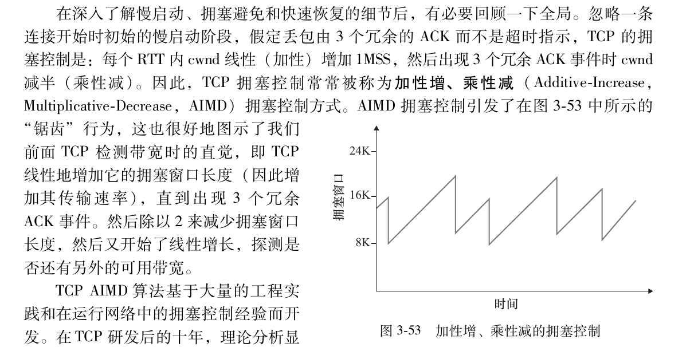

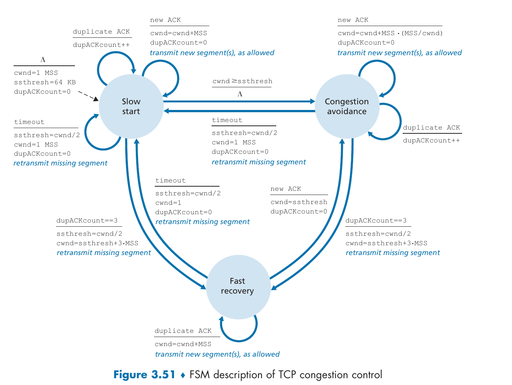
#### TCP连接的公平性
>如果在某一条有限带宽的链路上,不同的TCP连接的传输速率基本相同,则认为该拥塞控制算法是**公平的**.

在实践中,具有较小RTT的TCP连接能够在链路空闲时更快的占据带宽,从而享用更高的吞吐量;而由于UDP没有拥塞控制,所以需要专门抑制UDP的无限制增长来防止UDP占用所有带宽.

不管怎样,这个问题至今都没有很好的得到解决.

### QUIC
QUIC,**Quick UDP Internet Connections**,与HTTPS同为应用层协议,但它使用UDP作为运输层协议,主要特征如下:
1. 数据流: 允许不同的应用程序使用同一个QUIC连接
2. 可靠传输: 尽管UDP是不可靠的,但我们可以让QUIC的应用层可靠,即**加上数据检验和重传机制**


## 网络层(3/12) 
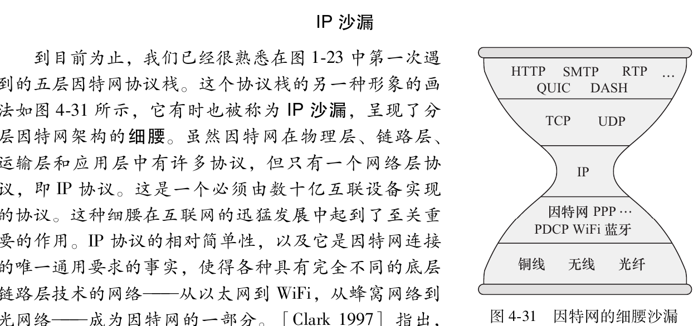
>网络层用一句话来表示就是: 通过多个路由器将数据从服务端移动到客户端.为此,网络层需要具备以下两种功能:
1. 转发: 当数据输入时,路由器需要将数据移动到适当的输出端口
2. 路由选择: 网络层需要解决数据从服务端传输到客户端所采用的路径,相当于规划好了具体要用到的转发路由器


- 注意这里的端口是指物理的输入输出接口,与虚拟的软件端口不是一个概念.
- 网络层不具有重传机制,而是由上层协议来决定是否重传

这样来看的话,网络层便可以分为负责**转发**功能的数据平面和负责**路由选择**功能的控制平面.
### 数据平面
#### 路由器工作原理
路由器有四个组件:
1. 输入端口
2. 交换结构: 将路由器的输入端口连接到输出端口
3. 输出端口
4. 路由选择处理器: 主要作用于交换结构

##### 输入端口处理和基于目的地转发
输入端口可以通过转发表和嵌入式的搜索算法来查找传入的ip地址对应的输出端口,故可以在本地实现转发决策,而无需调用路由选择处理器.

##### 交换方法
**经内存交换**
早期的路由器是传统的计算机,端口之间的交换.一个分组到达一个输入端口时，该端口会先通过中断方式向路由选择处理器发出信号。于是 ，该分组从输入端口处被复制到处理器内存中。路由选择处理器则从其首部提取目的地址，在转发表中查找适当的输出端口,并将该分组复制到输出端口的缓存中.
**经总线交换**
输入端口经一根共享总线将分组直接传送到输出端口,不需要路由选择处理器的干预.由于总线单一时间只能通过一个数据分组,故交换速率受到总线速率的限制.
**经互联网络交换**
克服单一、共享式总线带宽限制的一种方法是,使用一个更复杂的互联网络.如纵横式交换机使用由2N条总线构成的互联网络,能够并发转发多个分组,因此是非阻塞的

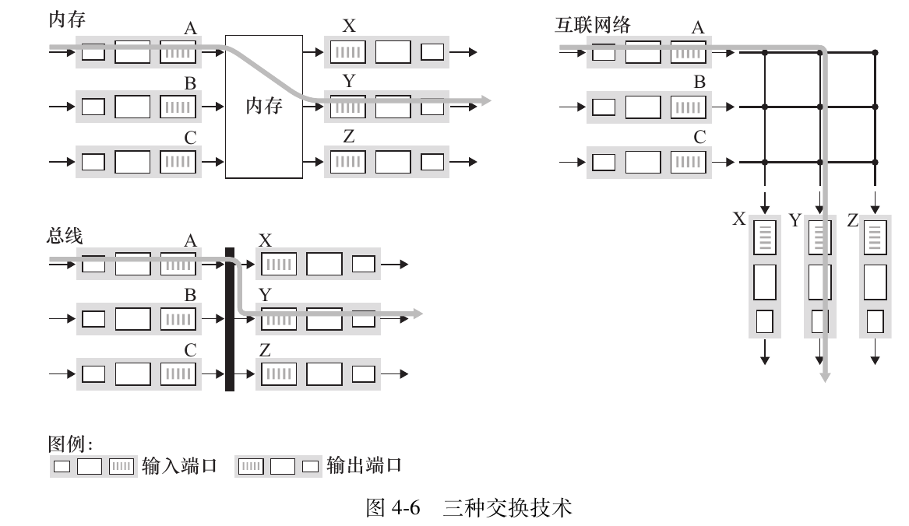

##### 输出端口处理
输出端口处理取出已经存放在输出端口内存中的分组并将其发送到输出链路上
- 分组(packet):从传输层传入的打包好的数据帧
##### 排队问题分析
在输入端口和输出端口处都可以形成分组队列，就像在环状交叉路的类比中我们讨论过的情况，即汽车可能等待在流量交叉点的入口和出口。排队的位置和程度（或者在输入端口排队，或者在输出端口排队）将取决于流量负载、交换结构的相对速率和线路速率。

我们现在更为详细地考虑这些队列，因为随着这些队列的增长，路由器的缓存空间最终将会耗尽，并且当无内存可用于存储到达的分组时将会出现丢包（packet loss）。回想前面的讨论，我们说过分组“在网络中丢失”或“被路由器丢弃”。正是在一台路由器的这些队列中，分组被实际丢弃或丢失。
**为什么不加缓存空间?**
我们很容易这样想：更多的缓存必定更好，因为更大的缓冲区能承受更大的分组到达率波动，从而降低路由器的丢包率。

但更大的缓冲区也意味着潜在的更长的排队时延。

对于游戏玩家和交互式电话会议用户，几十毫秒的时延就很关键。

如果为了减少丢包而把每跳路由器的缓冲区大小增加10倍，端到端时延可能随之增加10倍。

增加的RTT会使TCP发送方对拥塞或分组丢失的响应变慢：

- TCP依赖RTT来估计超时重传定时器（RTO）。
- RTT增大 → RTO变大 → 检测到丢包后等待更久才重传。
- 拥塞控制窗口增长更慢（慢启动、拥塞避免阶段受RTT影响）。
- 整体吞吐响应性下降，尤其在突发拥塞或间歇性丢包场景。

##### 如何决定分组转发的优先权?
有以下几种调度方法
**先进先出( First-In-First-Out，FIFO,也称为First-Come-First-Serve，FCFS)**
调度规则按照分组到达输出链路队列的相同次序来选择分组在链路上传输
**优先权排队(priority queuing)**
针对不同分组或者IP地址配置不同优先级别的权限,每次转发分组时均从当前最高优先级别的队列中选择分组来传输,同一级别则采用FIFO方式
**循环排队(round robin queuing discipline)和加权公平排队(Weighted Fair Queuing)**
循环排队像优先权排队规则一样给不同分组分类,但是会轮流处理不同类,从而避免低优先级类难以被转发的情况.
加权公平排队会为不同类分配权重,保证在某一时刻下在排队队列中的某一类能够得到对应权重的转发量.

#### IPv4,IPv6,寻址(3/13)
##### IPv4数据报格式
网络层中的分组被称为数据报,IPv4数据报的格式如下:
1. 版本:使用的IP协议版本,帮助路由器决定如何解释数据报的剩余部分
2. 首部长度:用来确定载荷(运输层报文)实际开始的字节
3. 服务类型: 可以将不同服务类型的数据报区别开来
4. 数据报长度: 首部加上数据的总字节长度,为16bit,故理论最大长度为65535字节,但实际上很少超过1500字节
5. 标识,标志,片偏移: 将一个大数据报分片为几个小数据报所需的字段
6. 寿命: 确保数据报不会一直在网络中循环
7. 协议: 指示数据部分是由哪个协议处理的,例如值为17表示要交给UDP处理
8. 首部检验和: 检验是否有数据错误或丢失
9. 源IP地址和目的IP地址
10. 可选字段: 很少用
11. 数据(有效载荷): 来自运输层
  
##### IPv4编址
>一台主机通常只有一条链路连接到网络 ，当主机中的 IP 想发送一个数据报时，它就在该链路上发送。主机与物理链路之间的边界叫作接口(interface)

路由器与它的任意一条链路之间的边界也叫作接口,因此每台主机与路由器都能发送和接收IP数据报,为了明确源地址和目标地址,故每台主机和路由器接口都有自己的IP地址.

在IPv4协议中,一个IP地址长度为32字节,书写方法为点分十进制记法(dotted-decimal notation),即每个字节都用它的十进制形式书写,因此会有3个点,4个部分,每个部分占8字节,如:
- `193. 32. 216. 9 `:11000001 00100000 11011000 00001001


互联这 3 个主机接口与 1 个路由器接口的网络形成一个子网(subnet),IP编址为这个子网分配一个地址223. 1. 1. 0 / 24,其中, `/24`被称为子网掩码,将地址的前24位设定为该子网的IP地址
表示为`255.255.255.0`.需要时可以通过将子网掩码与ip地址取和得到子网地址;换句话说,只有前24位等于223.1.1的地址才属于这个子网.
- 可以在cmd输入ipconfig查看自己所属的子网.

**IP地址是如何分配的(3/15)**
IP 地址由因特网名字和编号分配机构(Internet Corporation for Assigned Names and Numbers,ICANN)管理,是非盈利的.
当某个组织获得了被分配的地址块后,可以为本组织内的主机与路由器接口逐个分配 IP 地址,这主要由动态主机配置协议 (Dynamic Host Configuration Protocol ， DHCP)完成.

某给定主机每次与网络连接时能得到一个相同的 IP 地址,或者被分配一个临时的 IP 地址. 除了主机 IP 地址分配外，DHCP 还允许一台主机得知它的子网掩码、它的**第一跳路由器地址**（也就是直连路由器,常称为默认网关）与它的本地 DNS 服务器的地址等其他信息.


##### 网络地址转换(Network Address Translation,NAT)


**NAT（网络地址转换）** 是工作在路由器等网关设备上的物理逻辑，它允许整个局域网（LAN）内的成百上千台设备，通过同一个公网 IP 地址（WAN 端）访问互联网。

**A. 出站请求 (SNAT - Source NAT)**

当你的手机（`192.168.1.5`）访问网站时：

1. **原始数据包**：源 IP 是 `192.168.1.5`，源端口是 `10001`。
2. **物理改写**：路由器将源 IP 修改为自己的 **公网 IP**（如 `1.2.3.4`），并将源端口修改为一个新分配的端口（如 `5000`）。
3. **记录映射**：路由器在 NAT 表中记下一笔：`5000 端口 <-> 192.168.1.5:10001`。

**B. 入站响应 (DNAT - Destination NAT)**

当网站服务器回传数据时：

1. **到达数据包**：目标地址是 `1.2.3.4:5000`。
2. **物理查询**：路由器查找 NAT 表，发现 `5000` 端口对应的是内网的 `192.168.1.5:10001`。
3. **物理还原**：路由器将目标 IP 和端口还原，数据包准确送达手机。

##### IPv6
IPv6将地址长度从32bit增加到128bit,确保了IP地址不会被用完,具体结构如下:
- 版本: 4bit长,字段值为6
- 流量类型: 与IPv4的服务类型类似
- 流标签: 对数据流中的某些数据报给出优先权
- 有效载荷长度: 载荷的字节数量
- 下一个首部: 与IPv4中的协议字段含义一样,表示要交付给哪个运输层协议
- 跳限制: 类似于IPv4中的寿命字段,当跳限制计数变为0时,包被丢弃
- 源地址和目的地址
- 数据: 载荷

事实上,IPv6不再使用子网掩码,而是直接用一个整数表示网络部分的位数，写在地址后的斜线后,如:
`fe80::49e0/128`
**如何兼容IPv4**
通过将IPv6数据报整个放入IPv4数据报的载荷部分中,并通过协议字段指示接收方这是一个装入了IPv6的IPv4数据报,从而实现了对网络层中使用IPv4路由器的兼容
#### 补充: 泛化转发(4/22)
之所以叫**泛化转发(Generalized Forwarding)**,是因为这里的转发除了网络层之外,还可能会涉及**链路层**,这与之前路由器的转发**并不相同**,因此加上**泛化**两个字来表示这个转发是宽泛而言的.
- 因此,泛化转发使用的设备也不是简单的使用链路层的交换机或者网络层的路由器,而是称为**分组交换机**

---
- [wiki](https://en.wikipedia.org/wiki/OpenFlow)
泛化转发主要基于**OpenFlow**标准来执行:
##### 流表（Flow Table）
这是泛化转发的逻辑核心。每个分组交换机内部维护一个或多个流表。每个流表项（Flow Table Entry）由三个核心部分组成：
* **首部字段匹配值（Match）**：这是“泛化”的具体体现。匹配字段可以涵盖 **入端口、源/目的 MAC 地址、以太网类型、VLAN 标签、源/目的 IP 地址、协议号（TCP/UDP）以及源/目的端口号**。这种跨 1-4 层的匹配能力，使得分组交换机既可以充当路由器，也可以充当交换机、防火墙或 NAT 设备。
* **计数器（Counter）**：用于实时统计匹配该规则的分组数量、字节数等。这是流量监控与计费的物理基础。
* **操作（Actions）**：当分组匹配成功后执行的动作，包括：
    * **转发**：发送到指定端口。
    * **丢弃**：执行安全过滤逻辑。
    * **修改字段**：例如修改 IP 头部（NAT 功能）或重写 MAC 地址（路由功能）。
    * **入栈/出栈**：针对 MPLS 或 VLAN 标签的封装处理。


##### 匹配-动作（Match-plus-Action）抽象
与传统路由器“查找最长前缀-转发”的单一模式不同，泛化转发将其抽象为通用的“匹配-动作”范式。
* **机制本质**：只要分组匹配首部字段（Match），就执行相应**操作**（Action）。这意味着网络管理员可以自定义非标准的处理流程。
* **流的概念**：被相同规则处理的一系列分组被视为一个“流（Flow）”。网络管理的粒度从单纯的“路径选择”细化到了“流控制”。

##### 控制与数据平面分离
OpenFlow 实现了物理上的解耦：
* **数据平面（Data Plane）**：分组交换机只负责执行流表中的匹配逻辑，逻辑简单且支持硬件加速（通常基于 TCAM 内存）。
* **控制平面（Control Plane）**：由远程控制器（Controller）统一管理。当交换机遇到无法识别的未知流时，会将其通过 OpenFlow 协议发送给控制器。控制器计算出处理规则后，再下发回交换机的流表中。


换句话说,数据在网络层中转发的时候,不再是简单的通过路由器后再经过交换机,而是直接通过**分组交换机转发**,从而大幅度减小了传播过程中出差错的概率.因此,**泛化转发**才是真正的转发,取代了我们之前所说的路由器转发.
#### 中间盒(middlebox)
>**中间盒**: 在源主机和目的主机之间的数据路径上,执行除了 IP 路由器的正常标准功能之外的其他功能的任何中间的盒子,可以提供以下三种功能服务:
- NAT转换
- 安全服务: 如防火墙和电子邮件过滤器等
- 性能增强: 提供内容缓存等功能
### 控制平面
#### 路由选择算法
按照集中式的还是分散式的来给算法分类:
1. 集中式路由选择算法(centralized routing algorithm):也被称为链路状态(Link State,LS)算法,需要提前得知网络中每条链路的开销,从而计算出当前节点的最低开销路径
2. 分散式路由选择算法(decentrlized routing algorithm): 每个节点仅有与其直接相连的节点链路开销,通过迭代和通信逐渐计算出最低开销路径,距离向量(Distance Vector)算法是一个代表.

##### 链路状态(LS)算法
通过链路状态广播(link state broadcast)算法来获取整体的节点信息,并根据Dijkstra算法找到最佳路径.
但是,实际应用中会产生**振荡**(Oscillation)问题,也就是当路由恰巧都沿着最短路径转发时,这条路径的开销由于流量增大而不再是最优路径,因此路由都转向原本开销比较高但现在相对是开销最低的那条线路,又导致这条线路开销变高,路由又都回到原来的路由转发路径上,这样来回切换路径显然不利于网络减小时延.
##### 距离向量(DV)算法
使用Bellman-Ford算法
#### 因特网中自治系统内部的路由选择： OSPF

如果将网络看作一个大规模的路由器互联网络会遇到以下两个问题:
* **规模瓶颈（Scalability）**：数亿台设备若运行单一路由算法，将导致内存耗尽、广播风暴以及算法（如距离向量）无法收敛。
* **管理自治（Administrative Autonomy）**：不同 ISP 需要独立控制内部协议、隐藏拓扑结构，并按自身策略进行管理。
因此,设计者将路由器规划成一个自治系统( Autonomous System,AS):
* **构成**：处于相同管理控制下的路由器和链路集合。
* **标识**：每个 AS 拥有全局唯一的 **AS 号 (ASN)**，由 ICANN 授权机构分配。
* **划分**：ISP 可作为一个 AS，也可拆分为多个 AS。

光这样说还不够,看下面这个表格:

| 运营商       | 网络名称              | AS 号 (ASN) | 角色                                        |
| :----------- | :-------------------- | :---------- | :------------------------------------------ |
| **中国电信** | ChinaNet (163 骨干网) | **AS4134**  | 全球最大的 AS 之一，承载绝大多数宽带流量。  |
| **中国电信** | CN2 (下一代承载网)    | **AS4809**  | 独立的 AS，专注于高质量、低延迟的精品业务。 |
| **中国联通** | 中国联通骨干网        | **AS4837**  | 原中国网通与联通合并后的核心 AS。           |
| **中国移动** | 中国移动骨干网        | **AS9808**  | 移动宽带及移动端流量的核心承载 AS。         |

- 这样就很好理解了,当我们接入网络的时候,实际上是进入了某一个运营商的AS,而不是直接接入整个互联网.

在一个AS内部运行的路由选择算法称为(intra-autonomous system routing protocol).
##### 开放最短路优先 （ OSPF ）
>该算法使用Dijkstra和周期性的路由广播,也就是说:
>
>路由器向自治系统内所有其他路由器广播路由选择信息,而非只向相邻路由器广播. 每当一条链路的状态发生变化时(如开销的变化或连接 / 中断状态的变化)， 路由器就会广播链路状态信息 。即使链路状态未发生变化，它也要周期性地(至少每隔 30min一次)广播链路状态.从而能够运用Dijkstra得到正确的结果.
#### ISP之间的路由选择：BGP
前面讨论的是AS内部的路由选择,现在我们来考虑AS之间的路由选择,在internet中,所有AS运行相同的路由选择协议: 边界网关协议(Border Gateway Protocol,BGP).
##### BGP的作用
作为一种 AS 间的路由选择协议，BGP 为每台路由器提供了一种完成以下任务的手段：

1) 从邻居 AS 获得前缀的可达性信息: 特别是，BGP 允许每个子网向因特网的其余部分通告它的存在。一个子网高声宣布 "我存在，我在这里"，而 BGP 确保在因特网中的所有 AS 知道该子网。如果没有 BGP 的话，每个子网将是隔离的孤岛，即它们孤独地存在，不为因特网其余部分所知和所达。

2) 确定到该前缀的 "最好的" 路由: 一台路由器可能知道两条或更多条到特定前缀的不同路由。为了确定最好的路由，该路由器将本地运行一个 BGP 路由选择过程 (使用它经过相邻的路由器获得的前缀可达性信息)。该最好的路由将基于策略以及可达性信息来确定。

- **前缀**指的是例如138.16.68/22这样的AS子网

##### 通告BGP路由信息
一个AS中有两种类型的路由器:网关路由器(gateway router)和内部路由器(internal router),网关路由器直接与其他AS中的路由器相连接,内部路由器仅连接AS内部的主机和路由器

与先前AS内部的路由广播类似,网关路由器也会将对应的转发信息传递给相邻的网关路由和内部路由,从而找到不同AS之间的转发路由路径
##### 找到最短路径(待补充)

##### IP任播(anycast)
##### 路由选择策略

#### SDN控制平面
- [wiki](https://en.wikipedia.org/wiki/Software-defined_networking)


#### ICMP: 因特网控制报文协议
>[wiki](https://zh.wikipedia.org/wiki/%E4%BA%92%E8%81%94%E7%BD%91%E6%8E%A7%E5%88%B6%E6%B6%88%E6%81%AF%E5%8D%8F%E8%AE%AE)
互联网控制消息协议（英语：Internet Control Message Protocol，缩写：ICMP）是互联网协议族的核心协议之一。它用于网际协议（IP）中发送控制消息，提供可能发生在通信环境中的各种问题反馈。通过这些信息，使管理者可以对所发生的问题作出诊断，然后采取适当的措施解决。
>
>ICMP与传输协议（如TCP和UDP）显著不同：它一般不用于在两点间传输数据。它通常不由网络程序直接使用，除了 ping 和 traceroute 这两个特别的例子.

事实上,ICMP位于IPv4和IPv6报文里面,用于提供网络发生问题时返回报错信息


## 链路层
### OVERVIEW
- 节点: 运行链路层协议的任何设备,包括主机,路由器,交换机,WiFi接入点
- 链路: 连接相邻节点的通信信道
#### 链路层需要提供的服务
- 成帧(framing): 将网络层的数据报封装成链路层帧
- 协调多个节点之间的通信: MAC协议
- 可靠交付: 通过确认和重传确保数据不出错和丢失
- 差错检测
#### 链路层是如何实现的
链路层控制器的大部分功能是在硬件中实现的,但也有部分链路层是在运行与主机CPU上的软件实现的.

### 差错检测和纠正
#### 奇偶校验
假设要发送的信息D有d比特,在偶校验方案中,发送方附加一个校验比特,使得者d+1个比特中1的总数是偶数;在奇校验方案中则保证是奇数.
接收方只需要检测接收的d+1个比特中1的个数即可以验证是否出现差错,比如在偶校验方案中发现了奇数个1比特,则说明至少出现了1个比特差错.
但如果出现了偶数个比特的差错,那就无法检测出差错了.因此,可以采用二维的奇偶校验方案,通过行和列来检验从而减小没有检测到差错的概率
#### 检验和方法
与TCP/UDP协议中采用的检验和类似.
#### 循环冗余检测(Cyclic Redundancy Check,CRC)(待补充)
双方协商取一个最高位为1的r+1位多项式G,发送方在d位数据段D的后端附加r个附加比特R,使得这个d+r位数据在模2算术下可以被G整除,接收方只需要用G去除这个收到的数据就可以知道是否出现差错.
### 多路访问协议(multiple access protocol)
该协议的目标是实现多个发送和接收节点对同一个共享信道的访问.

因为所有的节点都能够传输帧,所以多个节点可能会同时传输帧,那么其他节点就会同时接收到多个帧,发生**碰撞**(collide),这时没有一个节点能够有效获得传输的帧.

在理想情况下，对于速率为 R bps 的广播信道，多路访问协议应该具有以下所希望的特性：

1. 当仅有一个节点发送数据时，该节点具有 R bps 的吞吐量;
2. 当有 M 个节点发送数据时，每个节点吞吐量为 R / M bps. 这不必要求 M 个节点中的每一个节点总是有 R / M 的瞬间速率，而是每个节点在一些适当定义的时间间隔内应该有 R / M 的平均传输速率;
3. 协议是去中心化的; 这就是说不会因某主节点故障而使整个系统崩溃;
4. 协议是简单的，使实现不昂贵.

#### 信道划分协议(过)
#### 随机接入协议(待补充)
>在随机接入协议中，一个传输节点总是以信道的全部速率（即 R bps）进行发送. 当有碰撞时，涉及碰撞的每个节点反复地重发它的帧（也就是分组），到该帧无碰撞地通过为止. 但是当一个节点经历一次碰撞时，它不必立刻重发该帧. 相反，它在重发该帧之前等待一个随机时延. 涉及碰撞的每个节点独立地选择随机时延. 因为该随机时延是独立地选择的，所以下述现象是有可能的：这些节点之一所选择的时延充分小于其他碰撞节点的时延，并因此能够无碰撞地将它的帧在信道中发出.


### Switched Local Area Networks
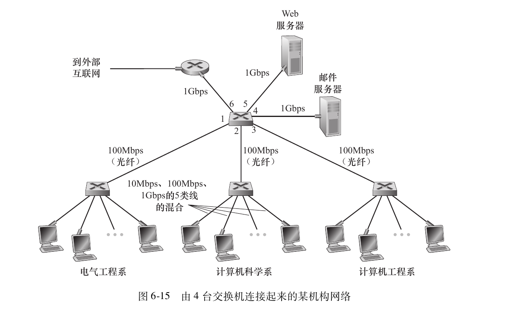

#### Link-Layer Addressing and Address Resolution Protocol(ARP)
##### MAC地址
A link-layer address is variously called a LAN address, a physical address, or a **MAC address**.
>事实上,并不是主机或路由器具有链路层地址,而是它们的**适配器**(即网络接口)具有链路层地址

The MAC address is 6 bytes long, giving 2^48 possible MAC addresses. 尽管MAC地址是一个固定值并且是唯一的,但现在有可能用软件改变某个接口的MAC地址.

- 需要注意的是,一般来说一个设备的MAC地址总是不变的,而对应的IP地址总是根据连接到的网络而改变

>一般来说,当源适配器要向向一个目的适配器发送帧时,它会讲目的适配器的MAC地址插入帧中,并将该帧发送到局域网中;有时候源适配器或者中途经过的交换机会将帧广播到所有的适配器.
当目的适配器接收到帧时,如果帧中的目的MAC地址与自己的MAC地址匹配,则会提取出封装的数据报并沿着协议栈向上传输;如果不匹配,则直接丢弃这个帧.
- 有时候源适配器需要让局域网的所有适配器接收并处理自己的帧,这个时候,可以在目的地址字段插入一个特殊的MAC广播地址,对于6字节MAC地址的局域网来说,广播地址是48个连续的1组成的字符串
#####  Address Resolution Protocol,ARP(地址解析协议)
为了在发送链路层帧的时候指明接收该帧的适配器,需要提前知道适配器的MAC地址,从而实现包的正确发送,因此我们采用ARP协议来根据适配器对应路由器或主机的IP地址,找到其MAC地址
- ARP: 将网络层地址与链路层地址相互转换的协议.它和DNS的作用基本类似,但一个重大区别是: DNS可以解析因特网上任意主机或者域名为IP地址,但ARP只为同一个子网的主机和路由器接口解析IP地址为MAC地址
**ARP原理**

每台主机或者路由器在内存中有一个ARP表(ARP table),包含了IP地址与MAC地址的映射关系,还有保存时限值,指示了从表中删除该映射的时间.

主机要发送帧前,先要发送一个ARP packet给自己的适配器,这个ARP分组包括发送和接收方的IP地址以及自己的MAC地址,指示适配器使用MAC广播地址发送这个分组并发送该链路层帧,从而让子网的所有适配器接收这个分组,IP地址与该ARP packet中包含的目的IP地址匹配的适配器会向发送方传回一个响应ARP packet,让发送方可以更新它的ARP表.

- 从这个角度来看,ARP与IP处于同一级别,都位于网络层
**如何跨越子网传输数据**
通过上面的论述,我们可以发现,ARP只适用于子网内部的转发,当我们要跨越子网转发数据时,应该先将数据转发给网关路由,再由网关路由来根据链路层帧包含的IP地址跳到下一个路由器,直到转发到目标主机的网关路由,再将数据交给目标主机
####  以太网(Ethernet)
- 以太网(Ethernet)几乎完全占据了有线局域网市场
##### 以太网的帧结构
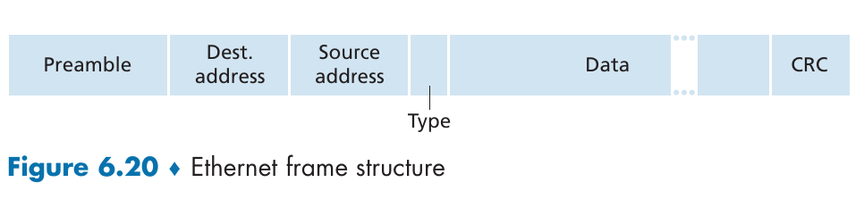

- Data field (46 to 1,500 bytes): This field carries the IP datagram. The minimum size of the data field is 46 bytes.This means that if the IP datagram is less than 46 bytes, the data field has to be “stuffed” to fill it out to 46 bytes.
- Destination address (6 bytes): This field contains the MAC address of the destination adapter.
- Source address (6 bytes): This field contains the MAC address of the adapter that transmits the frame onto the LAN
- Type field (2 bytes): 指示数据字段所用网络层协议的类型
- Cyclic redundancy check (CRC) (4 bytes): 检测帧差错
- Preamble (8 bytes): 用于唤醒适配器,告诉它现在有一个以太网帧来了


##### 以太网的无连接传输

以太网技术向网络层提供**不可靠服务**. 具体来说, 当适配器 B 收到一个来自适配器 A 的帧, 它对该帧执行 **CRC 校验**, 但是当该帧通过 CRC 校验时它既不发送确认帧; 而当该帧没有通过 CRC 校验时它也不发送否定确认帧. 当某帧没有通过 CRC 校验, 适配器 B 只是**丢弃**该帧. 因此, 适配器 A 根本不知道它传输的帧是否到达了 B 并通过了 CRC 校验.

在链路层缺乏可靠传输有助于使以太网变得**简单且便宜**. 但是这也意味着传递到网络层的数据报流可能存在**间隙**.

如果由于丢弃了以太网帧而存在间隙, 主机 B 上的应用也会看见这个间隙吗? 正如我们在第 3 章中所学到的, 这完全取决于该应用是使用 **UDP** 还是 **TCP**.

* 如果应用使用的是 **UDP**, 则主机 B 中的应用确实会看到数据中的间隙.
* 另一方面, 如果应用使用的是 **TCP**, 则主机 B 中的 TCP 将不会确认包含在丢弃帧中的数据, 从而引起主机 A 的 TCP **重传**.

注意到当 TCP 重传数据时, 数据最终将回到曾经丢弃它的以太网适配器. 因此, 从这种意义上来说, 以太网确实重传了数据, 尽管以太网本身并不知道它正在传输的是一个包含全新数据的全新数据报, 还是一个包含已经被传输过至少一次的数据的数据报.
#### 链路层交换机(Link-Layer Switches)(待补充)

##### 转发和过滤
>**Filtering** is the switch function that determines whether a frame should be forwarded to some interface or should just be dropped. 
**Forwarding** is the switch function that determines the interfaces to which a frame should be directed, and then moves the frame to those interfaces. 

假定目的地址为 DD-DD-DD-DD-DD-DD 的帧从交换机接口 x 到达,那么会有以下三种情况:
1. 交换表中没有对应 DD-DD-DD-DD-DD-DD 的表项,则将这个帧广播到所有接口(除了接口x,因为帧是从接口x来的)
2. 交换表中有对应 DD-DD-DD-DD-DD-DD 的表项,但是对应接口为x,那么显然你不可能把从接口x收到的帧再送回接口x,只能就地丢弃这个帧
3. 交换表中有对应 DD-DD-DD-DD-DD-DD 的表项,对应接口不是x而是y,那么交换机就需要把这个帧送入接口y

**疑问:第二种可能中,如果是局域网通信的话,那不就有可能用的是同一个接口吗?**


在局域网（LAN）中，如果两个主机 A 和 B 都在“同一个接口”下，通常只有两种物理物理场景：

* **场景 A：接了集线器（Hub）**
    你将 A 和 B 都接在一个外接 Hub 上，再把 Hub 连到交换机的接口 $x$。
* **场景 B：共享介质（旧式同轴电缆）**
    所有主机物理上连在同一根线上。

交换机（Switch）的核心作用是**隔离冲突域**并**跨端口转发**。

当主机 A 发送一个目的 MAC 为 B 的帧进入接口 $x$ 时：
1.  **查表**：交换机查找 MAC 地址表，发现 B 的 MAC 对应接口也是 $x$。
2.  **判断**：交换机意识到，“目的地”和“来源地”都在同一个物理方向上。
3.  **结论**：如果 A 和 B 都在接口 $x$ 下方，那么当 A 发出信号时，信号在到达交换机之前，**物理上已经流经了 B**（如果是 Hub 或共享总线）。

> **底层逻辑**：交换机认为，既然目标 MAC 就在接收端口所在的网段内，那么目标主机 B 应该已经通过物理介质直接收到了这个帧。如果交换机再把它从接口 $x$ “弹回”去，不仅是浪费带宽，更会导致 B 收到两份重复的数据帧。

##### 交换表的建立与交换机的自学习
1. 交换表初始为空
2. 对于在每个接口接收的帧,交换机会在表中记录以下信息:
   1. 该帧的源MAC地址
   2. 该帧是从哪个接口进来的
   3. 当前时间
3. 如果一段时间后,交换机没有接收到过与记录的源MAC地址相同的帧,那么就会在表中删除这个地址

那么,让我们来详细分析一个新产生的帧被目的MAC地址对应的交换机接收的过程:
1. 当这个帧进入第一个交换机时,由于交换机不认识这个帧,故会在所有接口转发该帧并记录该帧信息
2. 经过很多次转发,在传播路径上的交换机都记录了该帧的三种信息
3. 当目的MAC地址对应的交换机接收到该帧时,由于目的MAC地址对应的服务器一定已经将自己的信息存在了该交换机中(思考一下是为什么),那么只需要将该帧送入服务器的适配器即可完成整个流程.
#### 虚拟局域网(VLAN)
- [wiki](https://zh.wikipedia.org/wiki/%E8%99%9A%E6%8B%9F%E5%B1%80%E5%9F%9F%E7%BD%91)
  - 由于书上讲的不明不白,所以去额外找资料了

>VLAN的工作原理是在广播域内转发的网络帧上添加标签，从而使网络流量看起来如同被分割在不同的网络中。这样即使在同一个物理网络，VLAN也能将网络隔离开来，而无需部署多套电缆和网络设备。


### 无线网络概览
前面谈的都是有线网络,现在来谈谈WiFi,4G等无线网络,它由以下三个要素组成:
1. **无线主机**: 可以是手机,电脑,家用电器,可以是移动的,也可以是位置固定不动的
2. **无线链路**: 主机通过无线链路连接到一个基站或者另一个主机
3. **基站**: 负责收发无线链路数据

我们可以把无线网络分为四类:
1. 具有基站的单跳: 基站和主机之间可以直接通信,不需要经过中继节点,日常见到的无线网络如WiFi和4G都属于这一类型
2. 无基站的单跳: 由一个主机进行收发无线数据,其他设备与该主机通信,而不通过基站,**蓝牙协议**便是典型的例子
3. 具有基站的多跳: 主机与基站通信需要经过中继节点
4. 无基站的多跳: 通过多个主机节点进行通信,这显然是最难设计的一类网络

#### 无线链路的特征
与有线链路相比,无线链路有以下三个特点:
1. 信号强度递减: 电磁波穿过物体时强度将减弱,也就是**路径损耗**
2. 来自其他通信源的干扰: 同一频段的电磁波会相互干扰
3. 多路径传播: 电磁波会经过地面或者物体反射,导致出现**多径传播**的问题
显然,无线网络更容易出现差错,因此我们需要使用更为可靠的传输方法.

- **信噪比**( Signal-to-Noise Ratio，SNR):单位为dB,是接收到的信号振幅与噪声幅度比值的以10为底的对数的20倍,显然,信噪比越大,信号就越干净.
- **比特差错率**(BER): 接收方收到的一个比特为错误的概率

物理层的通信有以下特点:
1. 使用同一个调制方法,SNR越高,BER越低: 因此发送方可以通过增加传输功率提高SNR来降低BER,但是这样会消耗更多的能量,并且当功率超过阈值时不再有实际增益
2. 对于给定的SNR,调制方法的传输速度越高BER越高,这很容易理解,速度越快越容易出差错
3. 对于给定的信道我们可以采用不同的调制技术

#### CDMA(待补充)

### WiFi
尽管无线局域网(WLAN)的通信有很多技术可以选用,但是WiFi占据着统治地位.
WiFi的正式名称为**IEEE 802. 11 无线局域网**

基本服务集 (BSS) 是WiFi的基本构件，有两个部分：
- 无线站点 (Station)：手机、笔记本等终端设备。
- 接入点 (Access Point,AP)：起中央基站作用的节点。

#### 信道与关联
当管理员安装AP时,需要为AP分配一个服务集标识(Service Set Identifier,SSID)和一个信道号.

802.11运行在 2. 4GHz ～ 2. 485GHz的频段中,由11个部分重叠的信道组成, 当且仅当两个信道由 4 个或更多信道隔开时它们才无重叠,因此管理员需要指示AP的信道号避免影响到其他AP.

>显然,当你进入咖啡馆时,你可以收到很多个AP传来的信号,那么我们是符合与一个特定AP连接的呢?
802.11协议要求每个AP周期性的发送信标帧,该帧包括该AP的SSID和MAC地址,供无线站点接收并处理;当然,主机也可以自己发送广播帧来主动扫描附近的AP,选定关联AP,具体过程如图所示:
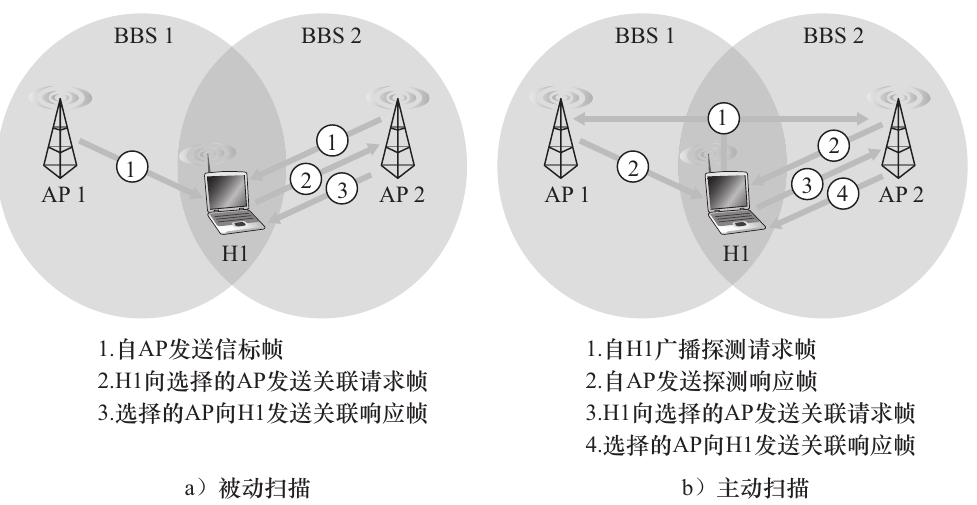
>选定与之关联的 AP 后，无线主机向该 AP 发送一个关联请求帧，并且该 AP 以一个关联响应帧进行响应。注意，对于主动扫描需要第二个请求 / 响应握手 ，因为一个对初始探测请求的帧进行响应的 AP 并不知道主机选择哪个 （ 可能多个 ） 响应的 AP 进行关联 ， 这与 DHCP 客户能够从多个 DHCP 服务器中进行选择有诸多相同之处 

与AP连接之后,主机便会发送DHCP报文获取自己的IP地址,从而与互联网连接.

#### 802. 11采用的传输协议: CSMA/CA
802.11采用的MAC协议类型为随机接入协议,称为带碰撞避免的CSMA(CSMA with collision avoidance), 简称为CSMA/CA.
之所以802.11采用碰撞避免而非和以太网相同的碰撞检测,有以下两个原因:
1. 检测碰撞需要主机同时具有发送信号和接收其他站点信号的能力,而802.11适配器接收到的信号强度往往远小于发送出去的信号强度
2. 无线信号存在衰减,多路传播,隐藏终端等问题,无法检测到所有的碰撞

##### 802.11的链路层确认方案
由于无线链路中的帧不能无损的到达目的地,因此802.11采用链路层确认方案来实现重传机制.
目的站点收到一个通过CRC校验的帧后,等待一小段时间-这被称为短帧间间隔(short inter-frame spacing),然后发回一个确认帧,如果发送站点在给定时间内没有收到确认帧,它就假定出现了错误并进行重传,如果若干次重传后仍未收到确认帧,则放弃发送并丢弃该帧.

##### 为什么现代以太网不重传而802.11重传
因为802.11的环境极易丢包,如果依靠上层协议如TCP的重传机制,由于跨越了多层硬件,传输速率将会大幅度下降;而以太网线路的环境非常稳定,发生丢包的概率几乎为零,将少量的丢包问题交给上层协议处理可以减少不必要的设计复杂度.


##### CSMA/CA协议的详细原理
1. 如果有一个帧要发送,发送站监听到信道空闲时,它等待一小段时间后发送该帧-这被称为分布式帧间间隔(distributed inter-frame space)
2. 如果信道被占据,则站点选取一个随机回退值,在侦听到信道空闲时减小该值,信道繁忙时则保持该值不变
3. 计数值减到零时,该站点发送帧并等待确认
4. 如果收到确认,则帧被正确接收.如果要传输另一个帧,站点将从第二步重新开始;如果没收到确认,则站点进入第二步并在一个更大的范围内选取随机值
**满格信号网速仍然很慢的原理**
当大量主机使用同一个AP时,为了避免碰撞,单一主机的等待时间大量延长,从而导致了网速的降低;同时,AP的上行光纤容量有限,不允许所有设备以最大功率同时传输.
##### 处理隐藏终端问题

- 尽管每个无线站点对AP都不隐藏,但两者彼此是隐藏的

当H1和H2要发送帧时,由于它们彼此是看不见的,因此都以为信道是空闲的,就会同时发送并导致碰撞.

为了避免碰撞,802.11通过让站点使用请求发送(Request to Send,RTS)控制帧和允许发送(Clear to Send,CTS)控制帧来预约何时访问信道.
发送方在发送帧之前,首先向AP发送一个RTS帧,指示自己传输帧和收到确认帧所需的总时间,AP收到该帧后广播一个CTS帧,指示发送方明确的发送许可并告知其他站点在这段时间内不要发送,从而避免碰撞.
- 这两个控制帧都很短,所以在这个过程中发生碰撞的可能性很小

>尽管 RTS / CTS 交换有助于减少碰撞 ， 但它同样引入了时延并消耗了信道资源。因此 ，RTS / CTS 交换仅仅用于为长数据帧预约信道 。 在实际中，每个无线站点可以设置一个 RTS门限值，仅当帧长超过门限值时，才使用 RTS / CTS 序列。对许多无线站点而言 ，默认的RTS 门限值大于最大帧长值 ， 因此对所有发送的 DATA 帧，RTS / CTS 序列都被跳过。

#### 802.11的帧结构

接下来对其中的重要组成部分做一点分析:
1. 有效载荷与CRC字段
2. 地址字段: 地址4仅在AP相互转发时使用,前三个字段的定义如下:
   1. 地址1是要接收该帧的站点MAC地址
   2. 地址2是传输该帧的站点MAC地址
   3. 地址3是子网默认网关的MAC地址
3. 序号,持续期,帧控制字段
#### 无线站点在同一子网中的不同BSS之间移动
>随着 H1 逐步远离 AP1 ，H1 检测到来自 AP1 的信号逐渐减弱并开始扫描一个更强的信号.H1 收到来自 AP2 的信标帧.
H1然后与 AP1 解除关联,并与AP2 关联起来,同时保持其 IP 地址和维持正在进行的 TCP 会话.新AP2 会发送以太网广播,强制沿途交换机更新路径.
### 蓝牙

蓝牙网络运行在 **2.4 GHz ISM（工业、科学、医学）** 免授权频段。由于该频段同时被微波炉、车库门遥控器和无绳电话等多种设备占用，蓝牙在设计之初就将**抗噪**与**抗干扰**作为核心目标。

#### 蓝牙的物理原理

* **时分复用（TDM）**：蓝牙无线信道被划分为时长为 **625 微秒** 的时间隙。
* **频分跳频扩展频谱（FHSS）**：在每个时间隙中，发送端在 79 个信道中的某一个进行传输。信道（频率）在每个时隙间按照已知但伪随机的规律切换。
* **抗干扰逻辑**：通过跳频技术，即使 ISM 频段内存在其他设备的干扰，也只会影响到**极少数特定时隙**的蓝牙通信，从而保证了整体链路的稳健性。目前蓝牙数据速率最高可达 3 Mbps。

---

#### 蓝牙网络的结构

在蓝牙网络（Piconet）中，设备角色分为以下三类：

1.  **主节点 (Master Device)**：核心控制单元，负责管理连接数量、调度时隙以及控制所有连接设备的传输功率。
2.  **客户设备 (Client/Slave Device)**：受控单元，遵循主节点的跳频序列进行通信。
3.  **存放设备 (Parked Device)**：低功耗睡眠模式设备。它们保持与主节点的同步，但不参与数据传输，仅在需要时由主节点唤醒进入活跃状态。

---

#### 主节点如何与其他设备连接

连接过程本质上是一个从“频率盲区”到“时间与频率双重同步”的过程，分为 **查询（Inquiry）** 和 **寻呼（Paging）** 两个阶段：

##### 第一阶段：设备发现（查询）
* **广播探测**：主节点在 32 个不同的信道上轮流发送询问消息，并将该序列重复传输多达 128 次，以确保覆盖所有可能的监听频率。
* **被动监听**：潜在的客户设备在自己随机选择的频率上进行监听。
* **随机回退机制**：一旦客户设备接收到查询，它会在 **0 ~ 0.3 秒** 之间选择一个随机时间量进行回退。这种“随机退避”设计是为了防止多个客户设备同时响应主节点而引发信号冲突。
* **身份响应**：回退结束后，客户设备发送包含其唯一设备 ID 的报文响应主节点。

##### 第二阶段：建立连接（寻呼）
* **定向寻呼**：主节点在发现范围内所有潜在设备后，开始针对特定设备发送 32 条寻呼邀请报文。由于此时客户设备尚未获得跳频序列，主节点仍需在多个频率上重复发送。
* **确认握手**：客户设备接收到寻呼报文后，返回 **ACK（确认）** 报文。
* **参数交付**：主节点随后向客户设备发送关键配置信息，包括：
    * **跳频序列模式**（告知未来的频率路径）。
    * **时钟同步信息**（校准通信时间基准）。
    * **活跃成员地址**（分配逻辑地址）。
* **轮询激活**：最后，主节点使用已同步的跳频模式对该客户设备进行轮询(polling)。一旦回复成功，双方正式进入连接状态，实现网络层面的握手。

#### 更上层发生了什么
我们可以发现,蓝牙的链路层连接逻辑与其他的协议完全不同,这从而说明蓝牙的上层逻辑也与其他的协议不同,这里就不介绍了.

### Cellular Networks: 4G and 5G
无线网络分为无线局域网和无线广域网,我们前面所说的WiFi和蓝牙就属于局域网,而这里的4G/5G就属于广域网了.

>The term **cellular**(蜂窝) refers to the fact that the region covered by a cellular network is partitioned into a number of geographic coverage areas, known as cells. 
Each cell contains a **base station** that transmits signals to, and receives signals from, the mobile devices currently in its cell.
#### 4G LTE Cellular Networks: Architecture and Elements
>The 4G networks that are pervasive as of this writing in 2020 implement the **4G Long-Term Evolution standard**, or more succinctly **4G LTE**.


4G网络由以下几个部件构成:
1. Mobile device: 连接到蜂窝运营商网络的智能手机 、 平板电脑、笔记本电脑或物联网设备
   1. 该移动设备还具有全球唯一的 64 位标识符，称为国际移动用户身份 （ IMSI），存储在其 SIM （ 用户身份模块） 卡上。IMSI 在全球蜂窝网络系统中识别用户，包括用户所属的国家和归属蜂窝网络 。
2. Base Station: The base station is responsible for managing t**he wireless radio resources** and the **mobile devices** with its coverage area.
   1. 这类似于WiFi中的AP,但还有很多额外的功能
3. Home Subscriber Server (HSS): The HSS is a database, storing information about the mobile devices for which the HSS’s network is their home network.
4. Serving Gateway (S-GW), Packet Data Network Gateway (P-GW), and other network routers: 用于实现NAT,路由转发等功能
5. Mobility Management Entity (MME): 控制平面部件,用于验证设备,设置路径,追踪设备位置

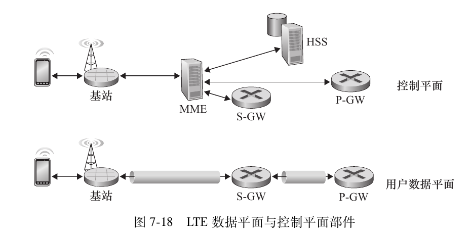


### 无线链路对高层协议的影响
鉴于无线链路传播的比特差错率远高于有线链路,因此需要对上层协议如TCP连接做出针对性的处理

>在所有情况下，TCP 的接收方到发送方的 ACK 都仅仅表明未能收到一个完整的报文段，发送方并不知道报文段是由于拥塞或切换 ， 还是由于检测到比特错误而被丢弃的。在所有情况下 ，发送方的反应都一样 ， 即**重传该报文段** 。 TCP 的拥塞控制响应在所有场合也是**相同**的 ，即 TCP 减小其拥塞窗口,这会导致带宽利用率骤降.

#### 链路层重传 (LL-ARQ)
这是解决无线丢包的最前线。LTE、5G 或 Wi-Fi 协议在数据链路层（MAC/RLC 层）实现了快速重传。
* **机制：** 基站与终端之间发现包序列不连续时，直接在二层进行重传，不向网络层汇报。
* **代价：** 引入了抖动 (Jitter)，因为链路层重传会导致部分包延迟到达。

#### 拥塞控制算法的进化 (BBR)
Google 提出的 **BBR (Bottleneck Bandwidth and RTT)** 算法改变了判断逻辑。
* **原理：** BBR 不再将“丢包”作为减速信号。它通过周期性探测**带宽极大值**和**延迟极小值**来构建网络模型。
* **实战表现：** 在一定比例（如 5% ~ 15%）的随机丢包环境下，BBR 能维持几乎满带宽的传输速率，而 CUBIC 则会因为不断减半窗口而彻底卡死。

#### 选择性确认 (SACK)
原生 TCP 采用累积确认，丢一个包可能导致后续一连串包被重传。
* **机制：** 启用 `TCP_SACK` 选项。接收端在 ACK 中告知发送端具体哪些数据块（Ranges）已收到。
* **效果：** 发送端可以精确补齐缺失的数据，而不是盲目重传所有未确认的包。

#### 拆分连接协议 (Split-TCP / Proxy)
在移动通信核心网中，常使用 **PEP (Performance Enhancing Proxy)**。
* **拓扑：** `终端 <——无线链路——> 基站/边缘网关 <——有线主干——> 服务器`。
* **机制：** 将一个 TCP 连接拆分为两段。无线段使用针对高丢包优化的协议（如调整过初始窗口、禁用慢启动退避的私有协议），有线段保持标准 TCP。
* **逻辑：** 避免了无线端的局部丢包反馈到远端服务器，缩短了重传的往返时间 (RTT)。


## 网络安全
网络通信中的安全需要满足以下要求:
1. 机密性(confidentiality): 仅有发送方和希望的接收方能够理解传输报文的内容,这需要报文能够被加密和解密
2. 完整性(message integrity): 通信内容在传输过程中不应该被篡改,这需要我们实现数据检验和可靠的传输通道
3. 通信认证(end-point authentication): 发送方和接收方都需要能够证明另一方的身份是真实的
4. 防御恶意攻击(operational security): 通过防火墙和入侵检测系统来防御网络攻击

### 密码学
我们现在假设A要向B发送一个报文,最初的文本被称为明文(plaintext),A使用密钥(key)*m*来加密明文,从而得到**密文**(ciphertext),并将其发送出去.
B为了解密这个密文,需要使用密钥*n*来处理这个密文,从而得到明文.

显然,加密过程中最关键的就是密钥了,根据密钥是否对称(相同)可以将加密方式分为两种:
1. 对称密钥系统: A和B所用的密钥是相同而且保密的,否则就没有任何意义了
2. 非对称密钥系统(也称为公开密钥系统): 有两个密钥,一个是公开的密钥,称为**公钥**,所有人都可以获取;另一个是只有A或者B才知道的密钥
#### 攻击手段
根据攻击者掌握的信息,大致有三种攻击手段:
1. 密文攻击: 入侵者只截取到了密文,破解难度最高
2. 已知明文攻击: 攻击者事先知道部分明文对应的密文
3. 选择明文攻击: 攻击者能够选择任意一段明文并获取对应的密文,破解难度最低
#### 对称密钥
#####  Caesar Cipher(凯撒密码)
密钥为字母表偏移量,很容易被破解
##### Block Cipher(块密码)
- TLS采用的就是这个加密方式
将明文划分为固定长度k的块，通过一一对应的映射函数将其转换为相同长度的密文块.如果我们让k=3,就需要让000到111这8个输入转换到对应的三比特输出.

尽管当增大k值时转换表的破解难度大幅度上升,但交流的双方都需要维护一张2^k大小的转换表,这不太现实.
因此,块密码使用函数来模拟转换表,例如:当k=64时,我们可以把64比特块划成8个子块,每个8比特块按照一张独特的k=8的转换表处理,然后将转换后的64比特按照一定规则打乱后再分为8个子块进行处理,进行多次循环.这种算法的密钥是**8张k-8的转换表**.
- 如果用 1 秒破解 56 比特 DES 的计算机 （ 就是说，每秒尝试所有 2^56个密钥 ） 来破解一个 128 比特的 AES 密钥 ，要用大约 149 万亿年的时间才有可能成功
##### Cipher-Block Chaining: 引入随机性
前面的块密码有一个缺陷: 如果有多个块中的明文内容相同,如"HTTP/1.1"这类常见的前缀词,那么将会得到相同的密文,从而被攻击者探测到并进行破解.
因此,我们可以在加密时引入随机数,如下图所示:
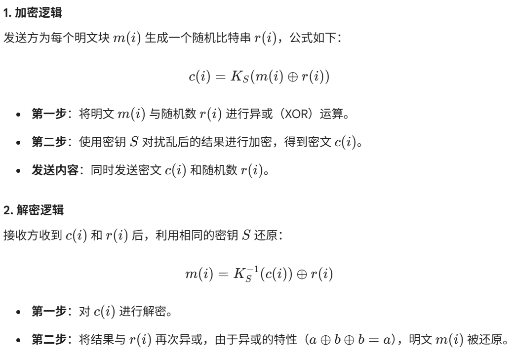
这样一来,即使明文相同,得到的密文也会不同,而密文相同时,得到的明文可能相同,破解难度大幅上升.

同时,实际应用中不太可能一个个传输随机数,故块密码使用密码块链接(Cipher-Block Chaining,CBC)来高效传输接收方所需的随机数,基本方法如下:
1. 在发送数据之前,发送方生成一个随机的k比特串(对应k比特块加密),称为初始向量(Initialization Vector,IV).表示为c(0),并以明文方式发给接收方
2. 对第一个块，发送方计算 c(1) = Ks(m(1) ⊕ c(0))后发送密文
3. 对于第 i 个块，发送方根据 c(i) = Ks(m(i) ⊕ c(i-1)) 生成第 i 个密文块


#### 非对称密钥
该类型的密钥有三个关键要素:
1. 一个公开的加密算法和一个公开的解密算法
2. 一个公开的密钥,称为**公钥**
3. 只有通信中的某一方才知道的密钥,称为**私钥**

使用非对称密钥的通信过程如下:
发送者用加密算法和公钥来加密报文,接收者使用解密算法和私钥来解密报文.

但是,这种加密方式有不少问题:
1. 如何保证加密后的报文不会被破解?
2. 由于任何人都可以通过公钥加密报文后发送给接收方,如何确定发送者是可靠的?

尽管有很多算法可以解决上述问题,但RSA算法已经成为了非对称密钥的代名词.

##### RSA算法
为了生成RSA的公钥和私钥,接收方需要执行以下步骤:
1. 选择两个大素数p和q,值越大就越难破解.
2. 计算`n=pq`和`z=(p-1)(q-1)`
3. 选择小于n的一个数e,使得e和z互质.
4. 选择一个数d,满足`ed mod z = 1`
5. 那么接收方的公钥由(n,e)组成,私钥由(n,d)组成

通信过程如下:
1. 发送方发送的报文以二进制形式表示为一个整数m,由于报文的位数有限,故m一般不会很大,在RSA算法中要求m < n,然后计算`c = m^e mod n`,从而得到密文c,并交给接收方.
2. 为了解密c,接收方计算`m = c^d mod n`,得到报文m.

举一个简单的例子:
1. 接收方选择p=5和q=7,得到n=35和z=24,在5,7,11等与24互质的数中选择一个数,比如说5,那么由于`(5x29)-1`可以被24整除(尽管5x5-1等取值也可以被24整除,但假设我们是随机取值取到了29),则d=29.
2. 发送方使用(35,5)加密报文,接收方使用(35,29)报文.

##### 会话密钥
由于大数据的指数运算非常耗时,所以实际应用中我们可以把对称密钥和RSA结合在一起,用RSA来加密对称密钥算法中所需的密钥.这个被加密的密钥称为**会话密钥**(session key)

##### RSA原理
RSA运用了两个数论中的结论,这里不做说明,我们只需要知道通过(n,e)和(n,d)就足够进行加密和解密,攻击者如果想暴力破解，唯一的方法是:
1. 试图从公开的 n 中分解出两个原始质数 p 和 q。
2. 只有得到 p 和 q，才能计算出`z = (p-1)(q-1)`。
3. 通过`ed ≡ 1 mod z` 解出私钥 d。

>RSA 的安全性依赖于这样的事实：目前没有已知的算法可以快速进行一个数的因数分解 ，这种情况下公开值 n 无法快速分解成素数 p 和 q。如果已知 p 和 q ，则给定公开值 e，
就很容易计算出秘密密钥 d 。 另一方面，不确定是否 存在 因数分解一个数的快速算法 ， 从这种意义上来说，RSA 的安全性也不是确保的 。
### 报文完整性的鉴别和数字签名
接收方验证某条消息是否可靠,需要检测以下两个因素:
1. 该报文来自可靠的发送方
2. 该报文在途中没有被篡改

#### 加密哈希函数(cryptographic hash function)
- hash function: 任意输入都会得到相同长度的输出
- cryptographic hash function: 在哈希函数的基础上,需要额外保证: 找到一个不同的输入得到相同的输出是基本不可能的.

从加密哈希函数的定义就可以看出来,攻击者一般来说是无法用其他报文伪造原报文的,从而保证该报文不会被篡改.

常用的加密哈希函数有以下几种:

| 算法      | 哈希长度                 | 基本逻辑                                                                                         | 安全性现状与建议                                                                      |
| :-------- | :----------------------- | :----------------------------------------------------------------------------------------------- | :------------------------------------------------------------------------------------ |
| **MD5**   | 128 位                   | 将输入信息按 512 位分组，通过复杂的压缩函数进行多轮迭代处理，生成 128 位哈希值。                 | ❌ **已破解**，可人为制造碰撞。**任何安全场景下都不应使用**。                          |
| **SHA-1** | 160 位                   | 逻辑与 MD5 类似，哈希值更长（160 位），处理步骤更复杂，安全性有所提升。                          | ⚠️ **已不足够安全**，存在理论碰撞攻击，Google 等已在 2017 年实现碰撞。**应避免使用**。 |
| **SHA-2** | 224 / 256 / 384 / 512 位 | 采用 Merkle-Damgård 结构，更多轮次和更复杂的逻辑（如更多常量）。其中 SHA-256 和 SHA-512 最常用。 | ✅ **广泛认为安全**，是替代 MD5 和 SHA-1 的**首选标准**。                              |
| **SHA-3** | 224 / 256 / 384 / 512 位 | 采用全新的 **Keccak 海绵函数结构**，与 SHA-2 设计思路完全不同，提供更高的安全冗余。              | ✅ **安全性高**，可作为 SHA-2 的**备选方案**。                                         |


#### 报文鉴别: 使用哈希函数和鉴别密钥
使用哈希函数,我们可以这样验证报文的完整性:

1. Alice生成报文m并计算散列H(m).
2. 然后Alice将H(m)附到报文m上,生成一个扩展报文(m, H(m)),并将该扩展报文发给Bob.
3. Bob接到一个扩展报文(m, h)并计算H(m). 如果H(m) = h,Bob得出结论:一切正常.

但这种方法有一个问题: 攻击者可以声称他就是Alice,并将报文发送给Bob,这显然可以通过报文完整性的验证.

因此,我们还需要加入鉴别密钥(authentication key),即一个被双方共享的秘密比特串,在下述过程中我们将其称为s.

1. Alice生成报文m,加入s生成m+s,并计算H(m+s),这被称为报文鉴别码(Message Authentication Code,MAC).
2. 然后Alice将MAC附加到报文m上,生成扩展报文(m, H(m+s)),并将该扩展报文发送给Bob.
3. Bob接收到一个扩展报文(m,h),由于知道s,计算出报文鉴别码H(m+s).如果H(m+s)=h,Bob得出结论:一切正常.

#### 数字签名
有时候,我们会需要用一个数字签名(digital signature)来标识某个文件,这个数字签名一定是独一无二,不可篡改的,这样才可以保证能够分辨出该文件的所有者.

一种方法是发送方使用某一加密哈希函数取得报文的hash值,并用私钥加密该hash值;而在验证这个签名时,接收方只需要用公钥去解密这个hash值,如果计算结果与该文件的hash值一致,则证明报文的来源可靠

#### 公钥认证
要让公钥密码生效,必须要证明你使用的公钥来源可靠,比如A和B通信时,A需要证明报文中的公钥确实来自B.

因此,我们需要通过CA(certification authority)来将公钥与特定实体(一个人,一台路由器,一个网站等)绑定.

CA有以下两个作用:
1. 证实一个实体的身份.这需要该CA能够执行严格的身份验证,具有权威性,常见的CA有"Let's Encrypt","DigiCert"等
2. 将某个实体的身份与其公钥绑定为证书,由CA对这个证书进行数字签名

### end-point authentication(端点鉴别)
前面的数字签名和公钥认证更像是被动被检测的,而这里提到的**端点鉴别**则是通信的某一方主动向另一方证明自己的身份.

### 应用层的安全服务: 安全电子邮件(过)
### 运输层的安全服务: TLS
TLS(Transport Layer Security)协议是由Netscape设计的安全协议-SSL(Secure Sockets Layer)协议-的升级版,所有的浏览器和服务器都支持该协议(看一下某个网站的URL,如果以https开始,就是启用了TLS),它有以下几个功能:
1. 机密性: 攻击者可能截获购买者的订单并得到银行卡信息
2. 完整性: 攻击者可能会修改购买者的订单地址或者购买数量
3. 服务器鉴别: 证明这个网站是官方的,安全的


可以看到,TLS只在应用层进行了加密而已,并没有深入运输层
#### TLS Intro
先大致描述一下TLS的简化版本(称为类TLS),它具有三个阶段: 握手,密钥生成和传输数据

现在以客户B与服务器A之间的通信来举例说明
##### 握手
在建立TCP连接后,B向服务器A发送一个hello报文,A在响应报文中返回该服务器的证书,里面包含了它的公钥.

由于该证书被某个CA证实过,B知道了这个公钥真的来自A,然后B生成一个主密钥(MS)用于此次TLS会话,使用A的公钥加密MS生成加密的主密钥(EMS),再发给服务器A,A再用私钥解密该EMS得到MS.

如此依赖,双方都知道了这次会话的主密钥MS.
##### 密钥生成
事实上,出于安全性的考量,通信双方都会使用MS生成4个密钥:
- E_B: 从B发送到A时所用的加密密钥
- M_B: 从B发送到A时所用的HMAC密钥(用于验证报文完整性)
- E_A: 从A发送到B时所用的加密密钥
- M_A: 从A发送到B时所用的HMAC密钥

##### 传输数据
>TLS breaks the data stream into records, appends an HMAC to each record for integrity checking, and then encrypts the record + HMAC.
比如说B要发送数据,它需要将数据流分割为一个个record,为每个record附上HMAC,然后使用M_B加密这个record+HMAC包后发送出去.
事实上,这个HMAC中海含有这次发送的record所属的序号,从而保证攻击者不会打乱record的顺序.
##### record的结构
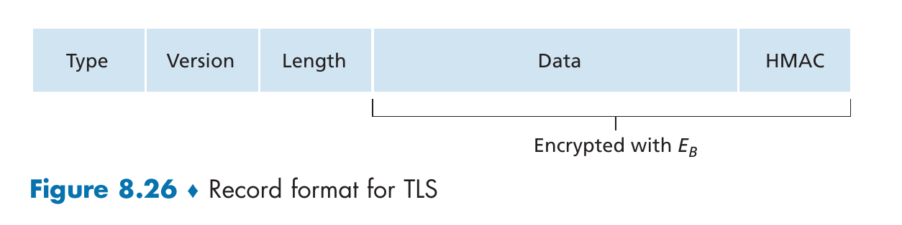

- Type字段: 判断这是握手报文还是传输数据的报文,也用于关闭TLS连接

#### 对于TLS更为精确的描述
##### 握手阶段
TLS不强制通信双方使用特定的加密算法,而是允许双方在TLS会话开始时就统一决定加密算法,真实的步骤如下:
1. 客户发送它支持的密码算法的列表和它选取的不重数(在本次会话中不会第二次出现的数字)
2. 服务器从列表中选择一个对称密钥算法,一种非对称密钥算法和一种HMAC算法,它把这些选择联通证书和另一个不重数发给服务器
3. 客户验证证书后提取服务器的公钥,生成PMS(Pre-Master Secret),用公钥加密该PMS后发送给服务器.
4. 客户和服务器根据PMS和各自的不重数得到上述的四种密钥.
5. 双方发送一段用新生成的密钥加密过的握手信息摘要，用于验证双方计算出的密钥是否一致，以及握手过程是否被篡改


>你可能想知道在步骤 1 和步骤 2 中存在**不重数（Nonce）**的原因。序号不足以防止报文段重放攻击吗？答案是肯定的，但它们并不只是防止“连接重放攻击”

假设 Trudy 嗅探了 Alice 和 Bob 之间的所有报文。第二天，Trudy 冒充 Bob 并向 Alice 发送正好是前一天 Bob 向 Alice 发送的相同的报文序列。

* **若未使用不重数**：Alice 将以前一天发送的完全相同的序列报文进行响应。由于接收到的每个报文都能通过完整性检查，Alice 不会怀疑任何异常。如果 Alice 是一个电子商务服务器，她将认为 Bob 正在进行第二次相同的订购。
* **若使用不重数**：Alice 将对每个 TCP 会话发送不同的不重数，使得两天的加密密钥完全不同。当 Alice 接收到 Trudy 重放的 TLS 记录时，由于密钥不匹配，该记录将**无法通过完整性检查**，假冒的事务便不会成功。

##### 连接终止
如果仅通过TCP连接来终止TLS会话的话,攻击者可以通过**截断攻击**(truncation attack)来提前结束会话,也就是说他可以在会话中发送一个TCP FIN报文,从而让用户不能获取完整的信息.

因此,我们可以用最后一个record指示终止会话.

### 网络层的安全服务: IPsec(过)

### 补充: 有线网络的安全服务
有线网络不提供安全服务,因为链路通信是很难被攻击和篡改的,只需依靠上层的安全服务即可.
### 无线网络的安全服务(待补充)

### 防火墙和入侵检测系统(待补充)

### 总结
显然,有这么多的防护措施,普通的cracker是很难通过截获IP数据报的形式来进行攻击的,相反,通过恶意软件(病毒,木马等)可以很轻易的跨越多层封锁,进入最薄弱的环节-主机-中,但这部分就不是网络通信所能负责的范畴了.

## ppt概念补充
### Intro
#### OSI七层协议
事实上,OSI协议的前三层对应了本书中的应用层,后面的都是一一对应的
#### Modem v.s. Router
Modem (调制解调器) 的本质是信号转换器。由于计算机内部处理的是二进制数字信号（Binary stream），而广域网传输介质（如电话线、光纤）传输的是模拟信号（Sinusoidal waves），Modem 负责将数字信号调制为模拟信号发出，并将接收到的模拟信号解调回数字信号。如果家中只有一个上网设备且不需要防火墙等功能，理论上仅需 Modem 即可拨号上网。

#### Circuit Switching and Packet Switching
##### Circuit Switching (电路交换)

**核心流程：**
1.  **建立电路 (Establishment)**：在发送数据前，必须先预留一条端到端的物理路径。
2.  **信息传输 (Transfer)**：数据（模拟或数字）沿专用路径实时流动。
3.  **电路拆除 (Termination)**：释放沿途占用的所有资源。

**关键特性：**
* **优势**：由于资源独占，数据传输速率恒定、带宽有保障，且数据严格按序到达，对用户而言网络是“透明”的。
* **劣势**：存在明显的拨号/建立延迟。资源利用率低，即便不传输数据，信道依然被占用，无法分配给其他用户。
* **复用方式**：通常通过**多路复用 (Multiplexing)** 将物理链路划分为多个子信道


---

##### Packet Switching (分组交换)

**核心流程：**
1.  **分组化 (Packetization)**：将长报文拆分为带有首部（源地址、目的地址、校验码）的小数据包。
2.  **存储转发 (Store-and-forward)**：路由器必须接收完一个分组的所有比特后，才能开始向下一跳转发。

**关键特性：**
* **优势**：
    * **带宽利用率高**：单个分组可以使用链路的全带宽，资源按需分配，支持更多用户接入。
    * **应对突发流量 (Bursty Data)**：互联网流量通常是爆发式的，分组交换通过路由器内的**缓冲区 (Buffer)** 吸收临时流量峰值。
* **劣势**：资源竞争可能导致拥塞和丢包；路由算法复杂；分组可能乱序到达目的地。


---

##### 核心对比总结

| 特性         | 电路交换 (Circuit)     | 分组交换 (Packet)         |
| :----------- | :--------------------- | :------------------------ |
| **资源分配** | 预先静态分配（独占）   | 动态按需分配（共享）      |
| **延迟来源** | 建立连接延迟           | 存储转发延迟、排队延迟    |
| **性能表现** | 稳定、无抖动、带宽保证 | 可能拥塞、有抖动、高并发  |
| **典型应用** | 传统电话网 (PSTN)      | 现代计算机网络 (Internet) |


### 物理层
#### outline
- Bandwidth (带宽) and Data Rate
- Modulation (调制) of a Signal (ASK, PSK, QPSK, QAM)
- Medium and Transmission (传输)
- Multiplexing (复用) (FDMA, TDMA, CDMA)

#### Bandwidth (带宽) and Data Rate
- Bandwidth: 单位时间内从一个节点传送到另一个节点的数据量

##### 奈奎斯特采样定理 (Nyquist Sampling Theorem)

**核心物理含义**
在进行模数转换（将连续信号变为数字点）时，如果模拟信号包含的最高频率为 $H$ Hz，那么每秒钟至少需要进行 $2H$ 次采样（即采样频率 $f_s \ge 2H$），才能通过这些采样点无失真地重建原始信号。这个最小值 $2H$ 被称为奈奎斯特速率。

**采样频率与波形还原**
为了识别一个周期的波形，数学上至少需要记录其一个波峰和一个波谷。如果采样率低于 $2H$，采样点分布太稀疏，捕捉到的数据点在还原时会连成一个错误的低频波形，这种现象称为**混叠 (Aliasing)**。


**混叠 (Aliasing) 的直观理解**
当采样频率不足时，高频信号会“伪装”成低频信号。
* **视觉现象**：在电影（每秒 24 帧采样）中看到快速转动的车轮时，车轮似乎在缓慢倒转，这就是典型的视觉混叠。
* **音频后果**：若采样率过低，录入的高音会变成诡异的低频杂音，且这种失真是永久性的，无法通过软件修复。


**工程应用实例**
* **CD 音质**：人耳听觉上限约为 $20\text{kHz}$。根据定理，采样率必须大于 $40\text{kHz}$。CD 标准采用 $44.1\text{kHz}$，正是为了确保完全覆盖人耳带宽并留出滤过缓冲带。
* **通信带宽**：在带通信号传输中，该定理限制了在给定频率范围内可以传输的最大符号速率，是数字通信设计的底层物理约束。


##### 信道容量与编码定理 (Channel Capacity & Coding Theorems)

**奈奎斯特准则 (Nyquist Theorem) —— 无噪声信道**
在理想的、没有噪声的信道中，由于信号在传输时存在码间串扰（带宽限制了信号的变化速率），最大数据传输速率由带宽和信号电平数（量化等级）决定。
* **公式**：$$R_{max} = 2 \times BW \times \log_2 V \text{ bps}$$
* **参数含义**：
    * **$BW$**：信道带宽（Hz）。
    * **$V$**：信号的离散电平数（量化等级）。
* **物理本质**：在无噪声情况下，理论上可以通过无限增加量化电平数 $V$ 来提升速率，但受限于实际硬件对电平分辨的精确度。


**香农定理 (Shannon's Theorem) —— 有噪声信道**
在存在随机热噪声的实际信道中，由于噪声会掩盖信号的电平细节，最大可靠传输速率（信道容量）存在一个物理极限。
* **公式**：$$C = BW \times \log_2 (1 + \frac{S}{N}) \text{ bps}$$
* **参数含义**：
    * **$C$**：信道容量，即该信道能实现的理论最大信息传输速率。
    * **$S/N$**：信噪比（SNR），信号功率与噪声功率的比值。
* **物理本质**：噪声决定了我们能区分的最小信号电平差。即使无限增加发送电平 $V$，如果电平差小于噪声强度 $N$，接收方也无法识别。因此，带宽和信噪比共同限定了信息交换的上限。


**信噪比与分贝 (SNR in Decibels)**
在工程实践中，信噪比通常跨越多个数量级，因此常使用对数单位**分贝 (dB)** 来表示。
* **分贝换算公式**：$$SNR(dB) = 10 \times \log_{10} (\frac{S}{N})$$
* **典型值参考**：
    * 如果 $S/N = 10$，则 $SNR = 10\text{ dB}$。
    * 如果 $S/N = 100$，则 $SNR = 20\text{ dB}$。
    * 如果 $S/N = 2$（信号是噪声的两倍），则 $SNR \approx 3\text{ dB}$。

**核心逻辑总结**
* **奈奎斯特**告诉我们：由于**带宽限制**，采样率有上限（不能跑太快，否则波形会糊）。
* **香农**告诉我们：由于**噪声存在**，信息的精细度有上限（不能分太细，否则分不清信号和噪声）。
* **实际应用**：在设计网络系统（如 5G 或 Wi-Fi）时，通常会同时计算这两个值，取其中的**较小者**作为实际物理层的理论瓶颈。

#### Modulation


## 专业名词(即使前面提过也会放在这里)
- RTT: Round-Trip Time(往返时延)
- MSS: Maximum Segment Size,TCP 报文段中负载的最大长度限制
- adapter: 适配器,主机与特定网络连接的硬件接口,俗称网卡.
- Internet: 是由无数个使用 TCP/IP 协议族 相互连接的计算机网络，物理上通过路由器和交换机在全球范围内实现数据交换与资源共享的网际网路。
- packet(分组): 在特定层传输的数据包,从应用层,运输层,网络层,到链路层,每经过一层增加一个头部修饰
- MAC: Medium Access Control,介质访问控制协议
- ISP: Internet Service Provider
- NAT: Network Address Translation
- WAN: Wide Area Network - 广域网
- LAN: Local Area Network - 局域网
- SDN: Software Defined Networking,通过软件管理路由转发
- CIDR: Classless Inter-Domain Routing,无类别域间路由,是一个用于给用户分配IP地址的方法
- CSMA: Carrier Sense Multiple Access,发送信号前先监听,从而判断是否要在这个时候发送信号
- 全双工(full-duplex): 可以同时接收和发送数据
- 半双工(half-duplex): 同一时刻要么接收,要么发送,不能同时进行

## 实战

### 备案流程
- [知乎介绍](https://zhuanlan.zhihu.com/p/371579941)

>[wiki](https://zh.wikipedia.org/zh-cn/ICP%E5%A4%87%E6%A1%88)
>个人网站备案需要准备：1份网站负责人的身份证件彩色扫描件或复印件；负责人的半身彩色照片（带接入商名称背景）；网站所使用的独立域名注册证书复印件（加盖公章）；主办单位所在地的详细联系方式；填写《信息安全管理协议》；填写《真实性核验单》。
>
>
>根据相关行政法规，**所有在中国境内的互联网信息服务提供者**都应完成备案登记手续方可开办，未按规定备案的不得开展服务。
>
>2005年2月8日，原中华人民共和国信息产业部部长王绪东签发《非经营性互联网信息服务备案管理办法》，并于3月20日正式实施。**该办法要求从事非经营性互联网信息服务的网站进行备案登记，否则将予以关站、罚款等处理。**


根据《互联网信息服务管理办法》，提供非经营性互联网信息服务需办理备案，而**办理备案的前提是使用中国境内服务商提供的内地机房IP**

事实上,在中国内地，合规运行网站需要两个核心要素：域名实名认证和ICP备案。

1. 后缀限制：并非所有域名后缀都能备案。只有在工信部正式批复的顶级域名列表中的后缀（如 .com, .cn, .net 等）才允许备案。如果你使用 .io, .ai 等部分未批复后缀，即便服务器在国内也无法通过备案。
2. 注册商要求：办理 ICP 备案的域名，其注册商必须在中国内地经过许可。如果你的域名是在 Namecheap、GoDaddy 或 Google Domains 注册的，必须先将域名转入国内注册商（如万网、新网），才能提交备案申请。

(补充): 事实上,所有的备案都是通过第三方的,小程序上线需要通过微信开发者平台备案;网站上线需要通过阿里云,腾讯云备案...
平台初审(一般需要1-2个工作日)通过后,再由平台提交给工信部审核(时间范围不确定,但一般不短),审核通过后会发短信提醒你.
这还没完,当你通过备案后,需要再进行[公安联网备案](https://help.aliyun.com/zh/icp-filing/basic-icp-service/quick-start-for-public-security-network-filing-for-personal-websites?spm=a2c4g.11186623.0.0.637f22faLqR4cq#9e78d861f9k3e),并提交审核,一般为2-3个工作日.

瑟瑟发抖...


# 操作系统
- 操作系统概念

# 数据库
- 数据库系统概念

## Introduction to the Relational Model
### Structure of Relational Databases
>A relational database consists of a collection of tables, each of which is assigned a
unique name.

>In mathematical terminology, a **tuple** is simply a sequence(or list) of values. A relationship between n values is represented mathematically by an n-tuple of values, that is, a tuple with n values, which corresponds to a row in a table.

Thus, in the relational model: 
- the term **relation** is used to refer to a table;
- the term **tuple** is used to refer to a row; 
- the term **attribute** refers to a column of a table.

>For each attribute of a relation, there is a set of permitted values, called the **domain** of that attribute. Thus, the domain of the salary attribute of the instructor relation is the set of all possible salary values, while the domain of the name attribute is the set of all possible instructor names.

A domain is atomic if elements of the domain are considered to be indivisible units.For example, suppose the table instructor had an attribute phone number, which can store a set of phone numbers corresponding to the instructor. Then the domain of phone number would not be atomic, since an element of the domain is a set of phonenumbers, and it has subparts, namely, the individual phone numbers in the set.

- 如果一个域的值在逻辑上/使用上还能再拆成更小的有意义的单元，那它就不是原子的

>The null value is a special value that signifies that the value is unknown or does not exist.

### Database Schema
- **schema**: the logical design of the database
  - 即数据库中所有关系,属性的处理
  - 这个概念其实很重要,会在之后多次出现.
### Keys


- **superkey**: a set of one or more attributes that identify uniquely a tuple in the relation.
> For example, the ID attribute of the relation instructor is sufficient to distinguish one instructor tuple from another. Thus, ID is a superkey. The name attribute of instructor, on the other hand, is not a superkey, because several instructors might have the same name.

- **candidate keys**: superkeys for which no proper subset is a superkey.
>It is possible that several distinct sets of attributes could serve as a candidate key.
Suppose that a combination of name and dept name is sufficient to distinguish among
members of the instructor relation. Then, both {ID} and {name, dept name} are candidate
keys. Although the attributes ID and name together can distinguish instructor tuples,
their combination, {ID, name}, does not form a candidate key, since the attribute ID
alone is a candidate key.

- **primary key**: denote a candidate key that is chosen by the database designer as the principal means of identifying tuples within a relation

>上述的三种key存在一个递进关系,superkey可以唯一标识一个元组,但允许用多余的属性,candidate key一旦删去任何一个属性都不可以唯一标识元组,primary key是从candidate key中选取的最终主键.

### Schema Diagrams
A database schema, along with primary key and foreign-key constraints, can be depicted by schema diagrams

>Primary-key attributes are shown underlined. Foreign-key constraints appear as
arrows from the foreign-key attributes of the referencing relation to the primary key of
the referenced relation. We use a two-headed arrow, instead of a single-headed arrow,
to indicate a referential integrity constraint that is not a foreign-key constraints.

### Relational Query Languages
* **Query Language**: A language used by a user to request information from a database. It operates at a higher level of abstraction than standard programming languages.
* **Categorization**:
  * **Imperative Query Language**: The user instructs the system to perform a specific sequence of operations. These languages maintain a notion of **state variables** that are updated during computation.
  * **Functional Query Language**: Computation is expressed as the evaluation of functions. These functions operate on database data or results of other functions. They are **side-effect free** and do not update program state.
  * **Declarative Query Language**: The user describes the desired information using mathematical logic without providing specific steps or function calls. The database system is responsible for determining the physical retrieval method.


* **Pure Query Languages**:
  * **Relational Algebra**: A **functional** query language that forms the theoretical basis of SQL.
  * **Tuple Relational Calculus** and **Domain Relational Calculus**: **Declarative** languages.


* **Characteristics**: These formal languages lack the "syntactic sugar" found in commercial languages but illustrate fundamental techniques for data extraction.

### The Relational Algebra(3/26)
#### The Select Operation
`σ dept_name = “Physics” (instructor)`
>We use the lowercase Greek letter sigma (σ) to denote **selection**.

>We can find all instructors with salary greater than $90,000 by writing:
`σ salary>90000 (instructor)`
#### The Project Operation
>**Projection** is denoted by the uppercase Greek letter pi (Π). 
`Π ID, name, salary (instructor)`
The **project** operation is a unary operation that returns its argument relation, with certain attributes left out. 
我们也可以在投影的时候进行计算:
`Π ID,salary∕12 (instructor)`
#### Composition of Relational Operations
“Find the names of all instructors in the Physics department.”:
`Π name (σ dept_name = “Physics” (instructor))`
#### The Cartesian-Product Operation

- 也就是说关系上的笛卡尔积会生成一个nxm大小的单元组表

#### The Join Operation

注意这里的join没有过滤掉重复的id列!


#### Set Operations
求并集(union)的前提条件:
1. 输入的两个关系具有相同数量的属性
2. 当属性相关联时,两个关系中对应属性的类型必须相同


求交集(intersection):


求集差(set-difference):

#### The Assignment Operation
>It is convenient at times to write a relational-algebra expression by assigning parts of it to temporary relation variables. 
The **assignment** operation, denoted by **←**, works like assignment in a programming language.


#### The Rename Operation
>The **rename** operator  refers to  the results of relational-algebra expressions,denoted by the lowercase Greek letter rho (ρ).


## Introduction to SQL
#### Overview of the SQL Query Language
- The SQL language has several parts:
  - **Data-definition language** (DDL). The SQL DDL provides commands for defining relation schemas, deleting relations, and modifying relation schemas.
  - **Data-manipulation language** (DML). The SQL DML provides the ability to query information from the database and to insert tuples into, delete tuples from, and modify tuples in the database.
    - 从这可以看到Data-manipulation是操作实例,Data-definition是操作关系模型
  - Integrity. The SQL DDL includes commands for specifying integrity constraints that the data stored in the database must satisfy. Updates that violate integrity constraints are disallowed.
    - 即规范性.
  - and so on

#### SQL Data Definition

##### Basic Types

The SQL standard supports a variety of built-in types, including:

- **char(n)**  
  Fixed-length character string.  
  Exactly n characters long.  
  Padded with spaces if shorter value inserted.  
  Full form: character(n).

- **varchar(n)**  
  Variable-length character string.  
  Maximum n characters.  
  Stores only actual characters (no padding).  
  Full form: character varying(n).

- **int**  
  Integer.  
  Machine-dependent range (usually 32-bit).  
  Full form: integer.

- **smallint**  
  Small integer.  
  Smaller machine-dependent range than int (usually 16-bit).

- **numeric(p, d)**  
  Fixed-point (exact decimal) number.  
  Total digits: p (including sign).  
  Decimal places: d.  
  Example: numeric(3,1) stores -99.9 to 99.9 exactly.  
  Cannot store 444.5 (exceeds p) or 0.32 (needs d≥2).

- **real**  
  Single-precision floating-point.  
  Machine-dependent precision (usually IEEE 32-bit).

- **double precision**  
  Double-precision floating-point.  
  Machine-dependent higher precision (usually IEEE 64-bit).

- **float(n)**  
  Floating-point with minimum precision of n decimal digits.  
  Implementation chooses actual precision ≥ n.

Each type may include a special value called the **null value**. A null value indicates
an absent value that may exist but be unknown or that may not exist at all. 

When comparing a char type with a varchar type, one may expect extra spaces to be added to the varchar type to make the lengths equal, before comparison; however, this may or may not be done, depending on the database system. As a result, even if the same value “Avi” is stored in the attributes A and B above, a comparison A=B may return false. We recommend you always use the varchar type instead of the char type to avoid these problems.
- 也就是说,可变数组在和固定长度数组比较时未必会加上对应长度的空格后再比较

#####  Basic Schema Definition
We define an SQL relation by using the create table command. The following command creates a relation department in the database:
```sql
create table department
(
  dept_name vacchar(20),
  building  varchar(15),
  budget    numeric(12,2),
  primary key(dept_name)
);
```

- 结尾的`;`在大多数sql版本中是可选的

SQL supports a number of different integrity constraints. In this section, we discuss only a few of them:
- primary key: required to be nonnull and unique
  - 也就是说不可重复,不可为null
  - Although the primary-key specification is optional, it is generally a good idea to specify a primary key for each relation.
- foreign key(A) references s: the value of A in this relation must correspond  to value of the primary key attributes in relation s.
  - 也就是说不允许把s关系中不存在的值写在这个关系中
- not null: the null value is not allowed for that attribute

- **drop table**: remove a relation from an SQL database
  - `drop table r;`只要这样就可以删除关系r了
- **delete from**:  retains relation r, but deletes all tuples in r.
  - `delete from r;`
- **alter table**:  add or drop attributes to an existing relation
  - `alter table r add A D;`:where r is the name of an existing relation, A is the name of the attribute to be added,and D is the type of the added attribute. 
  - `alter table r drop A;`:  drop attributes from a relation
**eg**
```sql
create table teaches
(
ID varchar (5),
course id varchar (8),
sec id varchar (8),
semester varchar (6),
year numeric (4,0),
primary key (ID, course id, sec id, semester, year),
foreign key (course id, sec id, semester, year) references section,
foreign key (ID) references instructor
);
alter table teaches  drop ID;
drop table teaches;
```
#### Basic Structure of SQL Queries
The basic structure of an SQL query consists of three clauses: **select, from, and where**.
A query takes as its input the relations listed in the from clause, operates on them as specified in the where and select clauses, and then produces a relation as the result. 
- 事实上在部分语句或者某些数据库系统中where,from是可选的,但select是必须出现的
#####  Queries on a Single Relation

```sql
select dept_name
from instructor;
```

Since more than one instructor can belong to a department, a department name could appear more than once in the instructor relation.
We can rewrite the preceding query as:
```sql
select distinct dept name
from instructor;
```
The result of the above query would contain each department name at most once.

Also,SQL allows us to use the keyword all to specify explicitly that duplicates are not removed:
```sql
select all dept name
from instructor;
```
Since duplicate retention is the default, we shall not use all in our examples. 

The select clause may also contain arithmetic expressions involving the operators +, −, ∗, and / operating on constants or attributes of tuples:
```sql
select ID, name, dept name, salary * 1.1
from instructor;
```
这不会改动原关系里的salary数值,只是在输出上将salary乘以1.1了


The where clause allows us to select only those rows in the result relation of the from clause that satisfy a specified predicate(断言)

```sql
select name
from instructor
where dept name = 'Comp. Sci.' and salary > 70000;
```

SQL allows the use of the logical connectives and, or, and not in the where clause.
The operands of the logical connectives can be expressions involving the comparison operators <, <=, >, >=, =, and <>.

#####  Queries on Multiple Relations
```sql
select instructor.dept_name, building, name
from instructor, department
where instructor.dept_name= department.dept_name;
```
注意到在不同关系中同时出现的attribute需要用关系名作为前缀来指明,而独特的attribute则不用

**from解析**
The from clause by itself defines a Cartesian product of the relations listed in the clause. It is defined formally in terms of relational algebra, but it can also be understood as an iterative process that generates tuples for the result relation of the from clause.

```text
for each tuple t1 in relation r1
  for each tuple t2 in relation r2
    …
      for each tuple tm in relation rm
        Concatenate t1 , t2 , … , tm into a single tuple t
        Add t into the result relation
```
也就是说from实际上会将所有关系用笛卡尔积制成一个nxm的表,如果不用where来过滤掉多余组合的话,在大型数据库中select将很难处理这么多数据

```sql
SELECT s.name, c.course_name
FROM students s, courses c;
```
→ 结果行数 = students 行数 × courses 行数（所有学生 × 所有课程的组合）

#### Additional Basic Operations
##### The Rename Operation
```sql
select name, course id
from instructor, teaches
where instructor.ID= teaches.ID;
```
The result of this query is a relation with the following attributes:
`name, course id`

We cannot, however, always derive names in this way, for several reasons:

First, two relations in the **from clause** may have attributes with the same name, in which case an attribute name is duplicated in the result.

Second, if we use an arithmetic expression in the **select clause**, the resultant attribute does not have a name.

Third, even if an attribute name can be derived from the base relations as in the preceding example, we may want to change the attribute name in the result.

Hence, SQL provides a way of renaming the attributes of a result relation. It uses the **as clause**, taking the form:
`old-name as new-name`

For example, if we want the attribute name **name** to be replaced with the name **instructor_name**, we can rewrite the preceding query as:

```sql
select name as instructor name, course id
from instructor, teaches
where instructor.ID= teaches.ID;
```

The **as clause** is particularly useful in renaming relations.

One reason to rename a relation is to replace a long relation name with a shortened version that is more convenient to use elsewhere in the query.

To illustrate, we rewrite the query **“For all instructors in the university who have taught some course, find their names and the course ID of all courses they taught.”**

```sql
select T.name, S.course_id
from instructor as T, teaches as S
where T.ID = S.ID;
```

Another reason to rename a relation is a case where we wish to compare tuples in the same relation. We then need to take the **Cartesian product** of a relation with itself and, without renaming, it becomes impossible to distinguish one tuple from the other.

Suppose that we want to write the query **“Find the names of all instructors whose salary is greater than at least one instructor in the Biology department.”**

We can write the SQL expression:

```sql
select distinct T.name
from instructor as T, instructor as S
where T.salary > S.salary and S.dept_name = 'Biology';
```
##### String Operations
SQL specifies strings by enclosing them in **single quotes**, for example, 'Computer'. A single quote character that is part of a string can be specified by using two single quote characters.

For example, the string “It’s right” can be specified by 'It''s right'.

The SQL standard specifies that the equality operation on strings is **case sensitive**;as a result, the expression “'comp. sci.' = 'Comp. Sci.'” evaluates to false.

- 但在MySQL和SQL Server中,在字符串比较时不区分大小写,故“'comp. sci.' = 'Comp. Sci.'” 为真.

Pattern matching can be performed on strings using the operator like. We describe patterns by using two special characters:
- Percent (%): The % character matches any substring.
- Underscore (_): The character matches any character.


Patterns are case sensitive.To illustrate pattern matching, we consider the following examples:

-  'Intro%' matches any string beginning with “Intro”.
-  '%Comp%' matches any string containing “Comp” as a substring, for example, 'Intro. to Computer Science', and 'Computational Biology'.
- '___' matches any string of exactly three characters.
- '___%' matches any string of at least three characters.

For patterns to include the special pattern characters (that is, % and ), SQL allows the
specification of an escape character. The escape character is used immediately before
a special pattern character to indicate that the special pattern character is to be treated
like a normal character. We define the escape character for a like comparison using the
escape keyword. To illustrate, consider the following patterns, which use a backslash(∖) as the escape character:

- **like 'ab∖%cd%' escape '∖'** matches all strings beginning with “ab%cd”.
- **like 'ab∖∖cd%' escape '∖'** matches all strings beginning with “ab∖cd”.

也就是说,sql没有通用的转义符,而是需要用户定义并写入字符串中

SQL allows us to search for mismatches instead of matches by using the not like com-
parison operator. Some implementations provide variants of the like operation that do
not distinguish lower- and uppercase.

##### Attribute Specification in the Select Clause
The asterisk symbol “ * ” can be used in the select clause to denote “all attributes.”

```sql
select instructor.*
from instructor, teaches
where instructor.ID= teaches.ID;
```
It indicates that all attributes of instructor are to be selected.

#### Ordering the Display of Tuples
The **order by** clause causes the tuples in the result of a query to appear in sorted order. 

By default, the order by clause lists items in ascending order. To specify the sort order,
we may specify desc for descending order or asc for ascending order. Furthermore,
ordering can be performed on multiple attributes. Suppose that we wish to list the
entire instructor relation in descending order of salary. If several instructors have the
same salary, we order them in ascending order by name. We express this query in SQL as follows:
```sql
select *
from instructor
order by salary desc, name asc;
```
#### Where-Clause Predicates
SQL includes a **between** comparison operator to simplify **where** clauses that specify
that a value be less than or equal to some value and greater than or equal to some other value.

Similarly, we can use the not between comparison operator.
```sql
select name
from instructor
where salary between 90000 and 100000;
```
尽管它等价于以下语句,但看上去就直白了一点
```sql
select name
from instructor
where salary <= 100000 and salary >= 90000;
```

SQL permits us to use the notation (v1 , v2 , … , vn ) to denote a tuple of arity n con-
taining values v1 , v2 , … , vn ; the notation is called a row constructor. The comparison
operators can be used on tuples, and the ordering is defined lexicographically. For ex-
ample, (a1 , a2 ) <= (b1 , b2 ) is true if a1 <= b1 and a2 <= b2 ; similarly, the two tuples
are equal if all their attributes are equal. Thus, the SQL query:
```sql
select name, course id
from instructor, teaches
where instructor.ID= teaches.ID and dept name = 'Biology';
```

can be rewritten as follows:
```sql
select name, course id
from instructor, teaches
where (instructor.ID, dept name) = (teaches.ID, 'Biology');
```

- 看似简写了,但其实看上去更懵了

### Set Operations
The SQL operations **union, intersect, and except** operate on relations and correspond to the mathematical set operations **∪, ∩, and −**.

#### The Union Operation
```sql
(select course id
from section
where semester = 'Fall' and year= 2017)
union
(select course id
from section
where semester = 'Spring' and year= 2018);
```
这里只是把两个结果合并了一下而已

Note that the parentheses we include around each select-
from-where statement below are optional but useful for ease of reading.

- The **union** operation automatically eliminates duplicates, unlike the **select** clause. 

If we want to retain all duplicates, we must write **union all** in place of **union**.

#### The Intersect Operation
```sql
(select course id
from section
where semester = 'Fall' and year= 2017)
intersect
(select course id
from section
where semester = 'Spring' and year= 2018);
```
找交集

- 同样可以加一个all来保留相同字段

```sql
(select course id
from section
where semester = 'Fall' and year= 2017)
intersect all
(select course id
from section
where semester = 'Spring' and year= 2018);
```
#### The Except Operation
To find all courses taught in the Fall 2017 semester **but not** in the Spring 2018 semester,we write:
```sql
(select course id
from section
where semester = 'Fall' and year= 2017)
except
(select course id
from section
where semester = 'Spring' and year= 2018);
```
The **except** operation outputs all tuples from its first input that do not occur in the second input.

- 同样可以加一个all来保留相同字段

```sql
(select course id
from section
where semester = 'Fall' and year= 2017)
except all
(select course id
from section
where semester = 'Spring' and year= 2018);
```
### Null Values
**Null values** present special problems in relational operations, including arithmetic operations, comparison operations, and set operations.

The result of an arithmetic expression (involving, for example, +, −, ∗, or ∕) is null.

If any of the input values is null. For example, if a query has an expression r.A + 5, and r.A is null for a particular tuple, then the expression result must also be null for that tuple.

- 也就是说null参与的数学运算结果都是null

Comparisons involving nulls are more of a problem.SQL therefore treats as **unknown** the result of any comparison involving a null value.This creates a third logical value in addition to true and false.

Since the predicate in a where clause can involve Boolean operations such as and,or, and not on the results of comparisons, the definitions of the Boolean operations are extended to deal with the value **unknown**.

- and: The result of true and unknown is unknown, **false and unknown is false**, while unknown and unknown is unknown.
- or: The result of true or unknown is true, **false or unknown is unknown**, while unknown or unknown is unknown.
- not: The result of not unknown is unknown.

**为什么这样设计?**
- TRUE AND UNKNOWN 为什么是 UNKNOWN?
  - 如果 UNKNOWN 实际上是 TRUE：true and true = true
  - 如果 UNKNOWN 实际上是 FALSE: true and false =false
  - 由于结果可能是 TRUE 也可能是 FALSE，数据库无法给出定论，只能保守地标注为 UNKNOWN。
- false and unknown 为什么是 false?
  - 含有false的and语句恒为false,结果是确定的,故可标记为false.
- true or unknown 为什么是 true?
  - 同理,含有true的or语句恒为true.
- false or unknown 为什么是 unknown?
  - 同理,结果可能是 TRUE 也可能是 FALSE,无法定论.

SQL uses the special keyword null in a predicate to test for a null value. 
Thus, to find all instructors who appear in the instructor relation with null values for salary, we write:

- 补充: `5*20+3=null`,`null=null`,返回值都是unknown.
```sql
select name
from instructor
where salary is null;
```
- 有`is null`当然就有`is not null`.

SQL allows us to test whether the result of a comparison is unknown,by using the clauses is unknown and is not unknown.For example:
```sql
select name
from instructor
where salary > 10000 is unknown;
```
### Aggregate Functions
Aggregate functions are functions that take a collection (a set or multiset) of values as
input and return a single value. SQL offers five standard built-in aggregate functions:
1. Average: avg
2. Minimum: min
3. Maximum: max
4. Total: sum
5. Count: count


#### Basic Aggregation
```sql
select avg (salary) as avg_salary
from instructor
where dept name = 'Comp. Sci.';
```
- 找到salary的平均值

```sql
select count (distinct ID)
from teaches
where semester = 'Spring' and year = 2018;
```
- 使用count关键字统计()内的具有对应属性的行数

#### Aggregation with Grouping
```sql
select dept_name, avg (salary) as avg salary
from instructor
group by dept_name;
```
这里把instructor用dept_name分组,从而统计出每个部门的avg_salary.
- 也就是说`group by` 需要在select语句中写明操作的对象,才能在结果中反映出来分组的结果
```sql
/* erroneous query */
select dept_name, ID, avg (salary)
from instructor
group by dept_name;
```
- 上述sql语句由于一个分组中的tuple可以有不同的id属性,故不能变成一个分组,会引发错误

>总结一下:
当 SQL 查询包含 GROUP BY 子句时，SELECT 子句中的任何属性（列名）**必须满足以下两个条件之一**，否则该查询在逻辑上是错误的：

1. 该属性出现在 GROUP BY 子句中。
2. 该属性被包裹在聚合函数（如 SUM, COUNT, AVG, MAX, MIN）之中。


**进阶版**
```sql
select dept_name, count (distinct ID) as instr count
from instructor, teaches
where instructor.ID = teaches.ID and
semester = 'Spring' and year = 2018
group by dept_name;
```
- “Find the number of instructors in each department who teach a course in the Spring 2018 semester.” 

#### The Having Clause
为了处理分组,而不是处理分组后的tuples,引入了**having** clause.
```sql
select dept name, avg (salary) as avg_salary
from instructor
group by dept name
having avg (salary) > 42000;
```
- 上述语句会过滤掉ayg_salary小于等于42000的分组

The logical execution sequence of an SQL query containing aggregation, `GROUP BY`, or `HAVING` clauses is defined as follows:

1.  **Evaluate the `FROM` clause**
    The `FROM` clause is first evaluated to generate a relation (the initial set of data from specified tables or joins).
2.  **Apply the `WHERE` clause** (if present)
    The predicate in the `WHERE` clause is applied to the result relation of the `FROM` clause. Only tuples satisfying this predicate proceed.
3.  **Apply the `GROUP BY` clause** (if present)
    Tuples satisfying the `WHERE` predicate are placed into groups based on the `GROUP BY` clause. If the `GROUP BY` clause is absent, the entire set of filtered tuples is treated as a single group.
4.  **Apply the `HAVING` clause** (if present)
    The `HAVING` clause is applied to each group. Groups that do not satisfy the `HAVING` clause predicate are removed entirely.
5.  **Evaluate the `SELECT` clause**
    The `SELECT` clause uses the remaining groups to generate the final result tuples. Aggregate functions are applied here to produce a single result tuple for each group.

**长难句分析**
```sql
select course_id, semester, year, sec_id, avg (tot_cred)
from student, takes
where student.ID= takes.ID and year = 2017
group by course_id, semester, year, sec_id
having count (ID) >= 2;
```
- 这里把学生按照“班级”扔进不同的筐里。比如“数据库-2017-秋-01班”是一个筐，“算法-2017-秋-02班”是另一个筐

>也就是说,group by后面的属性全部相同时才会被归为一组
####  Aggregation with Null and Boolean Values
```sql
select sum (salary)
from instructor;
```
当salary中有null值的时候,并不会像普通的`5+null=null`一样返回null,而是会忽略null

>In general, aggregate functions treat nulls according to the following rule: All aggre-
gate functions except count (*) ignore null values in their input collection. As a result
of null values being ignored, the collection of values may be empty. The count of an
empty collection is defined to be 0, and all other aggregate operations return a value
of null when applied on an empty collection

- 由于count是统计行数的,故当某一行有null时也会计入

### Nested Subqueries
>A subquery is a **select-from-where** expression that is nested within another query. A common use of subqueries is to perform tests for set membership, make set comparisons, and determine set cardinality by nesting subqueries in the **where** clause. 
#### Set Membership
```sql
select distinct course_id
from section
where semester = 'Fall' and year= 2017 and
course_id in (select course_id
              from section
              where semester = 'Spring' and year= 2018);
```
We use the not in construct in a way similar to the in construct. For example, to find
all the courses taught in the Fall 2017 semester but not in the Spring 2018 semester,
which we expressed earlier using the except operation, we can write:
```sql
select distinct course id
from section
where semester = 'Fall' and year= 2017 and
course id not in (select course id
from section
where semester = 'Spring' and year= 2018);
```
- 也就是说,之前提到的intersect和except都可以用subquery的形式来解决


#### Set Comparison
The phrase “greater than at least one” is represented in SQL by **> some**.
```sql
select name
from instructor
where salary > some (select salary
from instructor
where dept_name = 'Biology');
```
>SQL also allows < some, <= some, >= some, = some, and <> some comparisons.
As an exercise, verify that = some is identical to in, whereas <> some is not the same as not in.

The construct **> all** corresponds to the phrase “greater than all.”

```sql
select name
from instructor
where salary > all (select salary
from instructor
where dept name = 'Biology');
```
As it does for some, SQL also allows < all, <= all, >= all, = all, and <> all comparisons.
As an exercise, verify that <> all is identical to not in, whereas = all is not the same as
in.

#### Test for Empty Relations
The **exists** construct returns the value true if the argument subquery is nonempty. 
```sql
select course_id
from section as S
where semester = 'Fall' and year= 2017 and
  exists (select *
          from section as T
          where semester = 'Spring' 
          and year= 2018 
          and S.course_id= T .course_id);
```
>The above query also illustrates a feature of SQL where a correlation name from
an outer query (S in the above query), can be used in a subquery in the where clause.
A subquery that uses a correlation name from an outer query is called a correlated
subquery.

当然,有exists就有`not exists`:
```sql
select S.ID, S.name
from student as S
where not exists ((select course_id
                    from course
                    where dept_name = 'Biology')
                    except
                    (select T .course_id
                    from takes as T
                    where S.ID = T .ID));
```
**长难句分析**
首先计算“Biology 系开设了，但该学生没选”的课程,如果这类课程not exists,说明该学生选了所有Biology系的课程.

#### Test for the Absence of Duplicate Tuples(3/18)
Using the **unique** construct, we can write the query “Find all courses that were offered at most once in 2017” as follows:
- 如果你记忆力够好的话,可能会记得之前在create table的时候会用unique来保证对应的属性不能有重复值

```sql
select T .course id
from course as T
where unique (select R.course id
from section as R
where T .course id= R.course id and
R.year = 2017);
```
>Note that if a course were not offered in 2017, the subquery would return an empty result, and the unique predicate would evaluate to true on the empty set.
也就是说即使结果为空,但由于是unique,故也会返回true.

当然,有了unique就有`not unique`,要求返回结果中的每个tuple至少出现两次
```sql
select T .course id
from course as T
where not unique (select R.course id
                  from section as R
                  where T .course id= R.course id and
                  R.year = 2017);
```
- 可以看到,where部分的subquery可以访问外层的关系
#### Subqueries in the From Clause
```sql
select dept name, avg salary
from (select dept name, avg (salary)
      from instructor
      group by dept name)
      as dept avg (dept name, avg salary)
where avg salary > 42000;
```
- 是的,from的关系也能用别名...

但是值得注意的是,**在from中的subquery不能访问外层的关系**,因为from中的关系是相互并列的,不存在嵌套关系,只能通过lateral关键字来强制让后继关系能够获取前置关系

```sql
select name, salary, avg_salary
from instructor I1, lateral (select avg(salary) as avg_salary
from instructor I2
where I2.dept name= I1.dept_name);
```
>如果你跟我一样从头看到这里的话,你会清楚的记得前面都是写类似`instructor as I1`的方式来起别名的,但是as实际上是**可选的**!
#### The With Clause
>The **with** clause provides a way of defining a temporary **relation** whose definition is available only to the query in which the **with** clause occurs. 
```sql
with max_budget (value) as
  (select max(budget)
  from department)
select budget
from department, max_budget
where department.budget = max_budget.value;
```
注意到这里是先写别名再在as后写原关系,而我们之前都是先写原关系再写as的

> with得到的是关系而非属性,因此我们每次都需要用关系(属性)的方式来使用with

- 实际上,上述的with语句完全可以放到where中
```sql
select budget
from department
where budget = (select max(budget) from department);
```
>We could have written the preceding query by using a nested subquery in either the from clause or the where clause. 
However, using nested subqueries would have made the query harder to read and understand. The with clause makes the query logic clearer;
it also permits this temporary relation to be used in multiple places within a query.

#### Scalar(标量) Subqueries
>SQL allows subqueries to occur wherever an expression returning a value is permitted,provided the subquery returns only one tuple containing a single attribute; such sub-queries are called scalar subqueries.

- 也就是说只返回一行一列
**长难句分析**
```sql
select dept_name,
        (select count(*)
          from instructor
          where department.dept_name = instructor.dept_name)
        as num_instructors
from department;
```
- `select count(*)`在这里是无论是否有空值都返回满足`epartment.dept_name = instructor.dept_name`的所有行的意思
#### Scalar Without a From Clause
```sql
(select count (*) from teaches) / (select count (*) from instructor);
-- 在某些数据库中会由于没有from语句而报错
select (select count (*) from teaches) / (select count (*) from instructor) from dual;
-- 提供了一个dummy relation来提供from语句且不产生其他副作用
```
### Modification of the Database(3/19)
#### Deletion
>A delete request is expressed in much the same way as a query. We can delete only whole tuples; we cannot delete values on only particular attributes. SQL expresses a deletion by:
```sql
delete from r
where P;
-- where P represents a predicate and r represents a relation.
-- The where clause can be omitted, in which case all tuples in r are deleted.
```

```sql
delete from instructor
where salary between 13000 and 15000;
--  Delete all instructors with a salary between $13,000 and $15,000.
```
- 事实上delete与select的用法没有什么区别,只不过一个是选择关系,一个是删除关系而已.

#### Insertion
> The attribute values for inserted tuples must be members of the corresponding attribute’s domain. Similarly, tuples inserted must have the correct number of attributes.
```sql
insert into course
values ('CS-437', 'Database Systems', 'Comp. Sci.', 4);

-- 如果忘记了表的顺序,那么可以具体写出属性名来插入,这三种写法的结果完全相同
insert into course (course id, title, dept name, credits)
values ('CS-437', 'Database Systems', 'Comp. Sci.', 4);

insert into course (title, course id, credits, dept name)
values ('Database Systems', 'CS-437', 4, 'Comp. Sci.');

```

```sql
insert into instructor
      select ID, name, dept name, 18000
      from student
      where dept name = 'Music' and tot cred > 144;
```
当然,我们可以从其他关系中获取tuple后再插入,而不是只用value来具体写.
#### Updates
>n certain situations, we may wish to change a value in a tuple without changing all values in the tuple. For this purpose, the **update** statement can be used. 
```sql
update instructor
set salary= salary * 1.05;
-- 我们可以对某一列属性整体生效

update instructor
set salary = salary * 1.05
where salary < 70000;
-- 也可以对该列属性的部分值生效

update instructor
set salary = salary * 1.05
where salary < (select avg (salary)
from instructor);
-- 还可以对满足子查询的属性值生效
```
**进阶写法**
```sql
update instructor
set salary = case
              when salary <= 100000 then salary * 1.05
              else salary * 1.03
            end
-- 具体模板如下
-- case
  -- when pred 1 then result1
  -- when pred 2 then result2
  -- …
  -- when pred n then resultn
  -- else result0
-- end
```

## Intermediate SQL(3/15)
### Join Expressions
事实上,单独的join语句不加任何前缀和后缀会报错,因为不存在只写一个join而不进行过滤操作的语法.
#### The Natural Join
```sql
select name, course_id
from student, takes
where student.ID = takes.ID;
```
上述语句在执行的中间结果中会保留两个ID列,只是在select时抛弃掉了而已.
```sql
select name, course id
from student natural join takes;
```
而`natural join`的中间结果只保留一个ID列
规则:
1. 找到同名列
2. 过滤掉同名列中的值不相等的行
3. 两个同名列只保留一列

```sql
select name, title
from (student natural join takes) join course using (course_id);
```
The operation **join … using** requires a list of attribute names to be specified. Both relations being joined must have attributes with the specified names.
- 也就是说只用using()里面那个属性在join的时候来判断,而不像natural join一样在有多个同名属性的情况下全都要求相等.
####  Join Conditions
>The **on** condition allows a general predicate over the relations being joined. 
```sql
select *
from student join takes on student.ID = takes.ID;
```
完全等价于下面语句,也就是结果都保持了两个ID列
```sql
select *
from student, takes
where student.ID = takes.ID;
```
- 所以基本用不上on
#### Outer Joins
```sql
select *
from student natural join takes;
```
由于natural join会丢弃`takes.id!=student.id`的行,对于只在一个表中存在的ID,由于在另一个表中找不到对等的值,也会被抛弃,但在实际需求中,即使没选课的学生,我们也希望展示出来,故这里需要使用**outer join**.

There are three forms of outer join:
- The left outer join preserves tuples only in the relation named before the left outer join operation.
- The right outer join preserves tuples only in the relation named after the right outer join operation.
- The full outer join preserves tuples in both relations.

In contrast, the join operations we studied earlier that do not preserve nonmatched tuples are called **inner-join** operations, to distinguish them from the **outer-join** operations.

>We now explain exactly how each form of outer join operates. We can compute
the left outer-join operation as follows: First, compute the result of the inner join as
before. Then, for every tuple t in the left-hand-side relation that does not match any
tuple in the right-hand-side relation in the inner join, add a tuple r to the result of the
join constructed as follows:

- The attributes of tuple r that are derived from the left-hand-side relation are filled in with the values from tuple t.
- The remaining attributes of r are filled with null values.

```sql
select *
from student natural left outer join takes;
```
如果对于在student里出现但在takes里没有的id,会将student表中的值填入,对应takes部分的值均为null.

>The **full outer join** is a combination of the left and right outer-join types. After the
operation computes the result of the inner join, it extends with nulls those tuples from
the left-hand-side relation that did not match with any from the right-hand-side relation
and adds them to the result. Similarly, it extends with nulls those tuples from the right-
hand-side relation that did not match with any tuples from the left-hand-side relation
and adds them to the result. Said differently, full outer join is the union of a left outer
join and the corresponding right outer join.

- 也就是说保留两边的缺值

**进阶例子**
```sql
select *
from (select *
from student
where dept name = 'Comp. Sci.')
natural full outer join
(select *
from takes
where semester = 'Spring' and year = 2017);
```
>一开始明明都是用`student natural full outer join takes`的,这里为什么要单独把两个结果提出来呢?

```sql
select *
from student
natural full outer join takes
where dept_name = 'Comp. Sci.'
  and semester = 'Spring'
  and year = 2017;
```
因为如果这样写的话,尽管在from部分保留了null,但where部分又把null全部过滤掉了

>The **on** condition is part of the outer join specification, but a **where** clause is not. 

```sql
select *
from student left outer join takes on student.ID = takes.ID;
```
也就是说上面这个语句不等价于下面的,因为on是在join阶段生效,即使不匹配也会置为null;
而where是在join之后生效,因此where会过滤掉null行,而上面语句中的on则会保留
```sql
select *
from student left outer join takes on true
where student.ID = takes.ID;
```

#### Join Types and Conditions
The keyword **inner** is optional:
```sql
select *
from student join takes using (ID);
```
is equivalent to:
```sql
select *
from student inner join takes using (ID);
```
Similarly, natural join is equivalent to natural inner join.

### Views
>SQL allows a “virtual relation” to be defined by a query, and the relation conceptually contains the result of the query. The virtual relation is not precomputed and stored but instead is computed by executing the query whenever the virtual relation is used.

因此就有了view这个概念用来代表尚未执行的sql语句
#### View Definition
```sql
create view v as <query expression>;
```
where < query expression > is any legal query expression. The view name is represented v

```sql
create view faculty as
select ID, name, dept name
from instructor;
```
通过这样写,可以给低权限用户传递view这个关系而不直接接触instructor这个关系.

####  Using Views in SQL Queries
The attribute names of a view can be specified explicitly as follows:
```sql
create view departments total salary(dept name, total salary) as
select dept name, sum (salary)
from instructor
group by dept name;
```
Since the expression sum(salary) does not have a name, the attribute name is specified explicitly in the view definition.

####  Update of a View
Not recommended!
### Transactions
blablabla...

### Integrity Constraints
#### Constraints on a Single Relation
- not null
- unique
- check(<predicate>)

#### Not Null Constraint
```sql
name varchar(20) not null
budget numeric(12,2) not null
```
The not null constraint prohibits the insertion of a null value for the attribute, and is an example of a domain constraint. 

####  Unique Constraint
The unique specification says that no two tuples in the relation can be equal on all the listed attributes.

####  The Check Clause
>When applied to a relation declaration, the clause check(P) specifies a predicate P that must be satisfied by every tuple in a relation.
```sql
create table section
(course id
 varchar (8),
sec id
 varchar (8),
semester
 varchar (6),
year
 numeric (4,0),
building
 varchar (15),
room number varchar (7),
time slot id varchar (4),
primary key (course id, sec id, semester, year),
check (semester in ('Fall', 'Winter', 'Spring', 'Summer')));
```
Here, we use the **check** clause to simulate an enumerated type by specifying that semester must be one of 'Fall', 'Winter', 'Spring', or 'Summer'.

还可以把check写在定义的属性之后
```sql
CREATE TABLE classroom (
    building    VARCHAR(15),
    room_number VARCHAR(7),
    capacity    NUMERIC(4,0),
    PRIMARY KEY (building, room_number)
);

CREATE TABLE department (
    dept_name   VARCHAR(20),
    building    VARCHAR(15),
    budget      NUMERIC(12,2) CHECK (budget > 0),
    PRIMARY KEY (dept_name)
);

CREATE TABLE course (
    course_id   VARCHAR(8),
    title       VARCHAR(50),
    dept_name   VARCHAR(20),
    credits     NUMERIC(2,0) CHECK (credits > 0),
    PRIMARY KEY (course_id),
    FOREIGN KEY (dept_name) REFERENCES department 
);

CREATE TABLE instructor (
    ID          VARCHAR(5),
    name        VARCHAR(20) NOT NULL,
    dept_name   VARCHAR(20),
    salary      NUMERIC(8,2) CHECK (salary > 29000),
    PRIMARY KEY (ID),
    FOREIGN KEY (dept_name) REFERENCES department 
);

CREATE TABLE section (
    course_id    VARCHAR(8),
    sec_id       VARCHAR(8),
    semester     VARCHAR(6) CHECK (semester IN ('Fall', 'Winter', 'Spring', 'Summer')),
    year         NUMERIC(4,0) CHECK (year > 1759 AND year < 2100),
    building     VARCHAR(15),
    room_number  VARCHAR(7),
    time_slot_id VARCHAR(4),
    PRIMARY KEY (course_id, sec_id, semester, year),
    FOREIGN KEY (course_id) REFERENCES course ,
    FOREIGN KEY (building, room_number) REFERENCES classroom 
);
```

#### Referential Integrity

**默认引用 (Implicit Reference)**
`foreign key (dept_name) references department`

* **底层行为**：当你省略括号中的属性名时，SQL 标准规定该外键必须引用被参照表的 **主键 (Primary Key)**

**显式引用 (Explicit Reference)**
`foreign key (dept_name) references department(dept_name)`

* **底层行为**：目标列（dept_name）不必是主键，但必须具有 唯一性约束 (UNIQUE) 或本身就是 主键。即它必须是一个 超键 (Superkey)。

#### Assigning Names to Constraints

```sql
-- 使用constraint关键字命名该限制
salary numeric(8,2), constraint minsalary check (salary > 29000),
-- 删除该限制
alter table instructor drop constraint minsalary;
```
#### Complex Check Conditions and Assertions
>An **assertion** is a predicate expressing a condition that we wish the database always
to satisfy. 

**格式**
```sql
create assertion <assertion-name> check <predicate>;
```
```sql
create assertion credits earned constraint check
(not exists (select ID
            from student
            where tot_cred <> (select coalesce(sum(credits), 0)
            from takes natural join course
            where student.ID= takes.ID
              and grade is not null and grade<> ’F’ )))
```
- 非常好的是这种东西不会考,因为主流数据库也不用

### SQL Data Types and Schemas
>There are additional built-in data types supported by SQL, which we describe below. 

#### Date and Time Types in SQL

- date: A calendar date containing a (four-digit) year, month, and day of the month.
- time: The time of day, in hours, minutes, and seconds. 
- timestamp: A combination of date and time.

Date and time values can be specified like this:
```sql
date '2018-04-25'
-- Dates must be specified in the format year followed by month followed by day
time '09:30:00'
timestamp '2018-04-25 10:29:01.45'
```
#### Type Conversion and Formatting Functions(过)
- 由于我找到了中文版教材,故从现在开始大部分使用中文版,少部分使用英文版(因为这本书真的是又臭又长)


**1. 显式类型转换 (Type Casting)**
**语法：** `cast(expression as data_type)`  
**用途：** 物理改变数据的解析方式，常用于修正字符串排序逻辑。

```sql
/* 修正前：'11' 会排在 '2' 前面（字符串字典序） */
select ID from instructor order by ID;

/* 修正后：将字符串物理转为数字，实现数值大小排序 */
select ID 
from instructor 
order by cast(ID as numeric);
```

---

**2. 格式化函数 (Formatting Functions)**
**用途：** 不改变物理类型，只给数据套上“显示滤镜”。各数据库系统实现不同。

```sql
-- MySQL: 数字千分位格式化
select format(salary, 2) from instructor; 

-- PostgreSQL/Oracle: 日期转特定格式字符串
select to_char(now(), 'YYYY-MM-DD'); 

-- SQL Server: 风格化转换
select convert(varchar, getdate(), 101); -- 返回 mm/dd/yyyy
```


---

**3. 空值合并 (Coalesce)**
**语法：** `coalesce(arg1, arg2, ...)`  
**逻辑：** 物理扫描参数列表，返回第一个非 `null` 的值。要求所有参数**物理类型一致**。

```sql
/* 如果 salary 是 null，物理替换为 0 以便后续数学运算 */
select ID, coalesce(salary, 0) as actual_salary
from instructor;

/* 错误示例：coalesce(salary, 'N/A') 会报错，因为数字和字符串类型不匹配 */
```

---

**4. 条件解码 (Decode - Oracle 特有)**
**语法：** `decode(value, search, result, default)`  
**逻辑：** 类似于 `switch-case`。它允许 `null = null` 的物理匹配，且**不强制要求类型一致**。

```sql
/* 将物理空值直接翻译成业务描述字符串 'N/A' */
select ID, decode(salary, null, 'N/A', salary) as salary_text
from instructor;
```

- 随便一看就知道不会考的...

#### Default Values
SQL allows a default value to be specified for an attribute as illustrated by the following
create table statement:
```sql
create table student
    (ID varchar (5),
    name varchar (20) not null,
    dept_name varchar (20),
    tot_cred numeric (3,0) default 0,
    primary key (ID));
```

#### Large-Object Types
>SQL provides large-object data types for character data (clob) and binary data (blob). 
The letters “lob” in these data types stand for “Large OBject.”

```sql
book_review clob(10KB)
image blob(10MB)
movie blob(2GB)
```
#### User-Defined Types(过)
>SQL supports two forms of user-defined data types. 
The first form, which we cover here, is called **distinct types**.

The create type clause can be used to define new types:
```sql
create type Dollars as numeric(12,2) final;
create type Pounds as numeric(12,2) final;

create table department
(dept name
 varchar (20),
building
 varchar (15),
budget
 Dollars);
```


- 这一节也不重要,因为主流数据库也不支持

#### Generating Unique Key Values
```sql
ID number(5) generated always as identity
-- When the always option is used, any insert statement must avoid specifying a value
-- for the automatically generated key. 

insert into instructor (name, dept_name, salary)
values ('Newprof', 'Comp. Sci.', 100000);
```

#### Create Table Extensions
>Applications often require the creation of tables that have the same schema as an existing table. 
```sql
-- SQL provides a create table like extension to support this task
create table temp_instructor like instructor;
```

### Schemas, Catalogs, and Environments(过)

### Index Definition in SQL(过)
由于这部分基本什么都没讲,还是得到index章节去看

### Authorization
>We may assign a user several forms of authorizations on parts of the database. Authorizations on data include:

• Authorization to **read** data.
• Authorization to **insert** new data.
• Authorization to **update** data.
• Authorization to **delete** data.

- Each of these types of authorizations is called a privilege. 
#### Granting and Revoking of Privileges

```sql
-- grant的使用格式
grant <privilege list>
on <relation name or view name>
to <user/role list>;

-- grants database users Amit and Satoshi select authorization on the department relation:
grant select on department to Amit, Satoshi;

-- If the list of attributes is omitted, the update privilege will be granted on all attributes of the relation.
grant update (budget) on department to Amit, Satoshi;

-- To revoke an authorization, we use the revoke statement. It takes a form almost identical to that of grant:
revoke <privilege list>
on <relation name or view name>
from <user/role list>;

revoke select on department from Amit, Satoshi;
revoke update (budget) on department from Amit, Satoshi;
```
#### Roles
- 我们使用Roles来解决需要多次指定相同权限的问题
```sql
create role instructor;

-- Roles can then be granted privileges just as the users can,
grant select on takes
to instructor;

-- Roles can be granted to users, as well as to other roles,
create role dean;
grant instructor to dean;
grant dean to Satoshi;
```
#### Authorization on Views
```sql
-- 为了让某个工作人员能够看到地质系的所有教师但不能看到其他系的教师表,我们可以这样写:
create view geo_instructor as
(select *
from instructor
where dept name = 'Geology');

-- 但是,下面的操作实际上还是间接的访问了instructor表
select *
from geo_instructor;
```
#### Authorizations on Schema
>SQL includes a **references** privilege that permits a user to declare **foreign keys** when creating relations.

```sql
grant references (dept_name) on department to Mariano;
```
为什么要限制引用外码呢?
>However, recall that foreign-key constraints
**restrict deletion and update** operations on the referenced relation. Suppose Mariano
creates a foreign key in a relation r referencing the dept name attribute of the department
relation and then inserts a tuple into r pertaining to the Geology department. It is no
longer possible to delete the Geology department from the department relation without also modifying relation r. 

#### Transfer of Privileges
当我们授予某用户一个权限时,默认他是无法将获得的权限传递给其他用户的,如果希望他能够传递权限,我们可以这样写:
```sql
grant select on department to Amit with grant option;
```
- 当然,关系/视图/角色(relation/view/role) 的创建者拥有该对象的所有权限并且可以给其他用户授权(不然就没人能授权了)

#### Revoking of Privileges(过)


## Advanced SQL
- 事实上,这部分我觉得期末不考,我猜老师自己也不会😅
  - (4/8): 第一次小测考了前三节,...
### Accessing SQL from a Programming Language(过)
#### JDBC
- 你猜怎么着,我们的课程安排是在学完这门课后再学java...
>The **JDBC** standard defines an application program interface (API) that Java programs can use to connect to database servers. (The word JDBC was originally an abbreviation for **Java Database Connectivity**, but the full form is no longer used.)

#### ODBC
>The **Open Database Connectivity** (ODBC) standard defines an API that applications can use to open a connection with a database, send queries and updates, and get back results. 


### Functions and Procedures(待补充)

### Triggers(待补充)
>A **trigger** is a statement that the system **executes automatically** as a side effect of a modification to the database. 
- 也就是说,trigger是一个满足条件时自动执行的函数


## 第一次小测复习
### ch1
#### 使用文件处理系统而不是数据库的弊端
- Data redundancy and inconsistency: 可能有多个文件记录了相同的信息,又或者不同文件的记录不相同,没有同步更新
- Difficulty in accessing data: 普通的编程语言不能做到用高效又便利的方式取回数据
- Data isolation: 数据被存储在不同类型的不同文件中,很难统一管理
- Integrity problems: 很难通过普通的编程语言去给存储的数据加上各种限制
- Atomicity problems: 转账时,如果在付款方付钱后系统故障,那么收款方账户未必会收到钱,但付款方账户已经扣了钱.也就是说,很难实现这样一种效果:要么两边操作全都发生,要么都不发生
- Concurrent-access anomalies: 并发访问数据时可能导致异常
- Security problems: 很难设置不同管理员的权限
#### 数据库结构的基础: 数据模型
本书介绍了4种模型:
1. **Relational Model**: uses a collection of tables to represent **both data and the relationships among those data**. Each table has multiple columns, and each column has a unique name. Tables are also known as relations.
2. Entity-Relationship Model: The entity-relationship (E-R) data model uses a collection of basic objects, called *entities*, and relationships among these objects.
3. Semi-structured Data Model: individual data items of the same type may have different sets of attributes. 
4. Object-Based Data Model: 仅仅是第一种类型的扩展,适用于面向对象的编程语言
### ch2: Introduction to the Relational Model
#### schema到底是什么
- Relation Schema（关系模式）：对应编程中的“类型定义”或“类声明”。
  - 物理组成：由属性名（Attributes）及其对应的域（Domains/Data Types）组成。
  - 示例分析：`department (dept_name, building, budget)` 物理规定了任何存入该表的记录必须且只能包含这三个维度。
- Database Schema（数据库模式）：对应软件架构中的“逻辑设计”。
### ch3
#### 数据类型
- char(n): 固定长度为n的字符串
- varchar(n): 最大长度为n的可变长字符串
- int: 整数
- numeric(p,d): 有p位数字(加上一个符号位)和小数点右边的p位中的d位数字
- float(n): 精度至少为n位数字的浮点数

#### 操纵关系表 
**创建表**时可以对变量使用以下六个限制:
1. primary key(d): d非空且唯一
2. foreign key(d) references s: d的值必须出现在s的对应主码上
3. foreign key(d) references s(t): d的值必须与t对应,要求t是唯一的,即具有unique约束
4. not null: 非空
5. unique: 唯一
6. check(d...): 要求新加入的d满足对应条件,否则插入时报错
```sql
create table department(
  dept_name varchar(20) not null,
  building varchar(15) unique,
  budget numeric(12,2),check(buget>0),
  primary key(dept_name)
);
```

**删除表或更改属性**
```sql
-- 删除表r
drop table r;

-- 增加(删除)属性A,类型为D
alter table r add A D;
-- alter table r drop A 很多数据库系统不支持
```
**删除元组**
```sql
-- 删除表r中的所有元组,保留框架
delete from r;
-- 删除满足条件P的元组
delete from r
where P;
```

**插入元组**
```sql
-- 需要按照属性名顺序来,否则可能会插入失败
insert into r
  values(a1,a2,a3,....)
-- 指定插入值的对应属性
insert into course (course id, title, dept name, credits)
values ('CS-437', 'Database Systems', 'Comp. Sci.', 4);

-- 插入查询结果
insert into instructor
select ID, name, dept_name, 18000
from student
where dept name = 'Music' and tot_cred > 144;
```

**更新元组**

```sql
-- 更改满足条件的属性名
update instructor
set salary = salary * 1.05
where salary < 70000;
```

#### select...from...where 
##### **select基础部分**
```sql
-- !!!select会选中null行,不自动过滤!!!
-- 默认启用all保留重名行
select (all) dept_name
from instructor;
-- 去掉重名行
select distinct dept_name
from instructor;
-- 简单计算
select ID,salary*1.1
from insructor;

-- 选中所有关系的所有属性
select *
from instructor
-- 选中一个关系的所有属性
select instructor.*
from instructor, teaches
where instructor.ID= teaches.ID;
```
##### **select进阶部分**
```sql
-- max,min,avg,sum:均为op(attribute)格式
select avg (salary)
from instructor
where dept_name = 'Comp. Sci.';
-- 启用as
select avg (salary) as avg_salary
from instructor
where dept_name = 'Comp. Sci.';

-- count(attribute)和count(*)

-- count(attribute): 过滤重名行,一个ID统计一行,但会忽略ID为null的行
select count (distinct ID)
from teaches
where semester = 'Spring' and year = 2018;

-- count(*): 统计所有行,包括存在空值的行
select count (*)
from course;
```

##### **from基础部分**
```sql
-- 启用as
select T .name, S.course_id
from instructor as T , teaches as S
where T .ID= S.ID; 
```
##### **where基础部分**
```sql
-- =判断符
select name
from instructor
where dept_name = 'Comp. Sci.'
-- >,<,>=,<=判断符
select distinct T .name
from instructor as T , instructor as S
where T.salary > S.salary
-- and,or联结词
select name
from instructor
where dept_name = 'Comp. Sci.' and salary > 70000;
-- (not) between...and...联结词
select name
from instructor
where salary between 90000 and 100000;
-- 等价于
select name
from instructor
where salary <= 100000 and salary >= 90000;


-- 字符串比较: like,not like
-- 注意sql中只有单引号,没有双引号
-- %: 匹配任意子串
-- _: 匹配任意一个字符
-- ___%: 匹配至少含有任意三个字符的字符串

select dept_name
from department
where building like '%Watson%';

```
##### **where进阶**
```sql
-- 构造器写法: (a,b)=(c,d)-> a=c and b=d
select name, course_id
from instructor, teaches
where (instructor.ID, dept_name) = (teaches.ID, 'Biology');

-- unknown: 如果对于某一个元组来说,判断符(即使是=)的一边为null,那么结果就是unkown ,则该元组不能被加入到结果中

-- is (not) null,is (not) unknown
select name
from instructor
where salary is null;

select name
from instructor
where salary > 10000 is unknown;
-- 解释: 只有salary为null的行才可以出现在结果中
```
##### where中的子查询
**in,not in**
```sql
select distinct course_id
from section
where semester = 'Fall' and year= 2017 and
course_id in (select course_id
              from section
              where semester = 'Spring' and year= 2018);
```
**some**
```sql
select name
from instructor
where salary > some (select salary
from instructor
where dept_name = 'Biology');
-- 至少比生物学部门的一个老师工资要高
```
>SQL also allows **< some**, **<= some**, **>= some**, **= some**, and **<> some** comparisons.
As an exercise, verify that **= some** is identical to **in**, whereas **<> some** is not the same as **not in**.
**all**
```sql
select name
from instructor
where salary > all (select salary
from instructor
where dept_name = 'Biology');
-- 比生物学部门的所有老师工资都高
```
>SQL also allows **< all**, **<= all**, **>= all**, **= all**, and **<> all** comparisons.
As an exercise, verify that **<> all** is identical to **not in**, whereas **= all** is not the same as **in**.
**(not) exists**
```sql
select course_id
from section as S
where semester = 'Fall' and year= 2017 and
  exists (select *
          from section as T
          where semester = 'Spring' 
          and year= 2018 
          and S.course_id= T .course_id);
```
exists的原理: 当括号内的查询第一次被满足时即返回true,让sql引擎继续扫描下一行.

**unique**
```sql
select T .course id
from course as T
where unique (select R.course id
from section as R
where T .course id= R.course id and
R.year = 2017);
```
如果无重复元组则返回true,无论元组是否为空

##### from中的子查询
```sql
select dept_name, avg_salary
from (select dept_name, avg (salary)
      from instructor
      group by dept_name)
      as dept_avg (dept_name, avg_salary)
where avg_salary > 42000;
```
##### with: 子查询的变种
```sql
with max_budget (value) as
(select max(budget)
from department)
select budget
from department, max_budget
where department.budget = max_budget.value;
```
##### 标量子查询
```sql
select dept_name,
(select count(*)
from instructor
where department.dept_name = instructor.dept_name)
as num_instructors
from department;
```

#### having和group by
**group by**
```sql
-- 在group子句中的所有属性取值相同的元组将被分在一个组内,显然,当涉及的属性名越多,分的组也会越多
select dept_name, avg (salary)
from instructor
group by dept_name;
```
注意,没有出现在group by中的属性只能以聚集函数的参数形式在select语句中出现,如下方的例子中ID就是不该出现的属性,因为一个组中的教师可以有不同的ID,那就无法选定保留哪一个ID:

```sql
/* erroneous query */
select dept_name, ID, avg (salary)
from instructor
group by dept_name;
```
##### having: 作用于group的条件判断
```sql
select dept_name, avg (salary) as avg_salary
from instructor
group by dept_name
having avg (salary) > 42000;
-- 平均薪资低于42000的部门分组将被过滤掉
```
#### 关系的集合
- 三种运算均自动去重
```sql
-- union(并集): 找到至少在一个关系中出现的被select选中的元组,自动去重
-- union all: 保留重复项
(select course_id
from section
where semester = 'Fall' and year= 2017)
union
(select course_id
from section
where semester = 'Spring' and year= 2018);
-- intersect(交集): 找到在两个关系中都出现的被select选中的元组,自动去重
-- intersect all: 保留重复项
(select course_id
from section
where semester = 'Fall' and year= 2017)
intersect
(select course_id
from section
where semester = 'Spring' and year= 2018);
-- except(差集): 找到在前一个关系中出现,但不在第二个关系中出现的,被select选中的元组,自动去重
-- except all: 保留重复项
```


#### 排在最末尾的order by: 结果排序
```sql
-- 不写默认为升序asc
select name
from instructor
where dept_name = 'Physics'
order by name; -- 排序按字典序,首字母大的在后面
-- 先排第一个,同名再按第二个排
select *
from instructor
order by salary desc, name asc;
```
#### 习题3.1
**a**
```sql
select title
from course
where credits = 3 and dept_name = 'Comp.Sci.'
```
**b**
```sql
select distinct ID
from instructor,teaches,student,takes
where instructor.name='Einstein' and instructor.ID = teaches.ID  and student.ID =takes.ID and(takes.semester ,takes.sec_id,takes.year,teaches.course_id)=(teaches.semester ,teaches.sec_id,teaches.year,takes.course_id)
-- 写疯了
```
**c**
```sql
select max(salary)
from instructor
```

**d**
```sql
with max_salary(v) as (select max(salary) from instructor)
select ID,name
from instructor
where salary =max_salary(v)

-- 炫技写法1
select ID,name
from instructor
where salary >= all(select salary from instructor)

-- 2
select ID,name
from instructor 
where salary = (select max(salary)from instructor)
```
**e**
目标: 2017年 秋季 每个课程段 选课人数
approach: section,takes
```sql
select count(ID),course_id,sec_id;
from section natural join takes
where year=2017 and semester='autumn'
group by coures_id,sec_id;
```
**f**
target: max enrollment in Autumn 2009
```sql
with enrollment(counts) as (
  select count(ID)
  from section natural join takes
  where semester = 'Autumn' and year = 2009
  group by course_id, sec_id
)
select max(counts) from enrollment;
```

### ch4
#### join
##### natural join: 自动去重的发散join
自动去重,多列匹配
```sql
select name, course id
from student, takes
where student.ID = takes.ID;

-- 两者作用相同,尽管from的结果不同,但select时没有选择ID列,所以看不出来区别
select name, course id
from student natural join takes;
```
##### join...using: 自动去重的定向join
>using 只能用于等值连接,不能配合其他谓词使用

```sql
select name, title
from (student natural join takes) join course using (course id);
```
相当于一个仅比对所需列的natural join,更加安全

##### join...on: 不自动去重的定向join
```sql
select *
from student join takes on student.ID = takes.ID;

-- 等价
select *
from student, takes
where student.ID = takes.ID;
```
- 当然,on在大多数情况下都可以用where直接替换,但对于outer join来说,二者是有所不同的
##### outer join: 保留空值的发散join前缀
>outer join本身不能直接使用,需要搭配on,natural或者using

当我们希望即便一边的ID有值,但另一边不存在这个ID时,也保留该行时,可以使用`outer join`.

有三种形式:
1. left outer join: 只保留左边关系中的元组
2. right outer join: 只保留右边关系中的元组
3. full outer join: 保留两边关系的元组

以left outer join为例子来说明:
1. The attributes of tuple r that are **derived from** the left-hand-side relation are filled in with the values from tuple t.
2. The remaining attributes of r are filled with **null values**.


```sql
select ID
from student natural left outer join takes
where course id is null;


select *
from (select *
from student
where dept name = 'Comp. Sci.')
natural full outer join
(select *
from takes
where semester = 'Spring' and year = 2017);
```

## Database Design Using the E-R Model
数据库的设计并不简单,所以我们需要一些好用的模型来组织数据库,比如这章涉及的E-R模型.

### The Entity-Relationship Model
- entity: a “thing” or “object” in the real world that is distinguishable from all other objects.
  - 实体是一个独一无二的个体
- attribute: 实体通过一组属性来表示,每个实体在它的每个属性上都有一个值(value)
- entity set: 共享部分属性的实体集合
- relationship: 多个实体之间的关系
- relationship set: 相同类型的联系集合


- 看这个图就很好理解了,单独的两个实体,如Crick和Tanaka之间的关系就是relationship,而实体集之间的映射关系就是relationship set
### E-R图
- entity set: 使用矩形来表示,分为两个部分,一部分是实体集的名称,一部分是实体集所有属性的名称
- 实下划线: 标识实体集的主键
- 虚下划线: 在弱实体集中表示普通属性
- relationship set: 使用菱形来标识,通过线条连接到多个实体集
  - relationship set的**描述性属性**用单矩形虚线连接

- **描述性属性**: 单独用虚线从联系集中引出,该属性只属于联系本身.

以“学生（Student）选修（Enroll）课程（Course）”为例：

- 学生有属性：学号、姓名。
- 课程有属性：课程号、课程名。
- 成绩（Grade）：这个属性既不能放在学生表（因为学生选不同课成绩不同），也不能放在课程表（因为不同学生上这门课成绩不同）。它必须依附于“选修”这个联系。

转换成关系模式时,将多对多的联系集单独转换成一张独立的物理表即可,该表的主键为两端实体主键的集合,而描述性属性作为普通字段.


- **映射基数(mapping cardinality)**: 一个实体通过一个联系集关联的其他实体的数量,有以下四种:
  - 一对一: 从联系集到两个实体集各画一个有向线段
  - 一对多: "多方"使用无向线段连接,"一方"使用有向线段
  - 多对一: 与一对多刚好相反
  - 多对多: 两边都是无向线段


>The participation of an entity set E in a relationship set R is said to be **total** if every entity in E must participate in **at least one** relationship in R. 
If it is possible that some entities in E do not participate in relationships in R, the participation of entity set E in relationship R is said to be **partial**.

使用双线来表示一个实体集在联系集中全部参与.


#### 汇总


## Relational Database Design
尽管这一章都在说胡话,但是有一道真题是这样的:


如果看不懂的话还是得老老实实学习的.
### 前置概念
- **关系模式(relational schema)**: 创建关系表的sql代码
- **无损分解(lossless decomposition)**: 如果将一个关系模式分解成两个关系模式的并集后没有丢失信息,那么就称这是一个无损分解

如果用公式定义的话,是这样的:
```sql
select * 
from(select R1 from r)
    natural join
    (select R2 from r)
```

- **函数依赖**(functional dependency): 如果关系表中的任意两个元组t1和t2,对于其中的某两个属性α和β,如果满足当`t1[α]=t2[α]`时,`t1[β]=t2[β]`,则说该关系表**满足函数依赖**`α->β`.
- 如果所有使用了r(R)关系模式的表都满足函数依赖`α->β`,就称该函数依赖在r(R)上成立(hold).
- **平凡(trivial)**: 如果某些函数依赖被所有关系都满足,则称这类函数依赖是平凡的,一个非常常见的例子是,**如果 β ⊆ α,则形如 α → β 的函数依赖是平凡的**. 

- **闭包(closure)**: 从给定的关系r(R)上成立的函数依赖集合F中推导出的所有函数依赖的集合,*类似于离散数学中的闭包概念*.

那么R1和R2能够构成R的无损分解的条件是,以下函数依赖中至少有一个是在R导出的闭包中:


例如:
```sql
instructor (ID, name, dept_name, salary)
department (dept_name, building, budget)
```
>请考虑这两个模式的交集，即 dept_name。我们发现，由于 dept_name → dept_name, building, budget，因此满足无损分解的规则。

- **多值依赖**: 在关系模式中，当属性集 A 的值确定时，属性集B 有一组确定的值与之对应，且这组值的取值仅取决于 A 而与表中其他属性 C 完全无关。
  - 更通俗的说,当B的取值与C无关时,若C有n种取值,如果A增加一个B的值,那么就需要再插入n行从而保证不会有信息丢失.
  - 所有的函数依赖都是多值依赖.

### 范式
我们根据范式(Normal Form)来设计和更改数据库的关系表,减少数据的冗余和堆叠.
#### 概览

1. 第一范式 (1NF)：属性原子性

* **核心：** 每一列都是不可分割的最小数据单元。
* **要求：** 表中不包含集合、数组或组合属性（如“地址”不能同时包含省、市、区，必须拆分）。

2. 第二范式 (2NF)：完全函数依赖

* **核心：** 在满足 1NF 的基础上，消除非主属性对码的**部分函数依赖**。
* **要求：** 如果主键由多个属性组成（复合主键），非主属性必须依赖于整个主键，而不能只依赖于其中的一部分。

3. 第三范式 (3NF)：消除传递依赖

* **核心：** 在满足 2NF 的基础上，消除非主属性对码的**传递函数依赖**。
* **要求：** 属性不应通过另一个非主属性间接依赖于主键。例如，在 `instructor` 模式中，如果 `dept_name` 决定了 `building`，则 `building` 对主键 `ID` 存在传递依赖，应拆分为独立模式。

4. BCNF (Boyce-Codd 范式)：主属性的约束

* **核心：** 在满足 3NF 的基础上，消除**主属性**对码的部分或传递函数依赖。
* **要求：** 对于任何非平凡函数依赖 $\alpha \rightarrow \beta$，$\alpha$ 必须是一个超码。
* **示例：** 如图中所示，通过将原始模式分解为 `instructor (ID, name, dept_name, salary)` 和 `department (dept_name, building, budget)`，由于 `dept_name` 是其所在模式的码（即满足 $dept\_name \rightarrow building, budget$），这种分解保证了数据一致性并满足无损分解规则。


>不太像人话,接下来详细解释.
#### Boyce-Codd(BCNF)范式
该范式要求对于闭包中所有形如α->β的函数依赖,至少满足下面的一项:
1. α->β是平凡的函数依赖(即β ⊆ α)
2. α是模式R的一个超码(即可以区分出R中的任何一个元组)

>用人话来说,**当β不属于α时,需要确保α能够唯一标识这个元组,才能够保证在α相等时β也一定相等.**

- 第一个条件都是凑数的,α中的所有属性取值相等时,β中的所有属性自然取值相等.
#### 第三范式
它的约束比BCNF范式要弱一点,对于闭包中所有形如α->β的函数依赖,至少满足下面的一项:
1. α->β是平凡的函数依赖(即β ⊆ α)
2. α是模式R的一个超码(即可以区分出R中的任何一个元组)
3. β - α中的每个属性A都被包含于R的一个候选码(candidate key)中.

>用人话说,就算β中有部分属性不属于α,而且α本身不能唯一标识一个元组,但是这些多余的属性能够帮助标识元组,就不会丢失信息.
#### 第四范式
4NF是在BCNF的基础上设定的,需要满足以下条件:
1. α->β是一个平凡的多值依赖
2. α是R的一个超码

一个更为正常的说法是: 第四范式（4NF）要求关系模式在满足 BCNF 的基础上，消除所有非平凡且不以超码为前提的多值依赖，确保表中每一对独立的一对多关系都被剥离到独立的物理表中。

#### 第一范式
如果一个属性是不可再分的,即没有集合和字典,只是单个值,那么就说它是**原子的(atomic)**.

如果一个关系R中的所有属性都是原子的,那么就说R满足第一范式(First Normal Form,1NF).

- 显然这个范式基本所有关系模式都可以满足.


### 函数依赖的计算
- 逻辑蕴含(logically imply): 如果关系r(R)上的每一个满足F的实例也满足f,那么就称R上的函数依赖f被R上的函数依赖集F所逻辑蕴含.
- 闭包: F的闭包是被F所逻辑蕴含的所有函数依赖的集合,记作$F^+$

- Armstrong's axiom(阿姆斯特朗公理)用于寻找被逻辑蕴含的函数依赖:
  * **自反律**（reflexivity rule）：若 $\alpha$ 为一个属性集且 $\beta \subseteq \alpha$，则 $\alpha \rightarrow \beta$ 成立。
  * **增补律**（augmentation rule）：若 $\alpha \rightarrow \beta$ 成立且 $\gamma$ 为一个属性集，则 $\gamma \alpha \rightarrow \gamma \beta$ 成立。
  * **传递律**（transitivity rule）：若 $\alpha \rightarrow \beta$ 成立且 $\beta \rightarrow \gamma$ 成立，则 $\alpha \rightarrow \gamma$ 成立。

>两个集合写在一起表示**并集**

我们可以加上一些附加规则让它更有用一点:
* **合并律**（union rule）：若 $\alpha \rightarrow \beta$ 成立且 $\alpha \rightarrow \gamma$ 成立，则 $\alpha \rightarrow \beta\gamma$ 成立。
* **分解律**（decomposition）：若 $\alpha \rightarrow \beta\gamma$ 成立，则 $\alpha \rightarrow \beta$ 成立且 $\alpha \rightarrow \gamma$ 成立。
* **伪传递律**（pseudotransitivity rule）：若 $\alpha \rightarrow \beta$ 成立且 $\gamma\beta \rightarrow \delta$ 成立，则 $\alpha\gamma \rightarrow \delta$ 成立。

伪代码计算闭包:


- 真这么写的话是要疯的

### 函数依赖分解算法(重点!)
#### BCNF分解
##### 验证函数依赖是否符合BCNF
使用BCNF分解前,我们需要先判断关系模式是否满足BCNF,即检查某个非平凡的依赖是否违反BCNF: **验证`α->β`中的α是否是R的一个超码**

更为通俗的检查步骤如下:
1. 如果α是β的超集,那肯定满足,不必验证,所以需要找非平凡的函数依赖
2. 根据BCNF范式,我们需要验证α是否是R的一个超码(实际题目中我们往往找到的都是候选码)

##### 一个详尽的例子
上述的说明不太形象,但我有一个很好的例子:

模式 $R = (\text{course\_id, title, dept\_name, credits, sec\_id, semester, year, building, room\_number, capacity, time\_slot\_id})$
函数依赖集 $F$：

1. $f_1: \text{course\_id} \rightarrow \text{title, dept\_name, credits}$
2. $f_2: \text{building, room\_number} \rightarrow \text{capacity}$
3. $f_3: \text{course\_id, sec\_id, semester, year} \rightarrow \text{building, room\_number, time\_slot\_id}$


**候选码（Candidate Key）检查**：
通过属性闭包计算，该模式的候选码为 $(\text{course\_id, sec\_id, semester, year})$。

这个候选码是怎么计算出来的呢,我们按照以下准则判断属性是否在候选码中:
1. L 类（仅出现在左侧）：这些属性一定包含在候选码中。
2. R 类（仅出现在右侧）：这些属性一定不包含在候选码中。
3. N 类（两侧均未出现）：这些属性一定包含在候选码中。
4. LR 类（两侧均出现）：可能包含在候选码中

这个准则其实很好理解: 如果某个属性可以由其他属性推出,那么它一定不在候选码中;如果一个属性不能被其他属性推出,它一定在候选码中.

##### 对不符合BCNF的函数依赖进行模式分解
如果某个函数依赖不符合BCNF,我们就需要将这个函数依赖提取出来独立成表,并将左侧属性保留在原表中,将右侧属性提取到新表中,这样产生的两个表就都满足BCNF了
##### 一个详尽的例子
- 接着上述的例子进行说明

检查 $f_1: \text{course\_id} \rightarrow \text{title, dept\_name, credits}$。

* $\text{course\_id}$ 不是 $R$ 的超码。
* 该依赖违反 BCNF，需进行分解。

**分解结果**：

* $R_1 = (\text{course\_id, title, dept\_name, credits})$，候选码为 $\text{course\_id}$。满足 BCNF。
* $R_{\text{rest1}} = (\text{course\_id, sec\_id, semester, year, building, room\_number, capacity, time\_slot\_id})$。


在 $R_{\text{rest1}}$ 中，候选码依然是 $(\text{course\_id, sec\_id, semester, year})$。
检查 $f_2: \text{building, room\_number} \rightarrow \text{capacity}$。

* $\{\text{building, room\_number}\}$ 不是 $R_{\text{rest1}}$ 的超码。
* 该依赖违反 BCNF，需继续分解。

**分解结果**：

* $R_2 = (\text{building, room\_number, capacity})$，候选码为 $(\text{building, room\_number})$。满足 BCNF。
* $R_{\text{rest2}} = (\text{course\_id, sec\_id, semester, year, building, room\_number, time\_slot\_id})$。


在 $R_{\text{rest2}}$ 中，剩下的函数依赖为：

* $f_3: \text{course\_id, sec\_id, semester, year} \rightarrow \text{building, room\_number, time\_slot\_id}$
此时，决定因素 $\{\text{course\_id, sec\_id, semester, year}\}$ 正是 $R_{\text{rest2}}$ 的候选码。
* 该模式满足 BCNF。

最终分解为以下三个模式，均满足 BCNF：

1. **Course** $(\text{course\_id, title, dept\_name, credits})$
2. **Room** $(\text{building, room\_number, capacity})$
3. **Class_Section** $(\text{course\_id, sec\_id, semester, year, building, room\_number, time\_slot\_id})$

##### 总结
整体上来看是非常好理解的,只不过书上说的不太像人话而已.

#### 3NF分解
原理与BCNF分解别无二致,不同的地方只有一个: 验证函数依赖是否满足3NF时,就算α不是超码,如果β中的属性都是候选码的话,也说明它满足3NF

一道例题如下,不用过多讲解:


#### 4NF分解
如果一个满足BCNF的关系表中有两个关于同一个属性R的多值依赖,那么它仍然违反了4NF,需要将这两个多值依赖分别拆分出来,才能让属性R变成超码.
### 时态函数依赖
有时候我们会对一个数据设定有效期,用`start`和`end`两个变量表示:


- 快照(snapshot): 某个元组在特定时刻的数据值.

那么,时态函数依赖的定义如下:

- 对于r(R)的所有实例,r的所有快照都满足函数依赖α->β.


## Complex Data Types
>In this chapter, we discuss several non-atomic data types that are widely used,including **semi-structured data, object-based data, textual data, and spatial data**.
### Semi-structured Data
#### Overview of Semi-structured Data Models
##### Flexible Schema
Some database systems allow each tuple to potentially have a different set of attributes;
such a representation is referred to as a **wide column** data representation. 
The set of attributes is not fixed in such a representation; **each tuple may have a different set of attributes**, and new attributes may be added as needed.

A more restricted form of this representation is to have a fixed but very large number of attributes, with each tuple using only those attributes that it needs, leaving the rest with null values; such a representation is called a **sparse column**(稀疏表)  representation.

##### Multivalued Data Types
>Some representations allow attributes to store key-value maps, which store key-value pairs. A **key-value map**, often just called a map, is a set of (key, value) pairs, such that each key occurs in at most one element. 
##### Nested Data Types
All of these data types represent a hierarchy of data types, and that structure leads to the use of the term nested data types. 
- JSON和XML是该数据库类型的最重要的两个代表

#### JSON(JavaScript Object Notation)
>The **JavaScript Object Notation** (JSON), is a textual representation of complex data types that is widely used to transmit data between applications and to store complex data. 
JSON supports the primitive data types integer, real and string, as well as arrays,
and “objects,” which are a collection of (attribute name, value) pairs.


```json
{
  "ID": "22222",
  "name": {
    "firstname: "Albert",
    "lastname: "Einstein"
  },
  "deptname": "Physics",
  "children": [
    {"firstname": "Hans", "lastname": "Einstein" },
    {"firstname": "Eduard", "lastname": "Einstein" }
  ]
}
```
#### XML(Extensible Markup Language)
>The **XML** data representation adds tags enclosed in angle brackets, <>, to mark up information in a textual representation. 
Tags are used in pairs, with <tag> and </tag> delimiting the beginning and the end of the portion of the text to which the tag refers.
```xml
<course>
  <course_id> CS-101 </course_id>
  <title> Intro. to Computer Science </title>
  <dept_name> Comp. Sci. </dept_name>
  <credits> 4 </credits>
</course>
```
### Object Orientation
Three approaches are used in practice for integrating object orientation with
database systems:
1. Build an **object-relational database system**, which adds object-oriented features to a relational database system.
2. Automatically convert data from the native object-oriented type system of the programming language to a relational representation for storage, and vice versa for retrieval. Data conversion is specified using an **object-relational mapping**.
3. Build an **object-oriented database system**, that is, a database system that natively supports an object-oriented type system and allows direct access to data from an object-oriented programming language using the native type system of the language.

We provide a brief introduction to the first two approaches in this section. 
#### Object-Relational Database Systems
**User-Defined Types**
```sql
create type Person
(ID varchar(20) primary key,
name varchar(20),
address varchar(20))
ref from(ID);

create table people of Person;

-- We can create a new person as follows:

insert into people (ID, name, address) values
('12345', 'Srinivasan', '23 Coyote Run');
```
**Type Inheritance**
```sql
create type Student under Person
(degree varchar(20)) ;
create type Teacher under Person
(salary integer);
```

**Table Inheritance**
```sql
-- PostgreSQL
create table students
(degree varchar(20))
inherits people;
create table teachers
(salary integer)
inherits people;
```
#### Object-Relational Mapping(ORM)
>**A fringe benefit** of using an ORM is that any of a number of databases can be used
to store data, with exactly the same high-level code. ORMs hide minor SQL differences
between databases from the higher levels. Migration from one database to another is
thus relatively straightforward when using an ORM, whereas SQL differences can make
such migration significantly harder if an application uses SQL to communicate with
the database.

>**On the negative side**, object-relational mapping systems can suffer from significant
performance inefficiencies for bulk database updates, as well as for complex queries
that are written directly in the imperative language. It is possible to update the database
directly, bypassing the object-relational mapping system, and to write complex queries
directly in SQL in cases where such inefficiencies are discovered.
### Textual Data
>Textual data consists of unstructured text. The term **information retrieval** generally refers to the querying of unstructured textual data.
#### Keyword Queries
A keyword query retrieves documents whose set of keywords contains all the keywords in the query.

搜索引擎是information retrieval systems的典型例子,根据关键词返回网页内容.

#### Relevance Ranking
>The set of all documents that contain the keywords in a query may be very large; in
particular, there are billions of documents on the web, and most keyword queries on
a web search engine find hundreds of thousands of documents containing some or all of the keywords.

Information-retrieval systems therefore estimate relevance of documents to a query and return only highly ranked documents as answers.
##### Ranking Using TF-IDF
- **term**: refers to a keyword occurring in a document, or given as part of a query.
- TF: term frequency

One way of measuring TF(d, t), the relevance of a term t to a document d, is:

where n(d) denotes the number of term occurrences in the document and n(d, t) denotes the number of occurrences of term t in the document d.

>However, not all terms used as keywords are equal. Suppose a query uses two terms, one
of which occurs frequently, such as “database”, and another that is less frequent, such
as “Silberschatz”. A document containing “Silberschatz” but not “database” should be
ranked higher than a document containing the term “database” but not “Silberschatz”.

To fix this problem, weights are assigned to terms using the inverse document fre-
quency (IDF), defined as:


where n(t) denotes the number of documents (among those indexed by the system) that contain the term t. The **relevance** of a document d to **a set of terms Q** is then defined as:


>Almost all text documents (in English) contain words such as “and,” “or,” “a,” and
so on, and hence these words are useless for querying purposes since their inverse doc-
ument frequency is extremely low. Information-retrieval systems define a set of words,
called **stop words**, containing 100 or so of the most common words, and ignore these
words when indexing a document. Such words are not used as keywords, and they are
discarded if present in the keywords supplied by the user.
- 这就是为什么输入`python和爬虫`得到的结果与`python 爬虫`相差无几的原因
##### Ranking Using Hyperlinks
>Hyperlinks between documents can be used to decide on the overall importance of
a document, independent of the keyword query; for example, documents linked from
many other documents are considered more important.

Pagerank是该排序方法的著名代表之一

### Spatial Data
Two types of spatial data are particularly important:
1. Geographic data: such as road maps, land-usage maps, topographic elevation maps, political maps showing boundaries.
2. Geometric data:  include spatial information about how objects— such as buildings, cars, or aircraft— are constructed

游戏建模,谷歌地图都属于空间数据这一范畴
## 第二次小测复习(5/7)
- 这次小测考6,7,8章

对比一下中英文版本,所有标题都有对应,那就直接看中文版了,而第8章只有英文版可以看了:


### ch6: E-R模型引入

#### 概念
- **entity(实体)**: 对应关系表中的某一项,可以通过特定的标签与其他实体区分开来
- **entity set(实体集)**: 对应关系表,是实体的一个集合,例如所有教师,所有学生.
- **relationship(联系)**: 两个或者多个实体间的关联
- **relationship set(联系集)**: 相同类型联系的集合
- **弱实体集(weak entity)**: 该实体集的主码有一部分是来自其他实体集的,不能独立存在;相对的,如果主码是独立的,就称为**强实体集**
- **特化(specialization)/概化(generalization)**: 类似于OOP中的子类/父类.
  - 特化是将父类继承给多个子类,如果只允许子类与父类一对一继承,那么称为**不相交特化**,如果允许多个子类继承一个父类,那么称为**重叠特化**
  - 概化则是说将多个子类抽象成一个父类,与特化相对
##### 映射基数
- 映射基数: 一个实体通过一个联系集关联的另一些实体的数量.

对于实体集A和B之间的二元联系集R来说,映射基数有四种情况:

1. 一对一
2. 一对多: A中的一个实体可以与B中任意数量的实体相关联.
3. 多对一: A中的一个实体至多与B中的一个实体关联,但B中的一个实体可以与A中任意数量的实体相关联.
4. 多对多

这里的`一对多`和`多对一`如果不好理解的话,可以把`对`看成一个动作指向动词.比如说`一对多`中,A的一个实体**对应了**B中的多个实体.


#### E-R图
**实体集**用矩形来表示:


**弱实体集**用双边框矩形表示:


**联系集**用菱形来表示:


关联弱实体集的强实体集与弱实体集之间的**联系集**用双边框菱形来表示:


**映射基数**用有向线段和无向线段来区分,有向线段表示从另一边**只能触及箭头指向方的一个实体**,无向线段表示从另一边指向这一方**没有任何指向限制**:


如果实体集中的所有实体都必须参与到联系集R中,那么就称实体集在R中的参与是**全部的**,用**双线**表示,如果允许部分实体不参与,则称为**部分的**,仍然用单线表示.
#### 考点
1. 画E-R图
   1. 考试应该会给出属性和联系,不然根本不好改卷,那就很好画了
2. 将E-R图转换成关系模式
   1. 首先所有的实体集都可以轻松的转换成关系模式,标注主键即可
   2. 联系集需要分别引用双方的主键,并加入自身的描述性属性

应该就3道大题30分.
### ch7: 关系数据库设计
#### 考点
1. 范式分解
   1. 可能考一个3NF分解和一个BCNF分解,不管怎样确实都很简单
   2. BCNF分解如果不是超码就直接分解,而3NF分解还需要考虑β中的属性是否属于候选码.
   3. 鉴于内容太少,有可能会考一个多值依赖分解.

应该就三道大题40分.

### ch8: Complex Data Types
#### 关系型数据库的面向对象特性
- **构造函数**
```sql
create type Person
    (ID varchar(20) primary key,
    name varchar(20),
    address varchar(20))
    ref from(ID);
create table people of Person;
```
上述代码中我们使用自定义的type构造了一个新的关系表,使用`of`关键字实现构造.

我们还可以使用type自定义新的数据类型:
```sql
create type interest as table (
topic varchar(20),
degree of interest int
);
create table users (
ID varchar(20),
name varchar(20),
interests interest
);
```

- type间的**继承**
```sql
create type Student under Person
(degree varchar(20)) ;
create type Teacher under Person
(salary integer);
```
- 括号内是继承后新增的属性

- table间的**继承**
```sql
create table people of Person;
create table students of Student
under people;
create table teachers of Teacher
under people;
```
- 通过`inherits`关键字实现继承

##### 引用的处理
- 习题里都是这个,期末考试肯定不考,但小测可能会考.
- 这个特性只有Oracle支持

```sql
create type Person
(ID varchar(20) primary key,
name varchar(20),
address varchar(20))
ref from(ID);
create table people of Person;

create type Department (
dept name varchar(20),
head ref(Person) scope people);
create table departments of Department;
```
- 这里的ref关键字是Oracle的写法,而前面的教材使用通用的references写法.
- `scope`关键字用于将引用限定到某一个表实例上

#### RDF和SPARQL
- 鉴于数据库老师非常非常sb,所以有可能会考这种犄角旮旯的语法.

RDF(Resource Description Framework)使用以下两种形式的三元组来标识数据:
1. `(ID, attribute-name, value)`
2. `(ID1, relationship-name, ID2)`


三元组中的第一个属性被称为subject,第二个被称为predicate(谓词),第三个被称为object.

RDF有以下特性:
1. 只支持二元关系,无法表示多元关系
2. 可以简单的用图像来表示

**一张示意图**


>For example, the question “Which city is the capital of the U.S.A.?” can be answered by looking for an edge labeled capital-of, linking an entity to the country U.S.A.

由于RDF的特殊结构,使用SQL语句是无法处理的,需要用特殊的三元模式语法:
```sql
?cid title "Intro. to Computer Science"
```
上述语句会匹配所有的predicate是title,object是  “Intro. to Computer Science”的三元组,也就是说`?cid`是一个通配符,匹配所有的值.

- `?cid`可以随便起名,只要用`?`打头就是通配符,叫`?dog`也可以.

我们还可以将多个三元模式写在一起:
```sql
?cid title "Intro. to Computer Science"
?sid course ?cid
```
- 同名通配符表示这两个属性得是相同的值.

#### 搜索引擎算法
为了衡量搜索语句中某个关键词的分量,我们可以使用这个简单的算法:
$$TF(d, t) = \log \left( 1 + \frac{n(d, t)}{n(d)} \right)$$

- t(term): 文档中的某个关键字
- d(document): 文档的内容
- TF(Term Frequency): 关键字在文档中的出现频率
- n(d,t): t在d中出现的次数
- n(d): d中的总字数.

在搜索引擎中,不常用的关键词(如slizerbetz)显然需要比常用的关键词(如the)设置更高的权重,才可以更好的获取合适的搜索结果.

因此我们引入了inverse document frequency (IDF),用以下公式定义:

$$IDF(t) = \frac{1}{n(t)}$$

- n(t): 搜索引擎中含有该关键词t的文档总数

结合上述的两个式子,我们可以计算出一个文档d与查询关键字集合Q的相关程度:

$$r(d, Q) = \sum_{t \in Q} TF(d, t) * IDF(t)$$

- 这被称为TF-IDF计算方法.
##### PageRank算法

$$P[j] = \delta / N + (1 - \delta) * \sum_{i=1}^{N} (T[i, j] * P[i])$$


* **$P[j]$**：节点 $j$ 的 PageRank 值，代表访问者停留在该页面的概率。
* **$N$**：网络中节点的总数。
* **$\delta$**：**阻尼系数**（Damping Factor）。它代表用户随机跳转到网络中任意一个页面的概率。
* **$\delta / N$**：平滑项，确保每个节点都有一个基础的最小得分，防止由于“悬挂节点”（没有出链的页面）导致概率丢失。
* **$1 - \delta$**：用户通过点击当前页面上的链接继续浏览的概率（通常取值为 $0.85$ 左右）。
* **$\sum_{i=1}^{N}$**：对所有指向节点 $j$ 的入链节点 $i$ 进行求和。
* **$P[i]$**：节点 $i$ 在上一次迭代中的重要性得分。
* **$T[i, j]$**：**转移概率矩阵**。表示从节点 $i$ 跳转到节点 $j$ 的概率。通常定义为 $1 / L(i)$，其中 $L(i)$ 是节点 $i$ 的出链总数。

我看这个应该不会考

#### 考点
1. 面向对象的SQL
   1. 应该会让我们写一个`create type`并进行构造,然后再写一个`create type... under`用来继承
2. 搜索引擎算法
   1. 先计算TF和IDF,然后再针对查询词集合进行汇总.
3. SPARQL语句,应该会拿一个最简单的例子来说明即可.

应该就三道大题30分.


## 第三次小测复习(6/9)
### 小测内容
- 这次小测考第九章之后的部分
* Chapter 9: Application Design
  * 中文版完全对应
* Chapter 10: Big Data
  * 无对应
* Chapter 11: Data Analytics
  * 无对应
* Chapter 12: Physical Storage Systems (Sections 12.5 (RAID) omitted)
  * 刚好对应第十章前四节
* Chapter 13: Storage and File Structure
  * 刚好对应第十章第四节后面的内容
* **Chapter 14: Indexing and Hashing**
  * 基本完全对应11章
* Chapter 15: Query Processing (Section 15.1, 15.2)
  * 刚好对应12章1,2节
* Chapter 17: Transactions
  * 完全对应13章

我现在可以完全确定了,英文班的提纲完全是按照中文版教材来的,所以只看中文版就够了,那些改版后没提到的直接不管就行了,反正也不会考,这也是上次小测带来的血的教训

### ch9: 应用程序开发
- 非常无敌的一章,真考就没慕了


## 复习要点


1. 全部的关系代数
2. 全部的sql语法
3. 索引


## Transactions
### Transaction Concept
- transaction: a **unit of program execution** that accesses and possibly updates various data items.

事务需要满足以下特性,这被称为ACID特性:
- **atomicity**: 要么不执行要么全部执行,不存在中间状态
- **consistency**: 保证数据库的属性,接口,完整性约束不变
- **isolation**: 事务能够正常执行,不被并发执行的事务影响
- **durability**: 即使事务执行时系统崩溃,该操作也不可撤销.

### 存储器分类
- volatile storage: 易失性存储器,包括cache和main memory,存储的信息在系统崩溃后即丢失
- non-volatile storage: 非易失性存储器,包括SSD,HDD和磁带等存储设备,尽管不会在系统崩溃时丢失数据,但是容易受到故障的影响导致信息丢失.
- stable storage: 稳定存储器,将数据备份到多个非易失性存储器中


## 补充
### Outline Of The Course
* Chapter 1: Introduction
* *Chapter 2: Introduction to Relational Model*
* **Chapter 3: Introduction to SQL**
* *Chapter 4: Intermediate SQL*
* Chapter 5: Advanced SQL (只要求前三节)
* **Chapter 6: Entity-Relationship Model**
* **Chapter 7: Relational Database Design**
* Chapter 8: Complex Data Types
* Chapter 9: Application Design
* Chapter 10: Big Data
* Chapter 11: Data Analytics
* Chapter 12: Physical Storage Systems (Sections 12.5 (RAID) omitted)
* Chapter 13: Storage and File Structure
* **Chapter 14: Indexing and Hashing**
* Chapter 15: Query Processing (Section 15.1, 15.2)
* Chapter 17: Transactions

- 斜体的为需要熟练的部分,黑体的为非常重要的部分
##### 吐槽
教材详细过头了,而ppt基本是原封不动的搬运了整本书1300多页的内容,一个ppt最少五六十张,而总共有20多个ppt.
要说他敬业呢,ppt上的内容破碎无比,速览一遍发现不如看书完整,要说他不敬业呢,好歹有这么大的工作量.

- (3/26)这本书真的是又臭又长...
- (3/28)我服了原来这个ppt是[官网](https://db-book.com/slides-dir/index.html)上的,而我们老师实际啥都没干...

### 本教材核心: 大学数据库
- keys used


- schema diagram

### 关系表解析
```sql
create table classroom
  (building		varchar(15),
   room_number		varchar(7),
   capacity		numeric(4,0),
   primary key (building, room_number)
  );

create table department
  (dept_name		varchar(20), 
   building		varchar(15), 
   budget		        numeric(12,2) check (budget > 0),
   primary key (dept_name)
  );

create table course
  (course_id		varchar(8), 
   title			varchar(50), 
   dept_name		varchar(20),
   credits		numeric(2,0) check (credits > 0),
   primary key (course_id),
   foreign key (dept_name) references department (dept_name)
    on delete set null
  );

create table instructor
  (ID			varchar(5), 
   name			varchar(20) not null, 
   dept_name		varchar(20), 
   salary			numeric(8,2) check (salary > 29000),
   primary key (ID),
   foreign key (dept_name) references department (dept_name)
    on delete set null
  );

create table section
  (course_id		varchar(8), 
         sec_id			varchar(8),
   semester		varchar(6)
    check (semester in ('Fall', 'Winter', 'Spring', 'Summer')), 
   year			numeric(4,0) check (year > 1701 and year < 2100), 
   building		varchar(15),
   room_number		varchar(7),
   time_slot_id		varchar(4),
   primary key (course_id, sec_id, semester, year),
   foreign key (course_id) references course (course_id)
    on delete cascade,
   foreign key (building, room_number) references classroom (building, room_number)
    on delete set null
  );

create table teaches
  (ID			varchar(5), 
   course_id		varchar(8),
   sec_id			varchar(8), 
   semester		varchar(6),
   year			numeric(4,0),
   primary key (ID, course_id, sec_id, semester, year),
   foreign key (course_id, sec_id, semester, year) references section (course_id, sec_id, semester, year)
    on delete cascade,
   foreign key (ID) references instructor (ID)
    on delete cascade
  );

create table student
  (ID			varchar(5), 
   name			varchar(20) not null, 
   dept_name		varchar(20), 
   tot_cred		numeric(3,0) check (tot_cred >= 0),
   primary key (ID),
   foreign key (dept_name) references department (dept_name)
    on delete set null
  );

create table takes
  (ID			varchar(5), 
   course_id		varchar(8),
   sec_id			varchar(8), 
   semester		varchar(6),
   year			numeric(4,0),
   grade		        varchar(2),
   primary key (ID, course_id, sec_id, semester, year),
   foreign key (course_id, sec_id, semester, year) references section (course_id, sec_id, semester, year)
    on delete cascade,
   foreign key (ID) references student (ID)
    on delete cascade
  );

create table advisor
  (s_ID			varchar(5),
   i_ID			varchar(5),
   primary key (s_ID),
   foreign key (i_ID) references instructor (ID)
    on delete set null,
   foreign key (s_ID) references student (ID)
    on delete cascade
  );

create table time_slot
  (time_slot_id		varchar(4),
   day			varchar(1),
   start_hr		numeric(2) check (start_hr >= 0 and start_hr < 24),
   start_min		numeric(2) check (start_min >= 0 and start_min < 60),
   end_hr			numeric(2) check (end_hr >= 0 and end_hr < 24),
   end_min		numeric(2) check (end_min >= 0 and end_min < 60),
   primary key (time_slot_id, day, start_hr, start_min)
  );

create table prereq
  (course_id		varchar(8), 
   prereq_id		varchar(8),
   primary key (course_id, prereq_id),
   foreign key (course_id) references course (course_id)
    on delete cascade,
   foreign key (prereq_id) references course (course_id)
  );
```

- departname: 部门的办公地点和预算
- course: 培养计划中的课程
- instructor: 教师的信息
- section: 课表中的真实课程
  - section是course在某一学期的映射
- teaches: 教师教授的课程信息
- student: 学生的信息
- takes: 学生所选的真实课表

