# 计算机视觉: 算法与应用(第一版)
- 跟我想象中的不太一样,基本全是数学,真心看不下去
# 事务处理: 概念与技术
- 图灵奖得主的书,年代很久远,也比较冷门,匆匆一览下来,发现这么冷门是有理由的,首先内容太老了,其次是比较学究气,不太推荐阅读
# Spring实战 && Spring Boot实战
- 不推荐,到底哪里有正常一点的框架书啊😢
# 程序设计语言原理(第12版)
这本书应该放在所有程序员的必读书单中,原因就在于它的第二章详细描述了整个编程语言的发展历史,至于其他部分说实话都讲的不太行.
## 编程语言历史
- 非常的详实,非常的有趣,可以说这才是这整本书的精华,所有对编程语言历史感兴趣的人都应该看看这一章.

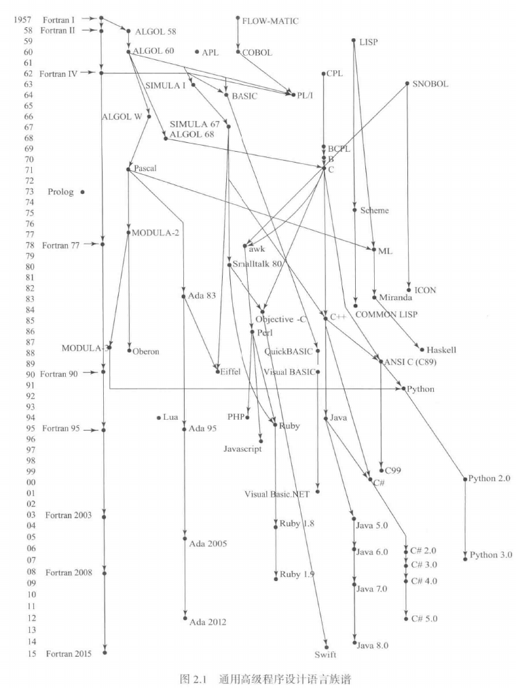
# Java核心技术·卷 I&&Ⅱ
- 实际观感不太行,第一部只不过涉及了一些常见的Java基础知识,而第二部涉及的各种框架和库也没什么必要去特地了解
# 深入理解计算机系统(第三版)
- 在读了各个层面的专业书籍后再回来看这本汇总书确实是一种享受,有一种把所有东西都串联起来的感觉.
## 概览
一场酣畅淋漓的概览,从处理器架构向上谈起,穿过操作系统,最终实现程序的I/O交互.
## 信息处理
我一直都很好奇各种入门书籍为何都如此看重诸如补码,反码,浮点数之类的知识,这本书也没能逃过这个俗套.

事实上来说,它们一点都不重要,在软件领域,我们根本没有机会用到这个知识,只要知道某个数据类型支持的最大范围和最大精度就可以了,即便是在相当冷门的硬件领域,只有在处理器和操作系统接口这一小小的范围内,你才需要考虑这些问题,然而这起码要在计算机领域钻研了好几年才有实力去接触,这不就是脱裤子放屁的事情吗.

### 大小端问题
不同处理器/操作系统中的有效字节顺序不同.最低有效字节在低地址的方式称为小端法(little endian),最高有效字节在低地址的方式称为大端法(big endian).

>这两种字节顺序在如今看来并没有什么高下之分,但也正是因为没有高下之分,也就无法达成一致的共识.
## 程序的机器级表示
这部分讲的是x86架构下的C语言汇编代码,说实话,讲的比较一般,通篇都是汇编代码的分析,入门程序员我想需要翻来覆去看很多遍才能看明白.
## 处理器体系结构
- 前半部分可以去看The Elements of Computing Systems,讲的比这可清楚多了;后半部分可以看计算机组成与设计
## 优化程序性能&&存储器层次结构
- 这两个部分对应了计算机体系结构那本书

## 链接
- 这一章的缺点是压缩了重要的链接具体过程,而拓展了一些不是很有用的知识.

为了从目标文件中构造可执行文件,链接器需要完成两个任务:
1. 符号解析: 将符号在各个文件中的引用与它在某个文件中的定义关联起来
2. 重定位: 将每个符号定义与一个内存位置关联起来,修改对这个符号的所有引用,使它们都指向这个内存位置.

这本书把目标文件分成三种:
* **可重定位目标文件**。包含二进制代码和数据，其形式可以在编译时与其他可重定位目标文件合并起来，创建一个可执行目标文件。
* **可执行目标文件**。包含二进制代码和数据，其形式可以被直接复制到内存并执行。
* **共享目标文件**。一种特殊类型的可重定位目标文件，可以在加载或者运行时被动态地加载进内存并链接。

ELF格式的可重定位目标文件格式如下:
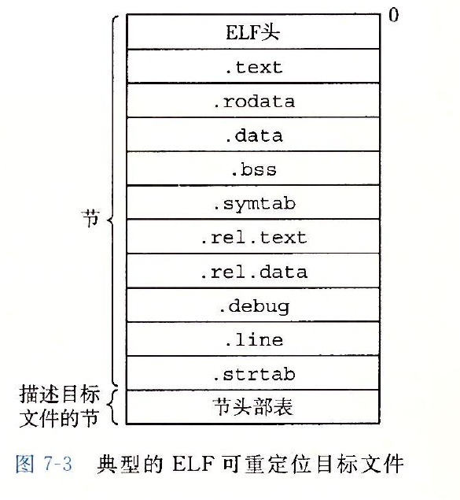

- ELF头记录了该文件的类型和节头部表的位置(偏移)
- 节头部表描述了不同节的位置和大小.
- text: 程序代码的机器语言表示
- rodata: 只读数据,比如printf语句中的格式串
- data: 已初始化的全局和静态C变量.至于局部C变量,它们只在运行时出现在栈中
- bss: 未初始化的全局和静态C变量,以及所有被初始化为0的全局或静态变量.这个段不占据实际的空间,仅仅是一个占位符,直到运行时才实际地分配这些变量的初始值为0.
- **symtab: 符号表,存放在程序中定义和引用的函数和全局变量的信息**,这是由汇编器构造的
- rel.text: 当链接器将该目标文件和其他文件组合时,需要修改这个段,用于重定位
- rel.data: 被模块引用或定义的所有全局变量的重定位信息
- debug: 用于调试的段,只有用-g选项调用gcc时才会生成
- line: 原始C源程序中的行号与.text中机器代码之间的映射,只有用-g选项调用gcc时才会生成
- strlab: 内容包括symtab和debug中的符号表

>bss的全名为Block Storage Start,始于IBM 704的汇编语言,这确实不知所云,一个简单方法是记成Better Save Space.

### 符号解析
链接器的输入是一组可重定位目标模块。每个模块定义一组符号，有些是局部的（只对定义该符号的模块可见），有些是全局的（对其他模块可见）。如果多个模块定义同名的全局符号，会发生什么呢？下面是 Linux 编译系统采用的方法。

在编译时，编译器向汇编器输出每个全局符号，或者是强（strong）或者是弱（weak），而汇编器把这个信息隐含地编码在可重定位目标文件的符号表里。函数和已初始化的全局变量是强符号，未初始化的全局变量是弱符号。

根据强弱符号的定义，Linux 链接器使用下面的规则来处理多重定义的符号名：

* **规则 1**：不允许有多个同名的强符号。
* **规则 2**：如果有一个强符号和多个弱符号同名，那么选择强符号。
* **规则 3**：如果有多个弱符号同名，那么从这些弱符号中任意选择一个。

### 重定位
重定位可以细分为两步:
1. 重定位节和符号定义: 将相同类型的节合并成一个新的节,并将符号定义对应特定的内存地址
2. 重定位符号引用: 修改代码节和数据节中的符号引用,指向第一步中的内存地址


## 异常控制&&虚拟内存
这两个部分完全就是操作系统导论的劣化版了.

## 程序部分
这一部分真想看的话可以翻一下Unix环境高级编程,不过想看的人一定很少吧.


## 总结
尽管写一本底层的汇总书并命名为"深入理解计算机系统"非常有魄力,但奈何这本书所说的深入都不是那么的深入,很多地方都拘泥于不太重要的层面.如果没有读过各个角度的专业书籍的话,是很容易被这本书迷惑的,从而花费大量时间去揣摩文中经过压缩和扭曲的知识点,这些时间完全可以用来去读专门的书籍,来获得更好一些的理解.

- 整体来说的话,只有链接一章值得一看,因为这方面的专业书籍实在太少了.
# Crafting Interpreters
## 概览
### 自举
- 自举: 使用语言C编写语言C的编译器.最开始,我们需要用其他语言实现的编译器来编写语言C的编译器,再用这个编译器来编译得到全部使用语言C编写的编译器,然后就可以把以前那个编译器扔掉了.

>至于最开始的编译器是怎么实现的?那自然是用汇编语言写的了,而将符号汇编语言转成二进制机器码也需要一个编译器,这个编译器自然就是用二进制机器码写的了,至于是如何实现的,我简直不敢想象
### 完整的编译器实现
程序编译分成多步:
1. 扫描/语法分析: 扫描器将高级语言的代码分割成不同的词法单元
2. 解析: 根据词法单元序列构建出语法树(abstract syntax tree,AST)
3. 静态分析: 分析语法树中各个变量的关系,如数据类型和是否为全局变量
   
上述三步称为编译器的前端.

4. 中间表示: intermediate representation(IR),将代码以一种中间语言存储,只需要针对中间语言来开发不同处理器架构的后端即可,而不需要改动前端.尽管很方便,但很多语言并不会在这一步生成中间代码,而是留待代码生成阶段再生成类似的形式
5. 优化: 使用各种编译处理来优化代码的运行速度,如循环展开和变量提取.

这两步称为编译器的中端.

6. 代码生成: 将中间代码/抽象语法树根据不同的处理器架构生成对应的汇编代码,或者,**为一个虚拟机生成虚拟的指令集代码**,如今称为字节码(bytecode),这是因为这类代码通常用单个字节构建而成
7. 虚拟机: 如果编译器生成了字节码,就可以用C语言编写一个虚拟机,那么任何支持C编译器的平台都可以运行该虚拟机,执行该语言的字节码,这也是为什么Java能够"一次编译,处处运行".
8. 运行时(runtime): 如果之前已经编译成机器码,那么我们只需要用操作系统加载可执行文件即可,如果编译成了字节码,那么就启动虚拟机并装载程序.程序执行过程中,我们需要能够支持垃圾回收,对象追踪等功能,这些被统称为运行时.

上述过程就是编译器的后端.
### 其他类型的编译器
- single-pass compiler: **不生成语法树或者中间代码**,需要源代码提供足够的信息,用于压缩编译占用的内存,如Pascal和C语言的编译器,这也解释了为何Pascal的语法规定类型声明必须位于代码块的开头；以及为何在C语言中，除非使用显式的前向声明告知编译器生成后续函数调用所需的信息，否则无法在函数定义代码上方调用该函数。
- tree-walk interpreter: 生成语法树后就立刻开始执行,也是这本书要制作的第一个解释器
- transpiler: 转译器,例如Typescript转译成Javascript,Javascript XML转译成Javascript.
- Just-in-time compilation(即时编译): 对于使用虚拟机和字节码的语言例如Java和C#来说,执行字节码还是太慢了,即时编译会将字节码编译成所在平台的汇编代码,从而加速代码的执行,如Java的HotSpot虚拟机.

### 编译器与解释器

- 编译器: 将源代码转换成另一种形式,但不会执行该代码,用户需要自己额外用命令运行它
- 解释器: 接收源代码并立即执行

例如CPython,它在内部将python代码转换成字节码,并用虚拟机立即执行它,因此它既是解释器也包含了编译器.

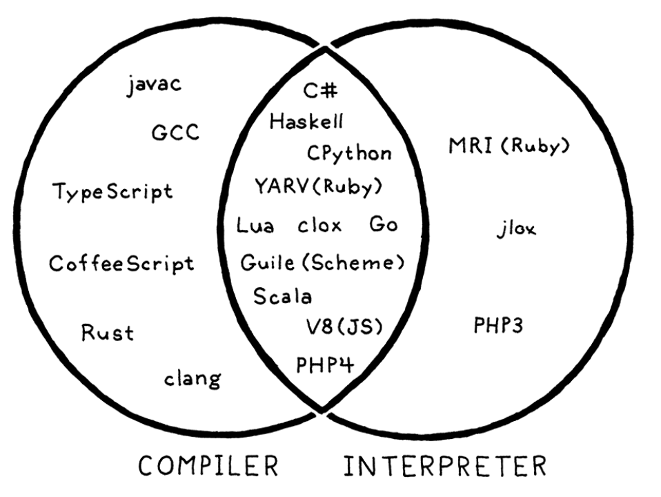

## 总结
具体实现的内容真的不太有耐心看下去呢,因为太过割裂了,以后有机会我或许会再来阅读一次吧.
# 白帽子讲Web安全
- [作者介绍](https://zhuanlan.zhihu.com/p/20436467)
  - 非常有传奇色彩的hacker,可惜了解他的人不多
## 浏览器安全
1. 同源策略: 禁止不同源的网站访问该网站的内容,否则恶意网站就可以监控你的交易信息.
2. Sandbox: 浏览器引擎由Sandbox隔离起来,从而防止网页中的恶意代码注入和执行
3. 恶意网址拦截: 浏览器内置了一份关于恶意网站的黑名单,当用户遇到这些网站时提出警告

## 跨站脚本攻击(XSS)
>跨站脚本攻击，英文全称是 Cross Site Script，本来缩写是 CSS，但是为了和层叠样式表（Cascading Style Sheet，CSS）有所区别，所以在安全领域叫做“XSS”

文章中讲的XSS攻击方案在如今的现代前端框架下已经不太可能出现了,所以我们现在没有听过像零几年Samy Worm那样的大规模攻击事件了.
## 跨站点请求伪造（CSRF）
CSRF的全名为Cross Site Request Forgery,通过恶意网站向正常网站发送带有Cookie或者Token的请求,从而引发破坏性的影响,现在这种攻击基本绝迹了.
## 点击劫持（ClickJacking）
这种方法将恶意的透明图片或者按钮覆盖在原网页上方,当用户浏览网页时,会不经意地被导向另外一个伪装的恶意网站,这种攻击现在也绝迹了.

## 注入攻击
通过ORM和数据库的内置防御,SQL等注入攻击现在也绝迹了

## 应用层拒绝服务攻击
分布式拒绝服务(Distributed Denial of Service,DDOS)通过大量的合理请求造成资源过载,服务器不得不停止运行,拒绝新的请求.

## 总结
尽管文章谈到的Web安全原理很多,但可惜的是在当今这个时代下都不太适用了,唯独DDOS还有着些微的活跃度.

纵览全文,可以发现的是,大多数Web安全方案都是被各种网络攻击逼出来的,如果没有这些网络攻击,或许人们永远不会意识到存在这些漏洞.

或许,网络安全这个行业将会逐渐式微下去吧,毕竟在现代的前后端框架下,传统的网络攻击方案都不太管作用了,cracker想要发起攻击只有两条道路,从内部突破,例如诱导下载恶意软件或者U盘攻击,或者付出高昂的代价从外部侵入,例如DDOS或者攻击防火墙.也就是说,SRE这类岗位做的才是传统的网络安全的活儿,而我如今看到的网络安全行业,更多的是去挖漏洞和找病毒,也就是和网络本身关系并不大了,叫做软件安全反而更为恰当
# Spring Start Here
## 前言
>The reality is that **despite being so popular**, it's pretty **hard to find quality introductory material**. The reference documentation is thousands of pages long, describing all the subtleties and details that could be helpful in very specific scenarios, so it's not an option for a newcomer. While online videos and tutorials typically fail to engage the student, **very few books capture the essence of Spring framework**, often spending long pages debating topics that prove to be **irrelevant to the problems faced in modern application development**. With this book, however, it's very hard to find anything to remove; all the concepts covered are recurring topics in the development of any Spring application.

>This book is for developers who understand basic object-oriented programming and Java concepts and want to learn Spring or refresh their Spring fundamentals knowledge.

>如果对 Spring 完全没有（或仅有极少）了解，最佳读法是从第一章开始，按顺序通读全书。

- (6/23): 希望这本书能够如前言所说的那样好.
## 介绍
Spring框架由以下部分组成:
1. Spring Core: 包含Spring context,The Spring Expression Language等核心功能.
2. Spring model-view-controller (MVC): 用于开发Web应用程序
3. Spring Data Access: 用于连接数据库
4. Spring testing: 用于测试

Spring Boot引入了`convention over configuration`这一概念,也就是说,开发者无需自行完成框架的全套配置，Spring Boot会提供一套默认配置方案，用户可根据需求进行个性化调整.

- 暂时弃坑
# 设计数据密集型应用(第二版)(待补充)
- 第一版于2017年出版,第二版于2026年出版,中间间隔了十年,所以章节内容上有了大幅度的改动.

前两章没什么太实际的内容,故可以直接跳过
## ch3

这一章主要介绍了主流的数据库类型,但都不是很深入,要专门学习还是得去看对应的书籍
## ch4
主要讲了LSM树和B+树,以及各种各样的索引类型

## 暂缓
明明很多人都推荐这本书,但我就是读不下去呢.一般的分布式服务问题用框架就可以解决了,如果问题严重到需要自己造轮子,那也不是我这个菜鸟能搞定的事情了.
# 第一行代码(待补充)
- 谁能想到我连Android Studio的模拟器都打不开呢,直接就折戟沉沙了,过会时候再来吧.
# The Garbage Collection Handbook(第一版)(待补充)
## 前置概念
- 堆: 一段或连续几段连续内存组成的空间集合,内存颗粒(granule)是堆内存分配的最小单位,通常是一个字(word)或者双字.内存单元(cell)是由数个连续的颗粒组成的内存块.
- 对象(object): 为应用程序分配的内存单元
- 赋值器: 分配新的对象,并修改对象之间的引用关系,从而改变对象图.
  - 赋值器有三种操作: New,从堆分配器获得一个新的堆对象;Read,访问某个对象;Write,修改某个对象
- 回收器(collector): 执行垃圾回收代码,找到不可达对象并将其回收
- 分配器(allocator): 分配或者释放存储空间

标记-清扫（mark-sweep）、标记-复制（mark-copy）、标记-整理（mark-compact）、引用计数（reference counting）是4种最基本的垃圾回收策略。大多数回收器会以不同的组合方式来应用这些策略.

## 标记-清扫算法
- 这是一种间接回收算法,并非直接检测垃圾本身,而是先确定所有的存活对象,再反过来判定其他对象都是垃圾.
# ASP.NET Core开发实战(第三版)
- 之前看了老版本的,直接被劝退了,现在这个版本是2023年出版的.


# Entity Framework Core in Action Second Edition
## 概览
### EF core原理
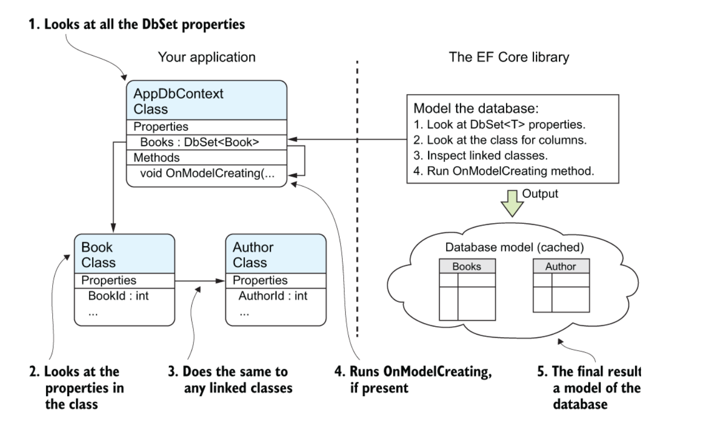

>该图展示了 EF Core 如何依据你映射的类构建数据库模型。首先它通过`DbSet<T>` 属性检查你定义的类，随后会扫描这些类所引用的其他类。借助这些类，EF Core 能够推导出数据库的默认模型。接着它会执行应用程序中 DbContext 的 `OnModelCreating` 方法，你可以重写该方法并添加具体指令，以按你的需求配置数据库。
## 查询数据库
# C# 12 in a Nutshell
- 2024年出版,还是非常新鲜的
##

# On Java 8(待补充)
- [中文翻译版链接](https://zyb0408.github.io/gitbooks/onjava8/)

讲的还算详细和有体系,但由于我已经了解过其中的大多数内容了,所以就只摘抄一些比较难懂和重要的部分,很多我这辈子都未必能用到的零碎知识点就直接跳过了.
## Java的垃圾回收
### 文章摘录
如果你以前用过的语言，在堆上分配对象的代价十分高昂，你可能自然会觉得 Java 中所有对象（基本类型除外）在堆上分配的方式也十分高昂。然而，垃圾回收器能很明显地提高对象的创建速度。这听起来很奇怪——存储空间的释放影响了存储空间的分配，但这确实是某些 Java 虚拟机的工作方式。这也意味着，Java 从堆空间分配的速度可以和其他语言在栈上分配空间的速度相媲美。

例如，你可以把 C++ 里的堆想象成一个院子，里面每个对象都负责管理自己的地盘。一段时间后，对象可能被销毁，但地盘必须复用。在某些 Java 虚拟机中，堆的实现截然不同：它更像一个传送带，每分配一个新对象，它就向前移动一格。这意味着对象存储空间的分配速度特别快。Java 的"堆指针"只是简单地移动到尚未分配的区域，所以它的效率与 C++ 在栈上分配空间的效率相当。当然实际过程中，在簿记工作方面还有少量额外开销，但是这部分开销比不上查找可用空间开销大。

你可能意识到了，Java 中的堆并非完全像传送带那样工作。要是那样的话，势必会导致频繁的内存页面调度——将其移进移出硬盘，因此会显得需要拥有比实际需要更多的内存。页面调度会显著影响性能。最终，在创建了足够多的对象后，内存资源被耗尽。其中的秘密在于垃圾回收器的介入。当它工作时，一边回收内存，一边使堆中的对象紧凑排列，这样"堆指针"就可以很容易地移动到更靠近传送带的开始处，也就尽量避免了页面错误。垃圾回收器通过重新排列对象，实现了一种高速的、有无限空间可分配的堆模型。

要想理解 Java 中的垃圾回收，先了解其他系统中的垃圾回收机制将会很有帮助。一种简单但速度很慢的垃圾回收机制叫做引用计数。每个对象中含有一个引用计数器，每当有引用指向该对象时，引用计数加 1。当引用离开作用域或被置为 null 时，引用计数减 1。因此，管理引用计数是一个开销不大但是在程序的整个生命周期频繁发生的负担。垃圾回收器会遍历含有全部对象的列表，当发现某个对象的引用计数为 0 时，就释放其占用的空间（但是，引用计数模式经常会在计数为 0 时立即释放对象）。这个机制存在一个缺点：如果对象之间存在循环引用，那么它们的引用计数都不为 0，就会出现应该被回收但无法被回收的情况。对垃圾回收器而言，定位这样的循环引用所需的工作量极大。引用计数常用来说明垃圾回收的工作方式，但似乎从未被应用于任何一种 Java 虚拟机实现中。

- Python一直采用的垃圾回收机制就是引用计数

在更快的策略中，垃圾回收器并非基于引用计数。它们依据的是：对于任意"活"的对象，一定能最终追溯到其存活在栈或静态存储区中的引用。这个引用链条可能会穿过数个对象层次，由此，如果从栈或静态存储区出发，遍历所有的引用，你将会发现所有"活"的对象。对于发现的每个引用，必须追踪它所引用的对象，然后是该对象包含的所有引用，如此反复进行，直到访问完"根源于栈或静态存储区的引用"所形成的整个网络。你所访问过的对象一定是"活"的。注意，这解决了对象间循环引用的问题，这些对象不会被发现，因此也就被自动回收了。

在这种方式下，Java 虚拟机采用了一种自适应的垃圾回收技术。至于如何处理找到的存活对象，取决于不同的 Java 虚拟机实现。其中有一种做法叫做停止-复制（stop-and-copy）。顾名思义，这需要先暂停程序的运行（不属于后台回收模式），然后将所有存活的对象从当前堆复制到另一个堆，没有复制的就是需要被垃圾回收的。另外，当对象被复制到新堆时，它们是一个挨着一个紧凑排列，然后就可以按照前面描述的那样简单、直接地分配新空间了。

当对象从一处复制到另一处，所有指向它的引用都必须修正。位于栈或静态存储区的引用可以直接被修正，但可能还有其他指向这些对象的引用，它们在遍历的过程中才能被找到（可以想象成一个表格，将旧地址映射到新地址）。

这种所谓的"复制回收器"效率低下主要因为两个原因。其一：得有两个堆，然后在这两个分离的堆之间来回折腾，得维护比实际需要多一倍的空间。某些 Java 虚拟机对此问题的处理方式是，按需从堆中分配几块较大的内存，复制动作发生在这些大块内存之间。

其二在于复制本身。一旦程序进入稳定状态之后，可能只会产生少量垃圾，甚至没有垃圾。尽管如此，复制回收器仍然会将所有内存从一处复制到另一处，这很浪费。为了避免这种状况，一些 Java 虚拟机会进行检查：要是没有新垃圾产生，就会转换到另一种模式（即"自适应"）。这种模式称为标记-清扫（mark-and-sweep），Sun 公司早期版本的 Java 虚拟机一直使用这种技术。对一般用途而言，"标记-清扫"方式速度相当慢，但是当你知道程序只会产生少量垃圾甚至不产生垃圾时，它的速度就很快了。

"标记-清扫"所依据的思路仍然是从栈和静态存储区出发，遍历所有的引用，找出所有存活的对象。但是，每当找到一个存活对象，就给对象设一个标记，并不回收它。只有当标记过程完成后，清理动作才开始。在清理过程中，没有标记的对象将被释放，不会发生任何复制动作。"标记-清扫"后剩下的堆空间是不连续的，垃圾回收器要是希望得到连续空间的话，就需要重新整理剩下的对象。

"停止-复制"指的是这种垃圾回收动作不是在后台进行的；相反，垃圾回收动作发生的同时，程序将会暂停。在 Oracle 公司的文档中会发现，许多参考文献将垃圾回收视为低优先级的后台进程，但是早期版本的 Java 虚拟机并不是这么实现垃圾回收器的。当可用内存较低时，垃圾回收器会暂停程序。同样，"标记-清扫"工作也必须在程序暂停的情况下才能进行。

如前文所述，这里讨论的 Java 虚拟机中，内存分配以较大的"块"为单位。如果对象较大，它会占用单独的块。严格来说，"停止-复制"要求在释放旧对象之前，必须先将所有存活对象从旧堆复制到新堆，这导致了大量的内存复制行为。有了块，垃圾回收器就可以把对象复制到废弃的块。每个块都有年代数来记录自己是否存活。通常，如果块在某处被引用，其年代数加 1，垃圾回收器会对上次回收动作之后新分配的块进行整理。这对处理大量短命的临时对象很有帮助。垃圾回收器会定期进行完整的清理动作——大型对象仍然不会复制（只是年代数会增加），含有小型对象的那些块则被复制并整理。Java 虚拟机会监视，如果所有对象都很稳定，垃圾回收的效率降低的话，就切换到"标记-清扫"方式。同样，Java 虚拟机会跟踪"标记-清扫"的效果，如果堆空间出现很多碎片，就会切换回"停止-复制"方式。这就是"自适应"的由来，你可以给它个啰嗦的称呼："自适应的、分代的、停止-复制、标记-清扫"式的垃圾回收器。

Java 虚拟机中有许多附加技术用来提升速度。尤其是与加载器操作有关的，被称为"即时"（Just-In-Time, JIT）编译器的技术。这种技术可以把程序全部或部分翻译成本地机器码，所以不需要 JVM 来进行翻译，因此运行得更快。当需要装载某个类（通常是创建该类的第一个对象）时，编译器会先找到其 .class 文件，然后将该类的字节码装入内存。你可以让即时编译器编译所有代码，但这种做法有两个缺点：一是这种加载动作贯穿整个程序生命周期内，累加起来需要花更多时间；二是会增加可执行代码的长度（字节码要比即时编译器展开后的本地机器码小很多），这会导致页面调度，从而一定降低程序速度。另一种做法称为惰性评估，意味着即时编译器只有在必要的时候才编译代码。这样，从未被执行的代码也许就压根不会被 JIT 编译。新版 JDK 中的 Java HotSpot 技术就采用了类似的做法，代码每被执行一次就优化一些，所以执行的次数越多，它的速度就越快。
### 总结
首先我们需要知道的是**Java将对象通通放在堆上**,当有新的对象要被分配时,Java 的"堆指针"只是简单地移动到尚未分配的区域，所以它的效率与 C++ 在栈上分配空间的效率相当。

但是,当对象数量一多,内存容量极小的缓存(cache)就有可能没有保留我们所需的对象,需要从主存(main memory)甚至是硬盘中读取,俗称(缓存不命中,cache miss),这大大延长了扫描对象的时间,从而影响程序运行的速度,所以我们需要通过**垃圾回收**机制处理**未被实际引用**的对象.

早期的JVM采用两种垃圾回收机制,分别对应程序启动和程序稳定运行的情况:
1. **停止-复制（stop-and-copy）**: 暂停程序运行,将所有对象复制到一个新的堆
2. **标记-清扫（mark-and-sweep）**: 当程序产生的垃圾很少时,再用停止-复制机制的开销就太大了,所以我们可以通过遍历栈和静态存储区的方式,**标记**那些被实际引用的对象,并在遍历结束后**清扫**未被标记的对象.

这两种垃圾回收都必须在程序暂停时才可以进行,所以还是不够理想,至于更深入的讨论,需要去阅读其他书籍来理解

## 函数式编程
>大多数面向对象语言都或多或少的学习和吸收了函数式语言的特点,JAva也不例外,在Java 8中引入了Lambda表达式和函数式编程.

### 新旧对比
下面是传统方式和Java 8的方式对比:
```java
// functional/Strategize.java

interface Strategy {
  String approach(String msg);
}

class Soft implements Strategy {
  public String approach(String msg) {
    return msg.toLowerCase() + "?";
  }
}

class Unrelated {
  static String twice(String msg) {
    return msg + " " + msg;
  }
}

public class Strategize {
  Strategy strategy;
  String msg;
  Strategize(String msg) {
    strategy = new Soft(); // [1]
    this.msg = msg;
  }

  void communicate() {
    System.out.println(strategy.approach(msg));
  }

  void changeStrategy(Strategy strategy) {
    this.strategy = strategy;
  }

  public static void main(String[] args) {
    Strategy[] strategies = {
      new Strategy() { // [2]
        public String approach(String msg) {
          return msg.toUpperCase() + "!";
        }
      },
      msg -> msg.substring(0, 5), // [3]
      Unrelated::twice // [4]
    };
    Strategize s = new Strategize("Hello there");
    s.communicate();
    for(Strategy newStrategy : strategies) {
      s.changeStrategy(newStrategy); // [5]
      s.communicate(); // [6]
    }
  }
}
```

**输出结果**
```java
hello there?
HELLO THERE!
Hello
Hello there Hello there
```

对应序号的说明:

- [1] 在 Strategize 中，Soft 作为默认策略，在构造函数中赋值。
- [2] 一种略显简短且更自发的方法是创建一个匿名内部类。即使这样，仍有相当数量的冗余代码。你总是要仔细观察：“哦，原来这样，这里使用了匿名内部类。”
- [3] Java 8 的 Lambda 表达式。由箭头 -> 分隔开参数和函数体，箭头左边是参数，箭头右侧是从 Lambda 返回的表达式，即函数体。这实现了与定义类、匿名内部类相同的效果，但代码少得多。
- [4] Java 8 的方法引用，由 :: 区分。在 :: 的左边是类或对象的名称，在 :: 的右边是方法的名称，但没有参数列表。
- [5] 在使用默认的 Soft strategy 之后，我们逐步遍历数组中的所有 Strategy，并使用 changeStrategy() 方法将每个 Strategy 放入 变量 s 中。
- [6] 现在，每次调用 communicate() 都会产生不同的行为，具体取决于此刻正在使用的策略代码对象。我们传递的是行为，而非仅数据

>在 Java 8 之前，我们能够通过 [1] 和 [2] 的方式传递功能。然而，这种语法的读写非常笨拙，并且我们别无选择。方法引用和 Lambda 表达式的出现让我们可以在需要时传递功能，而不是仅在必要才这么做。

上述的代码对于新手来说非常难以理解,所以接下来要好好探析一下.
### Lambda表达式
Lambda 表达式是使用最小可能语法编写的函数定义：

1. Lambda 表达式产生函数，而不是类。 在 JVM（Java Virtual Machine，Java 虚拟机）上，一切都是一个类，因此在幕后执行各种操作使 Lambda 看起来像函数 —— 但作为程序员，你可以高兴地假装它们“只是函数”。
2. Lambda 语法尽可能少，这正是为了使 Lambda 易于编写和使用。


# 图数据库(第二版)
## 介绍
>在数据集增大的时候,图数据库的性能保持不变,因为查询总是只与图的一部分有关,只需要遍历符合查询条件的那部分图即可.

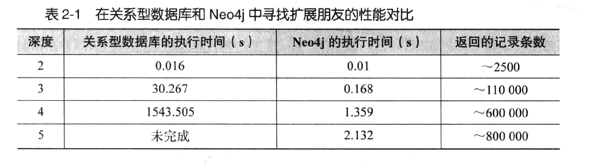
## 建模
- Cypher是图数据库的标准查询语言,而不少图数据库还支持RDF的查询语言SPARQL.

很遗憾的是,书中对Cypher的介绍非常浅显,所以需要专门找其他的书来看了.至于剩下的内容就都是扯淡了,这也看得出来图数据库本身还没有那么成熟.

# x86汇编语言：从实模式到保护模式(第二版)
这本书的前半部分围绕8086处理器,后半部分围绕80386处理器.
## 基础知识
### 8086处理器架构
- 8086处理器是INTEL的第一款16位处理器,诞生于1978年

8086中有8个16位(两个字节)的通用寄存器,结构如下:

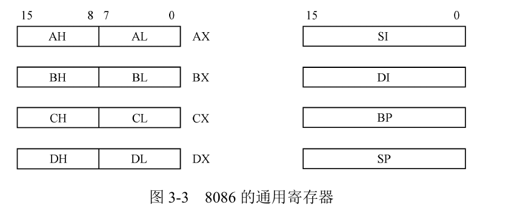

由于x86中指令的长度不定,短的只有1字节,长的有15字节,所以需要将指令和数据分开存放在内存中.

内存的结构如下:

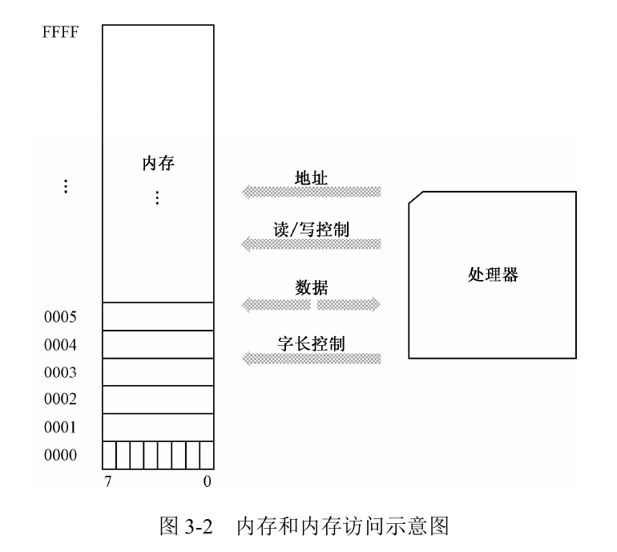

内存的最小访问单元是1字节,每一位地址对应1个字节.

关于8086架构的一个详细示意图如下:

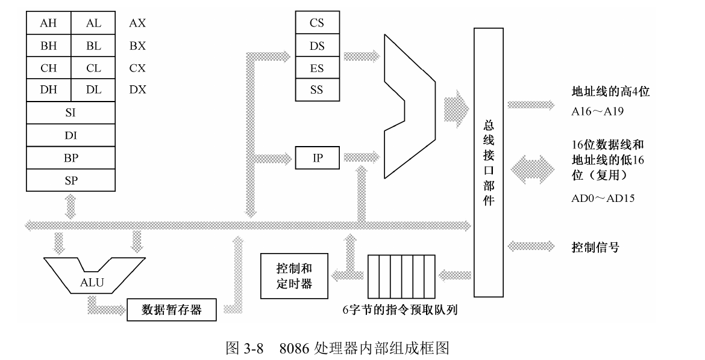

8086 内部有 4 个段寄存器。其中，CS 是代码段寄存器，DS 是数据段寄存器，ES 是附加段（Extra Segment）寄存器,SS 是栈段（Stack Segment）寄存器

IP是指令指针（Instruction Pointer）寄存器,只和CS一起使用,当一段代码开始执行时,CS 保存代码段的段地址，IP 则指向段内偏移。这样，由 CS 和 IP 共同形成逻辑地址.
### 汇编语言
16进制的英文是Hexadecimal,比如125H后面的“H”用于表明这是一个十六进制数,但在很多高级语言中，如果要指示一个数是十六进制数，通常不采用在后面加“H”的做法，而是为它添加一个“0x”前缀，如:
```asm
mov ax,0x3f
```

>你可能想问一下，为什么会是这样，为什么会是“0x”？答案是不知道，不知道在什么时候，为什么就这样用了。这不得不让人怀疑，它肯定是一个非常随意的决定，并在以后形成了惯例
### ROM
>8086 有 20 根地址线，但并非全都用来访问 DRAM，也就是内存条。事实上，这些地址线经过分配，大部分用于访问 DRAM，剩余的部分给了只读存储器（Read Only Memory，ROM）和外围的板卡，如图所示。

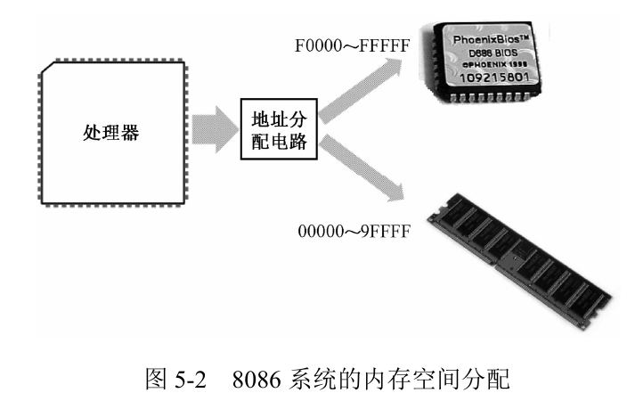

>与 DRAM 不同，ROM 不需要刷新，它的内容是预先写入的，即使掉电也不会消失，但也很难改变.

因此,我们可以在ROM中存入初始化指令,在电脑开机时载入最基本的硬件(如硬盘和内存),这块ROM芯片又被称为基本输入输出系统(（Base Input & Output System，BIOS）)ROM,即ROM-BIOS.

这是很显然的,因为操作系统都装在硬盘里呢,所以我们需要BIOS来激活操作系统.

### 硬盘
>谁能想到这本书对磁盘的讲解远远超过了我至今见过的所有底层技术书籍呢

硬盘由一个或者多个盘片组成,都串联在一个转轴上,由电动机带动着不断高速旋转,每个盘片都有两个磁头(Head),上面一个下面一个,磁头通过磁头臂固定在磁头支架上,由另一个电动机带动着在盘片的中心和边缘之间来回移动,速度略慢.

盘片高速旋转过程中会画出一个圆圈,由内而外半径主键变大,这就是磁道(Track),所有的磁头和垂直对应的磁道形成了一个虚拟的圆柱,称为柱面.

磁道和柱面也要编号,从0开始.磁道进一步可以划分成扇区(sector),是读写数据的最小单元,每个扇区也有编号,从1开始.


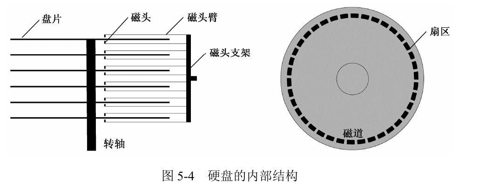
### 主引导扇区
硬盘的第一个扇区是 0 面 0 道 1 扇区，或者说是 0 头 0 柱 1 扇区，这个扇区称为主引导扇区。如果计算机的设置是从硬盘启动的，那么，ROM-BIOS 将读取硬盘主引导扇区的内容，将它加载到内存地址 0x0000:0x7c00（也就是物理地址 0x07C00），然后用一个 jmp 指令跳到那里接着执行.

>为什么偏偏是 0x7c00 这个地方？还不太清楚。反正当初定下这个方案的家伙已经被人说了很多坏话，我也就不准备再多说什么了。


## 实模式


# MongoDB权威指南(第三版)
## 简介
MongoDB 不是关系数据库，而是面向文档（document-oriented）的数据库

随着所需存储数据量的增长，开发人员面临一个艰难的决定：应该如何扩展数据库？这可以归结为两种选择：纵向扩展（提高配置）和横向扩展（将数据分布到更多机器上）。纵向扩展通常是阻力最小的途径，但它也有缺点：大型机器一般非常昂贵，而且在最终达到物理极限时，就无法再升级到更高的配置了。另一种方式是横向扩展：如果想增加存储空间或增加读写操作的吞吐量，那么可以购买额外的服务器，并将它们添加到集群中。这既便宜又便于扩展，但管理 1000 台机器比管理 1 台机器困难得多。

>MongoDB 的设计采用了横向扩展。面向文档的数据模型使跨多台服务器拆分数据更加容易。MongoDB 会自动平衡跨集群的数据和负载，自动重新分配文档，并将读写操作路由到正确的机器上

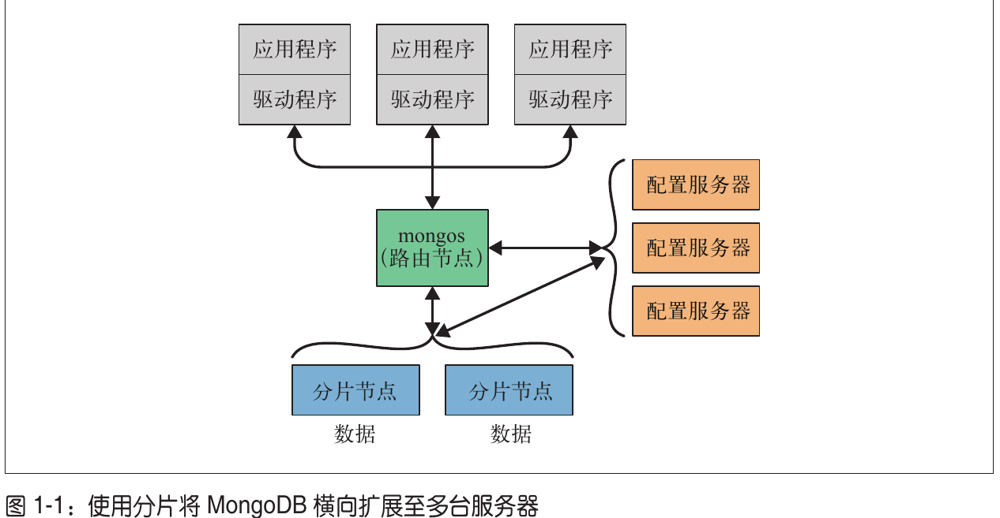
### 文档
文档是 MongoDB 的核心概念：它是一组有序键值的集合。文档的表示形式因编程语言而异，但大多数语言具有自然匹配的数据结构，比如映射、哈希表或字典.


MongoDB 会区分类型和大小写。例如，下面这两个文档是不同的：
```json
{"count" : 5}
{"count" : "5"}
```

### 集合
>集合就是一组文档。如果将文档比作关系数据库中的行，那么一个集合就相当于一张表。

任何文档都可以放入集合中,但为了管理方便,通常都会进行一定的分类.

### 数据库
MongoDB 使用集合对文档进行分组，使用数据库对集合进行分组。一个 MongoDB 实例可以承载多个数据库

有一些数据库名称是保留的。这些数据库可以被访问，但它们具有特殊的语义:
- admin: admin 数据库会在身份验证和授权时被使用。
- local: 特定于单个服务器的数据会存储在此数据库中。
- config: MongoDB 的分片集群会使用 config 数据库存储关于每个分片的信息

通过将数据库名称与该库中的集合名称连接起来，可以获得一个完全限定的集合名称，称为命名空间。如果你要使用 cms 数据库中的 blog.posts 集合，则该集合的命名空间为 cms.blog.posts。

### 补充: 安装和启动MongoDB
[官网](https://www.mongodb.com/try/download/community)下载对应平台的社区版server,书中说
# Python源码剖析
## 概览
Python的整体架构如下:

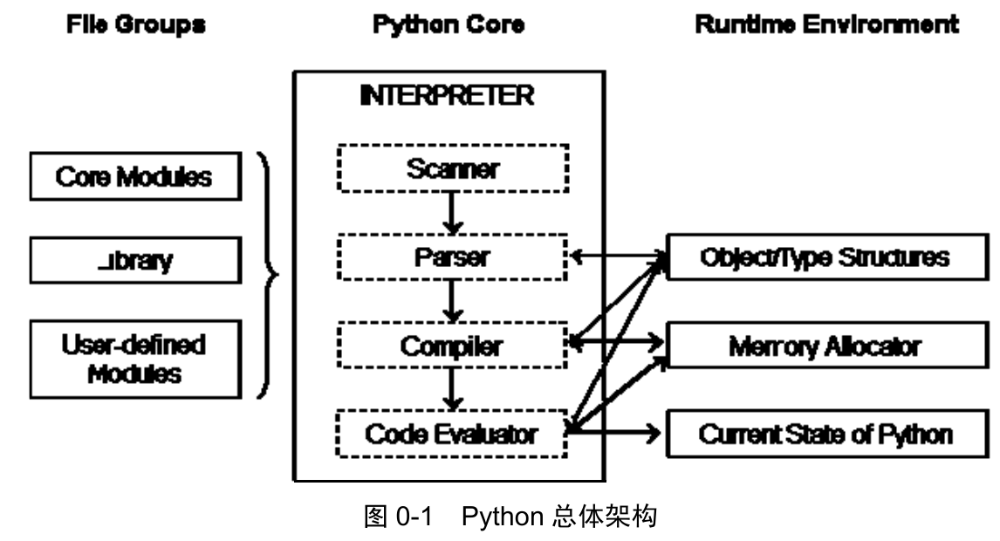

分为三个部分:
1. 模块: 系统模块(如os)和用户自定义模块(如fastapi)
2. python运行时: python程序运行时的所有上下文,包括类型系统,内存分配器和运行时的状态信息.
3. python解释器/虚拟机: 将python代码转换成字节码,并执行该字节码.

这本书分析的python版本为06年发布的2.5,距今已经有整整二十年,而我们都知道python3对python2做了很多大规模的修改,看一下两者的架构图对比:

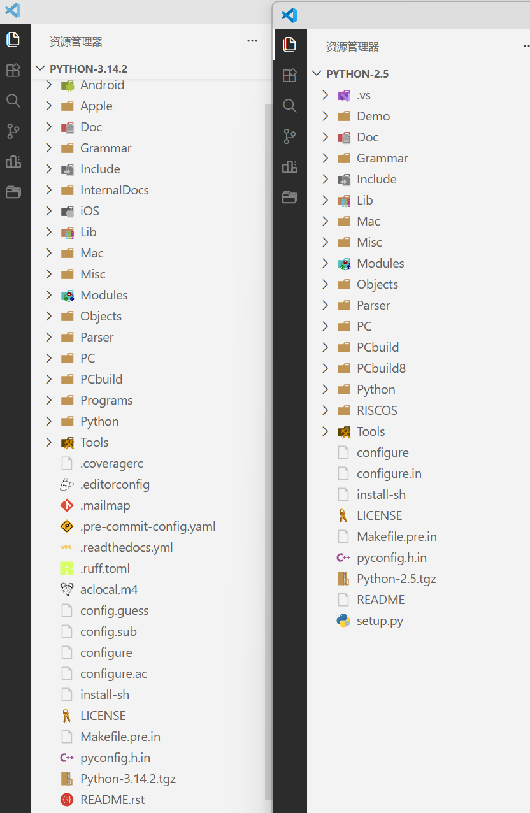

**python2.5**
```bash
---------------------------------------------------------------------------------------
Language                             files          blank        comment           code
---------------------------------------------------------------------------------------
Python                                1757          63467          82162         314024
C                                      364          38904          26691         302471
TeX                                    379          24318           1857         104858
C/C++ Header                           210           5150           8076          50944
Bourne Shell                            40           3205           3238          29277
MSBuild script                          45              0              0          14596
Text                                    97           1969              0          10161
Assembly                                29           1146           1944           5809
Lisp                                     3            537            519           3678
Perl                                    11            599            852           3677
make                                    14            657            505           3202
HTML                                    21            488             11           2843
Windows Module Definition                9            170            187           2050
XML                                     11            160             32           1251
reStructuredText                         2            285             74           1005
Objective-C                              6            105             75            660
Visual Studio Solution                   4              0              1            526
SVG                                      1             88              0            521
m4                                       2             34              5            296
Windows Resource File                    4             45             56            207
CSS                                      1             32             44            167
DOS Batch                               11             23             45            144
vim script                               1             36              7            104
INI                                      1             42             27            102
JSON                                     3              0              0             70
Expect                                   1              0              0             60
NAnt script                              4              2              0             60
Snakemake                                1             15              6             27
VBScript                                 2              1              1             12
diff                                     1              5             19             12
IDL                                      1              4              0             11
sed                                      1              0              0              3
---------------------------------------------------------------------------------------
SUM:                                  3037         141487         126434         852828
---------------------------------------------------------------------------------------
```
- 852 828行代码

**python3.14**
```bash
github.com/AlDanial/cloc v 2.08  T=39.25 s (113.7 files/s, 65894.3 lines/s)
---------------------------------------------------------------------------------------
Language                             files          blank        comment           code
---------------------------------------------------------------------------------------
Python                                2069         155895         171967         711733
C                                      467          70795          70129         490277
C/C++ Header                           619          29165          16692         254550
reStructuredText                       534          93860         119054         112181
Text                                   140           2808              0         104884
JSON                                    28              3              0          53816
XML                                    212            382            178          46085
Bourne Shell                            38           5554           3358          33031
m4                                       2            806            345           7876
Markdown                                27           1275             25           4478
C++                                      7            834            355           3789
TOML                                    75            109            130           2724
HTML                                    13            137              0           2427
WiX source                              52            194             44           2017
DOS Batch                               32            368            120           1829
Visual Studio Solution                   2              1              2           1814
Objective-C                             10            138             98            793
MSBuild script                          30             44              3            687
SVG                                     11              1             37            672
Windows Module Definition                6             23             12            557
diff                                     6             15            264            504
Lisp                                     1            109             81            502
JavaScript                               6             51             32            436
make                                     4             72             45            364
PowerShell                               7             88            179            352
INI                                     11             69             27            250
Windows Resource File                    6             37             52            242
Gradle                                   3             38             19            235
BitBake                                  2              2              0            186
WiX string localization                 11             20              0            182
YAML                                     3             15             10            154
CSS                                      2             27              5            101
Kotlin                                   2             18             14             95
D                                        5              8              1             74
Assembly                                 2              2             46             57
PO File                                  2             12              4             54
Bourne Again Shell                       2              8              2             46
Fish Shell                               1             13             14             42
TypeScript                               2              5              0             32
PHP                                      1              8             20             30
IDL                                      1              0              0             24
XSLT                                     2              5             12             16
C Shell                                  1             10              5             12
CMake                                    1              3              1             10
Properties                               2              1             23             10
DTD                                      1              4              0              2
VBScript                                 1              0              1              0
---------------------------------------------------------------------------------------
SUM:                                  4462         363032         383406        1840232
---------------------------------------------------------------------------------------
```
- 1 840 232行代码

两倍多的增量注定了这本书太老了,不过话又说回来,也正是因为分析的python版本老,我们才能看得清楚python的核心架构,所以更有必要看这本书了.

Python2.5的核心文件夹如下:
* **Include**：包含了 Python 提供的所有头文件。用户若使用 C 或 C++ 编写自定义扩展模块，需调用此处的头文件。
* **Lib**：包含了 Python 自带的所有标准库，均使用 Python 语言编写。
* **Modules**：包含了用 C 语言编写的模块（如 random、cStringIO）。主要存放对执行速度要求极高的模块。
* **Parser**：包含了 Python 解释器中的 Scanner（词法分析）和 Parser（语法分析）部分，以及可根据语法自动生成词法/语法分析器的工具。
* **Objects**：包含了所有 Python 的内建对象（如整数、list、dict）以及运行时所需的内部对象的具体实现。
* **Python**：包含了 Python 解释器中的 Compiler（编译器）和执行引擎部分，是 Python 运行的核心。
* **PCBuild**：包含了 Visual Studio 2003 的工程文件，用于在 VS2003 环境下编译 Python 源码。
* **PCBuild8**：包含了 Visual Studio 2005 使用的工程文件。

## Python内部对象
### 概览
在Python中,一切都是对象,甚至类型(如int,string)也是一个对象.

Python的实现语言一直都是ANSI C(C的简单改版),它并不是一个面向对象的语言,那么Python是如何实现面向对象的呢?

在Python中,对象为C中的结构体在堆上申请的一块内存,我们都知道堆的申请每次都要指定内存大小(malloc),那么一个对象一旦被创建,它的内存大小就是不变的了.

这样一来,诸如列表,字典等可变长度的对象就需要维护一个

# 推荐系统实践
## 推荐系统概述
>在这个时代，无论是信息消费者还是信息生产者都遇到了很大的挑战：作为信息消费者，如何从大量信息中找到自己感兴趣的信息是一件非常困难的事情；作为信息生产者，如何让自己生产的信息脱颖而出，受到广大用户的关注，也是一件非常困难的事情
>
>推荐系统就是解决这一矛盾的重要工具。推荐系统的任务就是联系用户和信息，一方面帮助用户发现对自己有价值的信息，另一方面让信息能够展现在对它感兴趣的用户面前，从而实现信息消费者和信息生产者的双赢

## 总结
还算值得一看,看完之后基本了解了两件事:
1. 早期的推荐算法背后的数学原理是相当简单的,不太需要费脑子去设计,市面上有相当多的成熟算法可以选用;而现在的推荐算法都是基于机器学习实现的,需要相当大的计算量,而效果我看并没有多好,不如老老实实地用以前的方法为好.
2. 推荐算法最重要的地方反而是数据集,无论是给新用户推荐,还是给老用户推荐,都需要事先有一个相当大规模的测试集,才能够大致划出一个恰当的范围,不会轻易让用户流失.
# Python3网络爬虫开发实战
## 爬虫基础
讲的还不错,基本涉及了爬虫所需的所有知识,尤其是关于session,cookie的地方讲的很好,帮我扫清了一点疑惑
# Powerful Python: Patterns and Strategies with Modern Python


## 数据的存储
## Ajax数据爬取
## 异步爬虫

