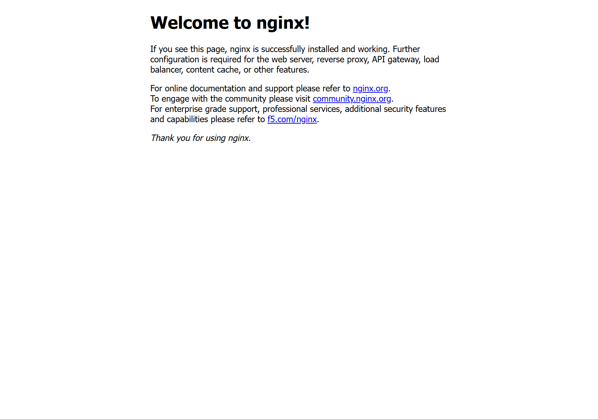

CI/CD的内容实际上相当广泛,所以值得专门来进行学习,为了方便写文章,我把所有能跟CI/CD扯上关系的技术都放进来了.

# 反向代理
## 前置知识
- 早期的文章,日后可能会重构
### domain name(域名)
- [wiki](https://en.wikipedia.org/wiki/Domain_name)
>domain name identifies a **network domain** or an **Internet Protocol** (IP) resource, such as a **personal computer** used to access the Internet, or a server computer.
- 也就是说domain name是用来标识电脑和服务器的.

A **fully qualified domain name** (FQDN) is a domain name that is completely specified with all labels in the hierarchy of the DNS, having no parts omitted.
- 比如`en.wikipedia.org`就由被两个点分开的三个部分组成,每一部分都是一个域名.

### hostname(主机名)
- [wiki](https://en.wikipedia.org/wiki/Hostname)
>On the Internet, a hostname is a **domain name** assigned to a host computer. This is usually a **combination** of the host's local name with its parent domain's name. For example, `en.wikipedia.org` consists of a local hostname (en) and the domain name wikipedia.org. **This kind of hostname is translated into an IP address via the local hosts file, or the DNS resolver**. It is possible for a single host computer to have several hostnames, but generally, the operating system of the host prefers to have **one hostname** that the host uses for itself.

也就是说,`en.wikipedia.org`就是一个主机名,跟DNS紧密关联;而个人电脑也具有主机名,在cmd中输入hostname即可查询自己电脑的主机名.默认输出为`My-com`.

当然主机名本身从来都不是一个必要的东西,你永远都可以直接通过IP地址来访问某个网站或者主机.
### localhost
- [wiki](https://en.wikipedia.org/wiki/Localhost)
>In computer networking, localhost is a hostname that refers to the **current computer** used to access it. The name localhost is reserved for **loopback**(回环) purposes.It is used to access the network services that are running on the host via the loopback network interface. Using the loopback interface bypasses any local network interface hardware.

- localhost就是本机用来访问本地网址的域名
#### loopback
>The local **loopback** mechanism may be used to run a network service on a host without requiring a physical network interface, or without making the service accessible from the networks the computer may be connected to. For example, a locally installed website may be accessed from a Web browser by the URL http://localhost to display its home page.
- 所有操作系统都会预留一个将localhost这个域名映射到IPv4和IPv6地址的注册表
>IPv4 network standards reserve the entire address block 127.0.0.0/8 (**more than 16 million addresses**) for loopback purposes.That means any packet sent to any of those addresses is looped back. The address **127.0.0.1** is the **standard address** for IPv4 loopback traffic; the rest are not supported by all operating systems. However, they can be used to set up multiple server applications on the host, all listening on the same port number. In the IPv6 addressing architecture there is only a single address assigned for loopback: **::1**. The standard precludes the assignment of that address to any physical interface, as well as its use as the source or destination address in any packet sent to remote hosts.
- 由于IPv4的糟糕设计,超过1600万个IP地址被直接浪费了,所以IPv6只保留了一个回环地址**[::1]**.由于历史习惯问题,大多数教程和实践仍然使用`localhost`和`127.0.0.1`来进行回环访问,但三者都是等价的.
  - 在IPv6中`::`表示省略前面的所有0,换句话说IPv6的回环地址就是地址`1`(省略了127个0).

#### 实战
使用docker运行以下命令:
`docker run -d -p 8080:80 nginx:alpine`


通过以下四(~~1600万~~)种方式都可以成功访问上图页面
1. `http://[::1]:8080/`: 少见
2. `http://localhost:8080/`: 最为常用
3. `http://127.0.0.1:8080/`: 第二常用
4. `http://127.1.0.2:8080/`: 罕见
### port(端口)
- 如果我问上面的`:8080`是什么,大多数人都知道这是端口,但我自己并不很清楚它具体的实现原理.

>[wiki](https://en.wikipedia.org/wiki/Port_(computer_networking))
>
>In computer networking, a port is a **communication endpoint**. **At the software level** within an operating system, a port is a logical construct that i**dentifies a specific process or a type of network service**. A port is uniquely identified by a number, the port number, associated with the combination of a transport protocol and the network IP address. Port numbers are 16-bit unsigned integers.(最大为65535)


**常见的应用层协议端口**
| 端口号      | 服务/协议  | 完整名称                            | 主要用途                           |
| :---------- | :--------- | :---------------------------------- | :--------------------------------- |
| **22**      | **SSH**    | Secure Shell                        | 安全外壳协议，用于远程加密登录     |
| **23**      | **Telnet** | Telnet                              | 远程登录服务，采用明文传输         |
| **25**      | **SMTP**   | Simple Mail Transfer Protocol       | 简单邮件传输协议，用于邮件发送     |
| **53**      | **DNS**    | Domain Name System                  | 域名系统服务，将域名解析为 IP      |
| **67 / 68** | **DHCP**   | Dynamic Host Configuration Protocol | 动态主机配置协议，自动分配 IP 地址 |
| **80**      | **HTTP**   | Hypertext Transfer Protocol         | 超文本传输协议，万维网基础         |
| **443**     | **HTTPS**  | HTTP Secure (HTTP over TLS/SSL)     | 超文本传输安全协议，加密网页访问   |

### Proxy
>[wiki](https://en.wikipedia.org/wiki/Proxy_server)
In computer networking, a proxy server is a server application that acts as an intermediary between a client requesting a resource and the server then providing that resource.
- 也就是说,proxy就是服务器和客户端之间的中间层了,双方的数据发送都可以经过代理来转发和储存

**正向代理(forward proxy)**
**forward proxy**: an **Internet-facing** proxy used to retrieve data from a wide range of sources (in most cases, anywhere on the Internet). 
**反向代理(reverse proxy)**
- **reverse proxy**: an **internal-facing** proxy used as a front-end to control and protect access to a server on a private network,also performs tasks such as **load-balancing**, **authentication**, **decryption**, and **caching**.

也就是说,正向代理是面向客户端的,反向代理是面向服务器的.

现在,我们可以开始正式学习nginx和traefik了.
## nginx
### 简短介绍
- [wiki](https://en.wikipedia.org/wiki/Nginx)
nginx是一个被用作反向代理的开源网页服务器应用(web server),于2004年发布,是目前应用最为广泛的反向代理(超过了Apache,另一个开源的反向代理应用).
### 命令行使用
- [官网](https://nginx.org/en/docs/beginners_guide.html)
  - 官方教程写的很烂

首先我们需要在官网上[下载](https://nginx.org/en/download.html)windows版本的nginx压缩包,解压后根目录下有一个nginx.exe,打开后访问`http://localhost/`出现如下页面说明运行成功:


当然,输入`http://127.0.0.1/`和`http://127.0.0.1:80/`都会出现上面这个页面,换句话说,现代浏览器在不指定端口时都**默认**进入80端口,而nginx的**默认部署端口**就是80端口.

自然,我们这里没有把nginx注册到环境变量,故以下的所有命令都需要在解压得到的nginx根目录下运行,并且需要加上`.\`前缀指明使用`nginx.exe`.

- `start nginx`: 命令行启动nginx.exe
- `.\nginx -s signal`: signal可以是以下四个参数:
  - stop — fast shutdown
  - quit — graceful shutdown
  - reload — reloading the configuration file
  - reopen — reopening the log files

一般来说,nginx需要**时刻不停**的运行,才能让用户稳定进入网站,所以我们不需要学习nginx的具体命令行操作,只需要把它启动就可以了.

### nginx.conf编写
打开nginx安装目录下的conf文件夹,可以看到标准nginx配置文件`nginx.conf`,过滤掉注释后的默认内容如下:
```toml
# 全局块：配置影响nginx全局的指令
worker_processes  1;

events {
    # events块：配置影响nginx服务器或与用户的网络连接
    worker_connections  1024;
}

http {
    # http块：可以嵌套多个server，配置代理，缓存，日志定义等绝大多数功能
    include       mime.types;
    default_type  application/octet-stream;

    sendfile        on;
    keepalive_timeout  65;

    server {
        # server块：配置虚拟主机的相关参数
        listen       80;
        server_name  localhost;

        location / {
            # location块：配置请求的路由，以及各种页面的处理情况
            root   html;
            index  index.html index.htm;
        }

        # 错误页面配置
        error_page   500 502 503 504  /50x.html;
        location = /50x.html {
            root   html;
        }
    }
}
```
以下是关键字的解释
1.  **`worker_processes 1;`**
    * 定义工作进程数,一般为1
2.  **`include mime.types;`**
    * 引入外部文件，该文件定义了各种文件扩展名对应的 MIME 类型（如 `.html` 对应 `text/html`），否则浏览器可能无法正确渲染样式表或图片。
3.  **`listen 80;`**
    * 监听的端口号。
4.  **`server_name localhost;`**
    * 定义服务器响应的域名或主机名。
5.  **`location / { ... }`**
    * 匹配根路径请求。
    * **`root html;`**：指定静态资源所在的根目录（相对于 nginx 安装目录的 `html` 文件夹）。
    * **`index index.html index.htm;`**：默认主页文件搜索顺序。
6.  **`error_page`**
    * 定义当服务器发生特定错误（如 500 系列）时转向的静态页面。

## traefik

# 容器

# 自动部署与自动构建
## git
在我刚接触编程的时候,git对我来说一直都是一个很神奇的东西,但我一直都没能找到一篇足够清晰,足够简练的文章来讲解git的原理,所以就只好
## GitHub Actions
