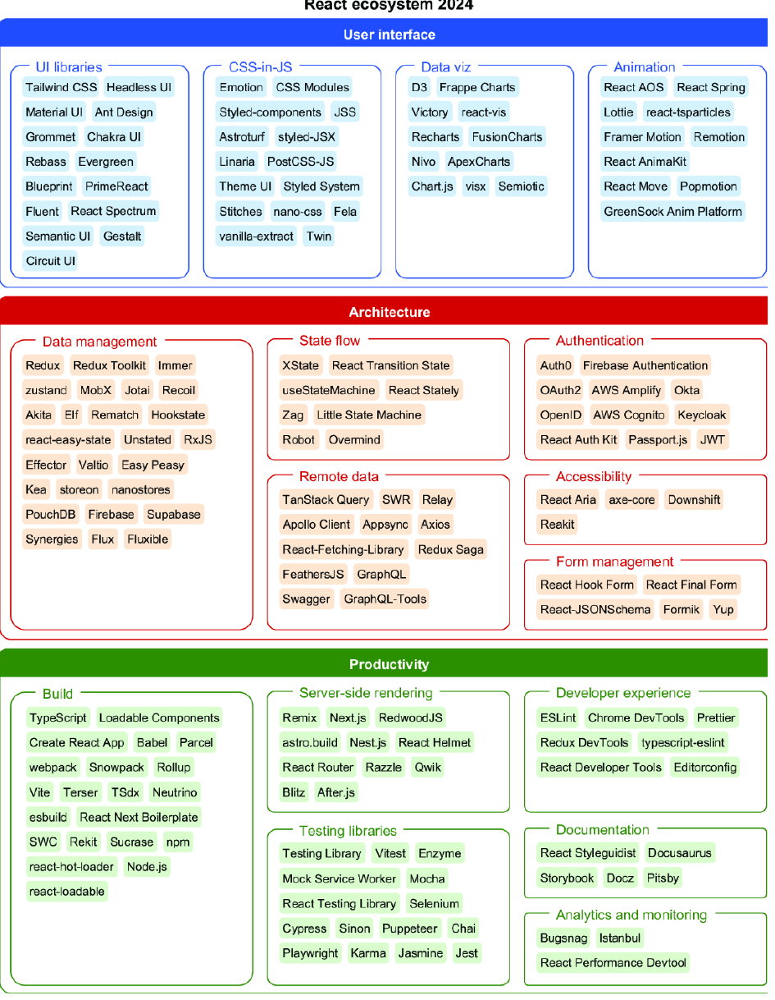

# High Performance Python 3rd edition
- 25年5月出版的,新鲜的很

# Powerful Python

# Python3网络爬虫开发实战
## 爬虫基础
讲的还不错,基本涉及了爬虫所需的所有知识,尤其是关于session,cookie的地方讲的很好,帮我扫清了一点疑惑

## 数据的存储
## Ajax数据爬取
## 异步爬虫

# Powerful Python: Patterns and Strategies with Modern Python

# React in Depth
## 介绍

前端的技术栈比起后端要可怕的多,这也是为什么资深前端这么少的原因.

## Advanced component patterns

### The Provider pattern
